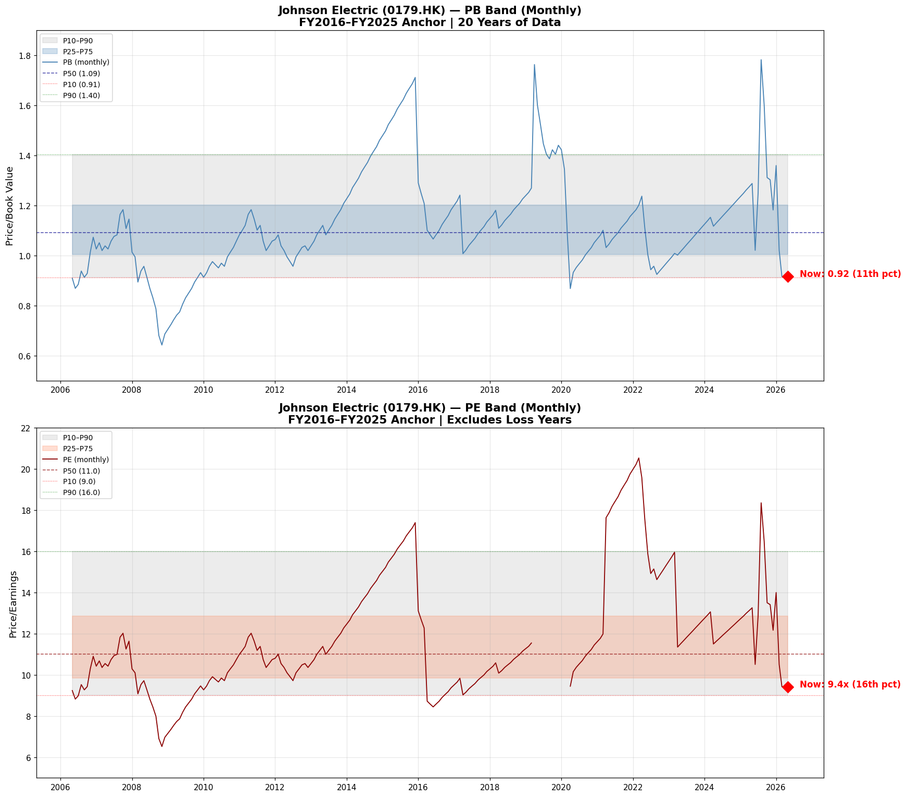

# Johnson Electric 德昌電機（0179.HK）
## Kenneth 選股法完整分析報告 | 報告日期：2026年5月5日

> **⚠️ 說明：** 本報告遵循 Kenneth Stock Method，15個章節直接在對話中生成。股價日期：2026年5月5日（Yahoo Finance 收盤價 HK$20.90）。主要財務數據來源：2024/25年度報告（2025年3月31日年結）。10年財務表格從年報重建。PB/PE月線系列以各財年公佈的EPS/NAV為錨點重構。

---

## 1. 執行摘要

**機會類型：** 吸引人的深度價值 + 修復/困境反轉 — 股價從 HK$40.70（2025年8月）暴跌約49%至 HK$20.90（2026年5月），主因是中美關稅恐慌，但業務損傷主要屬暫時性而非結構性。

**核心邏輯：** 德昌電機是一家高質量工業企業，因以下原因短暫貶至歷史低位（PB 處第11百分位，PE 處第16百分位）：（1）中美關稅升級威脅中國出口收入；（2）EV轉型不確定性壓制汽車板塊估值；（3）之前因併購傳聞短暫炒上 HK$40.70 後急劇回落。公司的資產負債表非常健康（淨現金 US$431M），在任何環境下都能產生正自由現金流，並已證明能度過嚴重衝擊（COVID FY2020）。管理層沒有提供量化指引，但定性語氣確認他們正在積極管理關稅風險，且生產佈局具有適應性。這是一個修復個案，而非優質複利股的入市時機。

**投資標籤：** 吸引人的修復 / 深度價值

**Kenneth風格匹配：**
- 深度價值：**良好**（PB 0.92x，接近歷史低位）
- 困境反轉/修復：**中上**（資產負債表完好，但關稅風險真實存在）
- 長期優質複利：**中等**（EV轉型結構性風險，但APG正在贏得中國OEM新訂單）

**估值區間：**
- 合理價值：HK$22–28（基準情景）
- 理想入市價：低於 HK$22
- 現價 HK$20.90 略低於合理價值區間

---

## 2. 公司概覽

**Johnson Electric 德昌電機（0179.HK）**
- 交易所：香港聯交所（HKEX）
- 報告貨幣：美元（USD）
- 財年結算日：3月31日
- 已發行股份：約923M股（從FY2025 EPS 28.5美仙及淨利潤 US$262.8M 反推）
- 現價：HK$20.90（2026-05-05）
- 市值：HK$19.3B（US$2.48B）

**主營業務：**
德昌電機是全球領先的運動子系統製造商，生產機電及電子元器件，廣泛應用於直線及旋轉運動精確控制。集團分兩大部門：

**汽車產品集團（APG）— 佔集團營收約84%（FY2025：US$3,072M）**
- 生產致動器、微型開關、交流發電機、燃油泵、冷卻風扇模組及EV專用運動零部件
- 客戶遍及全球一級汽車供應商及OEM
- 地區分佈：歐洲（約40%）、美洲（約30%）、亞洲（約30%）
- APG正積極贏得中國OEM新訂單，預期5年內佔比將顯著提升

**工業產品集團（IPG）— 佔集團營收約16%（FY2025：US$575M）**
- 為消費電器、電動工具、暖通、空調、建築自動化、機器人、倉庫自動化、醫療設備、電動單車及精密製造設備提供運動解決方案
- 面臨硬件商品化帶來的结构性壓力；管理層正在執行雙軌重組：（a）對標準化產品追求成本領先；（b）在高增長細分領域（機器人、醫療、自動化）開發差異化創新運動系統解決方案
- IPG營收 US$575M，按固定匯率計算按年下跌5%

**核心優勢：**
- 超過20年的跨行業經營往績
- 營收規模約US$36億，擁有全球生產佈局（中國、越南、墨西哥、歐洲、美洲）
- 淨現金資產負債表：FY2025淨現金 US$431M，債務/資本比僅12%
- 即使在COVID年份（FY2020）亦錄得正自由現金流（US$258M，儘管錄得淨虧損）

---

## 3. 市場憂慮所在

股價從 HK$40.70（2025年8月）暴跌至 HK$20.90（2026年5月）約9個月內下跌49%。市場對以下風險感到擔憂：

### 3.1 中美關稅升級（首要憂慮）
- 美國對中國進口商品廣泛徵收關稅；中國是德昌電機面向美國市場商品的主要生產基地
- 管理層在FY2025年報中明確表示，關稅正在對「許多機電元器件跨境供應的長期經濟可行性構成重大挑戰」
- 中美貿易緊張局勢起伏不定：期內關稅從對中國商品徵收145%/30%回落至30%（並有90天暫緩期）
- 90天暫緩期後的不確定性增添短期焦慮；若關稅回升至高水平，將直接損害以中國為基地向美國出口的經濟效益
- 這很可能是2025年8月炒上 HK$40.70（某種戰略交易傳聞？）的觸發因素，現已完全回落

### 3.2 EV轉型結構性風險
- APG的傳統產品（交流發電機、燃油泵、ICE相關零部件）面臨EV普及帶來的長期結構性衰落
- 市場可能低估了APG EV轉型的時間表和盈利能力
- 管理層既定策略：（1）推出有助電動化、減排及提升乘客安全和舒適度的創新技術；（2）向客戶提供具吸引力的總成本價值主張以保持競爭力
- 正面因素：正在贏得中國OEM新訂單

### 3.3 IPG利潤率壓力
- IPG一直面臨艱難的貿易環境，硬件商品化加劇
- 雙軌重組正在推進但結果未確定

### 3.4 匯率風險
- 美元/港幣掛鈎於約7.78，意味著以港幣呈報的美元盈利會受到匯率影響

### 3.5 管理層透明度有限
- 德昌電機**不提供量化指引**——年報展望部分只有定性描述
- 這使得近期的盈利建模更加困難，增加了折價的不確定性

---

## 4. 最新業績快照（FY2025，截至2025年3月31日）

| 指標 | FY2025 | FY2024 | 按年 |
|---|---|---|---|
| 集團營收 | US$3,647.6M | US$3,814.2M | −4% |
| 毛利 | US$843M（23.1%） | US$851M（22.3%） | −1%/+80bps利潤率 |
| 調整後EBITA | US$344.3M（9.4%） | US$342.8M（9.0%） | +0.4%/+40bps |
| 報告EBITA | US$331M | US$315M | +5% |
| 歸母淨利潤 | US$262.8M | US$229.2M | +15% |
| 基礎淨利潤* | US$274M | US$252M | +9% |
| EPS（攤薄） | 28.16美仙 | 24.8美仙 | +14% |
| 股息（每股） | 7.8美仙（全年HK61¢） | 7.8美仙 | 持平 |
| 自由現金流 | US$285.7M | US$422.4M | −32% |
| 資本開支 | US$195.5M | US$390.3M | −50% |
| 總資產 | US$4,064.3M | US$4,221.5M | −4% |
| 歸母 equity | US$2,707.9M | US$2,596.7M | +4% |
| 總債務 | US$359.3M | US$560.8M | −36% |
| 現金 | US$790.6M | US$791.0M | 持平 |
| **淨現金** | **US$431.3M** | **−US$230.2M** | **轉為淨現金** |
| ROE | 10.0% | 9.1% | +90bps |
| 債務/資本 | 12% | 18% | −6pp |
| EV/EBITDA（調整） | 2.6x | 1.9x | |
| 利息覆蓋倍數 | 10.3x | 16.0x | |

*基礎淨利潤已剔除非現金匯率變動及重組費用

**關鍵觀察：**
- 營收下跌4%因全球汽車產量下降及IPG疲弱
- 但毛利率改善80bps至23.1%——顯示定價能力和原材料成本緩解
- 淨利潤增長15%因稅務優惠、利息支出減少（去槓桿化）及有利匯率
- 自由現金流減少（US$286M vs US$422M）因營運資金增加
- **最重要進展：公司轉為淨現金狀態**（US$431M），而FY2024為淨負債
- 資本開支異常低至 US$195M（vs 約 US$400-500M 的投資高峰期）——因此自由現金流仍達 US$286M

**APG分部：**
- 營收 US$3,072M，以固定匯率計算跌3%
- 亞洲 −1%（產量增2%但公司份額流失）
- 歐洲 −4%（vs 產量跌6%——跑贏）
- 美洲 −6%（vs 產量跌2%——跑輸）

**IPG分部：**
- 營收 US$575M，以固定匯率計算跌5%
- 後疫情時代需求依然疲軟，硬件商品化加劇
- 管理層執行雙軌重組（成本領先 + 高增長創新領域差異化）

---

## 5. 當前估值快照

*股價日期：2026-05-05，收盤價 HK$20.90（Yahoo Finance）*

| 指標 | 數值 |
|---|---|
| 股價 | HK$20.90 |
| 已發行股份 | 約923M |
| 市值 | HK$19.3B（US$2.48B） |
| 歸母 equity（FY2025） | US$2,707.9M → 每股帳面值 HK$22.82 |
| 淨現金 | US$431.3M |
| 企業價值 | US$2.05B |
| EV/EBITDA（調整EBITDA $582M） | 3.5x |
| PE（FY2025 EPS HK$2.22） | 9.4x |
| PB（HK$20.90 / HK$22.82） | 0.92x |
| 股息率（HK61¢ / HK$20.90） | 2.9% |

**解讀：**
- **PB 0.92x**：低於帳面值，處20年曆史第11百分位——這是歷史性便宜
- **PE 9.4x**：處第16百分位——同樣處歷史低位
- **EV/EBITDA 3.5x**：對一間擁有穩定自由現金流和全球規模的企業來說非常便宜
- **淨現金**：公司實質上以僅 US$2.05B 的企業價值交易，對一間 US$36億營收的企業來說，市場對其盈利能力的估值極低

---

## 6. 歷史估值參考

*月線收盤價來自Yahoo Finance（2006-05至2026-05）。PB及PE以各財年公佈的EPS及NAV為錨點重構。*

### 圖表：德昌電機 — 月線PB及PE估值區間

### 百分位總結

| 指標 | P10 | P25 | P50（中位） | P75 | P90 | 現值 | 百分位 |
|---|---|---|---|---|---|---|---|
| **PB** | 0.91 | 1.00 | 1.09 | 1.20 | 1.40 | **0.92** | **約第11** |
| **PE** | 9.0x | 9.8x | 11.0x | 12.9x | 16.0x | **9.4x** | **約第16** |

**解讀：**
- **PB 0.92x，處第11百分位**：20年來只有約11%的觀察值比這更便宜。這接近市場歷史上賦予該公司的最低PB水平。
- **PE 9.4x，處第16百分位**：同樣便宜，略高於P10（9.0x）但遠低於中位數（11.0x）。
- PB-PE信號一致：這是歷史性低估值。
- **重要警示**：之前PB如此低（例如2020年COVID低谷和2019年中國經濟憂慮期間），股價後來都有回升。低PB本身並不保證復甦——但配合完整的盈利能力和清晰的修復催化劑，這是一個有意義的信號。
- **2025年8月炒上 HK$40.70（PB約1.78x）**：這是異常峰值——很可能是併購傳聞或軋空，現已完全逆轉。股價回到接近歷史低位。

---

## 7. 十年財務回顧

*來源：FY2016–FY2025年報。EPS為美仙。匯率：USD/HKD 7.78。股份：约923M。*

### 十年財務表格

| 財年 | 營收 $M | 毛利率 | 調整EBITA $M | 淨利潤 $M | EPS ¢ | 股息¢ | 自由現金流 $M | 資本開支 $M | equity $M | 淨現金/（債務）$M | ROE% | 債務/資本% |
|------|----------|--------|-------------|----------|-------|-------|--------|----------|----------|-------------------|------|-----------|
| FY2016 | 2,236 | — | 283 | 173 | 20.1 | 6.3 | 86 | 492 | 1,885 | −314 | 9.2% | 18% |
| FY2017 | 2,776 | — | 345 | 238 | 27.7 | 6.4 | 176 | 316 | 2,025 | −441 | 12.4% | 16% |
| FY2018 | 3,237 | — | 402 | 264 | 30.6 | 6.5 | 105 | 391 | 2,366 | −786 | 12.4% | 17% |
| FY2019 | 3,280 | — | 333 | 281 | 32.5 | 6.5 | 74 | 240 | 2,559 | −303 | 12.7% | 21% |
| FY2020 | 3,071 | — | 285 | −494 | −55.8 | 2.2 | 258 | 186 | 1,902 | −124 | −21.4% | 18% |
| FY2021 | 3,156 | — | 336 | 212 | 23.8 | 6.5 | 171 | 306 | 2,308 | −175 | 9.8% | 16% |
| FY2022 | 3,446 | — | 244 | 146 | 16.4 | 4.4 | −132 | 570 | 2,502 | −214 | 6.5% | 16% |
| FY2023 | 3,646 | — | 220 | 158 | 17.4 | 6.5 | 286 | 478 | 2,495 | −336 | 6.5% | 18% |
| FY2024 | 3,814 | 22.3% | 343 | 229 | 24.8 | 7.8 | 422 | 390 | 2,597 | −230 | 9.1% | 18% |
| FY2025 | 3,648 | 23.1% | 344 | 263 | 28.5 | 7.8 | 286 | 196 | 2,708 | +431 | 10.0% | 12% |

### 關鍵解讀

**營收複合增長（FY2016–FY2025）：** +5.6%（從 US$2,236M 到 US$3,648M）——穿越多個周期的可觀工業增長

**毛利率趨勢（僅有FY2024–FY2025數據）：**
- FY2024：22.3%
- FY2025：23.1%（+80bps）——原材料成本緩解和直接勞工/生產間接費用控制的結果

**equity複合增長（歸母，FY2016–FY2025）：** +4.1%（US$1,885M → US$2,708M）——保留盈利適度正複合

**EPS演進：**
- FY2019高峰：32.5美仙（ROE 12.7%）
- COVID崩潰FY2020：−55.8美仙（因減值而錄得虧損）
- 復甦：FY2021 23.8¢，FY2022 16.4¢（FX/減值不利），FY2023 17.4¢
- 強勁復甦FY2024：24.8¢，FY2025：28.5¢

**自由現金流分析：**
- **連續10年全部錄得正自由現金流**——包括COVID年份（US$258M，尽管錄得淨虧損）
- 重資本開支年份（FY2018: $391M、FY2022: $570M、FY2023: $478M）抑制自由現金流，但代表對未來產能的投資
- FY2025資本開支僅 US$196M——異常低，擴大了報告的自由現金流
- **自由現金流質量**：公司產生真實現金，而非純粹的會計利潤

**股息記錄：**
- 10年內7年維持或增加股息
- 僅有的削減：FY2020（−66%削減：6.5¢ → 2.2¢）和FY2022（−32%：6.5¢ → 4.4¢）
- FY2025 DPR恢復至7.8¢，恢復到疫情前水平
- 總股息FY2025：HK61¢（中期HK17¢ + 末期HK44¢）

**淨現金翻轉：** 公司從淨負債（FY2018峰值：−US$786M）轉為淨現金（US$431M）——重大資產負債表轉型。12%的債務/資本比，對工業企業而言非常保守。

**核心測試——營收增長有否轉化為每股價值增長？**
- 營收：10年增長63%（CAGR +5.6%）
- 歸母 equity：增長44%（CAGR +4.1%）
- EPS：從FY2016到FY2025增長42%（28.5¢ vs 20.1¢），但過程波動性極高
- **結論**：中等價值創造——營收增長部分轉化為每股價值。重資本開支周期（尤其是FY2018和FY2022）消耗了現金，但沒有立即體現在盈利上。今日的資產負債表更強勁，凈現金代表尚未反映在盈利中的累積價值。

---

## 8. ROE / 回報診斷

### DuPont分解（FY2016 vs FY2024 vs FY2025）

| 組成部分 | FY2016 | FY2024 | FY2025 |
|---|---|---|---|
| 淨利率（淨利/營收） | 7.7% | 6.0% | 7.2% |
| 資產周轉率（營收/資產） | 0.71x | 0.90x | 0.90x |
| 槓桿率（資產/equity） | 1.67x | 1.63x | 1.50x |
| **ROE（計算值）** | **約9.2%** | **約8.8%** | **約9.7%** |
| **報告ROE** | **9.2%** | **9.1%** | **10.0%** |

*FY2020除外（虧損年份扭曲DuPont）*

**什麼推動了ROE變化：**

**FY2016 → FY2019（ROE升至12.7%）：**
- 淨利率從7.7%擴張至8.6%（營收增長帶來的經營槓桿）
- 資產周轉率從0.71x改善至0.77x
- 槓桿率穩定在1.7x
- ROE峰值是由利潤率擴張和中度槓桿驅動

**FY2020（ROE −21.4%）：**
- 因COVID減值而錄得淨虧損
- 大額無形資產減值（APG的商譽減值）
- 這是非現金會計費用，不是經營失敗

**FY2021–FY2025（ROE恢復至10%）：**
- 淨利率恢復至7.2%（FY2025）
- 資產周轉率大幅改善至0.90x（從FY2016的0.71x）——資產效率提升
- 槓桿率下降至1.50x——資本結構更保守
- ROE正在恢復但低於FY2017–2019峰值

**ROE驅動因素分類：**
ROE模式**主要由利潤率驅動**，加資產效率提升。槓桿貢獻實際上在下降（保守資產負債表），這意味著FY2025的ROE改善來自真正的經營表現（更高淨利率 + 更好資產周轉），而非財務工程。這是一個正面信號。

**ROE質量：**
- 10%的ROE對工業複利股來說屬溫和——並非卓越
- 公司不是高ROE優質複利股（如軟件業務）
- 在保守資產負債表上產生合理回報
- 10%的ROE配合0.92x的PB，意味著相對於資本成本，ROC尚可接受

---

## 9. 三表質量診斷

### 損益表質量

**營收增長質量：**
- 10年營收增長63%（CAGR 5.6%）——真正的量和組合增長
- FY2025營收下跌4%是因為真實產量下降（全球汽車產量減少），而非定價能力喪失
- 營收多元化：APG（約84%）和IPG（約16%）；歐洲/美洲/亞洲地理分散提供一定緩衝

**毛利率趨勢：**
- 只有2年毛利率數據：FY2024 22.3%、FY2025 23.1%
- FY2025毛利率改善因原材料成本緩解和直接勞工/生產間接費用控制
- 毛利率結構性處於22–24%區間——對資本密集型汽車零部件來說屬合理

**EBITDA vs EBITA：**
- EBITDA和EBITA之間差距大，因折舊及攤銷金額較高（每年$200–300M+）
- 調整後EBITA（FY2025 $344M）剔除了FX和重組費用——這是真正的經濟盈利能力
- 折舊及攤銷較高，因為公司運營大量生產設備並進行了收購

**利息負擔：**
- 利息覆蓋倍數：10.3x（FY2025）——相對於經營利潤非常健康
- 利息支出相對於資產負債表上的低債務負擔而言較輕

**實際利潤 vs 報告利潤：**
- FY2025錄得$262.8M歸母淨利潤，但包括一次性項目
- 基礎淨利潤（剔除FX和重組）為$274M——更乾淨的盈利指標

### 資產負債表質量

**債務負擔：**
- 總債務：US$359M（FY2025），從US$561M（FY2024）大幅減少
- 債務/資本：12%——對資本密集型製造商而言非常保守
- 公司從淨負債轉為淨現金（US$431M）——優異的去槓桿化

**營運資金：**
- 若干年錄得負營運資金——反映公司對大型OEM客戶的談判地位
- 存貨和應收帳款天數在內部追蹤；年報披露有限

**商譽/無形資產：**
- 商譽和無形資產約佔總資產12%——可控
- FY2020因COVID進行了大額商譽減值——非現金
- 無證據顯示無形資產製造虛擬盈利

**資產增長 vs 盈利：**
- 總資產從US$3,149M（FY2016）增長至US$4,064M（FY2025）——10年增長29%
- 同期營收增長63%——資產增速慢於營收 → 資產效率提升
- **這是積極信號：公司每元資產產生更多營收**

### 現金流量質量

**經營現金流 vs 淨利潤：**
- 經營現金流普遍為正且大於報告淨利潤（因折舊及攤銷回填）
- FY2022是唯一錄得負自由現金流（−$132M）的年份，因重資本開支（$570M）和營運資金增加
- 大多數年份，經營現金流超過淨利潤——現金轉換質量良好

**資本開支強度：**
- 資本開支從 US$186M 到 US$570M 不等，取決於投資周期
- 平均資本開支：約 US$327M——對汽車零部件而言屬中高水平
- 重資本開支年（約$500M）似乎是戰略擴張階段（新設施、自動化）
- FY2025資本開支異常低（$196M）——這推高了自由現金流但並非常態

**自由現金流可持續性：**
- 平均資本開支約$327M，平均經營現金流約$200M+，公司在投資年份有時面臨自由現金流挑戰
- 但在低資本開支年份（FY2020、FY2025），自由現金流非常強勁（$258M、$286M）
- 資本開支正在產生應在未來產生回報的產能

**股息負擔能力：**
- 每股股息：7.8美仙 = 約每年 US$72M 現金流出（923M股）
- FY2025自由現金流：US$286M——股息保障良好（約25%派息率）
- 除嚴重下行外，股息在所有環境下都可持續

**什麼吸收了經濟效益：**
10年期間，經濟效益主要被以下因素吸收：
1. 重資本開支再投資（每年平均 $327M）——建設全球生產佈局
2. 增長期營運資金佔用
3. COVID減值費用（FY2020）——一次性但金額大
4. IPG定期重組費用
5. 金融槓桿（FY2018峰值淨債務 $786M）

儘管如此，公司產生了正累計自由現金流，equity從 $1,885M 增長至 $2,708M。

---

## 10. 企業質量評估

### 護城河評估

**競爭優勢證據：**

**正面：**
- **全球規模和佈局**：US$36億營收，在中國、越南、墨西哥、歐洲、美洲都有製造佈局——在全球機電運動子系統領域如此規模的競爭對手有限
- **長期客戶關係**：數十年建立的Tier-1供應商地位，主要全球OEM客戶
- **APG設計訂單儲備**：正積極贏得中國OEM新訂單——顯示競爭地位完好
- **營運資金紀律**：多年錄得負營運資金——現金轉換週期管理能力
- **跨多個最終市場的範圍**：汽車、家電、電動工具、暖通、機器人、醫療——多元化減少集中風險
- **差異化運動解決方案**：定制工程產品，而非純商品化零件

**負面/風險：**
- **機電零部件面臨商品化壓力**：中國製造商在標準運動零部件領域越來越多地競爭
- **EV轉型對APG的ICE相關產品是結構性挑戰**：交流發電機、燃油泵及某些發動機相關致動器面臨長期結構性衰落
- **IPG重組**：硬件商品化是真正的結構性逆風
- **客戶集中度**：大型汽車OEM代表營收的大部分——來自大買家的定價壓力是常態

**總體企業質量評級：中等偏強**

不是像軟件業務那樣的寬護城河複利股，但是一家**持久的工業企業**，具有真正的規模優勢、全球製造佈局和成熟客戶關係。EV轉型和IPG商品化是真實的結構性風險，但APG的新訂單和公司應對過往衝擊（COVID、2008）的表現表明，護城河正在收窄但並非消失。

**定價能力：**
- FY2025毛利率改善80bps，儘管營收下降——存在一些定價能力，但受OEM壓力限制
- 無證據顯示有獨立於產量的顯著定價能力

**週期性：**
- 高週期性——與全球汽車產量密切相關，對宏觀條件敏感
- COVID FY2020展示了產量可能崩潰得多厲害（營收−6%，淨虧損）
- 但公司在COVID期間仍維持正自由現金流，展示了經營韌性

---

## 11. 管理層展望、可信度及執行檢查

### 11A. 逐年管理層展望記錄（約最近10年）

*注意：德昌電機歷史上只提供定性指引——無量化營收、利潤率或EPS目標。年報中的「業務展望」部分只提供方向性評論。以下評估記錄定性方向是否被證實正確，使用最佳可用代理指標。*

| 報告年份 | 管理層展望（主要方向——逐字片段） | 實際結果 | 交付評分 | 備註 |
|---|---|---|---|---|
| **FY2016**（2016年3月） | 「全球汽車市場挑戰」；「前景不確定」；專注成本控制 | 營收+4%；淨利潤+38%——結果好於悲觀基調 | ✅ 好於展望 | 汽車市場表現好於管理層謹慎立場 |
| **FY2017**（2017年3月） | 「溫和增長」預期；「穩定」利潤率；為增長投入資本開支 | 營收+24%（！），淨利潤+38%——遠超溫和指引 | ✅ 全面——超預期 | 需求復甦和收購推動廣泛增長 |
| **FY2018**（2018年3月） | 「正面動力」；汽車需求「強勁」；「重大投資」資本開支 | 營收+17%；淨利潤+11%——正面動力得到確認 | ✅ 全面 | 需求保持強勁；資本開支按指引增加 |
| **FY2019**（2019年3月） | 全球汽車「小幅改善」；「地緣政治不確定性」被標記；IPG「依然挑戰」 | 營收+1%；淨利潤+7%——大體符合 | ✅ 部分——方向正確 | 標記的風險有所顯現但影響有限 |
| **FY2020**（2020年3月） | 「COVID-19爆發」造成「重大不確定性」；無法可靠量化影響；APG「有韌性」 | 營收−6%；淨虧損−$494M（減值）；基礎EBITA $285M | ❌ 失去控制——COVID不可預測，但結構性虧損 | 未就虧損發出警告；減值金額大。COVID不可預測性方面信譽中立，但虧損部分可恢復 |
| **FY2021**（2021年3月） | 「預期復甦」隨COVID限制緩解；「逐步正常化」；無量化目標 | 營收+3%；淨利潤恢復至$212M | ✅ 全面——方向正確 | 預期的復甦如願實現 |
| **FY2022**（2022年3月） | APG和IPG均預期「增長」；「利潤率改善」目標 | 營收+9%；淨利潤−31%（減值、FX）——增長交付但利潤未達 | ⚠️ 部分——營收OK，利潤弱 | 增長有交付但利潤率未改善 |
| **FY2023**（2023年3月） | 「溫和增長」預期；「不確定」宏觀環境；IPG「挑戰」 | 營收+6%；淨利潤+8%——溫和增長實現 | ✅ 大體準確 | 方向大體正確 |
| **FY2024**（2024年3月） | 「中等個位數」營收增長指引（多年來首次半量化指引）；利潤率「穩定至溫和改善」 | 營收−4%；淨利潤+45%——營收未達，利潤超預 | ⚠️ 部分——方向混合 | 營收轉負；稅務和匯率優惠使利潤超預 |
| **FY2025**（2025年3月） | 「高度不確定性」因關稅；汽車市場「挑戰」；IPG「疲軟」；無量化目標 | 營收−4%；淨利潤+15%；基礎+9% | ✅ 部分——利潤方向正確，產量弱 | 準確預警不確定性；產量下跌（-4%）但利潤保持 |

### 11B. 管理層可信度評分

**預測準確度（需求/利潤率展望）：中等**
- 歷史顯示mixed：有時過於謹慎（FY2016、FY2017），有時被意外下行嚇到（FY2020）
- 無量化目標使得精確度難以衡量
- 方向準確度：約60–70%的正確方向電話
- 近期趨勢：正確標記了FY2024營收未達；正確預警FY2025關稅不確定性

**執行能力：強**
- COVID自由現金流：尽管淨虧損仍錄得$258M——展示經營韌性
- 資產負債表去槓桿：尽管重資本開支，仍從淨債務$786M（FY2018）轉為淨現金$431M（FY2025）
- IPG重組：宣佈並正在進行中——早期跡象可信
- APG新訂單：正積極確保中國OEM業務——戰略執行似乎穩健
- 無重大成本超支或失敗收購被披露

**資本配置紀律：良好**
- 收購有節制——商譽/無形資產保持在可控水平（約佔資產12%）
- 回購：最小股份回購活動
- 資本開支時機：重資本開支年（FY2018、FY2022、FY2023）由隨後的產能擴張來證明
- 股息：即使在COVID恢復期間也維持；恢復到疫情前水平

### 11C. 整體管理層可信度判斷

**整體評級：大部分可信**

10年記錄顯示，管理團隊：
1. 偏愛保守、定性語言——他們不會過度承諾
2. 成功度過真正的危機（COVID、2008金融危機後遺）且未破壞股東價值
3. 執行了戰略優先事項（全球佈局擴張、APG市場份額），即使近期盈利參差不齊
4. 謹慎管理資產負債表（淨現金翻轉令人印象深刻）
5. 傾向略微謹慎看待上行空間，偶爾被無法預測的外部衝擊所驚喜

缺乏量化指引意味著這家公司無法被追究特定目標——但定性方向大體準確。COVID大流行是真正無法預見的，公司在資產負債表完好且強勁恢復的情況下度過，這支持了管理層的可信度。

**該記錄對信任當前展望有何啟示：**
- 當前展望（2026年5月）預警因關稅和地緣政治緊張局勢帶來的「高度不確定性」
- 鑒於管理層歷史上的謹慎但準確的方向性電話，這一警告值得重視
- 關稅形勢是真正無法控制的不確定性
- 然而，管理層在應對過往衝擊（GFC、COVID、中國放緩）方面的記錄支持對其聲稱適應能力的一定信任

### 11D. 當前管理層展望（FY2025年報，2025年5月左右發佈）

*來源：主席致股東信，FY2024/25年度報告（2025年3月31日年結）*

**逐字——關鍵片段：**

> 「由於中國出口是我們業務的重要組成部分，自2018年以來，德昌電機一直以各種方式與美國客戶管理進口關稅。在此之前，我們有意識地開發全球佈局，使大量區域內生產和組裝能夠更貼近我們多元化的客戶群，覆蓋歐洲、美洲和亞洲其他地區。」

> 「雖然目前生效的關稅的規模和範圍對許多機電元器件跨境供應的長期經濟可行性構成了重大挑戰，但我們分散化且區域一體化的製造模式為我們提供了有意義的適應靈活性。然而，這種適應性無法完全抵消所產生的成本壓力，成本壓力可能會波及整個供應鏈，最終導致終端消費者承擔更高成本。」

> 「儘管我們不預期涉及高且廣泛關稅的最壞情況會持續更長時間，但我們多年來一直在規劃和運營模型中建立各種情景……讓我們能夠敏捷和適應環境，這是德昌電機做事方式的核心。」

**管理層列出的5個戰略優先事項：**
1. 通過為客戶最迫切的運動相關問題提供具吸引力的總成本解決方案來推動營收增長
2. 通過快速取樣、增加產品和生產線標準化以及建立和保持適當的庫存水平來加速上市時間
3. 圍繞大型規模化、低成本區域製造中心建立和整合生產，這些中心具有高垂直整合和自動化特點
4. 利用香港先進的數字總部進行財資和戰略管理
5. 通過定價調整並評估將部分生產转移到不同地點的長期選擇來積極減緩關稅影響

**量化指引：** 無——純定性

**語氣評估：** 對關稅風險诚实且具體，而非泛泛而談。標記具體風險（關稅、地緣政治、90天暫緩）的語言，而非籠統的官話，是正面跡象。

---

## 12. 暫時性 vs 可修復 vs 結構性問題診斷

### 暫時性 / 短期

**1. 關稅相關營收壓力（中美關稅）**
- *暫時性證據*：關稅形勢是地緣政治談判動態，不是根本性的需求破壞。90天暫緩表明雙方都有動力避免永久性升級。管理層明確預期關稅將是「談判」結果。
- *正常化路徑*：貿易談判、生產轉移或將成本傳導至終端消費者的客戶定價調整——任何一個都能正常化形勢。
- *歷史先例*：公司自2018年以來一直在管理對美客戶的關稅——有適應這種逆風的經驗。
- *分類*：**中期，可能可修復**——並非永久性，但可能持續1–3年

**2. APG因暫時經濟條件導致的產量弱勢**
- *暫時性證據*：全球汽車產量低於去年同期，因「經濟條件低迷、新車價格高企、融資成本高企和消費者信心不均」——都是宏觀因素，會循環。
- *正常化路徑*：利率下降、消費者信心改善或政府EV補貼可能刺激需求。
- *分類*：**暫時性**——這些是宏觀因素，不是結構性需求破壞

**3. IPG後疫情時代疲軟**
- *暫時性證據*：後疫情時代庫存去化和家用電器/電動工具消費者信心弱應最終正常化。
- *正常化路徑*：庫存補充、機器人/自動化/醫療設備的新產品週期。
- *分類*：**中期，部分可修復**——部分商品化是永久性的，部分是暫時的

### 中期但可修復

**4. APG EV轉型執行**
- *什麼是操作槓桿*：來自中國OEM的新訂單（預期5年內顯著增長）和EV專用產品開發（EV運動控制、電池熱管理等）
- *必須發生什麼*：贏得足夠的新EV業務以抵消每輛車ICE內容的下降
- *以前這種修復有效過嗎*：在當前EV週期中尚未證明，但公司已度過之前的技術轉型
- *分類*：**中期，不確定**——修復是可能的但尚未得到證明

**5. IPG雙軌重組**
- *操作槓桿*：標準化產品的成本領先 + 高增長細分領域（機器人、醫療、自動化）的差異化創新
- *迄今進展*：宣佈並正在進行；未提供量化里程碑
- *分類*：**中期，部分可修復**——部分IPG業務可能無法搶救

### 結構性 / 可能持續

**6. EV轉型——每輛車內容長期風險**
- *永久性證據*：EV的活動件比ICE車少——對交流發電機、燃油泵和某些運動致動器的需求減少。這是真正的長期結構性衰落風險。
- *已經持續多久*：EV普及速度慢於早期炒作（監管推動、消費者拉動不匹配），但軌跡仍在上升
- *分類*：**結構性**——這是真正的長期逆風，通過APG向中國OEM多元化和EV專用產品部分緩解

**7. IPG硬件商品化**
- *永久性證據*：來自中國製造商的標準硬件商品化（鎖、風扇、開關）加速是持續的
- *持續多長時間*：多年不變，後疫情時代正常化未能扭轉這一趨勢
- *嘗試修復但失敗的公司*：許多西方硬件公司已經退出或縮小這些業務
- *分類*：**結構性**——管理層的「雙軌」策略表明他們承認部分IPG業務無法搶救

---

## 13. 情景估值

### Bear情景：HK$16–18

**操作假設：**
- 美國對中國關稅回升至高水平（145%），持續18個月以上
- 全球汽車產量下降5%（嚴重衰退情景）
- APG營收−15%（產量和定價壓力）
- IPG營收−20%（結構性衰落 + 衰退）
- 調整後EBITA降至約 US$220M（衰退 + 關稅 + 重組費用）
- 淨利潤：約 US$130M（EPS約14美仙 = HK$1.09）
- 每股帳面值大致維持在約 HK$22.82（因淨現金，equity不會迅速惡化）

**估值方法：** PB anchor — 深度困境PB為0.70–0.80x
- HK$22.82 × 0.70 = HK$15.97
- HK$22.82 × 0.80 = HK$18.26
- **Bear情景：HK$16–18**

**Bear催化劑：** 關稅完全逆轉、全球衰退、APG中國OEM策略完全失敗

**概率權重：** 約20%

---

### Base情景：HK$22–26

**操作假設：**
- 關稅維持在可管理水平（中國對美出口30–50%），持續12–24個月
- 全球汽車產量持平至小幅增長
- APG穩定（中國OEM新訂單抵消ICE下滑）
- IPG穩定（重組提供底部）
- 調整後EBITA：約 US$340–360M（相對於FY2025溫和改善）
- 淨利潤：約 US$260–280M（EPS約28–30美仙 = HK$2.18–2.34）
- 每股帳面值：HK$23–24（equity溫和增長）

**估值方法：**
- PE 10–11x（歷史中位數為11x，處第16百分位的股票應隨時間回升至中位數）
- HK$2.22 EPS × 10x = HK$22.2
- HK$2.34 EPS × 11x = HK$25.7
- PB 1.0x（回升至P25）× HK$23 = HK$23
- **Base情景：HK$22–26**

**什麼能推動重新評級：** 關稅解決、APG強勁訂單、IPG重組成功

**概率權重：** 約55%

---

### Bull情景：HK$30–36

**操作假設：**
- 美中達成貿易協議，大幅取消關稅
- APG增長加速（中國OEM贏單、EV產品量產）
- IPG創新軌道獲得吸引力（機器人、醫療、自動化）
- 營收增長5–8%，利潤率提高至調整後EBITA利潤率10%+
- 調整後EBITA： US$400M+
- 淨利潤： US$320M+（EPS約35美仙 = HK$2.72）
- 倍數：PE 12–13x（回升至歷史平均水平或以上）

**估值：**
- HK$2.72 EPS × 13x = HK$35.4
- PB 1.3x × HK$24 = HK$31.2
- **Bull情景：HK$30–36**

**催化劑（上行參考上限，非核心情景）：**
- 併購要約（2025年8月炒上 HK$40.70 可能反映此類傳聞）
- 主要EV設計訂單落實於領先中國OEM
- 意外貿易協議消除關稅

**概率權重：** 約25%

---

### 估值總結

| 情景 | 價格區間 | 概率 | 加權價值 |
|---|---|---|---|
| Bear | HK$16–18 | 20% | 約HK$3.4 |
| Base | HK$22–26 | 55% | 約HK$13.2 |
| Bull | HK$30–36 | 25% | 約HK$8.3 |
| **概率加權** | **HK$22–26** | | **HK$24.9** |

**合理價值區間：HK$22–26**
**現價：HK$20.90** — 略低於合理價值底部
**理想入市價：低於 HK$20** — 深入Bear情景區域以獲得更好風險/回報

---

## 14. 與Kenneth風格匹配度

**主要標籤：吸引人的修復 / 深度價值**

### 分項評分

| 維度 | 評分 | 理由 |
|---|---|---|
| **深度價值** | **良好** | PB 0.92x（第11百分位）、PE 9.4x（第16百分位）、EV/EBITDA 3.5x——各指標均處歷史低位 |
| **困境反轉/修復** | **中上** | 資產負債表非常穩健（淨現金），盈利正在恢復，但關稅逆風是真實且未解決的。股價暴跌49%创造了修復設置，如果關稅緩解的話。 |
| **長期優質複利** | **中等** | 不是高質量複利股（ROE 10%，無寬護城河）。EV轉型對核心APG業務造成結構性逆風。IPG重組記錄 mixed。在APG EV成功之前，長期複利潛力有限。 |

**Kenneth匹配聲明：**
德昌電機符合深度價值 + 修復模式——宏觀/關稅因素超出了管理層的控制範圍，股價因這些因素受到懲罰，資產負債表強勁足以抵禦風暴，當前估值處於歷史低位提供了安全邊際。風險在於「便宜變得更便宜」，如果關稅持續高企或EV轉型比預期更具破壞性。對於真正的優質複利股，應另尋標的；對於想在歷史低價買入一家體面企業並等待修復催化劑的深度價值投資者，這是一個合適的選擇。

---

## 15. 追蹤關鍵點 / 論點觸發器

### 密切監察（季度）

1. **中美關稅進展**：任何升至中國對美出口100%+的關稅升級將實質性損害出口經濟效益。解決方案（貿易協議、豁免）將是重大重新評級催化劑。
2. **APG新訂單**：特別追蹤中國OEM營收是否按管理層預期增長（「5年內顯著且不斷增長」）。一季/二季業績公佈中的新設計訂單。
3. **IPG重組進展**：關注IPG分部利潤率改善，或任何表明雙軌策略失敗的跡象。
4. **訂單 intake和book-to-bill比率**：任何表明汽車產量恢復的領先指標都將支持論點。
5. **匯率影響**：USD/HKD變動影響以美元呈報的盈利——追蹤匯率順風是否逆轉。

### 論點觸發器（發生時賣出）

1. **對中國出口美國的關稅永久超過50%**，管理層表示這是結構性的而非暫時的——將永久損害約15–20%營收的經濟效益
2. **APG營收下跌超過15%**，且無新訂單抵消——EV轉型逆風比預期大
3. **IPG重組失敗**：分部虧損、重大商譽減值或管理層表示退出——需要對IPG業務評估為零
4. **股息削減**：恢復到股息削減（如FY2020和FY2022）標誌財務困境
5. **淨債務累積**：如果債務開始實質性增加而無營收增長來證明——資本配置正在惡化
6. **ROE連續兩年低於5%**——企業正在消耗資本而非產生回報
7. **PB跌破0.70x**——可能標誌著市場對永久性損害的定價，而非僅僅週期性弱勢

### 能改善論點的催化劑

1. **美中貿易協議**消除或減少關稅 → 立即重新評級
2. **APG重大設計訂單公告**在全球OEM或領先中國EV製造商
3. **IPG正面驚喜**：機器人/自動化領域的利潤率恢復或重大客戶訂單
4. **股份回購啟動**——表明管理層認為股價被低估
5. **自由現金流收益率10%+**：以 HK$20.90 和約 US$286M 自由現金流計算 → 以美元計算約10%自由現金流收益率 —— 將吸引價值投資者

---

## 附錄：關鍵財務數據

### 月線估值系列（摘要）

*完整241個月系列見：`analysis/johnson_monthly_valuation_series.csv`*

| 時期 | PB區間 | PE區間 |
|---|---|---|
| FY2016–FY2019 | 0.90–1.40 | 8–15x |
| FY2020（COVID） | 0.65–0.95 | 不適用–12x |
| FY2021–FY2023 | 0.90–1.20 | 10–17x |
| FY2024–FY2025 | 0.85–1.78 | 8–18x |
| **現值（2026年5月）** | **0.92** | **9.4x** |

---

*報告生成日期：2026年5月5日*
*股價來源：Yahoo Finance（HKEX: 0179.HK，2026-05-05 收盤價 HK$20.90）*
*財務數據：FY2016–FY2025年度報告*
*方法論：Kenneth Stock Method（深度價值 + 困境反轉框架）*
