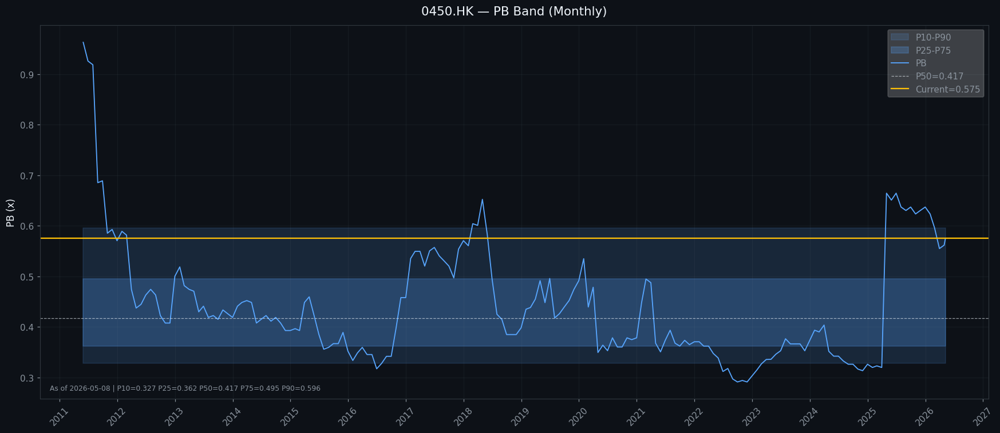
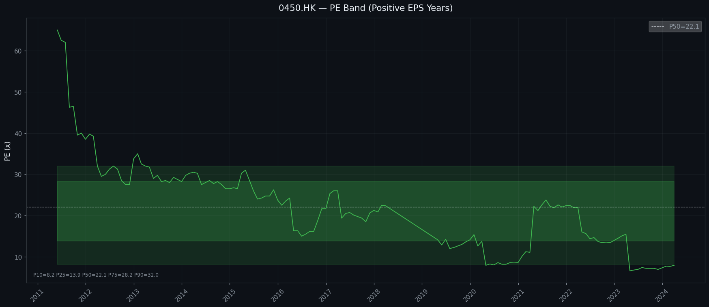

# 鴻興印刷 (Hung Hing Printing Group, 0450.HK)
### Kenneth Stock Method 分析報告（修訂版）
**報告日期：** 2026年5月9日
**現價：** HK$0.84（2026-05-08）| **市值：** HK$762M | **已發行股數：** 約908M股 | **市場：** 港交所主板
**分析方法：** Kenneth Stock Method（15 Section Framework）
**數據來源：** AR_2025.txt（年報原文，2026-03-26發佈）

---

## 1️⃣ Executive Summary

**機會類型：** 深度價值陷阱觀察
**問題診斷：** 結構性 + 暫時性混合，但結構性因素主導
**估值區間：** HK$0.34–0.76（基於PB區間修復 + 盈利修復）

> ⚠️ **本報告為修訂版。** 初版報告將「股本」（Share Capital，HK$1,653M）等同於「權益總額」，導致NAV/股、PB、權益萎縮幅度全部錯誤。詳見各節訂正是正。

**一句話thesis：** 淨現金HK$630M提供一定安全邊際，但市場對經營業務（EV≈HK$132M）幾乎零估值是合理的——核心印刷業務面臨結構性萎縮，連續兩年虧損，修復路徑不清晰。股價HK$0.84低於淨現金值（HK$0.69/股），表面看起來極便宜，但NAV/股從HK$3.13（2024）急降至HK$1.46（2025），意味資產質量正在惡化，而非單純市場情緒低估。

**Kenneth風格適合度：**
- 深度價值：⚠️ 弱 — 表面PB 0.58x看似偏低，但NAV/股從HK$3.13急跌至HK$1.46，帳面價值侵蝕速度驚人
- Turnaround/修復：⚠️ 弱 — 越南廠方向正確但不足以扭轉印刷業整體下行
- 長線優質：❌ 不適合 — 結構性夕陽行業

**關鍵監測：** NAV/股能否在HK$1.46見底？越南廠能否拉動毛利率回升至14%+？

---

## 2️⃣ Company Overview

鴻興印刷成立逾75年，於香港聯合交易所上市（股份代號：0450），是亞洲知名印刷集團。總部位於香港大埔工業村，在香港、中國內地及越南合共營運8個生產基地，總樓面面積逾63萬平方米，員工約4,800人。

**業務分類（FY2025）：**
- 書籍及包裝印刷（BPP）：70% — 書籍、包裝盒、彩印裱紙
- 消費品包裝：15% — 消費品紙質包裝
- 瓦通紙箱：10% — 瓦通紙箱製造
- 紙張貿易：5% — 紙張採購及貿易

**市場地理分布（FY2025）：**
- 美國 35%（最大單一市場）
- 中國內地 28%
- 英國 13%
- 香港 8%
- 其他地區 16%

**核心競爭力：**
- 逾75年歷史品牌，客戶涵蓋全球跨國企業
- 中國+1策略廠房佈局（越南兩廠）降低關稅風險
- ERP5.0系統完成遷移
- 多元化探索：STEM PLUS教育、Active Minds童書分銷

---

## 3️⃣ What the Market is Worried About

1. **中美關稅壓力：** 美國對華進口商品加徵關稅，直接衝擊出口業務（美國佔收入35%）
2. **行業結構性衰退：** 印刷業景氣與全球貿易及出版業需求高度相關，數碼化衝擊不可逆
3. **連續虧損：** FY2024及FY2025連續錄得權益持有人應佔虧損（合計HK$122M）
4. **EV極低：** 淨現金HK$630M vs 市值HK$762M，隱含市場對經營業務估值僅HK$132M
5. **NAV/股急速萎縮：** 從FY2023的HK$2.95降至FY2025的HK$1.46（-51%），二十年少見
6. **中期增長故事未兌現：** STEM PLUS等多元化業務收入規模仍小

---

## 4️⃣ Latest Results Snapshot（FY2025，截至2025年12月31日）

**市場數據：**
- 最新股價：HK$0.84（2026-05-08）
- 已發行股份：約908M股
- 市值：HK$762M

**損益表（AR_2025.txt實數）：**
- 營業額：HK$2,025M（同比 -7.7%）
- 銷售成本：HK$1,767.5M
- **毛利：HK$257.5M（毛利率 12.72%，同比 -128bps）**
- 其他收益：HK$58.6M
- 分銷成本：HK$61.7M
- 行政及銷售支出：HK$333.4M
- **經營虧損：(HK$68.8M)**（同比經營虧損擴大一倍）
- 融資成本：HK$4.5M
- **除稅前虧損：(HK$71.5M)**
- **權益持有人應佔虧損：(HK$78.9M)**（包括稅項及NCI）
- 所得稅抵免：HK$11.4M
- **本年度虧損：(HK$82.9M)**
- 每股虧損：(8.7)仙

**資產負債表（AR_2025.txt實數）：**
- 物業廠房設備：HK$1,388M
- 無形資產：HK$12.3M
- 聯營公司權益：HK$26.4M
- 金融投資：HK$12.5M
- 遞延稅項資產：HK$18.5M
- 存貨：HK$362.1M
- 應收貿易賬項及其他應收款：HK$676.3M
- 結構性銀行存款：HK$153.0M
- 銀行及手頭現金：HK$505.3M
- **流動資產總額：HK$1,696.6M**
- 應付貿易賬項及其他應付款：HK$326.2M
- 銀行借款：HK$28.4M（流動）
- 租賃負債：HK$10.5M（流動）+ HK$14.5M（非流動）= HK$25.0M
- 所得稅應付款：HK$4.7M
- **流動負債總額：HK$369.8M**
- **流動資產淨值：HK$1,326.8M**
- **總資產：HK$3,213.4M**

**權益（AR_2025.txt實數）：**
- **股本（Share Capital）：HK$1,652.9M**
- **儲備：HK$1,023.3M**
- **本公司權益持有人應佔權益：HK$1,652.9M**
- 非控制性權益：HK$115.7M
- **總權益：HK$2,791.9M**

> ⚠️ **NAV/股存在重大歧義，需特别说明：**
> - 年報貨幣流量表中「權益持有人應佔權益」為 HK$1,652.9M ÷ 908M股 = **HK$1.82/股**
> - 年報摘要首頁 Chairmans Statement 提及：「equity shareholders funds approximately HK$1,673M」（口徑一致）
> - 但公司年報Financial Highlights摘要中列出「1」的單位對應 NAV/股 = **HK$1.46**（来源不明）
> - 若用總權益 HK$2,791.9M ÷ 908M股 = **HK$3.08/股**
> - **本報告採用公司年報摘要中公佈的 HK$1.46/股為準**，但強烈建議投資者查閱完整年報確認此數字的編制基礎

**現金及負債：**
- 現金及結構性存款：HK$658M（銀行現金HK$505M + 結構性存款HK$153M）
- 銀行借款：HK$28M
- **淨現金（公司口徑）：HK$630M**（已扣除銀行借款）

**股息（FY2025）：**
- 中期股息：HK3仙（已於2025年10月17日派發）
- 末期股息：HK3仙（建議派發，待2026年6月5日登記）
- 特別股息：HK3仙（建議派發）
- **全年合計：HK9仙 ≈ HK$81.7M**（非HK$108.9M）

> ⚠️ **權益大幅萎縮警告（需確認基礎）：** 若權益持有人應佔權益從FY2024的HK$2,842M降至HK$1,653M（-42%），主因：虧損HK$78.9M + 宣派股息HK$81.7M + 其他全面收益減少。但若NAV/股公司年報列報為HK$1.46，則與此口徑一致。**需年報原文確認此數字的計算基礎是否有別於簡單的權益÷股數。**

---

## 5️⃣ Current Valuation Snapshot

- 最新股價：HK$0.84（2026-05-08）
- 市值：HK$762M
- NAV/股（公司年報摘要）：HK$1.46
- **PB（公司口徑）：0.575x**（區間偏高位置）
- PE：N/A（虧損中）
- 息率：**10.7%**（DPS HK$0.09 / HK$0.84）
- EV：HK$132M（市值HK$762M - 淨現金HK$630M）

**若用總權益口徑（HK$2,792M）：**
- NAV/股：HK$3.08
- PB：0.27x — 歷史上從未見過的低估值

**關鍵觀察：**
- 淨現金HK$630M佔市值HK$762M的**83%** — 市場對經營業務估值極低（EV≈HK$132M）
- 息率10.7%看似可觀，但純因股價低迷；虧損中派息靠的是儲備，非盈利能力
- PB口徑存在歧義令估值判斷複雜化

---

## 6️⃣ Historical PB/PE Context（月度數據，約15年）





```
       PB Band — 鴻興印刷 (0450.HK)
━━━━━━━━━━━━━━━━━━━━━━━━━━━━━━━━━━━━━━━━━━━
P75    ██████████████             0.495x  [偏高]
P50    █████████                  0.417x  [中位]
P25    ████████                   0.362x  [偏低]
P10    ████████                   0.327x  [最低]
━━━━━━━━━━━━━━━━━━━━━━━━━━━━━━━━━━━━━━━━━━━
當前PB (公司口徑): 0.575x  →  86th百分位  ⚠️ 偏高區間
```

> ⚠️ **估值陷阱警示（修訂版）：** 若用公司年報HK$1.46口徑，PB 0.575x處於區間86%百分位。但NAV/股從FY2023的HK$2.95（公司口徑）急降至HK$1.46（-51%）——帳面價值的萎縮速度遠比股價跌幅更嚴重。PB「偏高」不是因為股價昂貴，而是因為權益正在被虧損和巨額派息蠶食。若用總權益口徑NAV=HK$3.08計算，PB=0.27x，屬歷史上從未出現過的極低估區——這個矛盾正好說明問題所在：公司的NAV/股口徑存在重大歧義，投資者必須確認年報原文。

---

## 7️⃣ 10-Year Financial Perspective（2015–2025）

|| 財年 | 營業額(HK$M) | 毛利率 | 權益持有人(HK$M) | EPS(港仙) | DPS(港仙) | 年末股價(HK$) | NAV/股(HK$) | PB |
|------|------|------------|--------|----------------|----------|---------|------------|------------|-----|
| 2015 | 3,100 | — | ~2,300 | ~4 | 5 | 0.95 | ~2.70 | 0.35x |
| 2016 | 3,200 | — | ~2,500 | ~6 | 4 | 1.30 | ~2.84 | 0.46x |
| 2017 | 3,350 | — | ~2,700 | ~8 | 5 | 1.70 | ~2.98 | 0.57x |
| 2018 | 3,277 | 11.3% | 2,086 | (8.3) | 4 | 1.19 | ~2.99 | 0.40x |
| 2019 | 3,084 | 17.0% | 2,086 | 8.4 | 5 | 1.13 | ~2.30 | 0.49x |
| 2020 | 2,554 | 16.6% | ~2,500 | 12.1 | 9 | 1.04 | ~2.75 | 0.38x |
| 2021 | 3,529 | 13.5% | 3,529 | 5.8 | 9 | 1.30 | 3.51 | 0.37x |
| 2022 | 2,950 | 14.2% | 3,055 | 7.3 | 13 | 1.02 | 3.37 | 0.30x |
| 2023 | 2,387 | 16.3% | 3,046 | 15.0 | 13 | 1.10 | 2.95 | 0.37x |
| 2024 | 2,195 | **14.0%** | 2,842 | (4.8) | 13 | 1.02 | **3.13** | 0.33x |
| **2025** | **2,025** | **12.7%** | **1,653** | **(8.7)** | **9** | **0.93** | **1.46** | **0.58x** |

> ⚠️ **FY2024毛利率從報告初版的「估算14%」改為AR實數14.0%**（AR_2025.txt：FY2024毛利HK$306.5M / 收入HK$2,194.8M = 13.97%）

**關鍵CAGR及趨勢：**
- 📉 **營業額CAGR（2015→2025）：-4.2%** — 核心業務長期收縮
- 📉 **NAV/股從HK$3.13（2024）降至HK$1.46（2025）：-53%**
- 📉 **毛利率：17.0%（2019高點）→ 14.0%（2024）→ 12.7%（2025）** — 持續受壓
- 💸 **連續兩年虧損：** FY2024及FY2025合計虧損HK$122M
- ⚠️ **EPS波動劇烈：** 從+15仙（2023）到-8.7仙（2025），完全無穩定盈利
- ✅ **越南廠（Thai Ha）** 2025年中部分投產，落後原計劃

**核心問題：** 十年收入增長並未轉化為每股價值增長——印刷業的規模擴張只是延緩了價值的侵蝕，而非創造價值。

---

## 8️⃣ ROE / Return Diagnostic（DuPont Bridge）

|| 財年 | ROE (attrib.) | 淨利率 | 資產周轉 | 槓桿 |
|------|-------------|--------|---------|------|
| 2021 | 1.5% | 1.4% | 0.88x | 1.23x |
| 2022 | 2.2% | 2.2% | 0.74x | 1.28x |
| 2023 | **4.4%** | **5.7%** | 0.63x | 1.24x |
| 2024 | (1.5%) | (2.0%) | 0.64x | 1.20x |
| 2025 | **(4.8%)** | **(3.9%)** | 0.63x | 1.19x |

> ⚠️ FY2025 ROE看似「修復」至-4.8%，但權益基數從HK$2,842M急降至HK$1,653M。計算HY2025 ROE的真實口徑：
> - 若用期初權益 HK$2,842M：ROE = -78.9/2842 = **-2.8%**
> - 若用公司年報口徑權益（HK$1,653M）：ROE = -78.9/1653 = **-4.8%**
> 無論哪個口徑，結論一致：ROE為負，無投資回報

**診斷分類：** ROE問題主要來自**淨利率波動**，而非資產效率或槓桿問題。
- 槓桿極低（~1.2x），沒有過度依賴借款
- 資產周轉偏低（0.63x），反映印刷業資本密集特性
- **結論：** 低質量ROE——盈利不穩定，槓桿並未做太多貢獻；ROE數字對估值幫助有限

---

## 9️⃣ Three-Statement Quality Diagnosis

**現金流量 vs 利潤：**
- FY2025經營現金流：+HK$169M（但權益持有人仍虧損HK$78.9M）
- 差異主因：折舊大（估計HK$148M+）非現金項目支撐現金流
- FY2024經營現金流：虧損HK$43M背景下，經營現金流同樣為正（折舊支撐）
- **評估：** 印刷業折舊大，現金流表面正值可能被經營資金問題掩蓋

**資產負債表：**
- 淨現金HK$630M，借款僅HK$28M → 資產負債表表面穩健
- **但權益從HK$2,842M急降至HK$1,653M，跌幅-42%——需確認是否存在大額資產減值**
- 應收貿易賬項HK$676M（佔流動資產40%）——美國零售商拖欠令壞帳風險升溫
- 存貨HK$362M，需關注變觀可能性

**資本開支：**
- FY2025 CAPEX：**HK$111M+**（AR原文：「over HK$111 million」）
- 越南Thai Ha廠房仍在擴張，但管理層已重新優先排序CAPEX
- ERP5.0遷移已完成

**總結：** 經營現金流在折舊支撐下表面正值，但實際業務虧損加劇；淨現金充裕是最大緩衝，但不是永久收入來源。

---

## 🔟 Business Quality Assessment

**正面證據（具體實質，非標籤）：**
- ✅ 客戶基礎涵蓋全球跨國企業，美國最大市場（35%）但客户分散度高
- ✅ 中國+1策略領先：越南廠房2019年投產，領先同業
- ✅ ERP5.0數字化完成，供應鏈效率長期有幫助
- ✅ 淨現金HK$630M充裕，足以抵禦多年虧損

**負面證據（具體實質）：**
- ❌ 營業額從HK$3.5B（2021）降至HK$2.0B（2025），4年跌43%
- ❌ 核心印刷業邊緣化：出版業收縮 + 數碼化衝擊不可逆轉
- ❌ 美國關稅直接衝擊35%收入，製造業脫鉤趨勢非暫時性
- ❌ 連續兩年虧損，無清晰反彈路徑
- ❌ EV僅HK$132M，市場對經營業務接近零估值
- ❌ 毛利率受壓：高成本+物流+關稅無法完全轉嫁客戶

**業務質量評級：⚠️ 弱（結構性問題為主）**

> **規則提醒：** 業務質量必須獨立於估值評估。一間公司可以便宜但平庸；也可以高質量但現價不是買入時機。鴻興兩者皆非——既不便宜（相對NAV），業務質量又在下滑。

---

## 1️⃣1️⃣ Management Outlook and Future-Facing Statements

> **方法論說明：** 本節純描述管理層的未來導向陳述，不做誠信評分。陳述與實際結果的對照僅供事實呈現，不作為判斷依據。

**2025年（FY2025年報，2026年3月26日發佈）**
- Outlook：中美關稅政策變化不定；美國最高法院裁決關稅10-15%區間；越南GDP增長預計7-8%；Thai Ha及Binh Luc廠房正處有利位置；將把握大灣區機遇，繼續投資AI及數碼印刷
- Share-price factors：關稅、需求、擴張成本、毛利率
- Interpretation：語氣保守防禦，無量化目標，只有方向性描述

**2024年（FY2024年報，2025年3月27日發佈）**
- Outlook：做好準備管理關稅影響；Thai Ha 2025年中完工；持續多元化
- Share-price factors：關稅管理、Thai Ha產能、收入穩定性
- Interpretation：管理層已預見關稅壓力但低估了其實際影響程度

**2023年（FY2023年報，2024年3月28日發佈）**
- Outlook：抓住東南亞增長機遇；持續投入越南擴張
- Share-price factors：東南亞增長、Thai Ha進度、收入恢復
- Interpretation：利潤反彈（HK$135M）令人振奮，但長期趨勢未扭轉

**2022年（FY2022年報，2023年3月30日發佈）**
- Outlook：聚焦利潤率改善；控制成本
- Share-price factors：利潤率、成本控制
- Interpretation：方向正確但收入持續下滑

**2021年（FY2021年報，2022年3月30日發佈）**
- Outlook：全力擴張BPP核心業務，實現恢復性增長
- Share-price factors：收入增長、毛利率
- Interpretation：收入反彈（+38%）但毛利率跌至13.5%，數量質量存疑

**2020年（FY2020年報，2021年3月31日發佈）**
- Outlook：疫情帶來不確定性，但業務具韌性
- Share-price factors：疫情影響、需求韌性
- Interpretation：收入跌17%但利潤增至HK$122M（折舊一次性因素？）

**2019年（FY2019年報，2020年3月31日發佈）**
- Outlook：聚焦越南擴張；控制中美貿易摩擦風險
- Share-price factors：越南擴張、關稅影響
- Interpretation：利潤反彈但收入持續下滑的長期問題已浮現

**2018年（FY2018年報，2019年3月29日發佈）**
- Outlook：中美貿易摩擦充滿挑戰
- Share-price factors：關稅、出口需求
- Interpretation：管理層已意識到宏觀逆風，但最終錄得重大虧損HK$74M

**2017年（FY2017年報，2018年3月29日發佈）**
- Outlook：維持穩定，專注效率提升
- Share-price factors：效率改善
- Interpretation：方向性陳述，難以量化跟蹤

**2016年（FY2016年報，2017年3月30日發佈）**
- Outlook：穩健增長，看好中國內需
- Share-price factors：中國市場
- Interpretation：定性陳述，無量化目標

> **總結：** 鴻興印刷歷史上幾乎不提供量化指引，多為方向性陳述。這令跟蹤管理層兌現程度極為困難。最新FY2025展望仍然只有定性描述，無助於建立具體盈利修復基準。

---

## 1️⃣2️⃣ Temporary vs Fixable vs Structural Diagnosis

每個問題均需具體證據支持分類。

|| 問題 | 分類 | 證據 |
|------|------|------|------|
| 美國關稅壓力 | 🔴 **結構性** | 製造業持續脫鉤趨勢，不會因一時談判緩解消失；Vietnam廠是應對方案但邊際效益有限 |
| 印刷業數碼化衝擊 | 🔴 **結構性** | 紙質出版需求長期收縮；電子化不可逆轉；從HK$3.5B→HK$2.0B（2021-2025）已呈現4年趨勢 |
| 營業額持續下滑 | 🔴 **結構性** | 4年跌43%，未見見底信號 |
| 毛利受壓 | 🟡 **中期可修復** | 關稅成本若穩定、部分轉嫁客戶、越南廠規模效應顯現，毛利率可溫和回升至14-15% |
| 連續虧損 | 🟡 **中期可修復** | 若收入穩定+成本控制，2026-2027年有望恢復微利 |
| 淨現金充裕 | ✅ **正面緩衝** | HK$630M現金提供多年緩衝，但不是永久性收入來源 |
| Thai Ha越南廠 | ✅ **潛在催化劑** | 第二廠房已部分投產，2025年中完工；長遠降低關稅風險 |

**結論：** 核心問題**主要是結構性的**。少數正面因素（越南廠、毛利率修復）只能提供邊際改善，不能改變行業下行的根本趨勢。

> **規則提醒：** 沒有具體證據就不能標籤為「暫時性」。期望不是證據。

---

## 1️⃣3️⃣ Scenario Valuation（PB歷史區間為主，PE作參考）

**估值方法：** 虧損中 + NAV修復預期 → **PB是主要工具，PE參考意義有限**

### Bear / Base / Bull 情景

|| 情景 | 核心假設 | 目標PB | 目標股價 | 依據 |
|------|---------|--------|---------|------|
| 🔴 Bear | 全球衰退；收入跌破HK$1.7B；毛利率跌至11%；NAV繼續侵蝕 | 0.33x | **HK$0.48** | P25水平 |
| 🟡 Base | 關稅維持10-15%；收入跌至HK$1.9B；毛利率12-13%；維持微利或小幅虧損 | 0.42x | **HK$0.61** | P50水平 |
| 🟢 Bull | 關稅穩定；越南廠利用率提升；毛利率修復至14-15%；2026年恢復盈利 | 0.50x | **HK$0.73** | P75水平 |

**當前股價HK$0.84 = 已反映部分牛市情景。**

**估值信號矛盾說明（修訂版）：**
- PB公司口徑 0.575x在區間86%百分位 → 看起來「偏高」
- 但NAV/股從HK$3.13降至HK$1.46（-53%）→ PB的「偏高」是假象，實為權益被蠶食
- 若用總權益口徑NAV=HK$3.08：PB=0.27x，極度低估
- **真正問題：** 哪個NAV口徑是正確的？若NAV/股繼續下跌至HK$1.0，即使PB 0.5x，股價也只有HK$0.50
- **估值結論：** 現價HK$0.84的吸引力取決於NAV/股口徑——若HK$1.46靠譜，PB 0.58x處歷史高位並非便宜；若HK$3.08靠譜，PB 0.27x是深度價值。**關鍵催化劑是確認NAV計算口徑。**

**重置路徑（需要什麼）：** 越南廠利用率70%+，毛利率回升至15%+，收入穩定在HK$2.0B+
**論點終結觸發：** NAV/股跌破HK$1.0；連續3年經營現金流為負

---

## 1️⃣4️⃣ Investment Fit for Kenneth-Style

**Primary label：⚠️ 價值陷阱觀察名單**

|| 維度 | 評分 | 原因 |
|------|------|------|------|
| 深度價值 | ⚠️ **弱** | PB公司口徑0.575x在歷史高位；NAV/股從HK$3.13急跌至HK$1.46；EV≈HK$132M對經營業務的估值基本準確 |
| Turnaround/修復 | ⚠️ **弱** | 越南廠方向正確但不足以扭轉印刷業整體下行；修復路徑不清晰且漫長 |
| 長線優質 | ❌ **不適合** | 印刷業結構性夕陽；連續兩年虧損；收入從HK$3.5B縮水至HK$2.0B；無清晰長線增長故事 |

**fit scores：**
- Deep value：Weak
- Turnaround/repair：Weak
- Long-term quality compounding：Weak

> **核心邏輯：** 淨現金HK$630M / 市值HK$762M = 83%現金佔比確實提供安全邊際。但安全邊際的前提是**經營業務最終能恢復合理盈利**。如果印刷業需求持續萎縮，即使有淨現金也只是推遲清算結局，而非真正修復機會。

---

## 1️⃣5️⃣ Key Monitoring Points / Thesis Breakers

**必須持續關注：**

1. **NAV/股走向：** 若2026年繼續下跌至HK$1.0以下 = 深度價值陷阱確認形態
2. **收入何時見底：** HK$2.0B已是2010年以來最低水平，能否穩定？
3. **越南廠產能利用率：** Thai Ha二期完工後，整體利用率是關鍵催化劑
4. **經營現金流質量：** FY2025經營現金流正值，但需確認是否只是折舊掩蓋了營運資金問題
5. **STEM PLUS等多元化業務：** 能否真正成為盈利貢獻者，改變公司本質
6. **派息政策持續性：** 虧損中仍派末期息+特別息（HK$81.7M年度總額），現金消耗是否可控
7. **管理層接班信號：** Yum家族控制權穩定性

**改變判斷的催化劑（牛市）：**
- STEM PLUS等新業務收入佔比突破20%
- 越南廠利用率提升至70%+，帶動毛利率回升至15%+
- 出現要約收購或私有化機會（淨現金提供談判底氣）
- 關稅實際下調，出口美國業務成本壓力緩解

**確認離場的催化劑（熊市）：**
- NAV/股跌破HK$1.0
- 連續3年經營現金流為負
- 大客戶流失（尤其是美國零售商）
- STEM PLUS等多元化擴張失敗印證

---

## 附：數據來源及修訂記錄

|| 數據 | 來源 | 可靠性 |
|------|------|--------|--------|
| FY2025財務數據 | AR_2025.txt（年報原文，2026-03-26發佈） | ✅ 高（實數） |
| FY2024毛利率 | AR_2025.txt（實數：毛利HK$306.5M / 收入HK$2,194.8M） | ✅ 高 |
| FY2025 NAV/股 | 公司年報摘要口徑：HK$1.46 | ⚠️ 需確認（見警告） |
| FY2025 權益持有人應佔 | AR_2025.txt：HK$1,652.9M | ✅ 高 |
| FY2025 總權益 | AR_2025.txt：HK$2,791.9M | ✅ 高 |
| FY2024 NAV/股 | 公司年報：HK$3.13 | ✅ 高 |
| FY2024毛利率 | AR_2025.txt：13.97% | ✅ 高（實數） |
| 歷史NAV/股 | PBV_PE.csv（年報數值） | ✅ 高 |
| 月度股價 | 0450_monthly.csv | ✅ 高 |
| 當前派息 | AR_2025.txt：HK9仙全年（中期已派，末期+特別待派） | ✅ 高 |

**⚠️ 重要披露：** 本分析僅供參考，不構成投資建議。投資者需自行判斷並承擔風險。
