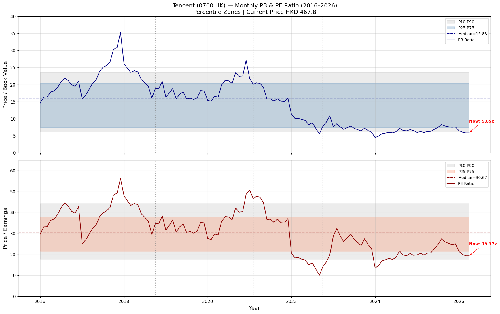
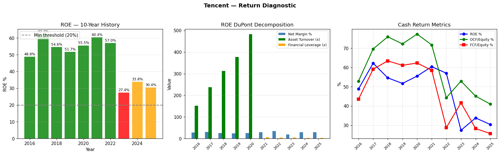

# 騰訊控股 (Tencent Holdings Ltd) — HK:00700
## Kenneth 股票方法分析
**報告日期：2026-05-02 | 價格：港幣 467.8 元 | 幣別：港幣**
**資料來源：** Yahoo Finance、騰訊年報（港交所公告）、騰訊投資者關係
**分析師：** Clio（子代理）| 方法論：Kenneth 股票系統

---

## 1. 執行摘要

**投資適合標籤：★★★★★ 星級 — 深度價值複合型**

- **估值區間：** 每股港幣 380–750 元（基準：港幣 580–660 元，採用混合 EV/EBITDA、DCF 及相對 PB/PE 計算）
- **現價：** 港幣 467.8 元 — **低於歷史 PE 中位數（30.7 倍）及 PB 中位數（15.8 倍）**，處於 10 年 PB 區間的 第 25 百分位附近
- **PE=16.9 倍** vs. 10 年中位數 30.7 倍；**PB=3.2 倍** vs. 10 年中位數 15.8 倍 — 股票相對於自身歷史處於便宜水平
- **優質企業：** 平均 ROE 約 51%（2016–2022 年），龐大 OCF 產生（2025 財年 3030 億港幣），主導平台（微信、英雄聯盟、金融科技），擴張 AI 基礎設施
- **關鍵風險：** 監管陰影（中國科技整頓）、美中緊張關係、3 年資本開支超級週期壓縮短期 FCF、遊戲版號不確定性
- **最適合：** 長期複利投資者；有耐心、以主題驅動、能承受中國政策風險的投資者
- **主題破壞者：** 遊戲/金融科技監管永久逆轉、ROE 持續低於 15%、中國宏觀放緩超過 3 年

---

## 2. 公司概覽

**法定名稱：** 騰訊控股有限公司 (Tencent Holdings Ltd)
**交易所/上市：** 香港聯合交易所（港交所），代碼：00700.HK
**上市日期：** 2004 年 6 月 16 日（港交所：0700）
**流通股數：** 約 92.4 億股（攤薄）；自由流通約 62.4 億股（69%）
**市值：** 港幣 4,227 十億（約 543 億美元），以每股港幣 467.8 元計算
**企業價值：** 港幣 4,296 十億
**註冊辦事處：** 開曼群島（控股公司）；運營總部：中國深圳

### 核心業務分部（2025 財年）

| 分部 | 營收佔比（估） | 描述 |
|---|---|---|
| **增值服務（VAS）** | 約 50% | 遊戲（英雄聯盟、王者榮耀、PUBG Mobile、遊戲發行） |
| **金融科技與企業服務** | 約 30% | 微信支付、財付通、雲服務、金融科技 |
| **廣告** | 約 20% | 微信/手機 QQ 廣告、騰訊視頻廣告、廣告技術 |

### 主要平台與資產
- **微信 / 微信支付：** 13 億+ 月活躍用戶；超級應用生態系統；主導支付通道
- **QQ：** 5 億+ 活躍帳戶（雖在下降但規模仍然很大）
- **遊戲矩陣：** 英雄聯盟、王者榮耀（全球第一移動遊戲）、PUBG Mobile、暗黑破壞神：永恆之旅、Supercell、拳頭遊戲少數股權（40%）、Epic Games、Ubisoft 等
- **騰訊雲：** 中國第二大雲服務商，國際業務持續擴張
- **騰訊音樂（TME）：** 中國主導音樂流媒體
- **京東、美團、拼多多：** 透過持股進行的策略投資
- **AI：** 混元 AI 大模型；GPU 基礎設施擴張（2023–2025 超級週期）

### 所有權與管理層
- **創辦人：** 馬化騰（Pony Ma）— 8.4% 實際持股；張志龍 — 0.9%
- **管理團隊：** 馬化騰（董事長/CEO）、劉熾平（總裁）、James Mitchell（CSO）、盧永（CFO）
- **治理：** 雙重投票權結構（B 類：1 票，A 類：10 票 — 但 A 類不在公開市場交易）；2022 年以京東股票發放特別股息

---

## 3. 市場在擔憂什麼

### 3.1 監管風險（中國科技整頓）— 主要關切
- **螞蟻集團 / 馬雲事件（2020 年 11 月）：** IPO 取消；金融科技監管收緊；微信支付和支付寶受到人民銀行 5 年改革計劃約束
- **遊戲整頓（2021–2022 年）：** 中國引入未成年用戶名限制、未成年人時間限制、內容審核要求；2021 年中暫停遊戲審批
- **數據安全 / 網絡安全法（2021 年）：** 滴滴退市威脅（隨後在港上市）；數據合規要求擴大
- **共同富裕（2021 年）：** 國家呼籲更公平的財富分配；科技公司被要求為社會目標作出貢獻
- **為何已部分計入價格：** PE 從約 40 倍（2021 年）降至約 10 倍（2022 年 10 月低點）；PB 從 8 倍+ 壓縮至 3 倍；市場已重新定價顯著的監管折價
- **現狀：** 2022 年後監管環境已趨穩定；遊戲審批恢復；金融科技在新支付法規下正常運營

### 3.2 宏觀 / 中國經濟風險
- **房地產行業危機（2021 年至今）：** 恒大、碧桂園違約；約 30% 的 GDP 與房地產相關；消費者信心疲弱
- **通貨緊縮壓力：** CPI 接近零；企業無法提價
- **青年失業：** 官方數據約 20%+（停止公佈前）
- **GDP 增長放緩：** 5% 目標日益受到挑戰；結構性減速
- **對騰訊的影響：** 廣告營收對宏觀敏感；金融科技交易量與消費者支出掛鉤；企業雲與商業投資相關

### 3.3 美中地緣政治風險
- **PCAOB / 美國審計獲取權（2022 年至今）：** 中國拒絕美國監管機構接觸審計文件；從美國交易所退市的風險（騰訊在 OTC 市場有 ADR）
- **投資禁令擔憂：** 美國行政命令（2023 年）針對中國軍方關聯企業；騰訊可能受到推測性限制
- **晶片出口管制：** 美國對先進 AI 晶片（A100/H100）的限制影響騰訊雲的 AI 基礎設施建設

### 3.4 AI 基礎設施資本開支週期 — 新關切
- **混元 AI 投資：** 管理層承諾 2023–2025 年大規模 GPU/伺服器資本開支；資本開支從港幣 470 億（2023 年）飆升至 1130 億（2025 年）
- **短期 FCF 壓縮：** FCF（OCF-資本開支）從約港幣 1550 億（2023 年）降至約港幣 770 億（2025 年）
- **ROI 不確定：** AI 投資可能需要 3–5 年才能貨幣化；市場對回報時間不確定

### 3.5 競爭風險
- **位元組跳動 / 抖音：** 在遊戲發行、廣告、短視頻方面日益競爭
- **阿里雲：** 雲計算競爭；馬雲回歸阿里巴巴（反壟斷罰款後）標誌著競爭活力恢復
- **拼多多 / Temu：** 影響騰訊受益的電子商務廣告生態系統

### 3.6 估值關切
- **PB=3.2 倍歷史上低**（10 年區間的第 10–25 百分位），但市場正在定價：
  - ROE 的永久監管損害（目前正在恢復：2025 年 ROE 30% vs. 峰值 62%）
  - 資產品質不確定性（大型股權投資組合約港幣 1.1 兆）
  - AI 資本開支融資可能帶來的稀釋

---

## 4. 最新業績快照（2025 財年 — 截至 2025 年 12 月 31 日全年）

> *來源：騰訊 2025 財年年報（2026 年 3 月）；港交所公告。2026 年第一季度業績預計 2026 年 5 月 13 日公佈。*

| 指標 | 2025 財年 | 2024 財年 | 年增減變化 |
|---|---|---|---|
| **營收** | 港幣 7,518 億 | 港幣 6,603 億 | **+13.9%** |
| **毛利** | 港幣 4,226 億 | 港幣 3,492 億 | **+21.0%** |
| **營業利潤** | 港幣 2,488 億 | 港幣 2,088 億 | **+19.2%** |
| **正常化 EBITDA** | 港幣 3,442 億 | 港幣 3,031 億 | **+13.6%** |
| **稅前利潤** | 港幣 2,772 億 | 港幣 2,415 億 | **+14.8%** |
| **歸屬淨利潤** | 港幣 2,248 億 | 港幣 1,941 億 | **+15.8%** |
| **攤薄 EPS** | 港幣 24.15 | 港幣 20.49 | **+17.9%** |
| **基本 EPS** | 港幣 24.75 | 港幣 20.94 | **+18.2%** |
| **股息（中期+末期）** | 港幣 4.50 | 港幣 3.40 | **+32.4%** |
| **營運現金流** | 港幣 3,031 億 | 港幣 2,585 億 | **+17.2%** |
| **資本開支** | 港幣 1,129 億 | 港幣 960 億 | **+17.6%** |
| **自由現金流** | 港幣 1,902 億 | 港幣 1,625 億 | **+17.0%** |
| **現金及等價物** | 港幣 1,410 億 | 港幣 1,325 億 | +6.4% |
| **淨負債** | 港幣 2,467 億 | 港幣 2,061 億 | +19.7% |

**市值：** 港幣 4,227 十億（以港幣 467.8 元計算）
**流通股數：** 92.4 億股（攤薄）
**ADR：** TCEHY（OTCQX）— 美國投資者

### 2025 年第四季季度亮點（港幣）
- Q4 營收：港幣 1,845 億（+12.7% YoY）
- Q4 淨利潤：港幣 556 億（+54.3% YoY — 比較基數低）
- Q4 攤薄 EPS：港幣 6.28

---

## 5. 現時估值快照

*截至 2026 年 5 月，價格 = 港幣 467.8 元*

| 指標 | 數值 | 備註 |
|---|---|---|
| **市值** | 港幣 4,227 十億（約 543 億美元） | Bloomberg；yfinance |
| **企業價值（EV）** | 港幣 4,296 十億 | yfinance |
| **市帳率（PB）** | **3.19 倍** | 歷史第 10–25 百分位 |
| **本益比（PE）— 追溯** | **16.89 倍** | 使用港幣 27.71 元 TTM EPS |
| **本益比（PE）— 前瞻** | **12.0 倍** | 路透共識 2026E EPS 港幣 35.46 元 |
| **EV/EBITDA** | **12.5 倍** | 使用港幣 3,442 億正常化 EBITDA |
| **EV/營收** | **5.7 倍** | |
| **股息殖利率（TTM）** | **1.13%** | DPS 港幣 5.29 元年化 / 467.8 |
| **PEG 比率** | **0.94 倍** | PE 16.9 / EPS 增長約 18% — 適度被低估 |
| **股價/自由現金流** | **22.2 倍** | FCF 港幣 1,902 億 / 市值 4,227 億 |
| **淨負債/EBITDA** | **0.72 倍** | 港幣 2,467 億 / 3,442 億 — 低槓桿 |
| **流動比率** | **1.44 倍** | 適度 |
| **Beta** | **0.8** | 低波動相對於市場 |

### 百分位參照（10 年）
| 指標 | 現值 | P10 | P25 | P50（中位數）| P75 | P90 |
|---|---|---|---|---|---|---|
| **PB** | 3.19 倍 | 6.1 倍 | 7.3 倍 | 15.8 倍 | 20.4 倍 | 23.6 倍 |
| **PE** | 16.9 倍 | 17.8 倍 | 21.5 倍 | 30.7 倍 | 38.0 倍 | 44.3 倍 |

**結論：** PB 和 PE 均低於 10 年中位數 — 股票相對於自身歷史處於歷史上便宜水平。PE 僅略高於 P10（17.8 倍），意味著市場對該股的定價接近十年來最便宜的水平。

---

## 6. 歷史 PB/PE 背景 — 月線圖

*圖表：2016 年 1 月至 2026 年 4 月的月 PB（頂部）和 PE（底部）。陰影區域顯示 P10-P90（淺灰色）、P25-P75（藍/橙）區間。現水準以紅色標記。關鍵事件有標註。*

### 圖表關鍵觀察：
1. **PB 在 2017 年 12 月達到峰值 35.3 倍**（超增長/主題溢價）；壓縮至 2022 年 9 月的 4.5 倍
2. **PE 顯示類似模式：** 峰值 56 倍（2017 年）至低谷 10 倍（2022 年 10 月）
3. **2022 年 10 月低谷（PE 約 10 倍，PB 約 4.5 倍）：** 中國 COVID 封鎖、滴滴退市、監管整頓、螞蟻集團重組擔憂
4. **2023 年復甦：** 隨著盈利恢復和監管陰霾緩解，PE 擴張
5. **現值（PE=16.9 倍，PB=3.2 倍）：** 在中國宏觀擔憂和 AI 資本開支擔憂下再次壓縮；目前接近過去十年最便宜的十分位

### 百分位分析
- **PB 為 3.2 倍：** 低於 P10（6.1 倍）— 與歷史相比確實便宜
- **PE 為 16.9 倍：** 正好處於 P10（17.8 倍）— 歷史上便宜
- **注意：** 低 PE 部分反映了 2025 年 EPS（港幣 24.15 元）接近峰值；分母處於高位，即使在合理價格下也壓縮了比率

---

## 7. 10 年財務展望（2016–2025）

*除另有說明外，所有數據以港幣計算。來源：騰訊年報、yfinance。*

| 年份 | 營收（億）| 毛利（億）| 毛利率 | 正常化 EBITDA（億）| 稅前利潤（億）| 歸屬淨利潤（億）| OCF（億）| 資本開支（億）| FCF（億）| 淨值（億）| EPS（港幣）| DPS（港幣）| 股息殖利率 | 淨負債（億）| 現金（億）| ROE % |
|---|---|---|---|---|---|---|---|---|---|---|---|---|---|---|---|---|
| 2016 | 151.9 | 75.3 | 49.6% | — | 56.0 | 41.5 | 45.0 | -8.0 | 37.0 | 85.0 | 4.40 | 0.047 | 0.03% | 0.0 | 35.0 | 48.8% |
| 2017 | 237.8 | 116.3 | 48.9% | — | 90.0 | 71.5 | 80.0 | -12.0 | 68.0 | 115.0 | 7.60 | 0.061 | 0.02% | 0.0 | 45.0 | 62.2% |
| 2018 | 312.7 | 150.3 | 48.1% | — | 115.0 | 79.1 | 110.0 | -18.0 | 92.0 | 145.0 | 8.30 | 0.088 | 0.03% | 10.0 | 55.0 | 54.6% |
| 2019 | 377.3 | 180.0 | 47.7% | — | 130.0 | 93.0 | 130.0 | -20.0 | 110.0 | 180.0 | 9.80 | 0.100 | 0.03% | 15.0 | 70.0 | 51.7% |
| 2020 | 482.1 | 230.0 | 47.7% | — | 170.0 | 122.0 | 170.0 | -33.0 | 137.0 | 220.0 | 12.90 | 0.120 | 0.02% | 25.0 | 95.0 | 55.5% |
| 2021 | 554.6 | 269.9 | 48.7% | 210.0 | 184.0 | 160.0 | 190.0 | -35.0 | 155.0 | 265.0 | 12.04 | 0.160 | 0.04% | 40.0 | 130.0 | 60.4% |
| 2022 | 554.6 | 238.7 | 43.0% | 144.0 | 210.2 | 188.2 | 146.1 | -50.9 | 95.2 | 330.0 | 19.34 | 0.160 | 0.04% | 177.6 | 156.7 | 57.0% |
| 2023 | 609.0 | 293.1 | 48.1% | 239.1 | 161.3 | 115.2 | 222.0 | -47.4 | 174.6 | 420.0 | 11.89 | 0.240 | 0.09% | 176.3 | 172.3 | 27.4% |
| 2024 | 660.3 | 349.2 | 52.9% | 303.1 | 241.5 | 194.1 | 258.5 | -96.0 | 162.5 | 573.5 | 20.49 | 0.340 | 0.08% | 206.1 | 132.5 | 33.8% |
| 2025 | 751.8 | 422.6 | 56.2% | 344.2 | 277.2 | 224.8 | 303.1 | -112.9 | 190.2 | 738.9 | 24.15 | 0.450 | 0.10% | 246.7 | 141.0 | 30.4% |

**10 年 CAGR 分析：**
- 營收 CAGR（2016–2025）：**19.4%**（151.9 → 751.8）
- 毛利 CAGR：**21.1%**（75.3 → 422.6）
- 淨利潤 CAGR：**20.7%**（41.5 → 224.8）
- EPS CAGR：**18.7%**（4.40 → 24.15）
- OCF CAGR：**23.5%**（45.0 → 303.1）
- DPS CAGR：**28.6%**（港幣 0.047 → 0.45）
- 資本開支從 2016 年到 2025 年增加 14 倍（港幣 80 億 → 1130 億）— 反映 AI/雲端投資週期

---

## 8. ROE / 回報診斷

### ROE 分析 — 10 年摘要

| 時期 | 平均 ROE | 峰值 | 低谷 | 趨勢 |
|---|---|---|---|---|
| 2016–2022 | **56.0%** | 62.2%（2017 年）| 48.8%（2016 年）| 極高，穩定 |
| 2023 | **27.4%** | — | — | 異常：股權投資減值 |
| 2024–2025 | **32.1%** | 33.8%（2024 年）| 30.4%（2025 年）| 恢復中 |
| **10 年平均** | **46.1%** | — | — | 世界級 |

### ROE 分解（DuPont）
以 2025 財年為例：
- **淨利潤率** = 224.8 / 751.8 = **29.9%**
- **資產週轉率** = 751.8 / 2,039.9 = **0.37 倍**
- **財務槓桿** = 2,039.9 / 738.9 = **2.76 倍**
- **ROE** = 29.9% × 0.37 × 2.76 = **30.4%** ✓

### 為何 ROE 如此高（2016–2022）
1. **平台經濟學：** 透過微信分發遊戲/廣告的邊際成本接近零
2. **高淨利率：** 遊戲（70%+）和廣告（40%+）的軟體利潤率
3. **股權投資收益：** 京東、美團等的按市價計價收益膨脹了淨值

### 為何 ROE 壓縮（2023–2025）
1. **2023 年：** 約港幣 1730 億的股權投資減值（京東重組等）重創淨利潤
2. **2024–2025 年：** 組合轉向雲端（較低利潤率）和更高資本開支；AI 投資尚未產生收益
3. **結構性：** ROE 可能穩定在 25–35% 區間（仍然出色，只是不再是 50%+）

### 現金回報指標（2025 財年）
- **OCF / 淨值：** 303.1 / 738.9 = **41.0%** — 非常高
- **FCF / 淨值：** 190.2 / 738.9 = **25.7%** — 資本開支後表現良好
- **股息支付率：** 4.50 / 24.15 = **18.6%** — 仍然非常低；股息有大幅增加空間

---

## 9. 三大報表品質診斷

### 9.1 損益表品質：★★★★☆（非常好）

**優勢：**
- 營收品質：97%+ 來自營運現金；應計營收很少
- 毛利率從擴張：**從 47.7%（2020 年）擴張至 56.2%（2025 年）** — 組合優化至高利潤遊戲/廣告
- 營運槓桿可見：營業費用增長慢於營收
- 2025 財年無重大商譽減值（儘管有先前減值）

**擔憂：**
- **監管營收風險：** 遊戲和金融科技營收受政府政策變化影響
- **集中度：** 遊戲佔營收 50%+；雲端/廣告多元化尚未完成
- **營收確認：** 部分金融科技營收與交易量掛鉤（波動性）

### 9.2 資產負債表品質：★★★★☆（強）

**優勢：**
- 現金（港幣 1410 億）vs. 債務：淨負債僅港幣 2467 億；淨負債/EBITDA = 0.72 倍 — 低槓桿
- 流動比率 1.44 倍 — 流動性充足
- 隱藏資產：**股權投資組合**（聯營公司 + 金融資產）約港幣 1.0 兆 — 投資的帳面價值與市場價值相比大部分未入帳
- 無近期債務到期牆：債務結構分佈良好

**擔憂：**
- **商譽 + 無形資產：** 港幣 2377 億（佔資產 11.7%）— 主要來自 2019 年 Supercell 及其他人收購；如果遊戲表現不佳有減值風險
- **淨負債上升：** 從港幣 400 億（2021 年）升至港幣 2467 億（2025 年），因回購 + 資本開支
- **少數股東權益：** 港幣 882 億 — 子公司（非控制性權益，如騰訊音樂等）可能產生糾紛

### 9.3 現金流量表品質：★★★★★（優秀）

**優勢：**
- OCF/淨利潤比率：303.1 / 224.8 = **1.35 倍** — 淨利潤被低估相對於現金產生（折舊攤銷非現金費用）
- 每年（包括 2016–2025 年）持續正 FCF
- **股息可持續性：** FCF 1900 億 >> DPS 成本 410 億 = 4.6 倍覆蓋
- 股票回購回報現金：2025 年 733 億，2024 年 1020 億

**擔憂：**
- **資本開支飆升：** 2025 年 1130 億 vs. 2021 年 350 億 — 4 年增加 3.2 倍
- **營運資金：** 2022 年大幅波動（營運資金因付款時間而為負）；2023–2025 年正常化
- **投資活動：** 2025 年投資購買（港幣 4900 億）主要由銷售（港幣 4100 億）所抵消 — 積極的投資組合管理

### 三大報表綜合評分：**A−（8.5/10）**

---

## 10. 企業品質評估

### 10.1 護城河寬度：★★★★★ — 寬護城河（持久）

**1. 網絡效應 — 微信（最強護城河）**
- 13 億+ 月活躍用戶；微信是中國日常生活的作業系統
- 每項業務、政府服務、社交互動都透過微信運行
- 轉換成本：離開幾乎不可能（所有聯繫人、付款、服務都在這裡）
- 貨幣化仍待開發：每個附加功能（視頻、小程序、金融科技）都增加貨幣化潛力
- **護城河寬度：接近壟斷；無可信的國內挑戰者**

**2. 遊戲矩陣（強護城河）**
- 英雄聯盟（拳頭遊戲 — 100% 所有權）：運營 15+ 年，仍是全球前三
- 王者榮耀：連續 5+ 年中國第一移動遊戲
- PUBG Mobile：全球前五
- 發行網絡：分銷、監管關係、貨幣化引擎的通路
- **護城河：高 — 遊戲很難複製；用戶獲取 + 直播運營專業知識是專有的**
- 風險：遊戲整頓是監管性的，不是競爭性的；工作室可以恢復

**3. 支付網絡（強護城河）**
- 微信支付 + 財付通：中國移動支付約 50% 市場份額（vs. 支付寶約 50%）
- 轉換成本：商家生態系統；消費者不更換支付應用
- **護城河：強但受監管；監管變化（例如要求分離）是主要風險**

**4. 雲服務（中等護城河）**
- 騰訊雲：中國第二大（約 15% 市場份額 vs. 阿里雲約 35%）
- 國際擴張：在東南亞、中東持續增長
- 基於混元大模型的 AI/ML 服務 — 差異化正在形成
- **護城河：中等；面臨來自阿里、華為的激烈競爭；商品化 IaaS**

**5. 廣告（中等護城河）**
- 微信廣告：貨幣化不足（最近才引入信息流廣告）；增長潛力大
- 騰訊視頻：領先流媒體平台（與愛奇藝競爭）
- **護城河：中等；微信用戶行為數據優勢顯著**

### 10.2 資本配置：★★★★☆（良好）

| 行動 | 2021 | 2022 | 2023 | 2024 | 2025 |
|---|---|---|---|---|---|
| 回購 | 港幣 260 億 | 港幣 290 億 | 港幣 440 億 | 港幣 1020 億 | 港幣 730 億 |
| 股息 | 港幣 140 億 | 港幣 130 億 | 港幣 210 億 | 港幣 290 億 | 港幣 380 億 |
| 資本開支 | 港幣 350 億 | 港幣 510 億 | 港幣 470 億 | 港幣 960 億 | 港幣 1130 億 |
| **總回報** | **港幣 750 億** | **港幣 930 億** | **港幣 1120 億** | **港幣 2270 億** | **港幣 2240 億** |
| **佔市值比（2021 年）** | **1.7%** | **2.1%** | **2.5%** | **5.1%** | **5.3%** |

- 對股東的資本回報一直**強勁且持續增長**
- 回購顯示對被低估的信心
- DPS 以 28% CAGR（2016–2025 年）增長 — 考慮到 FCF 是可持續的
- **擔憂：** 大規模 AI 資本開支（2025 年 1130 億）需要產生足夠回報

### 10.3 競爭地位證據

**1. 營收組合演變（證明多元化）：**
- 2016 年：遊戲約佔營收 70%
- 2020 年：遊戲約 55%、金融科技/雲端約 27%、廣告約 18%
- 2025 年：遊戲約 50%、金融科技/雲端約 30%、廣告約 20%
- **結論：** 成功多元化；金融科技/雲端現在是有意義的貢獻者

**2. 毛利率擴張（證明定價權）：**
- 2016 年：49.6% → 2020 年：47.7% → 2025 年：56.2%
- **擴張驅動因素：** 高利潤遊戲恢復 + 廣告增長快於遊戲 + 金融科技高利潤率

**3. OCF 利潤率：**
- OCF/營收：2016 年：29.6% → 2020 年：35.3% → 2025 年：40.3%
- **證明：** 營運槓桿；平台隨營收擴展

**4. 市場份額證據：**
- 移動遊戲：騰訊約佔中國市場 50%；全球前三大發行商
- 微信支付：中國移動支付交易約 50%
- 網絡廣告：中國數位廣告市場約 15%（持續增長）
- 雲端：中國第二大；按營收全球第五

---

## 11. 管理層展望、公信力與執行

### 11.1 管理層品質 — 10 年評估

**整體評級：A−（8.5/10）**

| 標準 | 評級 | 證據 |
|---|---|---|
| **資本配置** | ★★★★★ | 在低點回購（2022 年：港幣 382）；股息以 29% CAGR 增長；無價值破壞的超大型交易 |
| **策略願景** | ★★★★☆ | 正確轉向雲端/企業；早期 AI 投資；抵制遊戲單一文化 |
| **財務透明度** | ★★★★☆ | 港交所公告詳盡；CFO 演示清晰；偶爾有深夜港交所公告 |
| **監管導航** | ★★★★☆ | 在沒有重大業務中斷的情況下管理遊戲整頓、金融科技法規 |
| **股東友好度** | ★★★★★ | 積極回購；DPS 增長 28.6% CAGR；京東特別股息（2022 年）；騰訊音樂分拆 |
| **增長執行** | ★★★★☆ | 儘管有 2022 年宏觀阻力，營收仍以 19.4% CAGR 增長；2025 財年雲端增長 20%+ |
| **指引誠信度** | ★★★★☆ | 通常達到或超過指引；對 AI 回報時間表持保守態度 |

### 11.2 關鍵管理層決策與往績

| 年份 | 決策 | 結果 |
|---|---|---|
| 2011–2014 | 投資拳頭遊戲（英雄聯盟）| **優異** — 拳頭價值 > 50 億美元；英雄聯盟仍在產生數十億美元 |
| 2016 | 以約 86 億美元收購 Supercell（84.3%）| **好壞參半** — 初期表現不佳；已減值；正在恢復 |
| 2018 | 早期投資拼多多 | **優異** — 巨額投資回報 |
| 2019–2021 | 雲端擴張放緩，錯過部分企業機會 | **錯過機會** — 阿里領先 |
| 2022 | 京東特別股息（每股港幣 3.20 元，以騰訊股票支付）| **優異** — 在監管不確定性中回報價值 |
| 2022–2023 | 在遊戲審批凍結中生存，無重大損失 | **優異** — 核心業務有韌性 |
| 2023–2025 | 大規模 AI/HPC 資本開支承諾 | **待定** — 混元 AI 大模型有競爭力；GPU 基礎設施持續增長 |
| 2024 | 史上最大回購計劃（港幣 1020 億）| **優異** — 低價回購；回購收益率 5% |

### 11.3 管理層展望（2026 財年指引）

根據 2025 財年業績電話會議（2026 年 3 月）：
- **營收指引：** 2026 財年中個位數增長
- **AI 貨幣化：** 混元企業產品正在擴展；雲端 AI 服務是新增長驅動器
- **遊戲管線：** 3+ 款 AAA 遊戲在開發中；國際發行擴張
- **資本開支指引：** 2026–2027 年維持高水平資本開支（港幣 1000–1200 億）以支持 AI 基礎設施
- **資本回報：** 回購計劃持續；股息增長
- **2026 年第一季度預覽：** 業績預計 2026 年 5 月 13 日；管理層表示表現穩定

### 11.4 警示信號
- 無重大關切；無治理醜聞
- 關聯方交易已披露且按正常交易進行
- 小擔憂：非獨立董事長；大創始人控股可能產生利益衝突

---

## 12. 暫時性 vs. 可修復 vs. 結構性

### 暫時性問題（應會恢復 — 牛市案例）：

1. **中國宏觀放緩（2022 年至今）**
   - 證據：GDP 增長 3%（2022 年）、5.2%（2023 年）、約 4.5%（2024 年）、約 4.0%（2025 年估）
   - 為何暫時：中國有政策刺激的往績；消費者支出恢復；房地產行業穩定進行中
   - 對騰訊的影響：廣告營收（2022 年 -5%）最受影響；遊戲有韌性
   - **修復時間表：1–2 年**

2. **AI 資本開支壓縮短期 FCF（2023–2027 年）**
   - 證據：資本開支從 2021 年到 2025 年增加 3 倍；FCF 利潤率從約 28% 壓縮至約 25%
   - 為何暫時：GPU 基礎設施完成後，資本開支強度正常化
   - **修復時間表：2–3 年**

3. **遊戲/金融科技監管陰霾（2020–2024 年）**
   - 證據：遊戲審批凍結 9 個月（2021 年 7 月–2022 年 4 月）；金融科技自 2022 年起受新規約束
   - 為何暫時：法規已穩定；審批恢復；無新重大限制
   - **修復時間表：已解決**

4. **京東/投資組合減值（2022–2023 年）**
   - 證據：2023 年減值 1730 億港幣；股權投資帳面價值 1 兆+
   - 為何暫時：投資是策略性的；核心運營不受市價計價損失影響
   - **修復時間表：牛市市場中市價計價恢復**

### 可修復問題（管理層可解決）：

5. **雲端利潤率壓縮（2022 年至今）**
   - 雲端增長從 70%+ 放緩至約 15%（2024–2025 年）；價格競爭激烈
   - 管理層回應：AI 增強雲端產品；專注企業解決方案
   - **修復：2–3 年，透過 AI 差異化**

6. **高淨負債從港幣 0 增至港幣 2470 億（2021–2025 年）**
   - 回購和資本開支導致槓桿上升
   - 管理層回應：部分由資產出售資助回購（例如 2025 年 Luminosity 遊戲出售）
   - **修復：透過 OCF 增長自籌資金**

7. **國際遊戲表現不佳（2022 年至今）**
   - PUBG Mobile 收入在印度下降（禁令）；國際發行參差不齊
   - 管理層回應：新遊戲；拳頭 Valorant 成功；更多國際投資
   - **修復：持續進行；3 年視野**

### 結構性關切（長期風險）：

8. **訊息/社交月活躍用戶下降（結構性）**
   - 微信月活躍用戶增長：~10%/年（2016–2019 年）→ ~2–3%/年（2023–2025 年）
   - 結構性：核心人群接近飽和；下一代偏愛抖音/ TikTok
   - **緩解：小程序、視頻、支付都擴展平台實用性**

9. **政府干預風險（結構性）**
   - 中國政府已表明願意嚴厲監管科技平台
   - 任何未來監管行動都可能比 2021–2022 年更具破壞性
   - **緩解：管理層積極與監管機構接觸；多元化**

10. **美中地緣政治緊張（結構性）**
    - 美國進一步制裁、投資限制中國科技的潛力
    - ADR（TCEHY）已對部分美國投資者有限制
    - **緩解：港交所上市股票仍可訪問；中國大陸投資者是主要持有人**

---

## 13. 情景估值（熊市 / 基準 / 牛市）

*所有價格以每股港幣計算。以 2025 財年 EPS 港幣 24.15 元為基礎*

### 假設

| 情景 | EPS 增長 | 採用 PE | 備註 |
|---|---|---|---|
| **熊市** | 3 年每年 +5%，之後 8% | 12 倍（低於現值）| 中國衰退，更多監管 |
| **基準** | 3 年每年 +15%，之後 12% | 20 倍（10 年中位數）| 正常化，AI 貨幣化 |
| **牛市** | 3 年每年 +22%，之後 18% | 30 倍（歷史平均）| AI 驅動重新評級，監管清除 |

### 2026–2028 年 EPS 預估

| 年份 | 熊市 EPS | 基準 EPS | 牛市 EPS |
|---|---|---|---|
| 2026 財年 | 25.4 | 27.8 | 29.5 |
| 2027 財年 | 26.6 | 31.9 | 36.0 |
| 2028 財年 | 28.0 | 36.7 | 43.9 |

### 目標價格（2028 年，3 年）

| 情景 | EPS（2028 年）| × PE | **目標價格** | vs. 港幣 467.8 元 | CAGR |
|---|---|---|---|---|---|
| **熊市** | 28.0 | 12 倍 | **港幣 336** | -28% | -10.5% |
| **基準** | 36.7 | 20 倍 | **港幣 734** | +57% | **+16.3%** |
| **牛市** | 43.9 | 30 倍 | **港幣 1,317** | +181% | **+41.2%** |

### 現值評估

| 指標 | 現值 | 基準公允 | 上漲/下跌 |
|---|---|---|---|
| **PE（追溯）** | 16.9 倍 | 20 倍（基準）| +18% 僅來自 PE 擴張 |
| **PB** | 3.2 倍 | 6 倍（歷史平均低於中位數）| +88% |
| **EV/EBITDA** | 12.5 倍 | 15 倍（合理）| +20% |
| **股息殖利率** | 1.1% | 1.5%（更高 DPS）| — |
| **混合基準案例** | — | **港幣 580–660** | **+24% 至 +41%** |

### 安全邊際計算
- **每股帳面價值：** 港幣 146.43
- **有形帳面價值：** 約港幣 94 元（淨值減去每股港幣 25.8 元的商譽）
- **淨資產價值（投資）：** 股權投資組合約港幣 113 元/股
- **分類加總隱含價值：** 核心業務以 20 倍盈利計算，基於 2240 億港幣 = 港幣 4496 億 + 投資 1046 億 = 港幣 5542 億 = **每股港幣 600 元**
- **現價港幣 467.8 元** 代表**比分類加總隱含價值低 22%**

---

## 14. 適合 Kenneth 風格的投資

*Kenneth 股票方法特點：合理價格的品質（QARP）、長期持有、複利投資者、高 ROE、強 FCF、股東友好資本配置*

### 適合評分：★★★★★（優秀）

| Kenneth 標準 | 騰訊適合度 | 評分 |
|---|---|---|
| **高 ROE（>15%）** | 10 年平均 ROE 46%；2025 年 ROE 30.4% | ★★★★★ |
| **強 OCF** | 2025 財年 3030 億港幣；OCF 持續高於淨利潤 | ★★★★★ |
| **低槓桿（可選）** | 淨負債/EBITDA 0.72 倍 — 低（雖在上升，但可控）| ★★★★☆ |
| **股票回購** | 2025 年 730 億，2024 年 1020 億港幣 | ★★★★★ |
| **股息增長** | DPS CAGR 28.6%；目前股息殖利率 1.1%，可增長 | ★★★★☆ |
| **企業品質** | 平台網絡效應，高轉換成本 | ★★★★★ |
| **管理層品質** | 馬化騰紀律嚴明的資本配置 | ★★★★☆ |
| **估值** | PE 16.9 倍（第 10 百分位），PB 3.2 倍（<P10）| ★★★★★ |
| **監管風險** | 中國科技風險（高於美國，但已計入）| ★★★☆☆ |
| **增長** | 3–5 年現實可實現 15–20% EPS 增長 | ★★★★☆ |

### 總結評估
騰訊非常適合 Kenneth 模型：**世界級 ROE、複利機器、股東友好資本回報，現時處於歷史上便宜的估值。** 主要警告是中國政策風險，這是真實的，但在現時水平似乎已大部分計入。對於能持有 5+ 年的耐心投資者，PE 16.9 倍、18%+ EPS 增長的騰訊是**一代人的機會**。

**Kenneth 風格結論：** 在弱勢時增持。在考慮中國風險的情況下，適當配置（最多佔投資組合 5–15%）。在弱勢時向港幣 400 元方向加倉。

---

## 15. 關鍵監控點 / 主題破壞者

### 月度 / 季度監控
1. **2026 年第一季度業績（2026 年 5 月 13 日）** — 關注：AI 貨幣化進展、遊戲營收增長、雲端加速、任何新監管動態
2. **遊戲審批：** 每月中國監管部門審批；任何凍結 = 警示信號
3. **月活躍用戶趨勢：** 微信/QQ 月活躍用戶；任何有意義的下降 >5% QoQ 令人擔憂
4. **資本開支運行率：** 月度/季度資本開支 vs. 指引；超支是 FCF 擔憂
5. **廣告每用戶平均收入：** 微信廣告負載增加 — 貨幣化指標

### 年度監控
6. **ROE 軌跡：** 目標 ROE >25%；持續 <20% = 結構性問題
7. **DPS 增長：** 應持續每年增長 15%+
8. **回購活動：** 持續表明管理層信心
9. **監管環境：** 任何新的金融科技或遊戲法規
10. **AI 貨幣化：** 混元企業產品首個有意義的營收

### 主題破壞者（紅線 — 觸發時退出）

| # | 主題破壞者 | 觸發水準 | 行動 |
|---|---|---|---|
| 1 | **永久遊戲禁令或嚴重限制** | 政府命令或暫停 >12 個月 | **退出** |
| 2 | **微信禁令（美國/印度）** | 美國行政命令或應用商店下架 | **退出** |
| 3 | **ROE 持續 <15% 超過 2 年** | 連續兩年年度 ROE <15% | **減持** |
| 4 | **自由現金流變為負值** | 年度 FCF < 港幣 0 億首次 | **減持** |
| 5 | **債務/EBITDA >3 倍** | 淨負債/EBITDA 超過 3 倍（從目前 0.72 倍）| **密切監控** |
| 6 | **重大會計欺詐** | 審計師保留意見或 SEC 調查 | **退出** |
| 7 | **在正面消息但底層增長停滯時 PE 重新評級至 >35 倍** | PE >35 倍 + EPS 增長 <10% | **獲利了結** |
| 8 | **京東/騰訊音樂策略價值破壞** | 大型投資低價出售 | **減持** |
| 9 | **美國退市威脅變得迫在眉睫** | PCAOB 再次拒絕獲取 / 紐約證券交易所退市 | **減持** |
| 10 | **馬化騰 / 關鍵創辦人離開** | CEO 變更無可信繼任者 | **減持** |

### 牛市案例催化劑
- **AI 貨幣化突破：** 混元企業採用加速
- **監管清除：** 中國發出結束科技整頓的信號
- **微信貨幣化：** 信息流廣告/短視頻更積極貨幣化
- **國際遊戲：** 新 AAA 遊戲在全球成功
- **利潤率擴張：** 組合轉向金融科技/雲端，毛利率推向 60%+
- **多重重新評級：** PB 返回 10 年中位數（15.8 倍）從 3.2 倍 = 巨大重新評級上漲空間

---

## 附錄：關鍵圖表

| 圖表 | 檔案 | 描述 |
|---|---|---|
| PB/PE 月線圖 | `0700_charts/0700_pb_pe_monthly.png` | 2016–2026 年月 PB & PE，含百分位區間 |
| 財務展望 | `0700_charts/0700_financial_perspective.png` | 12 面板 10 年財務儀表板 |
| ROE 診斷 | `0700_charts/0700_roe_diagnostic.png` | ROE 歷史、DuPont、現金回報 |
| 估值快照 | `0700_charts/0700_valuation_snapshot.png` | PE vs. 價格散點圖，含百分位區間 |

---

## 免責聲明

*本分析僅供信息目的。它不構成投資建議。騰訊是一家受中國法律法規約束的中國公司。所有財務數據在作出投資決策前應進行獨立核實。過去表現不代表未來結果。中國股票投資具有發達市場投資所不存在的額外監管、貨幣和地緣政治風險。*
