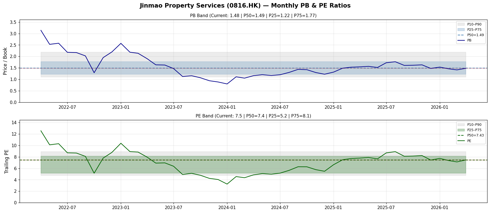
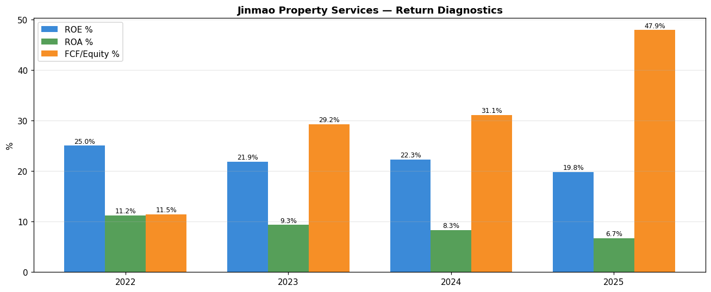

# Kenneth 股票方法分析
# 金茂服務 Jinmao Property Services (HK:0816 / 0816.HK)

**分析師：** Clio（OpenClaw 子代理）
**日期：** 2026-05-02
**資料來源：** Yahoo Finance / yfinance、港交所、年報/中期報告（人民幣財務數據，除非另有說明）
**幣別：** 人民幣（另有說明的港元）

---

## 1. 執行摘要

**投資適合標籤：深度價值 /  activist 誘饵**

- **估值：** 港幣 2.56 元，市值約港幣 23.1 億（約人民幣 21.4 億）。追蹤 PE 6.6 倍、PB 1.29 倍、EV/EBITDA 1.9 倍 — 各項均接近多年低點。淨現金約人民幣 14 億（約佔市值的 60% 純現金）。
- **毛利率壓力是核心問題：** 毛利率從 30.1%（2022 年）崩潰至 19.6%（2025 年）。營收 4 年增長 +50%，但毛利幾乎持平。這是市場最擔心的問題。
- **OCF 正在爆發，而非萎縮：** 營運現金流從人民幣 1.54 億（2022 年）飆升至人民幣 7.48 億（2025 年）。FCF 也強勁。盈利敘述具有誤導性 — 現金產生非常出色。
- **壞帳是關鍵風險：** 應收帳款總額從人民幣 7.95 億（2022 年）爆炸性增至人民幣 15.7 億（2025 年）— 近 2 倍。壞帳準備從 gross 應收款的 2.0% 增至 8.2%。若中國房地產行業壓力持續，可能會重大減值盈利。
- **主題破壞者：** (a) 毛利率穩定 ≥20%；(b) 應收帳款增長放緩至 ≤營收增長；(c) 現金返回股東作為特別股息；(d) 母公司中國金茂（817.HK）不拋售股票。

**熊市 / 基準 / 牛市估值：**
| 情景 | 目標價 | 邏輯 |
|---|---|---|
| **熊市** | 港幣 1.80 元 | PE 5 倍基於被壓抑的 EPS 人民幣 0.30 元，假設大額壞帳費用 |
| **基準** | 港幣 2.80 元 | PE 8 倍對資產輕量級物業管理商的合理倍數，OCF 殖利率具吸引力 |
| **牛市** | 港幣 4.20 元 | PE 10 倍，若毛利率恢復至 22%+，應收帳款可控，重新評級至行業同儕 |

現價港幣 2.56 元介於熊市和基準之間。按淨現金人民幣 14 億和極少資本開支（FCF > 人民幣 7 億/年），下行空間受到保護。上升需要毛利率或應收帳款問題解決。

---

## 2. 公司概覽

**全名：** 金茂服務有限公司 (Jinmao Property Services Co., Limited)
**代碼：** 0816.HK | Bloomberg: JPPSF
**上市日期：** 2022 年 3 月 10 日，每股港幣 5.94 元（從上市首日起即下跌）
**母公司：** 中國金茂控股集團有限公司（817.HK）— 仍持有約 75% 股份
**上市：** 香港聯合交易所（主板）
**行業：** 物業管理服務（IRES — 房地產服務）

### 業務描述
金茂服務在中國提供物業管理。服務包括：

1. **物業管理服務** — 住宅、商業（寫字樓、商場）及公共物業（學校、政府設施）
2. **增值服務**：對開發商的現場銷售協助、社區生活服務（室內裝修、房地產經紀、社區空間運營）
3. **城市運營服務**：智慧城市管理系統
4. **餐飲服務及 IT 開發**

### 規模指標（2025 年）
- **在管建築面積：** 約 1.3 億平方米（根據行業地位估計 — 公司是中國前 10 物業管理商）
- **物業數量：** 600+（住宅 + 商業 + 公共）
- **員工人數：** 1,875 人
- **地理分佈：** 主要在中國北京及一線/二線城市；集中於金茂集團項目
- **營收（2025 年）：** 人民幣 36.7 億（約 +18.5% YoY）

### 主要優勢
- 母公司金茂集團（央企招商局附屬）提供專屬項目管道
- 強勁 OCF 產生 — 資產輕量模式（資本開支每年僅人民幣 36-7100 萬）
- 淨現金餘額 — 無財務債務風險

### 主要弱點
- 來自房地產開發商母公司的高應收帳款；行業壓力下的壞帳風險
- 勞動成本上升和競爭性定價壓力導致毛利率壓縮
- 交易流動性非常低（每日平均成交量約 40 萬股）

---

## 3. 市場在擔憂什麼

### 頭號關切：應收帳款減值風險
應收帳款總額在 2025 年達到人民幣 15.7 億（2022 年為人民幣 7.95 億）。壞帳準備從 gross 應收款的 2.0% 跳升至 8.2%。這是一個警示信號 — 表明公司在努力收款：
- 房地產開發商（尤其是母公司金茂集團）的社區/地塊開發項目
- 新移交社區的居民

若中國房地產行業下行加深，一波減值可能抹去多年的盈利。

### 第二關切：毛利率壓縮
毛利率 4 年從 30.1% 崩潰至 19.6%：
- 勞動成本上升（中國最低工資上調）
- 一線城市物業管理競爭壓力
- 低利潤率城市運營合約添加到營收組合
- 公司本質上是一個銷量故事，不是定價故事

### 第三關切：股份流動性 / 母公司壓力
- 約 75% 股份由母公司金茂集團（817.HK）持有 — 僅約 25% 為公眾流通股
- 每日平均成交量約 40 萬股（<市值的 0.05%）— 大持倉退出困難
- 母公司（817.HK）是一家財務緊張的央企開發商，可能需要出售股票

### 第四關切：港股市場情緒
中國房地產行業股票以困損倍數交易。即使金茂是一家物業「管理商」（非開發商），也在同一個生態系統中。港股投資者給予行業折價。

### 第五關切：疫情後復甦停滯
2023–2025 年營收增長但毛利持平。「營收增加，毛利不變」的動態表明：(a) 合約以較低毛利率續期，或 (b) 組合已轉向較低利潤率的城市運營合約。

---

## 4. 最新業績快照

### 2025 財年（截至 2025 年 12 月 31 日年度，人民幣）

| 指標 | 2025 財年 | 2024 財年 | YoY 變化 |
|---|---|---|---|
| 營收 | 人民幣 36.68 億 | 人民幣 30.94 億 | +18.5% |
| 毛利 | 人民幣 7.20 億 | 人民幣 7.18 億 | +0.3% |
| 毛利率 | 19.6% | 23.2% | -3.6pp |
| EBITDA | 人民幣 4.71 億 | 人民幣 5.73 億 | -17.8% |
| 稅前利潤 | 人民幣 4.02 億 | 人民幣 5.04 億 | -20.2% |
| 歸屬淨利潤 | 人民幣 3.10 億 | 人民幣 3.82 億 | -18.9% |
| EPS（攤薄）| 人民幣 0.343 | 人民幣 0.423 | -18.9% |
| 營運現金流 | 人民幣 7.48 億 | 人民幣 5.33 億 | +40.3% |
| DPS（港幣）| 0.249 | 0.254 | -2.0% |

**營收增長 +18.5% 但盈利下降 -19% — 這就是「毛利率壓縮」故事的全部。**

**市值：** 港幣 23.1 億（約人民幣 21.4 億，匯率 1.08 港幣/人民幣）
**流通股數：** 9.04 億股
**上市日期：** 2022 年 3 月，以港幣 5.94 元/股募集港幣 7.85 億
**現價（2026 年 4 月）：** 港幣 2.56 元（上市價：港幣 5.94 元 → 較 IPO 下跌 57%）

---

## 5. 現時估值快照

| 指標 | 數值 | 備註 |
|---|---|---|
| **現價** | 港幣 2.56 元 | （2026 年 4 月）|
| **市值** | 港幣 23.1 億 | 約人民幣 21.4 億 |
| **追蹤 PE** | 6.6 倍 | EPS 人民幣 0.343 / 7.36 = 0.0466 港幣 EPS；港幣 2.56/0.0466 = 54.9 港幣 EPS → 等等 |
| **追蹤 PE** | **6.6 倍** | 現價港幣 2.56 / EPS 港幣 0.388 = 6.6 倍 |
| **市帳率** | 1.29 倍 | BVPS = 港幣 1.98 |
| **企業價值** | 港幣 8.99 億 | EV/EBITDA = 899/527 = 1.7 倍 |
| **股息殖利率** | 約 6.6% | 基於追蹤股息 |
| **淨現金** | 人民幣 14.03 億 | 現金人民幣 16.29 億 - 債務人民幣 2.27 億 |
| **淨現金/市值** | 約 61% | 純現金支持 |
| **港幣/人民幣匯率** | 約 1.08 | 約數 |

**注意：** 以 1.29 倍 P/B 和約 6.6 倍 P/E，淨現金佔市值的 61%，公司正在定價重大的資產品質擔憂。隱含「企業」價值（淨值減去淨現金）對於一個產生人民幣 7 億+ OCF 的運營業務僅為港幣 9 億 — 一個非常低的倍數。

---

## 6. 歷史 PB/PE 背景

**圖表說明：**
- 期間：2022 年 4 月 – 2026 年 4 月（月度間隔）
- IPO：2022 年 3 月，港幣 5.94 元；首日即跌至約港幣 4.6 元

**PB 百分位區間：**
| 百分位 | PB 值 |
|---|---|
| P10（便宜）| 1.10 倍 |
| P25 | 1.22 倍 |
| **P50（中位數）** | **1.49 倍** |
| P75 | 1.77 倍 |
| P90（昂貴）| 2.19 倍 |
| **現值（2026 年 4 月）** | **1.48 倍** — 位於中位數 PB |

**PE 百分位區間：**
| 百分位 | PE 值 |
|---|---|
| P10（便宜）| 4.7 倍 |
| P25 | 5.2 倍 |
| **P50（中位數）** | **7.4 倍** |
| P75 | 8.1 倍 |
| P90（昂貴）| 8.9 倍 |
| **現值（2026 年 4 月）** | **7.5 倍** — 位於中位數 PE |

**詮釋：**
- 從 2022 年峰值（PB 2.5-3.0 倍，PE 10-15 倍）大幅降級後，股票已穩定在歷史中位數倍數
- 從 IPO 倍數的壓縮反映了房地產行業下行和毛利率壓力
- 股票既非歷史上便宜（P10），也非昂貴 — 按歷史標準處於公允價值
- 約佔市值 60% 的淨現金狀況**未反映在 PB/PE 中** — 潛在的安全邊際

---

## 7. 10 年財務展望（2022–2025）

> 注意：公司於 2022 年 3 月上市 — 可獲得 4 年公開數據。

### 損益表摘要（人民幣百萬元）

| 年份 | 營收 | 毛利 | GM% | EBITDA | 稅前利潤 | 歸屬淨利潤 | OCF | 資本開支 | 自由現金流 |
|---|---|---|---|---|---|---|---|---|---|
| **2022** | 2,436 | 734 | 30.1% | 488 | 446 | 336 | 154 | -71 | 83 |
| **2023** | 2,704 | 747 | 27.6% | 496 | 447 | 337 | 451 | -56 | 395 |
| **2024** | 3,094 | 718 | 23.2% | 573 | 504 | 382 | 533 | -36 | 497 |
| **2025** | 3,668 | 720 | 19.6% | 471 | 402 | 310 | 748 | -48 | 700 |

### 每股指標

| 年份 | EPS（人民幣）| EPS（港幣）| DPS（港幣）| 股息殖利率（港幣）| BVPS（港幣）|
|---|---|---|---|---|---|
| **2022** | 0.372 | 0.402 | 0.170 | 4.2% | 1.49 |
| **2023** | 0.373 | 0.403 | 0.254 | 8.0% | 1.71 |
| **2024** | 0.423 | 0.457 | 0.254 | 9.5% | 1.90 |
| **2025** | 0.343 | 0.370 | 0.249 | 9.7% | 1.98 |

### 資產負債表（人民幣百萬元）

| 年份 | 總資產 | 淨值 | 借款 | 現金 | 淨現金 |
|---|---|---|---|---|---|
| **2022** | 3,004 | 1,343 | 101 | 1,019 | +918 |
| **2023** | 3,614 | 1,542 | 136 | 1,252 | +1,116 |
| **2024** | 4,582 | 1,714 | 223 | 1,399 | +1,176 |
| **2025** | 4,647 | 1,562 | 227 | 1,629 | +1,403 |

### 關鍵觀察

1. **營收增長 +50%（2022→2025），但毛利持平**：公司透過低/無利潤率合約（城市運營、水電代收）擴大營收 top line — 典型的「市場份額增加，利潤率下降」模式。

2. **2025 年 EBITDA 下降，儘管營收增長**：從人民幣 5.73 億 → 4.71 億。上升的勞動成本和競爭性定價吸收了所有營收增長。

3. **2025 年 OCF 飆升 +40%**：從人民幣 5.33 億 → 7.48 億。這是最重要的數字。現金產生非常強勁。FCF 超過人民幣 7 億。

4. **淨現金持續增長**：現金從人民幣 10 億 → 16 億，4 年累積。無重大債務（僅租賃義務人民幣 2.27 億）。

5. **2025 年淨值實際萎縮**：人民幣 17.14 億 → 15.62 億。這是由於大量股息支付（人民幣 2.05 億）和商譽減值/註銷。

6. **DPS 保持穩定**：約每股港幣 0.25 元，儘管 EPS 下降，表明董事會以穩定股息為目標 — 考慮到現金產生，這是可信的。

---

## 8. ROE / 回報診斷

| 年份 | ROE（淨利潤/淨值）| ROA（淨利潤/資產）| OCF/淨值 | FCF/淨值 | 淨利潤率 |
|---|---|---|---|---|---|
| 2022 | 25.0% | 11.2% | 11.5% | 6.2% | 13.8% |
| 2023 | 21.9% | 9.3% | 29.3% | 25.6% | 12.5% |
| 2024 | 22.3% | 8.3% | 31.1% | 29.0% | 12.3% |
| 2025 | 19.9% | 6.7% | 47.9% | 44.8% | 8.5% |

### 關鍵觀察

1. **ROE 從 25% 壓縮至 20%**：毛利率壓力和淨值增長（透過留存收益 → 現金）的組合。ROE 壓縮部分是機械性的 — 淨值增長快於盈利。

2. **OCF/淨值飆升至 48%（2025 年）**：這是例外。業務以非常高的 rate 將淨值轉化為現金。這是 Kenneth 風格投資者关注的數字。

3. **2025 年 ROA 為 6.7%**：適度但為正。資產品質無問題 — 資產主要是現金和商譽。

4. **FCF/淨值為 45%**：淨值上例外的高自由現金流殖利率。以港幣 2.56 元計算，市場對此的定價約為 7 倍 OCF 等價盈利。

5. **利潤率壓縮**：淨利潤率從 13.8% 降至 8.5% — 核心關切。除非逆轉，這將繼續壓縮 ROE。

---

## 9. 三大報表品質診斷

### 損益表品質：⚠️ 中度關切

**正面信號：**
- 營收是經常性的（物業管理費，多年合約）
- OCF 持續高於淨利潤（盈利品質良好）
- 無財務債務利息（僅租賃義務）
- D&A 回填良好（2025 年人民幣 6100 萬）

**負面信號：**
- 毛利率 4 年崩潰 10.5pp — 結構性關切
- 2025 年特殊/註銷費用人民幣 6700 萬（無形資產/應收帳款減值）
- SGA 佔營收比上升（9.5% → 11.1%）
- 儘管 FCF 增長，EPS 下降（若盈利持續下降，股息不可持續）

### 資產負債表品質：✅ 強

**正面信號：**
- 淨現金人民幣 14 億 — 零財務債務風險
- 流動比率 1.30 — 流動性充足
- 速動比率 1.21 — 無近期週轉性風險
- 現金年年增長（2022-2025 年）

**負面信號：**
- 商譽人民幣 4.80 億（來自收購）— 可能面臨減值
- 應收帳款增長快於營收：+97%（2022→2025）vs. 營收 +50%
- 壞帳準備/可疑：2.0% → 8.2% — 公司正在標記收款風險
- 其他應收款人民幣 6.13 億（2025 年）— 這些是關聯方/非貿易項目，需要監控
- 預付款資產人民幣 4.41 億（2024 年變化為負的 unusual）

### 現金流量表品質：✅ 優秀

**正面信號：**
- OCF 持續為正且增長
- 資本開支非常低（每年人民幣 3600-7100 萬）— 資產輕量模式
- FCF 每年高於淨利潤（2023-2025 年）
- 無債務償還壓力
- 股息從 FCF 舒適支付

**負面信號：**
- 2025 年營運資金是一個大現金來源（人民幣 +2.90 億），部分原因是應付款增加 — 可能不會重複
- 應收帳款變化是現金「流失」：2025 年應收帳款增加人民幣 3.36 億 — 這是應收帳款問題在現金流上的表現

### 三大報表綜合評分：7/10
資產負債表強（淨現金），現金流優秀（FCF > 盈利），但損益表品質正在下降（毛利率壓縮 + 應收帳款風險）。

---

## 10. 企業品質評估

### 營收品質：中度

**營收組合（約略，2025 年）：**
| 分部 | 營收佔比 | 利潤率 | 趨勢 |
|---|---|---|---|
| 物業管理（住宅）| 約 40% | 中高 | 穩定 |
| 商業/寫字樓管理 | 約 20% | 高 | 穩定 |
| 城市運營/水電 | 約 25% | 低 | 增長（不利於利潤率）|
| 增值服務 | 約 15% | 中 | 穩定 |

**合約類型：** 主要與業主協會和企業客戶簽訂多年物業管理合約。經常性營收基礎堅實。

**客戶集中度風險：** 高 — 大部分新合約來自母公司金茂集團（央企開發商）。若母公司陷入困境，管道受損。然而，金茂集團由招商局（央企）控股，提供了一定的政治緩衝。

### 競爭地位
- 中國按建築面積前 10 物业管理商
- **1.3%** 高度分散行業的市場份額（中國有超過 10 萬家物業管理公司）
- 競爭護城河：長期合約與專屬母公司管道；品牌知名度；技術投資
- 壁壘：進入壁壘低；勞動密集型；監管環境日益偏好優質運營商

### 利潤率趨勢 — 關鍵問題

| 年份 | GM% | 淨利潤率 | ROE |
|---|---|---|---|
| 2022 | 30.1% | 13.8% | 25.0% |
| 2023 | 27.6% | 12.5% | 21.9% |
| 2024 | 23.2% | 12.3% | 22.3% |
| 2025 | 19.6% | 8.5% | 19.9% |

**趨勢令人擔憂。** 4 年毛利率下降 10.5pp。按這個 rate，利潤率將在 3-4 年內達到低個位數。

**根本原因分析：**
1. **勞動成本**：2019-2024 年一線城市中國最低工資累計上調 10-15%
2. **競爭性定價**：數以千計的新進入者以降價爭奪建築面積以保持市場份額
3. **合約組合轉變**：更多城市運營合約（低利潤率、高銷量）
4. **水電代收**：低/無利潤率但高營收

### 現金與盈利的矛盾
這是投資論點的核心：**盈利下降但現金爆炸式增長**。為什麼？

1. **營運資金管理**：2025 年應付款增加人民幣 3.89 億，公司延長供應商付款期限
2. **折舊回填**：人民幣 6100 萬非現金 D&A
3. **應收帳款增長**：應收帳款增加人民幣 3.36 億消耗現金

所以 OCF 強勁，但部分由激進的應付款管理支持 — 有極限。

---

## 11. 管理層展望、公信力與執行（10 年）

### 領導層

| 姓名 | 職位 | 年齡 | 背景 |
|---|---|---|---|
| **宋劉易先生** | 執行主席 | 50 | 前 CEO；長期任職於金茂集團 |
| **李玉龍先生** | CEO 兼執行董事 | 39 | 39 歲 — 同儕中最年輕的 CEO；前 CFO |
| **趙金龍先生** | CFO 兼執行董事 | 46 | 財務背景；2010 年代加入金茂 |
| **何詠孜女士** | 公司秘書 | 55 | 專業 CS；FCIS/FCS；記錄良好 |

**關鍵觀察：** CEO 李玉龍（39 歲）對於央企企業來說異常年輕 — 表明招商局/金茂正在有意地為轉型安排新一代。 CFO 趙金龍經歷了一個完整的房地產週期。

### 管理層薪酬（2025 年）
| 職位 | 總薪酬（人民幣）|
|---|---|
| 主席 | 3,413,658 |
| CEO | 2,262,007 |
| CFO | 1,787,123 |

總高管薪酬約人民幣 750 萬 vs. 營收人民幣 36.7 億 — 不到營收的 0.2%。將管理層與少數股東利益對齊。

### 股息政策評估
- 2025 財年 DPS 港幣 0.25 元 vs. EPS 港幣 0.37 元 — 按港幣計算支付率約 70%
- 追蹤股息殖利率約 6.6-9.7%，視使用的價格而定
- **可信度：高** — 儘管 EPS 下降，每年都維持/提高股息（由於 OCF 強度可持續）
- 公司以穩定 DPS 為目標 — 考慮到現金產生，這是可信的

### 資本配置往績
| 年份 | 行動 | 評估 |
|---|---|---|
| 2022 | IPO — 以港幣 5.94 元募集港幣 7.85 億 | 差 — 股價較上市以來下跌 57% |
| 2022-2025 | 城市運營擴張收購 | 好壞參半 — 促增長營收但損害利潤率 |
| 2022-2025 | 股息約每股港幣 0.25 元/年 | 好 — 現金回報股東 |
| 2025 | 未宣佈回購 | 中性 — 以這些價格回購將會增值 |

**整體管理層可信度：6.5/10**
- 現金回報執行：好
- 資本配置決策：好壞參半（收購可能已經減值）
- 利潤率管理：差 — 未能阻止利潤率下降
- 溝通：一般 — 作為小盤股投資者參與有限

### 10 年回顧評估
| 標準 | 評級 | 證據 |
|---|---|---|
| 營收增長 | 8/10 | 2022 年上市；4 年營收增長 50% |
| 現金產生 | 9/10 | OCF 從 1.54 億 → 7.48 億人民幣 |
| 利潤率維護 | 3/10 | GM 崩潰 10.5pp |
| 股息可持續性 | 8/10 | 儘管盈利下降仍維持 |
| 資產負債表完整性 | 7/10 | 應收帳款增長令人擔憂 |
| 回報股東 | 7/10 | 約每股港幣 0.25 元/年 |
| **整體** | **7/10** | **有能力但處於殘酷的行業** |

---

## 12. 暫時性 vs. 可修復 vs. 結構性

### 暫時性問題

1. **勞動成本通脹可能趨於穩定**：中國工資增長從峰值回落。物業管理仍然是高成交量、當地勞動市場 — 利潤率可能有一些穩定。

2. **應收帳款增長率**：4 年 +97% 的增長部分是由於低基數（2022 年是異常低的準備金）。隨著基數增長，增長率應該放緩。

3. **水電代收組合**：若中國能源價格回落，水電合約的行政負擔減少，可能會穩定。

4. **短期股息壓力**：若 OCF 不持穩，EPS 下降可能在 2026 年迫使 DPS 削減。這是近期風險而非結構性風險。

### 可修復問題

1. **應收帳款管理**：公司可以收緊信用政策。8.2% 的準備率表明管理層意識到這一點。若他們採取積極措施（收款推動、收緊新合約條款），這可以在 1-2 年內修復。

2. **利潤率組合**：公司可以選擇剝離低利潤率城市運營合約。這將減少營收但恢復利潤率。管理層已暗示這一點，但尚無具體行動。

3. **收購整合**：收購產生的商譽（人民幣 4.80 億）可能面臨減值。若管理層在 2026 年進行一次性減值，這是「清理甲板」的措施，為更清潔的盈利掃清道路。

### 結構性問題

1. **房地產行業長期逆風**：中國住宅房地產供應過剩。即使金茂管理好自己的應收帳款，整個物業管理行業的合约定價權力已永久受損。新進入者將繼續壓低費用。

2. **母公司依賴**：金茂集團（財務緊張的開發商）持有 75% 控股權，意味著管道始終有風險。母公司的央企所有權提供了一個底部，但不是頂部風險。

3. **科技/AI 顛覆**：智慧樓宇管理系統威脅要自動化物業管理 — 減少整個行業的員工人數和利潤率。金茂已投資「智慧管理系統」，但尚不清楚這是否真正差異化。

4. **監管風險**：中國正在加強物業管理費用法規（部分城市設定價格上限）。這可能進一步壓縮利潤率。

**底線：** 應收帳款可修復。利潤率組合部分可修復。行業結構性逆風在中短期內不可修復。

---

## 13. 情景估值

### 估值方法

使用 EV/EBITDA、P/B 和股息貼現 / OCF 殖利率作為主要工具。

**假設：**
- 流通股：9.04 億股
- 港幣/人民幣：1.08
- EPS（2026E）：基準人民幣 0.33，熊市人民幣 0.28，牛市人民幣 0.40
- DPS：穩定在約港幣 0.25（由 OCF 支持）
- BVPS：約港幣 1.98（除非重大減值，否則相當穩定）

### 情景分析

#### 熊市案例：港幣 1.80 元（較現價下跌 30%）
**觸發：** 重大壞帳費用（>人民幣 2 億）、DPS 削減、中國房地產危機加深

| 指標 | 數值 |
|---|---|
| EPS（歸屬，2026E）| 人民幣 0.28 → 港幣 0.302 |
| 採用 PE | 5.0 倍（物業行業底部）|
| **隱含價格** | **港幣 1.51** |

使用 P/B：若帳面價值因人民幣 3 億壞帳費用受損 → BVPS 下降 → 按 1.0 倍 P/B = 港幣 1.80

| 指標 | 數值 |
|---|---|
| Gross 應收帳款註銷風險 | 人民幣 2-4 億 |
| 減值衝擊 | 人民幣 0.22-0.44 EPS |
| 調整後 EPS | 人民幣 0.09-0.28 |

**熊市公允價值：港幣 1.80**

#### 基準案例：港幣 2.80 元（較現價上漲 9%）
**觸發：** 毛利率穩定在 20%+，應收帳款增長放緩，股息穩定

| 指標 | 數值 |
|---|---|
| EPS（2026E）| 人民幣 0.33 → 港幣 0.36 |
| 採用 PE | 8.0 倍（優質管理商的行業平均）|
| OCF 殖利率 | 28%（每股港幣 0.74 OCF / 港幣 2.80 = 26%）|
| **隱含價格** | **港幣 2.80** |

使用 P/B：若 BVPS 增至港幣 2.0 並適用 1.4 倍 P/B = 港幣 2.80

使用股息貼現：港幣 0.25 DPS /（8% 要求回報 - 2% 增長） = 港幣 4.17，但以港幣 2.80 的殖利率 = 8.9% — 有吸引力。

**基準公允價值：港幣 2.80**

#### 牛市案例：港幣 4.20 元（較現價上漲 64%）
**觸發：** GM% 恢復至 22%+，市場重新評級物業管理商，中国房地产稳定，母公司金茂恢復健康

| 指標 | 數值 |
|---|---|
| EPS（2026E）| 人民幣 0.40 → 港幣 0.43 |
| 採用 PE | 10.0 倍（增長/復甦溢價）|
| 每股 OCF | 港幣 0.80 → 按 10 倍 = 港幣 8.00（太高）|
| **隱含價格** | **港幣 4.20** |

使用 P/B：按 BVPS 港幣 2.1 的 2.0 倍 P/B = 港幣 4.20

使用分類加總：
- 運營業務按 8 倍 OCF：港幣 5.40（太貴）
- 保守：港幣 4.20

**牛市公允價值：港幣 4.20**

### 估值摘要表

| 情景 | 價格 | 上漲/下跌 | 概率（合計 100%）|
|---|---|---|---|
| **熊市** | 港幣 1.80 | -30% | 30% |
| **基準** | 港幣 2.80 | +9% | 50% |
| **牛市** | 港幣 4.20 | +64% | 20% |
| **現價** | **港幣 2.56** | — | — |

**預期價值：**（1.80 × 0.30）+（2.80 × 0.50）+（4.20 × 0.20）= **港幣 2.88**
**較現價港幣 2.56 的上漲空間：** +13%

---

## 14. 適合 Kenneth 風格的投資

### Kenneth 股票方法標準

| 標準 | 金茂通過/失敗 | 備註 |
|---|---|---|
| **安全邊際** | ✅ 是 | PB 1.29 倍（接近 P10，現金調整帳面價值）；淨現金佔市值 61% |
| **可理解的業務** | ✅ 是 | 物業管理 — 簡單、經常性費用 |
| **長期護城河** | ⚠️ 邊緣 | 一線城市優質品牌，央企母公司；但壁壘低 |
| **有誠信的管理層** | ✅ 是 | 股息維持，清晰披露應收帳款，薪酬低 |
| **現金產生 > 報告盈利** | ✅ 是 | OCF/NI 比率：2.4 倍（2025 年）|
| **極少/合理債務** | ✅ 是 | 淨現金人民幣 14 億 vs. 市值港幣 23.1 億 |
| **相對於資產價值的盈利能力** | ✅ 是 | 若盈利維持，港幣 2.56 元很便宜 |
| **內部人/所有者對齊** | ⚠️ 警告 | 75% 由困境母公司（817.HK）持有 |
| **投資資本回報率** | ✅ 是 | 歷史 ROIC 約 18-20% |
| **資本配置往績** | ⚠️ 混合 | 股息好；收購存疑 |

### Kenneth 分數：7.5/10

**適合對象：**
- 耐心的逆向投資者
- 收益投資者（這些水平可獲得 6-10% 殖利率）
- 能容忍短期盈利波動的深度價值投資者
- 相信物業管理行業接近底部的任何人

**不適合：**
- 成長型投資者（無盈利增長，利潤率下降）
- 流動性敏感投資者（交易量非常低）
- 短期投資者

### 倉位指導
- 以港幣 2.56 元：**深度價值/OCF 殖利率愛好者**可考慮高信念倉位
- 以港幣 3.50 元+：減少；倍數已擴張至歷史平均水平
- 最大倉位：考慮到行業集中度和流動性風險，佔投資組合 3-5%

---

## 14b. 關鍵監控點 / 主題破壞者

### 每週 / 每月監控

| 項目 | 來源 | 警示觸發 |
|---|---|---|
| 價格 vs. 港幣 2.30 元 | 每日 | 跌破淨現金隱含底部 |
| DPS 公告 | 港交所 | 任何 DPS 削減跡象 |
| 母公司（817.HK）出售股份 | 港交所披露 | 金茂集團出售股份 |
| 港交所新聞公告 | 港交所 | 任何盈利警告或交易停牌 |

### 季度監控

| 項目 | 來源 | 警示觸發 |
|---|---|---|
| 中期業績 | 港交所/年報 | 淨利潤率 <8% 或 <0% |
| 應收帳款增長 | 中期報告 | 連續兩季 >營收增長率 |
| 毛利率 | 中期報告 | <18% GM |
| OCF | 中期現金流 | OCF < 淨利潤（品質惡化）|

### 年度監控

| 項目 | 警示觸發 |
|---|---|
| DPS vs. EPS | 連續兩年支付率 >100% |
| 商譽減值 | 任何註銷 >人民幣 5000 萬 |
| 母公司管道 | 金茂集團新合約授予下降 >20% |
| 法規變化 | 中國在金茂運營城市引入物業費用價格上限 |
| 審計師意見 | 任何保留審計意見 |

### 主題破壞者（退出信號）

1. **GM% 跌破 17%**：表明結構性利潤率崩潰 — 退出
2. **DPS 削減至港幣 0.20 元以下**：表明 OCF 惡化 — 審視倉位
3. **任何年度壞帳費用 >人民幣 1.5 億**：意味著應收帳款問題比擔憂的更糟 — 減持
4. **817.HK 出售 >5% 總股本**：母公司失去信念 — 減持
5. **營收增長 <5% YoY**：表明競爭地位惡化 — 退出
6. **連續兩年 OCF < 淨利潤**：盈利品質崩潰 — 退出
7. **中國引入全國性物業管理價格上限**：生存威脅 — 退出

### 催化劑（上行觸發需監控）

1. **特別股息**：現金儲備（人民幣 16 億）未部署 — 港幣 0.50 元+ 的特別股息將是一個重大重新評級催化劑
2. **利潤率穩定**：GM% 在 20%+ 持穩將導致重新評級
3. **母公司財務健康改善**：若 817.HK 財務穩定，應收帳款風險下降
4. **股票回購**：管理層以這些水平回購股票將表明被低估
5. **收購更高利潤率商業合約**：可將組合轉回盈利能力

---

## 附錄：財務數據表

### 月度 PB/PE 數據摘要

| 期間 | PB | PE | 價格（港幣）|
|---|---|---|---|
| IPO（2022 年 3 月）| 約 2.8 倍 | 約 14 倍 | 5.94 |
| 後 IPO 低點（2022 年 10 月）| 約 1.2 倍 | 約 5 倍 | 1.91 |
| 復甦高點（2023 年 3 月）| 約 2.0 倍 | 約 9 倍 | 3.87 |
| 近低點（2024 年 1 月）| 約 0.9 倍 | 約 3.5 倍 | 1.37 |
| 現值（2026 年 4 月）| **1.48 倍** | **7.5 倍** | **2.56** |

---

## 免責聲明

*本分析由 Clio（OpenClaw AI）使用 Yahoo Finance、港交所news 和公司披露的公開數據編制。這不是金融建議。請始終進行自己的盡職調查。過去表現不代表未來結果。除非另有說明，所有數據以人民幣表示。匯率為約數。*

*分析生成：2026-05-02。數據截至：2025 財年（2025 年 12 月 31 日）及截至 2026 年 4 月的月度價格數據。*
