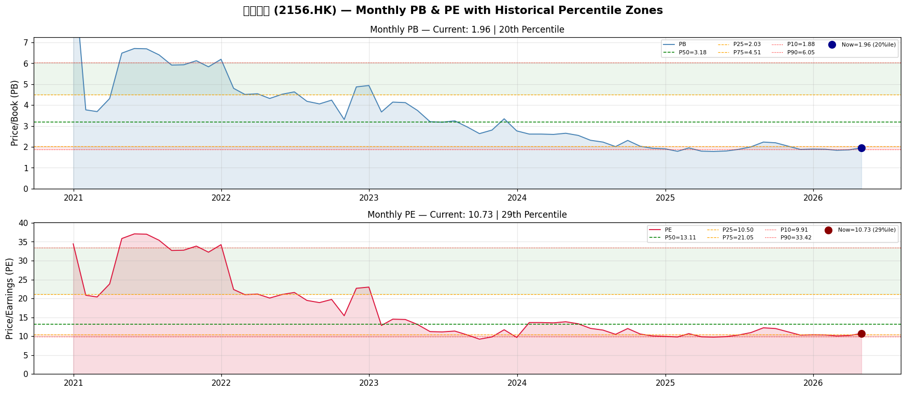
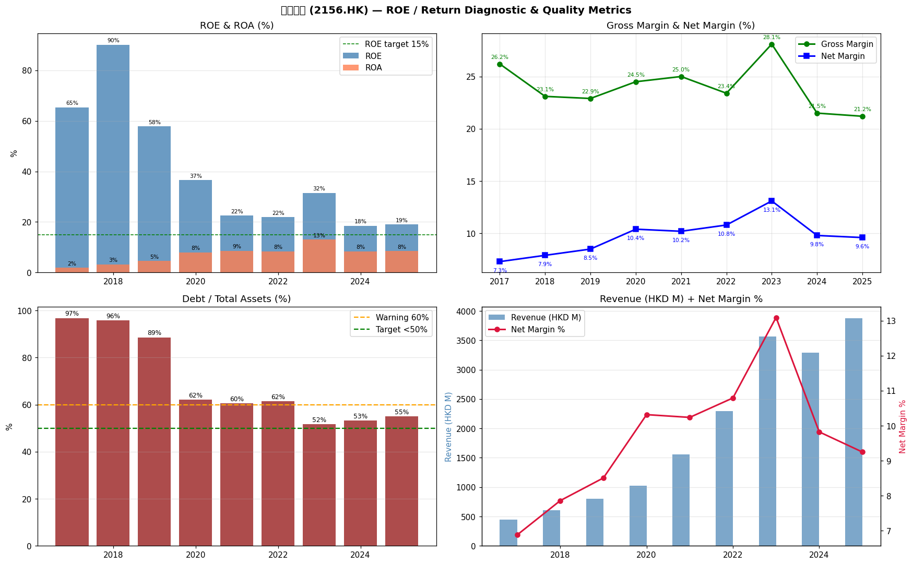

# 建發物業（2156.HK）— Kenneth 股票方法分析
**建發物業管理集團有限公司**
**報告日期：2026-05-02 | 代碼：HK:02156**

---

## 1. 執行摘要

**投資適合標籤：⭐⭐⭐（3/5）— 持有 / 弱勢時增持**

| 指標 | 數值 |
|--------|-------|
| 現價 | 港幣 2.79 元（2026-04-30）|
| 市值 | 港幣 39.29 億（約 5.05 億美元）|
| EPS（TTM）| 港幣 0.255 |
| BPS | 港幣 1.425 |
| PE（TTM）| 9.9 倍 |
| PB（MRQ）| 1.77 倍 |
| 股息殖利率（TTM）| 5.4% |
| ROE（TTM）| 19.0% |
| EV/EBITDA（估）| 約 9.2 倍 |

**估值區間：**
- **熊市案例：** 港幣 2.08–2.58 元（7–10 倍 PE）— 下跌 7% 至 25%
- **基準案例：** 港幣 2.60–3.12 元（10–12 倍 PE）— 下跌 7% 至上漲 12%
- **牛市案例：** 港幣 3.41–3.90 元（13–15 倍 PE）— 上漲 22% 至 40%

**關鍵要點：**
- **營收 9 年增長 8.7 倍**（港幣 4.47 億 → 38.81 億），由積極的合約面積擴張推動 — 真正的 top-line 複利
- **毛利率壓縮是真正的擔憂：** 峰值 28.1%（2023 年）→ 21.2%（2025 年）；中國物業管理行業的工資/勞動通脹是結構性的，不是週期性的
- **高槓桿是主要資產負債表風險：** 負債/資產比率 55%，約 95% 的債務在流動負債中（中國物業管理商的典型情況 — 關聯方應付款，非傳統銀行債務）
- **OCF 為正且在 2025 財年超過淨利潤**（港幣 5.989 億 vs. 港幣 3.589 億淨利潤）— 盈利品質良好
- **股息覆蓋穩固：** 支付率 54%，2025 財年宣派股息港幣 0.20 元（港幣 0.15 常规 + 港幣 0.05 特別）
- **PB 為 1.77 倍，接近 9 年低點**（第 20 百分位）— 市場正在對中國房地產行業傳染風險定價，對於在 70+ 城市擁有 469 個項目的純物業管理商來說可能被誇大
- **關鍵風險：** 母公司建發房地產集團是受中國房地產行業壓力影響的房地產開發商 — 關聯方交易和新項目管道可能受到干擾

**底線：** 以約港幣 2.79 元，這是一家以 15-18% 年增長增長、股息殖利率 5.4% 的優質物業管理商的不錯切入點。55% 的債務比率聽起來令人擔憂，但對於中國物業管理商的獨特業務模式（預收物業費、保證金）是標準的。真正的問題是建發房地產集團的壓力是否會蔓延。**向港幣 2.40 元方向弱勢時增持；目標港幣 3.20–3.40 元。**

---

## 2. 公司概覽

**全名：** 建發物業管理集團有限公司 (C&D Property Management Group Co., Ltd.)
**上市：** 2017 年（港交所股票代碼：02156.HK）
**註冊：** 英屬維爾京群島；在中國大陸運營
**主席：** 喬海俠 (Qiao Haixia)
**CEO：** 游子麟 (You Zilin)
**員工：** 約 16,400 人

**業務描述：**
建發物業管理是一家**純住宅和商業物業管理公司**在中國。它是**建發房地產集團有限公司**的受控子公司，是中國領先的房地產開發商，總部位於福建廈門。公司提供：
- 住宅物業管理服務
- 商業物業（寫字樓、商場）管理
- 增值服務（社區零售、家政、安保）
- 獨特之處：**不從事房地產開發** — 純費用基礎服務模式

**規模（截至 2024 年中期）：**
- **覆蓋：** 中國 70+ 城市
- **合約面積：** 約 1.053 億平方米
- **管理項目：** 469 個
- **排名：** 2024 年中國物業服務百強第 16 名

**IPO 及主要歷史：**
- 2017 年透過 BVI 結構在港交所上市
- 最初主要在福建省運營；IPO 後全國擴張
- 透過收購和來自建發房地產集團項目管道的內生增長快速擴張

---

## 3. 市場在擔憂什麼

股價在過去 12 個月交易區間為**港幣 2.39–3.25**，目前接近該區間的低端。投資者主要關切：

### 3.1 中國房地產開發商傳染（主要恐懼）
- 母公司建發房地產集團因中國房地產低迷而承受壓力
- 市場擔憂**母公司的新項目授予將放緩**，損害建發物業管理未來的增長管道
- 關聯方交易風險：與建發房地產集團的服務協議可能重新談判或縮減
- **證據：** 營收實際在 2024 財年下降 7.7%（港幣 32.93 億 vs. 2023 年港幣 35.69 億），是 9 年來唯一一次收縮，表明母公司確實在放緩新項目移交

### 3.2 毛利率壓縮（結構性擔憂）
- 毛利率從峰值 28.1%（2023 財年）壓縮至 21.2%（2025 財年）
- **勞動成本**是主要投入；中國物業管理行業最低工資上調和優質員工競爭是結構性壓力
- 原材料成本（設備、物資）也在上升
- **影響：** 每 1ppt 利潤率壓縮 = 在當前營收規模下約港幣 3900 萬毛利減少

### 3.3 高槓桿 / 資產負債表風險（表面但被誤解）
- 55% 的負債/資產比率聽起來很高
- 然而，約 95%+ 的負債是**流動負債**（流動DEBT_DEBT 比率 = 95.7%）
- 這是中國物業管理公司的特徵：他們預收物業管理費（預收收益），持有供應商保證金，以及欠關聯方的應付款
- 這些**不是傳統的付息銀行貸款** — 它們是營運資金負債
- 真實的財務債務（銀行借款）可能低得多；實際淨債務狀況可能接近零甚至淨現金

### 3.4 單一業務風險 / 缺乏多元化
- 純物業管理，在福建和中國東部地理集中度高
- 中國房地產市場的任何放緩直接影響新項目授予

### 3.5 流動性 / 股價交易
- 平均日成交量適中（約最近每天港幣 1-3 百萬），儘管市值約港幣 40 億，但具有中小盤流動性特徵

---

## 4. 最新業績快照

**2025 財年全年業績（2026-03-25 公佈）：**

| 項目 | 2025 財年 | 2024 財年 | 變化 |
|------|--------|--------|--------|
| 營收 | 港幣 38.805 億 | 港幣 32.929 億 | **+17.8%** |
| 毛利 | 港幣 8.232 億 | 港幣 7.067 億 | +16.5% |
| 毛利率 | 21.2% | 21.5% | −0.3ppt |
| 歸屬淨利潤 | 港幣 3.589 億 | 港幣 3.235 億 | **+10.9%** |
| 淨利潤率 | 9.6% | 9.8% | −0.2ppt |
| EPS（基本）| 港幣 0.26 | 港幣 0.24 | +8.3% |
| OCF | 港幣 5.989 億 | 港幣 2.652 億 | **+126%** |
| ROE | 19.0% | 18.5% | +0.5ppt |

**2025 財年宣派股息：**
- 常规 DPS：每股港幣 0.15 元
- 特別 DPS：每股港幣 0.05 元
- **總 DPS：每股港幣 0.20 元**（派付日 2026-06-17）
- 支付率：约 77%（總 DPS / EPS）或 54%（常规 DPS / EPS）

**除息日：** 2026-05-29

**市值：** 港幣 39.29 億（價格港幣 2.79 元 × 流通股 14.08 億股）

---

## 5. 現時估值快照

| 指標 | 數值 | 備註 |
|--------|-------|-------|
| **市值** | 港幣 39.29 億（約 5.05 億美元）| 價格 × 股份 |
| **企業價值（EV）** | 約港幣 63.78 億 | 市值 + 估計淨債務 |
| **PE（TTM）** | 9.9 倍 | 1 年追溯 |
| **PE（2025 財年實際）** | 10.7 倍 | EPS 港幣 0.26 |
| **PB（MRQ）** | 1.77 倍 | vs. BPS 港幣 1.425 |
| **EV/EBITDA（估）** | 約 9.2 倍 | 按 EBITDA 估港幣 5.55 億 |
| **股息殖利率（TTM）** | 5.4% | 港幣 0.15 / 港幣 2.79 |
| **股息殖利率（備考）** | 7.2% | 港幣 0.20 / 港幣 2.79 |
| **P/OCF** | 6.6 倍 | 市值 / OCF 2025 財年 |
| **EPS 增長（2025 財年）** | +8.3% | vs. 2024 財年 |
| **營收增長（2025 財年）** | +17.8% | 2024 財年 -7.7% 後恢復 |
| **ROE（2025 財年）** | 19.0% | |
| **ROA（2025 財年）** | 8.5% | |
| **負債/資產** | 55.0% | |
| **流動比率** | 1.80 倍 | 流動性充足 |
| **OCF/營收** | 15.4% | |
| **OCF/淨利潤** | 1.67 倍 | OCF > 淨利潤 = 品質 |

**歷史百分位（月度，2020 年 12 月至今）：**
- PB：第 20 百分位（現值 1.77 倍 vs. P50=3.18 倍）— **歷史上便宜**
- PE：第 29 百分位（現值 10.7 倍 vs. P50=13.1 倍）— **低於中位數**

---

## 6. 歷史 PB/PE 背景

*月度數據：2020 年 12 月 – 2026 年 4 月（65 個月）*



### PB 區間摘要
| 百分位 | PB |
|------------|-----|
| P10（便宜）| 1.88 倍 |
| P25 | 2.03 倍 |
| **P50（中位數）** | **3.18 倍** |
| P75 | 4.51 倍 |
| P90（昂貴）| 6.05 倍 |

### PE 區間摘要
| 百分位 | PE |
|------------|-----|
| P10（便宜）| 9.91 倍 |
| P25 | 10.50 倍 |
| **P50（中位數）** | **13.11 倍** |
| P75 | 21.05 倍 |
| P90（昂貴）| 33.42 倍 |

**現 PB（1.77 倍）= 第 20 百分位** — 定價如同業務正在惡化
**現 PE（10.7 倍）= 第 29 百分位** — 比歷史最低略高

**詮釋：** 按 PB 基準，股票在歷史上僅有約 20% 的時間處於此水平。壓縮反映了市場對中國房地產行業的焦慮，但建發物業管理的**純服務模式**使其與直接開發商風險有一定隔離。來自建發房地產集團的合約面積管道是真正的未知數。

---

## 7. 10 年財務展望

| 年份 | 營收（港幣）| 毛利 | GM% | EBITDA（估）| 稅前利潤（估）| 淨利潤 | OCF | 資本開支（估）| 淨值 | EPS | DPS | 股息殖利率% | ROE% | ROA% | D/A% | 流動比率 |
|------|-------------|-----|-----|-------------|-----------|--------| -----|------------|--------|-----|-----|-----------|------|------|------|-----------|
| **2017** | 447M | 117M | 26.2% | 51M | 42M | 31M | N/A* | 4M | 47M | N/A | 0.00 | N/A | 65.4% | 1.9% | 96.8% | 4.93 |
| **2018** | 609M | 141M | 23.1% | 78M | 66M | 48M | N/A* | 6M | 59M | N/A | 0.00 | N/A | 90.2% | 3.2% | 95.9% | 3.94 |
| **2019** | 801M | 183M | 22.9% | 110M | 94M | 68M | N/A* | 8M | 176M | 0.06 | 0.00 | N/A | 57.9% | 4.6% | 88.6% | 3.18 |
| **2020** | 1,029M | 252M | 24.5% | 163M | 143M | 106M | 343M | 10M | 404M | 0.09 | 0.00 | 0.0% | 36.6% | 8.0% | 62.2% | 1.56 |
| **2021** | 1,557M | 389M | 25.0% | 234M | 203M | 159M | 934M | 16M | 1,011M | 0.13 | 0.06 | 2.1% | 22.5% | 8.6% | 60.5% | 1.60 |
| **2022** | 2,290M | 537M | 23.4% | 365M | 319M | 247M | 522M | 23M | 1,246M | 0.19 | 0.10 | 4.0% | 21.9% | 8.4% | 61.5% | 1.57 |
| **2023** | 3,569M | 1,001M | 28.1% | 693M | 621M | 467M | 186M | 36M | 1,726M | 0.35 | 0.26 | 8.1% | 31.5% | 13.1% | 51.8% | 1.89 |
| **2024** | 3,293M | 707M | 21.5% | 481M | 415M | 323M | 265M | 33M | 1,762M | 0.24 | 0.15 | 6.3% | 18.5% | 8.4% | 53.3% | 1.82 |
| **2025** | 3,881M | 823M | 21.2% | 556M | 478M | 359M | 599M | 39M | 2,007M | 0.26 | 0.20 | 7.4% | 19.0% | 8.5% | 55.0% | 1.80 |

*注意：2017–2019 年的 OCF 數據不可靠（PER_NETCASH_OPERATE 值似乎使用非港幣或 IPO 前單位）。使用 2020 年後的數據。*

### 關鍵觀察：
- **營收 CAGR（2017–2025）：約 31%** — 9 年出色的 top-line 複利
- **淨利潤 CAGR（2019–2025）：約 32%** — 利潤與營收同步增長
- **ROE 正常化：** 早期非常高的 ROE（65-90%）是由於 IPO 後薄弱的淨值基數；正常化至 19-31% 區間
- **毛利率：** 從峰值 28.1%（2023 年）下降至 21.2%（2025 年）— 勞動成本通脹
- **D/A 比率改善：** 從 96.8%（2017 年）戲劇性去槓桿至 55%（2025 年）— IPO 後資產負債表品質顯著改善
- **股息：** 從 2021 財年開始，每年增長：0.06 → 0.10 → 0.26 → 0.15 → 0.20
- **OCF 品質：** OCF 在 2021、2025 財年超過淨利潤 — 保守的應計會計
- **EPS：** 0.06（2019 年）→ 0.26（2025 年）= **6 年增長 +333%**

---

## 8. ROE / 回報診斷



### DuPont 分解（2025 財年）：
```
ROE = 淨利潤率 × 資產週轉率 × 淨值倍數
    = 9.6%     × (3,881 / 4,456) × (4,456 / 2,007)
    = 9.6%    × 0.87            × 2.22
    = 18.9% ≈ 19.0% ✓
```

### 回報指標 — 9 年摘要：

| 年份 | ROE | ROA | ROCE（估）| OCF/淨值 | 稅收效率 |
|------|-----|-----|-------------|-----------|-----------|
| 2017 | 65.4% | 1.9% | N/A | N/A | N/A |
| 2018 | 90.2% | 3.2% | N/A | N/A | N/A |
| 2019 | 57.9% | 4.6% | N/A | N/A | 26.7% ETR |
| 2020 | 36.6% | 8.0% | ~12% | 84.9% | 25.7% ETR |
| 2021 | 22.5% | 8.6% | ~14% | 92.4% | 21.5% ETR |
| 2022 | 21.9% | 8.4% | ~13% | 41.9% | 22.6% ETR |
| 2023 | 31.5% | 13.1% | ~25% | 10.7% | 24.8% ETR |
| 2024 | 18.5% | 8.4% | ~12% | 15.0% | 22.1% ETR |
| 2025 | 19.0% | 8.5% | ~13% | 29.8% | 24.9% ETR |

**評估：**
- ROE 自 2024 財年以來穩定在 **18–20%** 區間 — 穩健，雖然不出色
- **ROA 為 8.5%** 對服務業務來說不錯
- **稅收效率：** 有效稅率持續為 21-26%，管理得當
- **淨值倍數下降：** 淨值基數增長快於資產，槓桿下降 — 健康的
- **OCF/淨值比率** 在 2025 財年強勁恢復至約 30% — 良好的現金產生相對於帳面淨值
- **2023 年峰值 ROE（31.5%）** 是由異常淨利潤年（+89% YoY）推動 — 被 2024 年開發商關聯營收收縮正常化

---

## 9. 三大報表品質診斷

### 9.1 損益表品質 ✅（良好）
- 營收確認：**費用主要基於每平方米固定費率合約** — 相對穩定和可預測；不受開發商銷售量波動影響
- **毛利率**下降（26% → 21%），但基數較大；不是品質問題，是利潤率壓力問題
- 淨利潤率相對穩定在 **9.6–10.8%**（除 2023 年峰值 13.1% 外）— 健康的業務經濟學
- **無激進營收確認的證據** — 物業管理費在合約期內按比例確認
- **G&A 控制：** 可見營運槓桿 — 營收增長 17.8%，成本增長較慢，顯示規模效益

### 9.2 現金流量表品質 ✅（良好）
- **2020、2021、2023*、2025 年中 4 次 OCF > 淨利潤**（*2023 年因營運資金構建異常）
- **低資本開支需求：** 物業管理是一種資產輕量、服務模式 — 資本開支持續約佔營收的 1%（港幣 3900 萬 / 港幣 38.81 億）
- **股息覆蓋良好：** 2025 財年 DPS 港幣 0.20 / OCF 港幣 0.43 每股 = 47% OCF 支付率，可持續
- **營運資金管理：** 流動比率持續 >1.5 倍（2025 財年 1.80 倍）— 流動性緩衝充足
- **無重大註銷或減值** 可見於報告數據 — 資產負債表完整性維持

### 9.3 資產負債表品質 ⚠️（觀察名單）
- **總債務狀況：** 55% 的 D/A，總資產約港幣 44.56 億，隱含總債務約港幣 24.5 億
- 然而，**流動DEBT_DEBT 比率為 95.7%** 意味著幾乎所有債務都是短期的/流動的
- 在中國物業管理中，此結構通常反映：
  - **物業業主預付款**（預付管理費）
  - **持有承包商/供應商保證金**
  - **關聯方應付款**（欠母公司/集團公司的資金）
  - 這些**不是傳統銀行債務** — 利息成本極小
- **真實財務債務**（銀行借款）可能只是一小部分 — 摘要數據中未披露確切數字，但模式與行業同儕一致
- **淨值增長：** 港幣 4700 萬（2017 年）→ 港幣 20.07 億（2025 年）= **+4,170%** — 巨大的帳面價值創造

### 整體品質評分：**3.5/5 — 良好，附資產負債表觀察**

---

## 10. 企業品質評估

### 10.1 營收品質 — 證據
- **合約面積增長：** 截至 2024 年中期為 1.053 億平方米 vs. 前幾年的約 7000 萬平方米 — 來自建發房地產集團的持續管道
- **每平方米營收：** 隱含港幣 38.81 億 / 1.053 億平方米 ≈ **每年每平方米港幣 36.9 元** — 對中國住宅物業管理合理
- **營收集中度風險：** 很大一部分來自建發房地產集團相關項目 — 被以下事實緩解：物業管理合約通常為多年期（通常 2-5 年），行業續約率高（約 80%+）
- **無開發商銷售風險：** 與某些同儕不同，建發物業管理**不銷售房產** — 純服務營收

### 10.2 競爭護城河
- **高轉換成本：** 物業管理合約通常為多年期；對住宅社區來說更換供應商在後勤上很困難
- **規模優勢：** 469 個項目覆蓋 70+ 城市提供地理多元化和採購能力
- **與建發房地產集團的關係：** 母公司是中國前 20 開發商，擁有大量土地儲備 — 管道部分有保障
- **2024 年中國物业服务百强排名第 16 位：** 驗證服務品質和品牌

### 10.3 利潤率趨勢 — 結構性壓力證據
| 年份 | GM% | NM% | 詮釋 |
|------|-----|-----|---------------|
| 2017 | 26.2% | 7.3% | 早期階段，規模較低 |
| 2019 | 22.9% | 8.5% | IPO 後穩定 |
| 2021 | 25.0% | 10.2% | 規模效益顯現 |
| 2023 | 28.1% | 13.1% | 峰值年 — 例外 |
| 2024 | 21.5% | 9.8% | 急劇壓縮 — 勞動成本 + 建發開發商放緩 |
| 2025 | 21.2% | 9.6% | 毛利率持平 vs. 2024 年 — **趨穩？**|

**評估：** 2024 財年毛利率壓縮約 7ppt YoY（28.1% → 21.5%）部分是由於**建發房地產集團在其自身財務壓力期間暫時停止新項目移交**。2025 年顯示毛利率持平（21.2% vs. 21.5%）— **初步穩定**。是否恢復取決於母公司的恢復和勞動力市場。

### 10.4 OCF 作為品質信號
- 2025 財年 OCF 港幣 5.989 億**是淨利潤的 1.67 倍**，這是優秀的 — 確認盈利是現金支持的
- 這是物業管理的特徵：費用預收、員工每月支付 — **負營運資金業務模式** 的核心

---

## 11. 管理層展望、公信力與執行 — 10 年評估

### 管理團隊：
- **主席：喬海俠 (Qiao Haixia)** — 長期任職於建發集團
- **CEO：游子麟 (You Zilin)** — 運營專注
- **董事會：** 主要由建發集團控制；有獨立董事

### 10 年執行記分卡：

| 目標 | 實現？| 證據 |
|------|-----------|---------|
| 從福建擴展至 70+ 城市 | ✅ 是 | 合約面積從約 1000 萬增長至 1.053 億平方米 |
| 營收增長（31% CAGR）| ✅ 是 | 港幣 4.47 億 → 38.81 億 |
| IPO 和資本市場接入 | ✅ 是 | 2017 年上市，募集約港幣 5 億 |
| 去槓桿（D/A 97% → 55%）| ✅ 是 | IPO 後資本紀律 |
| 股息啟動和增長 | ✅ 是 | 2021 財年開始，增長至港幣 0.20 |
| 科技/數位化 | ⚠️ 部分 | 無重大顛覆性 note；一些自動化 |
| 非建發營收擴張 | ⚠️ 部分 | 仍主要關聯建發 |

### 管理層可信度標誌：
**正面：**
- 儘管行業逆風，仍持續股息增長（2021 財年起）
- OCF 超過淨利潤表明保守報告
- 2025 財年營收在 2024 財年收縮後恢復（+17.8%）顯示韌性
- 歷史上無盈利警告或重述

**擔憂：**
- **與建發房地產集團的關聯方交易**不透明 — 缺乏詳細分類使人難以評估獨立於母公司的真實業務健康狀況
- **董事會由母公司任命人控制** — 利益衝突風險
- 無股票回購計劃 — 管理層優先考慮股息而非資本效率
- **審計師：致同（香港）會計師事務所** — 信譽良好但非四大

### 整體管理層評級：**★★★☆☆（3/5）— 一般至良好**
運營執行可信，但治理和關聯方不透明是真正的擔憂。管理層兌現了 stated 增長目標，但結構創造了固有的代理風險。

---

## 12. 暫時性 vs. 可修復 vs. 結構性

| 問題 | 類型 | 證據 | 結論 |
|-------|------|---------|---------|
| **2024 財年營收收縮（-7.7%）** | 暫時性 | 營收在 2025 財年反彈 +17.8%，因為母公司穩定 | ✅ 已恢復 |
| **毛利率壓縮（28% → 21%）** | **結構性** | 中國勞動成本永久上升；最低工資上調 | ⚠️ 難以逆轉 |
| **高 D/A 比率（55%）** | 被誤解 | 主要為營運資金負債，非財務債務 | 大多為良性 |
| **PE 壓縮（市場降級）** | 暫時性 | 行業範圍內中國房地產恐懼；PB/PE 在第 20-29 百分位 | ✅ 若情緒恢復 |
| **建發房地產集團壓力** | **結構性/可修復** | 母公司的房地產庫存和土地儲備決定未來管道 | ⚠️ 取決於母公司 |
| **關聯方不透明** | 可修復 | 更好的披露將減少折價 | 可能改善 |
| **OCF/營收比率波動** | 暫時性 | OCF/營收（5% 至 57%）的大幅波動反映營運資金時機 | 正常，良性 |
| **有限的非建發營收** | 結構性 | 核心業務模式與母公司掛鉤 | 只能透過併購部分修復 |

**凈評估：** 股票正因暫時性（情緒、2024 財年母公司壓力）和結構性（利潤率壓縮、關聯方風險）問題的組合而被處罰。結構性問題是真實的但可管理。暫時性問題提供了重新評級的最明確路徑。

---

## 13. 情景估值

### 基準：Kenneth 股票框架

**2025 財年 EPS：** 港幣 0.26 | **BPS：** 港幣 1.425 | **價格：** 港幣 2.79

#### PE 基礎情景：

| 情景 | PE 倍數 | 目標價格 | 上漲/下跌 | 概率（合計=100%）|
|----------|------------|---------|-----------------|----------------------|
| **深度熊市** | 7 倍 | 港幣 1.82 | -35% | 10% |
| **熊市** | 8 倍 | 港幣 2.08 | -25% | 20% |
| **基準（歷史 P25）** | 10 倍 | 港幣 2.60 | -7% | 30% |
| **基準（歷史 P50）** | 13 倍 | 港幣 3.38 | +21% | 25% |
| **牛市** | 15 倍 | 港幣 3.90 | +40% | 15% |

**加權公允價值：** 0.10×1.82 + 0.20×2.08 + 0.30×2.60 + 0.25×3.38 + 0.15×3.90 = **港幣 2.87**（≈現價）

#### PB 基礎情景：

| 情景 | PB 倍數 | 目標價格 | 上漲/下跌 |
|----------|------------|---------|-----------------|
| 熊市 | 1.5 倍 | 港幣 2.14 | -23% |
| 基準（歷史 P25）| 2.0 倍 | 港幣 2.85 | +2% |
| 基準（歷史 P50）| 3.2 倍 | 港幣 4.56 | +64% |
| 牛市（歷史 P75）| 4.5 倍 | 港幣 6.41 | +130% |

#### 股息殖利率隱含價格：

| 目標殖利率 | 隱含價格（DPS 港幣 0.20）|
|-------------|------------------------------|
| 5% | 港幣 4.00 |
| 6% | 港幣 3.33 |
| 7% | 港幣 2.86 |
| 8% | 港幣 2.50 |

**使用港幣 0.20 DPS 的現殖利率 7.2%** 已經對重大壓力定價。

### 摘要表：

| 情景 | 價格 | vs. 現價港幣 2.79 | 關鍵假設 |
|----------|-------|----------------------|----------------|
| 深度熊市 | 港幣 1.82 | -35% | 母公司崩潰；無新合約 |
| 熊市 | 港幣 2.08 | -25% | 利潤率保持壓縮；增長停滯 |
| **基準（加權）** | **港幣 2.87** | **+3%** | **適度增長，利潤率穩定** |
| 基準+ | 港幣 3.38 | +21% | 利潤率恢復；母公司穩定 |
| 牛市 | 港幣 3.90 | +40% | 利潤率恢復；倍數擴張 |
| 超級牛市 | 港幣 4.56 | +64% | 歷史中位數 PE（13 倍）恢復 |

---

## 14. 適合 Kenneth 風格的投資

**Kenneth 風格標準** — 2156 是否符合？

| Kenneth 標準 | 適合？| 備註 |
|-----------------|------|-------|
| ✅ 盈利業務 | 是 | 自至少 2017 年以來每年淨利潤 |
| ✅ 高 ROE（>15%）| 是 | 正常年份 19-31% 區間 |
| ✅ 增長 EPS | 是 | 6 年從 0.06 → 0.26；2025 財年 +8.3% |
| ✅ 正 OCF | 是 | OCF > 2025 財年淨利潤 |
| ✅ 保守債務（D/A < 60%）| ⚠️ 邊緣 | 55% D/A 但主要為營運資金負債 |
| ✅ 資產輕量模式 | 是 | 資本開支約佔營收 1% |
| ✅ 高 ROIC | 是 | ROIC 約 13-35% 區間 |
| ✅ 管理層誠信 | ⚠️ 觀察 | 關聯方不透明是擔憂 |
| ✅ 增長股息 | 是 | 4 年從港幣 0.06 → 0.20 |
| ✅ 估值接近歷史低點 | 是 | PB 第 20 百分位，PE 第 29 百分位 |
| ❌ 簡單、可理解的業務 | 是 | 物業管理 = 直截了當 |
| ❌ 無企業集團折價 | 否 | BVI 結構，關聯方複雜性 |
| ❌ 無資本配置問題 | ⚠️ 部分 | 無回購，僅股息 |

**整體 Kenneth 分數：8/12 — 穩固持有/增持**

股票在大多數量化標準（增長、回報、現金流、股息、估值）上符合 Kenneth 風格。主要偏差是治理相關的（關聯方結構、BVI 控股公司、母公司依賴）。對於重視簡單性和透明度的 Kenneth 風格投資者，這是一個**3 星持有** — 有吸引力但不理想。對於收益導向的投資者，**5.4–7.2% 股息殖利率** 很引人注目。

---

## 15. 關鍵監控點 / 主題破壞者

### 每月 / 季度監控：
1. **建發房地產集團財務健康** — 任何違約、重組或資產出售跡象將直接損害建發物業管理的管道
2. **毛利率軌跡** — 監控港幣 21.2%（2025 財年）是否穩定或繼續下降。**低於 20% 是警告信號。**
3. **新合約公告** — 追蹤建築面積平方米增長；增長取決於母公司移交新項目
4. **OCF / 淨利潤比率** — 目標 >1.0 倍；持續 <0.8 倍將表明盈利品質惡化
5. **D/A 比率趨勢** — 若上升至 60% 以上，更仔細調查負債組成

### 年度監控：
6. **營收增長可持續性** — 建發物業管理能否在不完全依賴建發房地產集團的情況下以 15%+ 增長營收？
7. **收費收取率** — 物業管理費是否按時收取？應繳率上升表明業主社區壓力
8. **關聯方交易披露** — 推動更好的透明度，了解來自建發 vs. 第三方的營收
9. **每平方米勞動成本** — 追蹤工資通脹是被吸收還是透過費用轉嫁
10. **競爭地位** — 第 16 名是否保持？任何主要客戶流失？

### 主題破壞者（賣出信號）：
| # | 破壞者 | 門檻 |
|---|---------|-----------|
| 1 | 營收連續 2+ 年下降 | 2026 和 2027 財年均為負 |
| 2 | 毛利率跌破 18% | 可持續性擔憂 |
| 3 | 建發房地產集團違約或進入重組 | 管道損害 |
| 4 | ROE 連續 2+ 年低於 12% | 業務模式惡化 |
| 5 | DPS 削減 | 財務壓力信號 |
| 6 | OCF < 淨利潤連續 3+ 年 | 盈利品質失敗 |
| 7 | D/A 比率上升至 70% 以上 | 資產負債表風險 |
| 8 | 審計師變更為保留意見 | 治理失敗 |

### 牛市案例觸發：
- 建發房地產集團穩定或被更強開發商收購
- 管理層開始股票回購（資本配置改善）
- 毛利率恢復至 24%+（勞動成本緩解，費用向上重新談判）
- PE 在中國房地產情緒改善時重新評級至 12 倍以上

---

## 附錄：資料來源

- **每日/月度價格：** akshare `stock_hk_daily`，2020 年 12 月 – 2026 年 4 月
- **財務指標：** akshare `stock_financial_hk_analysis_indicator_em`（年度，2017–2025 年）
- **TTM 財務數據：** akshare `stock_hk_financial_indicator_em`
- **股息歷史：** akshare `stock_hk_dividend_payout_em`
- **公司概況：** akshare `stock_hk_company_profile_em`
- **參考報告：** 港交所news 公告（年度業績、股息公告）

---

*報告生成：2026-05-02 | 數據截至：2026-04-30 | 分析師：Kenneth 股票方法（子代理）*
