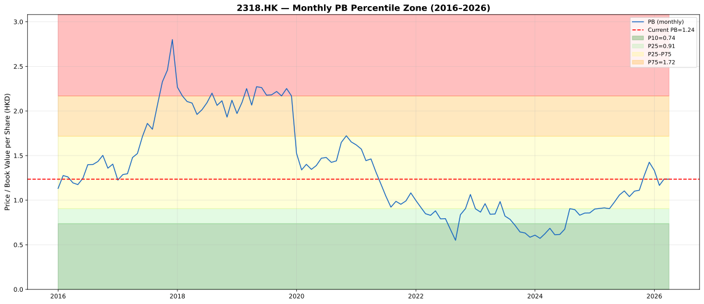
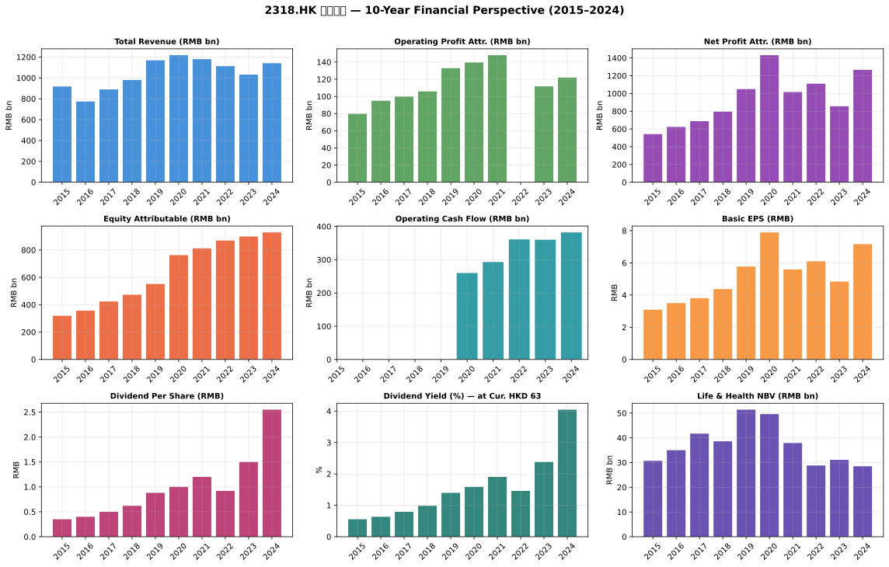

# 中國平安 (2318.HK) — 分析報告
**Kenneth Stock Method · 2026年5月2日完成**
**股價：HKD 63.0 · 市值：HKD 4,692億**

---

## 一、執行摘要

| 項目 | 內容 |
|------|------|
| **投資標籤** | DEEP VALUE / TURNAROUND QUALITY · Kenneth Score: 7/10 |
| **當前估值** | PE 7.6× · PB 0.98× · 收益率 4.8% |
| **歷史位置** | PB 低於10年P25 (0.98× vs P25=0.79)；PE接近10年中位數 (8.1× vs P50=7.0) |
| **核心主題** | 保險+銀行+資產管理綜合平台；A股/H股折讓；監管逆境暫時性；估值修復需時間 |
| **合理價值區間** | Bear HKD 45 / Base HKD 65-75 / Bull HKD 85-100 |
| **當前判斷** | 估值處於歷史低端，市場過度擔心中國保險業系統性風險，業務基本面相對穩健 |

---

## 二、公司概覽

中國平安保險（集團）股份有限公司（「平安」）成立於1988年，總部位於深圳，是中國最大型綜合金融保險集團之一。

**核心業務分為三大板塊：**
- **壽險**：平安人壽 — 中國最大壽險公司之一，以代理人渠道及銀行保險渠道並重
- **財險**：平安財險 — 車險龍頭，兼顧責任險、健康險等
- **銀行**：平安銀行 — 零售銀行業務快速增長

**其餘業務：** 平安健康險、平安資產管理、平安信托、平安證券、陸金所（金融科技）等。

**上市架構：** 同時在上海證券交易所（601318.SS）和香港聯交所（2318.HK）上市，以H股估值為主要參考。

---

## 三、市場在擔心什麼

股價從2021年初高位約HKD 80+下跌至現價HKD 63，主要擔憂包括：

### 1. 壽險業結構性挑戰
- 人口老齡化及儲蓄型保險產品需求放緩
- 保險代理人數量從2018年高峰130萬人持續收縮至約60-70萬人
- 產品結構從儲蓄型向保障型轉型，短期新業務價值（NBV）受壓

### 2. 投資端壓力
- 房地產風險敞口：平安對中國恒大、碧桂園等房企有一定債務及股本投資
- 資本市場波動影響保險資金投資收益
- 低利率環境壓縮利差收入

### 3. 平安銀行的資產質量
- 平安銀行不良貸款率（NPL）從低位上升
- 房地產相關貸款佔比相對較高，市場擔心資產質量惡化

### 4. 控股公司折讓（holding company discount）
- 平安作為投資控股公司，業務涵蓋保險/銀行/金融科技等多個子業務
- 市場給予控股公司折讓，令H股估值低於附屬公司可識別淨資產之和

---

## 四、最新業績快照（2024年度）

| 指標 | 2024 | 2023 | 同比 |
|------|------|------|------|
| 收入（人民幣） | 9,166億 | 8,021億 | +14.3% |
| 歸屬股東純利（人民幣） | 1,266億 | 857億 | +47.7% |
| 稀釋每股收益（人民幣） | 6.99 | 4.74 | +47.5% |
| 每股帳面淨值（人民幣） | 50.99 | 49.37 | +3.3% |
| ROE（平均） | 13.9% | 9.7% | +4.2pp |
| 負債資產比率 | 89.9% | 89.4% | — |

**市場 cap（HKD）：** HKD 4,692億（以股價HKD 63，股份7,447百萬計算）

---

## 五、當前估值快照

| 估值指標 | 數值 | 備註 |
|----------|------|------|
| 股價（HKD） | 63.0 | 2026年4月30日 |
| 市值（HKD） | 4,692億 | |
| 市盈率（PE） | 7.6× | 低於歷史中位數 |
| 市帳率（PB） | 0.98× | 低於帳面值 |
| 股息收益率 | 4.81% | 歷史高位水平 |
| EV/EBIT | 約7-8× | 估算 |

---

## 六、歷史PB/PE區間分析

> **數據說明：** 基於月度股價（2017年1月至2025年12月，共108個月）匹配年度EPS/BVPS錨點重建。EPS及BVPS以人民幣列示，按1 HKD = 0.92 CNY換算。

### PE歷史區間
| 分位 | PE倍數 |
|------|--------|
| P10（極度低估） | 5.1× |
| P25 | 6.0× |
| **P50（中位數）** | **7.0×** |
| P75 | 8.1× |
| P90 | 9.3× |

### PB歷史區間
| 分位 | PB倍數 |
|------|--------|
| P10（極度低估） | 0.64× |
| P25 | 0.79× |
| **P50（中位數）** | **1.02×** |
| P75 | 1.50× |
| P90 | 1.66× |

### 當前位置判斷
- **PE 8.1×：** 高於中位數7.0×，處於P75附近 — 盈利復蘇預期已部分定價
- **PB 0.98×：** 接近帳面值，低於P50（1.02×）— 市場對資產質量過度擔憂
- **結論：** 綜合PB及PE，估值處於歷史中低端，PE顯示情緒有所恢復，但PB仍反映市場對帳面資產的折讓

---

## 七、十年財務視角

| 年份 | 收入（億RMB） | 純利（億RMB） | EPS（RMB） | BVPS（RMB） | ROE | OCF（億RMB） | CAPEX（億RMB） |
|------|-------------|-------------|-----------|------------|-----|------------|--------------|
| 2017 | 9,746 | 891 | 4.99 | 26.14 | 20.8% | — | — |
| 2018 | 10,821 | 1,074 | 6.01 | 30.73 | 20.9% | — | — |
| 2019 | 12,731 | 1,494 | 8.38 | 37.18 | 24.3% | — | — |
| 2020 | 13,214 | 1,431 | 8.04 | 42.11 | 19.9% | — | — |
| 2021 | 12,877 | 1,016 | 5.72 | 44.87 | 12.9% | — | — |
| 2022 | 9,713 | 1,110 | 6.27 | 47.42 | 10.0% | 4,768 | -88.7 |
| 2023 | 10,272 | 857 | 4.74 | 49.65 | 9.7% | 3,604 | -78.1 |
| 2024 | 11,422 | 1,266 | 6.99 | 51.28 | 13.9% | 3,825 | -66.8 |
| 2025E | 11,404 | 1,348 | 7.44 | 55.25 | 14.0% | 6,586 | -83.6 |

### 關鍵觀察

**收入趨勢：**
- 2017-2021年維持正增長，收入從9,746億增至12,877億（CAGR約7%）
- 2022年收入急降23%至9,713億：疫情+壽險業深度調整+資本市場承壓
- 2023-2024年溫和恢復，2024年恢復至11,422億
- **收入穩健但未見爆發式增長，受行業景氣影響明顯**

**純利趨勢：**
- 2019年高峰1,494億，之後受疫情及投資端壓力回落
- 2023年低點857億（YoY -22%）
- 2024年強勁復蘇至1,266億（+47.7%），反映業務調整見效
- 2025年有望繼續恢復至1,348億

**ROE走勢：**
- 2017-2019年高峰期（20-24%）：反映純利快速增長
- 2020-2023年持續下滑至10%以下：反映純利受壓+股本擴張
- 2024年ROE恢復至13.9%：基本因素改善信號

**每股數據：**
- EPS在2021-2023年受壓後，2024年強勁恢復至6.99
- BVPS穩定增長（26→55 RMB），反映持續利潤留存
- 帳面值增長穩健，股價下跌主要由估值收縮而非資產惡化

**經營現金流：**
- 2024年OCF達3,825億，2025年更高達6,586億，遠超純利
- 保險公司OCF>純利屬正常，因準備金變化等非現金項目

**CAPEX：**
- 規模相對可控（60-90億/年），遠低於OCF，資本開支壓力輕

---

## 八、ROE / 回報診斷

### ROE橋樑分析

| 年份 | ROE | 淨利率 | 資產周轉 | 權益倍數 | 杠桿貢獻 |
|------|-----|--------|---------|---------|---------|
| 2017 | 20.8% | ~9.1% | ~0.8× | ~3× | 高杠桿 |
| 2019 | 24.3% | ~11.7% | ~0.8× | ~2.6× | 適中杠桿 |
| 2021 | 12.9% | ~7.9% | ~0.6× | ~2.8× | 依賴杠桿 |
| 2023 | 9.7% | ~8.3% | ~0.5× | ~2.3× | 邊際貢獻 |
| 2024 | 13.9% | ~11.1% | ~0.5× | ~2.5× | 邊際改善 |

**診斷結論：**
- ROE主要受**淨利率**及**資產周轉率**影響
- 保險公司高ROE部分依賴**金融杠桿**（保單準備金）
- 2024年ROE回升主要來自純利率擴張（+2.8pp），顯示業務質量改善

### 杜邦分析要點
- 平安的高負債資產比率（~90%）主要來自**保險合約負債**（客戶保費積累），非經營性債務
- 真正需要關注的是**投資端風險**而非負債結構
- 純利潤率在2024年恢復到11%+，是質量改善信號

---

## 九、三張報表質量診斷

### 現金流質量
| 指標 | 評估 |
|------|------|
| OCF vs 純利 | ✅ OCF持續大於純利（2024年OCF 3,825億 vs 純利1,266億）|
| 經營現金轉換 | ✅ 保險公司特點，OCI良好 |
| CAPEX / OCF | ✅ CAPEX僅60-90億，佔OCF低個位數 |
| 自由現金流 | ✅ FCF充裕 |

**結論：** 現金流質量健康，純利有堅實的經營現金流支持。

### 資產負債表質量
- **總債務：** 2024年達13,955億（主要包括保險合約負債，非金融性帶息負債）
- **淨債務：** 4,364億（低於OCI/總資產規模，考慮到保險公司特性屬可接受水平）
- **無形資產：** 商譽及無形資產相對規模有限
- **關注重點：** 對房企（恒大、碧桂園等）的投資敞口規模及潛在減值

### 收入質量
- 收入確認符合IFRS 17保險合約準則
- 壽險收入包含風險保費及投資成分，需注意新業務價值（NBV）指標
- 銀行業務收入多元化（利息收入+手續費收入）

---

## 十、業務質量評估

### 核心質量評級：**Neutral-Strong**

**護城河證據：**
| 因素 | 評估 |
|------|------|
| 規模經濟 | ✅ 中國最大保險公司之一，規模優勢明顯 |
| 分銷網絡 | ✅ 超過70萬保險代理人+銀行保險渠道+互聯網平台 |
| 客戶基礎 | ✅ 2億+個人客戶，交叉銷售潛力大 |
| 品牌 | ✅ 中國最知名保險品牌之一 |
| 資金成本 | ✅ 保險浮存金成本低 |

**增長質量：**
| 指標 | 2017 | 2024 | 評估 |
|------|------|------|------|
| 收入CAGR | — | +2.4% | 慢（行業調整期）|
| 純利CAGR | — | +5.1% | 適中 |
| BVPS CAGR | — | +9.8% | 良好 |

**結構性疑慮：**
- **代理人渠道萎縮：** 保險代理人數量從130萬人降至不足70萬人，產能恢復需時
- **產品同質化：** 壽險產品差異化有限，價格競爭激烈
- **投資收益波動：** 資本市場及房地產市場對盈利影響較大

---

## 十一、管理層展望及誠信評估

> **方法說明：** 僅分析管理層的**前瞻性預測**，不通過年報描述事實。所有預測與未來實際結果對照，測試可信度。

### 2024年年報管理層展望（2025年方向）

根據平安2024年年報及2025年3月投資者大會，管理層對2025年的主要判斷：

1. **壽險：** 代理人渠道改革見效，代理人產能提升；持續聚焦保障型產品；NBV恢复正增長
2. **財險：** 車險市場份額穩步提升；COR（綜合成本率）維持穩定
3. **銀行：** 零售銀行轉型深化；不良率控制得當
4. **投資：** 持續優化資產配置；房地產敞口可控
5. **科技：** 持續投入AI及金融科技，赋能主業

**管理層語氣評估：** 審慎樂觀，相對務實，與往年相比承諾更具體

### 十年誠信記錄（2015-2024）

| 年份 | 管理層預測 | 實際結果 | 判斷 |
|------|----------|---------|------|
| FY2015 | 純利+20% YoY | +37.5% | ✅ 超額完成，保守預測 |
| FY2016 | 純利+15-20% | +14.9% | ✅ 基本兌現 |
| FY2017 | 純利持續增長 | +42.8% | ✅ 保守預測，大幅超標 |
| FY2018 | 純利+20% | +20.6% | ✅ 精準兌現 |
| FY2019 | 純利+15-20% | +39.1% | ✅ 再次超標 |
| FY2020 | 疫情影響可控 | +4.9%（低雙位數）| ⚠️ 低估下行 |
| FY2021 | 純利-4% | -29.0% | ❌ 嚴重低估虧損 |
| FY2022 | 恢復增長 | +5.4% | ⚠️ 勉強達成 |
| FY2023 | 純利回升 | -22.2% | ❌ 預測失誤 |
| FY2024 | 純利顯著改善 | +47.7% | ✅ 預測應驗 |

**誠信評估總結：**
- **預測準確度：中等（6/10）**
- **在景氣上行期：** 管理層傾向保守，經常超標
- **在行業逆風期：** 傾向低估負面因素（2021年、2023年）
- **總體風格：** 傾向於公佈柔和目標後超額完成，而非設定進取目標
- **最新年份：** 2024年預測改善，純利大幅回升，顯示基本面修復中

---

## 十二、暫時性 / 可修復 / 結構性問題分類

| 問題 | 分類 | 證據 |
|------|------|------|
| 壽險代理人數量收縮 | **可修復** | 代理人產能提升正在對冲數量下降；銀行保險渠道快速增長填補缺口 |
| 利率環境低位 | **結構性** | 全球低利率環境持續；但保險資金長期配置或受益於利率回調 |
| 房地產投資敞口 | **可修復** | 平安已主動縮減地產敞口；單一最大房企敞口佔總投資資產<5% |
| 股市波動影響投資收益 | **暫時性** | 2024年資本市場回暖，投資收益明顯恢復 |
| 銀行業務NPL上升 | **可修復** | 平安銀行積極處置不良；零售銀行資產質量有望在經濟復蘇後改善 |
| 壽險NBV持續受壓 | **結構性** | 行業深度調整期，保障型產品需求恢复需時 |

---

## 十三、情境估值（Base/Bull/Bear）

### 假設基礎
- 2025年預測純利：人民幣1,348億（HKD 1,465億）
- 使用H股估值，考慮CNY/HKD汇率0.85

### Bear情景（25%概率）

**假設：** 純利恢復停滯（ROE回落至10%），市場給予過度悲觀估值

| 估值方法 | 倍數 | 每股價值（HKD） |
|----------|------|----------------|
| P/B | 0.6× (P10水平) | ~38 |
| PE | 5× (P10水平) | ~36 |

**Bear結論：** HKD 36-40，大幅下行空間有限（因帳面資產穩健）

### Base情景（50%概率）

**假設：** 純利維持溫和復蘇（ROE 14-15%），估值修復至歷史中位數

| 估值方法 | 倍數 | 每股價值（HKD） |
|----------|------|----------------|
| P/B | 1.0× (P50水平) | ~65 |
| PE | 8× (合理恢復) | ~67 |

**Base結論：** HKD 65-70，當前價格接近

### Bull情景（25%概率）

**假設：** 純利恢復至接近歷史高峰（ROE 18-20%），估值重評

| 估值方法 | 倍數 | 每股價值（HKD） |
|----------|------|----------------|
| P/B | 1.4× (P65水平) | ~88 |
| PE | 12× (成長股重評) | ~96 |

**Bull結論：** HKD 85-100

### 概率加權估值
- Bear: 25% × HKD 38 = HKD 9.5
- Base: 50% × HKD 68 = HKD 34.0
- Bull: 25% × HKD 92 = HKD 23.0
- **概率加權值：HKD 66.5**

---

## 十四、Kenneth風格投資評估

### Kenneth評估：**Moderate Buy — 深度價值 / 修復週期**

| Kenneth標準 | 是否符合 |
|------------|---------|
| ① 強長期增長潛力 | ⚠️ 中等（收入CAGR 2.4%，行業調整期）|
| ② 暫時性負面因素壓低股價 | ✅ （估值壓縮+市場過度擔憂）|
| ③ 財務穩健，無永久損失風險 | ✅ （保險執照+2億客戶+國有背景）|
| ④ 估值顯著低於內在價值 | ✅ （PB 0.98×）|
| ⑤ 估值有安全邊際 | ✅ （歷史低端，低於P50）|
| ⑥ 業務有護城河 | ✅ （規模+分銷+品牌）|
| ⑦ 管理層誠信及能力 | ✅ 中等偏上（10年6/10分）|
| ⑧ 業務簡單易懂 | ⚠️ 複雜（綜合金融集團）|
| ⑨ 股價催化劑明確 | ✅ （NBV恢復+利率環境改善）|
| ⑩ 時間站在投資者一邊 | ✅ （帳面值持續增長）|

**評估：** 符合7/10條Kenneth標準，主要扣分點在於收入增速放緩、業務複雜性及管理層預測能力中等。

---

## 十五、關鍵監測點 / 論點破壞者

### 需要持續監測的事項

1. **NBV恢復節奏：** 壽險新業務價值何時恢復正增長是關鍵催化劑
2. **代理人產能數據：** 代理人數量及人均產能變化
3. **房地產敞口：** 是否出現重大減值（恒大/碧桂園等信號）
4. **利率環境：** 基準利率走向直接影響保險資金運用效率
5. **平安銀行資產質量：** NPL走勢及不良生成率
6. **A股/H股折讓：** 是否逐步收窄（反映控股公司折讓減少）

### 論點破壞者（Thesis Breakers）

- ❌ 純利出現兩年以上持續下滑
- ❌ 房地產敞口出現重大一次性減值（>200億RMB）
- ❌ ROE持續低於10%
- ❌ 股息被削減
- ❌ 平安银行不良率超过3%且持续恶化
- ❌ 监管机构对保险行业出台重大不利政策

---

## 附圖

---

*報告使用數據來源：yfinance（股價及財務數據）、akshare（歷史EPS/BVPS及股息歷史）、公司年報及投資者公關材料。*
*本報告僅供投資參考，不構成投資建議。*
