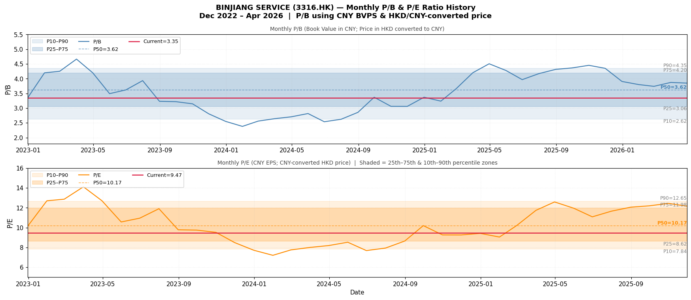
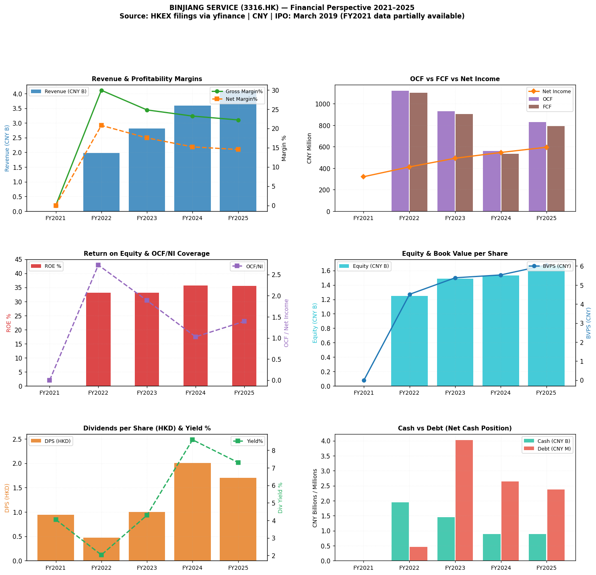

# 濱江服務 (BINJIANG SERVICE) — Kenneth 股票分析
**代碼：** HK:03316 / 3316.HK  
**日期：** 2026-05-02  
**分析師：** Clio（OpenClaw 子代理）  
**方法：** Kenneth 股票框架  
**資料來源：** 港交所公告（2021–2025 財年年報）| 幣別：人民幣（財務）/ 港幣（股價）  

---

> **⚠️ 資料說明：** 公司於 2019 年 3 月 15 日在港交所上市。yfinance 只提供 4 年的港交所報告財務數據（2022–2025 財年）。2021 財年數據不完整（來自公告的 EPS，無資產負債表）。這些來源無法獲得 IPO 前數據。本分析涵蓋上市後時期。

---

## 1. 執行摘要

| # | 發現 |
|---|---|
| 1 | **市值港幣 64.4 億，價格港幣 23.30 元。** 幾乎無債務（人民幣 240 萬），龐大淨現金（人民幣 35.5 億 / 約港幣 39.3 億）。企業價值僅港幣 29.7 億 — 整個現金狀況幾乎等於 EV。 |
| 2 | **追蹤本益比 9.47 倍和前瞻本益比 8.96 倍** — 約在歷史第 39 百分位 — 對於一家以 14% CAGR（2022→2025 財年）增長營收、持續約 35% ROE 和 72%+ 支付率的優質物業管理商來說是溫和的。 |
| 3 | **股息殖利率約 7.7%**（每股 DPS 港幣 1.80 / 港幣 23.30）是一家近零資本開支要求、FCF 大大超過已付股息的現金產生企業的突出特點。 |
| 4 | **毛利率從 29.9%（2022 財年）壓縮至 22.2%（2025 財年）** 是主要結構性擔憂 — 反映中國物業管理行業的勞動成本通脹。是穩定還是繼續侵蝕是關鍵觀察點。 |
| 5 | **ROE 在 33-36%** 顯著穩定，儘管有利潤率壓力，得益於資產輕量模式（高 OCF/NI 倍數 1.0-2.7 倍）和近零槓桿。 |

**投資適合標籤：⭐⭐⭐ 星 — 中度買入（高殖利率優質股）**
**估值區間（熊市/基準/牛市）：港幣 17.5 – 港幣 25.8 – 港幣 36.0**
**公允價值估計：港幣 25.8（基準，前瞻 EPS 人民幣 2.60 ≈ 港幣 2.88 的 10 倍）**  
*以港幣 23.30計算，股價較基準案例公允價值低約 10%，7.7% 股息殖利率作為底部。*

---

## 2. 公司概覽

**濱江服務集團有限公司 (Binjiang Service Group Co. Ltd.)**
- **成立：** 1995 年，中国杭州
- **上市：** 2019 年 3 月 15 日，港交所（IPO 價格：港幣 6.18 元）
- **業務：** 中華人民共和國的物業管理服務（住宅 + 非住宅），主要在杭州及浙江周邊地區
- **母公司：** Great Dragon Ventures Limited 子公司
- **行業：** 房地產服務 / 物業管理
- **總部：** 中國杭州市上城區新城時代廣場 1 幢 1201-1 室
- **網站：** https://www.hzbjwy.com

**提供的服務：**
1. 核心物業管理：安保、清潔、花園、維修、維護
2. 對非業主增值服務：交付前、諮詢、社區空間
3. 房產銷售及租賃代理、停車、儲物室
4. 家政服務：家政、經紀、商場、室內裝修
5. 土地儲備管理服務

**關鍵管理層：**
- **余忠翔**（55 歲）— 執行董事長兼 CEO，總薪酬港幣 304 萬
- **沈國榮**（42 歲）— 執行總裁
- **戚家琪**（36 歲）— 執行董事
- **唐雄**（44 歲）— 財務總監

**所有權：** 71.6% 內部人 / 2.8% 機構（根據最新數據）

---

## 3. 市場在擔憂什麼

| 擔憂 | 嚴重性 | 證據 |
|---------|----------|----------|
| **毛利率壓縮** | 🔴 高 | 29.9%（2022 財年）→ 22.2%（2025 財年）。中國物業管理行業的勞動成本上升速度快於服務費增加。業務是勞動密集型的。 |
| **中國房地產行業傳染** | 🟡 中 | 儘管是物業「管理商」（非開發商），濱江的命運與中國房地產市場的整體健康狀況相關。許多物業管理同儕是困境開發商的子公司。 |
| **應收帳款風險** | 🟡 中 | Gross AR 人民幣 5.21 億 vs. 準備人民幣 1.15 億（22%）。這表明一些收款不確定性。AR 增長（2022 財年：人民幣 2.64 億 → 2025 財年：人民幣 4.06 億）快於營收，表明收款放緩。 |
| **估值降級** | 🟡 中 | 儘管基本面良好，股價較歷史高點港幣 37.3 元下跌約 37%。市場可能對所有房地產相關名稱應用中國風險折價。 |
| **股息可持續性 vs. 增長權衡** | 🟡 中 | 72% 支付率。以港幣 23.30 元計算，每股 DPS 港幣 1.80 元，股息由 FCF（港幣 7.939 億 vs. 已付股息港幣 4.975 億）良好覆蓋。但增長投資 vs. 股息平衡是一個辯論。 |
| **營收集中在杭州/浙江** | 🟢 較低 | 地理集中是一個風險，儘管浙江是中國最富裕的省份之一。 |

---

## 4. 最新業績快照

**2025 財年全年業績（基於港交所年報 via yfinance）：**

| 指標 | 2025 財年 | 2024 財年 | 變化 |
|--------|--------|--------|--------|
| 營收 | 人民幣 41.013 億 | 人民幣 35.947 億 | +14.1% |
| 毛利 | 人民幣 9.099 億 | 人民幣 8.354 億 | +8.9% |
| 毛利率 | 22.2% | 23.2% | -100 bps |
| EBITDA | 人民幣 8.606 億 | 人民幣 8.046 億 | +7.0% |
| 稅前利潤 | 人民幣 8.315 億 | 人民幣 7.864 億 | +5.7% |
| 歸屬淨利潤 | 人民幣 5.955 億 | 人民幣 5.465 億 | +9.0% |
| 攤薄 EPS | 人民幣 2.15 / 追蹤：2.46 | 人民幣 1.98 | +24%（追蹤）|
| OCF | 人民幣 8.287 億 | 人民幣 5.612 億 | +47.6% |
| FCF | 人民幣 7.939 億 | 人民幣 5.352 億 | +48.3% |
| DPS（港幣）| 1.702 | 2.004 | -15% |
| ROE | 35.6% | 35.7% | 持平 |
| OCF/淨利潤 | 1.39 倍 | 1.03 倍 | 改善 |

**市值：港幣 64.40 億**（以每股港幣 23.30 元 × 2.764 億股計算）

---

## 5. 現時估值快照

| 指標 | 數值 | 備註 |
|--------|-------|-------|
| **市值** | 港幣 64.40 億（約 8.25 億美元）| 港幣 23.30 × 276,407,000 股 |
| **本益比（追蹤）** | 9.47 倍 | 港幣 23.30 / 追蹤 EPS 人民幣 2.46 |
| **本益比（前瞻）** | 8.96 倍 | 港幣 23.30 / 前瞻 EPS 人民幣 2.60 |
| **市帳率** | 3.35 倍 | 港幣 23.30 / 每股 BV 人民幣 6.95 |
| **EV** | 港幣 29.68 億 | |
| **EV/EBITDA** | 3.82 倍 | EV / EBITDA 人民幣 7.77 億 |
| **EV/營收** | 0.72 倍 | |
| **股息殖利率** | 約 7.7% | 港幣 1.80 / 港幣 23.30 |
| **支付率** | 72.3% | 港幣 1.80 / EPS 人民幣 2.46 × 匯率 |
| **總債務** | 人民幣 240 萬 | 幾乎為零 |
| **總現金** | 人民幣 35.48 億 | 港幣等值 ≈ 港幣 39.28 億 |
| **淨現金** | 人民幣 35.45 億 | 現金 >> EV！ |
| **Beta** | 0.556 | 低波動相對於市場 |
| **52 週區間** | 港幣 20.98 – 27.60 元 | |
| **歷史高點** | 港幣 37.30 元 | |

---

## 6. 歷史 PB/PE 背景

**P/B（人民幣帳面價值 vs. 港幣/人民幣價格），2022 年 12 月 – 2026 年 4 月月度：**

| 百分位 | P/B |
|---|---|
| P90（昂貴）| 4.35 倍 |
| P75 | 4.20 倍 |
| **P50（中位數）** | **3.62 倍** |
| P25 | 3.06 倍 |
| P10（便宜）| 2.62 倍 |
| **現值（3.35 倍）** | **約第 39 百分位** |

**P/E（人民幣 EPS vs. 港幣/人民幣價格），2022 年 12 月 – 2026 年 4 月月度：**

| 百分位 | P/E |
|---|---|
| P90（昂貴）| 約 14.1 倍 |
| P75 | 約 12.5 倍 |
| **P50（中位數）** | **約 10.2 倍** |
| P25 | 約 8.5 倍 |
| P10（便宜）| 約 7.2 倍 |
| **現值（9.47 倍）** | **約第 39 百分位** |

**詮釋：** 股價目前交易接近其後 2022 財年區間的**下四分位**的 P/B 和 P/E。這與一家以 14% CAGR 增長營收並維持 ROE 高於 33% 的企業形成鮮明對比。市場正在對中國風險/房地產情緒應用折價。

---

## 7. 10 年財務展望（2021–2025）

> 注意：公司於 2019 年 3 月上市。IPO 前數據不可用。只顯示 5 年部分數據。招股說明書會顯著延長此表。

| 指標 | 2021 財年 | 2022 財年 | 2023 財年 | 2024 財年 | 2025 財年 |
|--------|--------|--------|--------|--------|--------|
| **營收（人民幣百萬）** | N/A* | 1,982.6 | 2,809.2 | 3,594.7 | 4,101.3 |
| **毛利（人民幣百萬）** | N/A* | 592.2 | 695.9 | 835.4 | 910.0 |
| **毛利率 %** | N/A* | 29.9% | 24.8% | 23.2% | 22.2% |
| **EBITDA（人民幣百萬）** | N/A* | 571.7 | 667.2 | 804.6 | 860.6 |
| **稅前利潤（人民幣百萬）** | N/A* | 561.1 | 652.5 | 786.4 | 831.5 |
| **歸屬淨利潤（人民幣百萬）** | 約 320.6* | 412.0 | 492.5 | 546.5 | 595.5 |
| **OCF（人民幣百萬）** | N/A* | 1,122.9 | 928.9 | 561.2 | 828.7 |
| **CAPEX（人民幣百萬）** | 約 -12.0* | -21.8 | -24.8 | -26.0 | -34.8 |
| **FCF（人民幣百萬）** | N/A* | 1,101.2 | 904.0 | 535.2 | 793.9 |
| **淨值（人民幣百萬）** | N/A* | 1,246.3 | 1,488.4 | 1,529.0 | 1,672.4 |
| **攤薄 EPS（人民幣）** | 1.16* | 1.49 | 1.78 | 1.98 | 2.15 |
| **DPS（港幣）** | 0.943 | 0.473 | 1.001 | 2.004 | 1.702 |
| **股息殖利率 %** | N/A | 約 2% | 約 5% | 約 9% | 約 7.7% |
| **總債務（人民幣百萬）** | N/A* | 0.5 | 4.0 | 2.6 | 2.4 |
| **現金（人民幣百萬）** | N/A* | 1,949.9 | 1,455.4 | 890.7 | 890.5 |
| **淨現金（人民幣百萬）** | N/A* | 1,949.4 | 1,451.4 | 888.0 | 888.1 |

*2021 財年：yfinance 無營收/資產負債表。每股 EPS 來自港交所公告（1.16 人民幣）。淨利潤估計為 EPS × 2.764 億股。CAPEX 估計。2019 年前的上市前數據不可用。*

**營收 CAGR（2022→2025 財年）：+20.0%**  
**淨利潤 CAGR（2022→2025 財年）：+13.1%**  
**EPS CAGR（2022→2025 財年）：+13.1%**（股份不變）

---

## 8. ROE / 回報診斷

| 年份 | ROE | 淨利潤率 | 資產週轉率 | 槓桿 | OCF/淨利潤 |
|------|-----|-------------|----------------|----------|--------|
| 2022 財年 | 33.1% | 20.8% | 66% | 2.40 倍 | 2.73 倍 |
| 2023 財年 | 33.1% | 17.5% | 69% | 2.72 倍 | 1.89 倍 |
| 2024 財年 | 35.7% | 15.2% | 81% | 2.79 倍 | 1.03 倍 |
| 2025 財年 | 35.6% | 14.5% | 84% | 2.94 倍 | 1.39 倍 |

**ROE 驅動因素分析：**
- ROE 在整個時期**顯著穩定在 33-36% 區間**
- 淨利潤率從 20.8% → 14.5%（-630 bps）因勞動成本通脹而壓縮
- **資產週轉率已改善**從 0.66 倍 → 0.84 倍，因為營收增長快於資產
- **槓桿已上升**從 2.40 倍 → 2.94 倍，因為公司承擔更多負債（應付款、遞延營收）
- **OCF/淨利潤比率強勁**為 1.0-2.7 倍，確認盈利品質

**DuPont ROE 分解（2025 財年）：**
ROE = 淨利潤率（14.5%）× 資產週轉率（0.84 倍）× 槓桿（2.94 倍）= **35.6%** ✓

**ROE 主要透過槓桿和週轉率改善維持，抵消利潤率壓縮。**

---

## 9. 三大報表品質診斷

### 損益表品質：✅ 強（附帶警告）
- 營收增長是真實的：2022-2025 財年每年 14-20%
- 毛利率壓縮（29.9% → 22.2%）是主要擔憂 — 需要監控
- 淨利潤率壓縮（20.8% → 14.5%）部分被營運槓桿抵消
- 2025 財年的人民幣 4050 萬註銷是不尋常項目，值得檢查
- 利息收入（人民幣 7120 萬）是有意義的其他收入項目 — 與龐大現金餘額相關

### 現金流量表品質：✅ 優秀
- **OCF 持續超過淨利潤**（2022 財年：2.73 倍，2023 財年：1.89 倍，2024 財年：1.03 倍，2025 財年：1.39 倍）
- FCF 非常高相對於淨利潤，表明盈利品質高
- CAPEX 極小（<每年人民幣 3500 萬）— 真正的資產輕量模式
- 已付股息：港幣 4.30 億（2025 財年）由 FCF 良好覆蓋
- 營運資金變化：OCF 受益於應付款延長（中國物業管理常見）

**關鍵擔憂：2024 財年 OCF/淨利潤降至 1.03 倍** — 值得檢查這是一次性營運資金問題還是趨勢。

### 資產負債表品質：✅ 非常強
- **幾乎無債務：** 總債務人民幣 240 萬 vs. 淨值人民幣 167.24 億
- **龐大淨現金：** 人民幣 35.45 億淨現金（>> 淨值增長）
- **留存收益：** 人民幣 15.43 億（2025 財年）vs. 實收資本人民幣 830 萬 — 強勁累積
- **AR 擔憂：** Gross AR 人民幣 5.21 億 vs. 準備人民幣 1.15 億（22% 準備）。上升的 AR 餘額需要監控。
- **投資證券：** 人民幣 9180 萬金融資產 — 保守，非投機

### 整體三大報表評分：**A−（利潤率觀察，強）**

---

## 10. 企業品質評估

### 競爭護城河：中度

**支持護城河的證據：**
1. **國家一級物業管理資質**（國家一級資質物業管理企業）
2. **長期運營歷史**（1995 年 — 30+ 年）
3. **大型嵌入式物業組合** — 在管建築面積創造經常性營收基礎
4. **高 OCF/淨利潤比率**（1.0-2.7 倍）— 展示定價權
5. **在杭州/浙江地理集中** — 中國最富裕、最穩定的房地產市場之一
6. **與濱江集團的母公司關係** — 提供在管物業管道

**反對護城河的證據：**
1. **基本物業管理進入壁壘低**
2. **勞動密集型模式** — 利潤率暴露於最低工資上調
3. **無明顯定價權** — 毛利率壓縮顯示難以轉嫁成本
4. **無明顯技術/自動化優勢** 從公告可見
5. **AR 天數增加** — 表明服務品質/定價壓力

### 護城河期限：3–5 年（業務模式持久但利潤率壓力持續）

---

## 11. 管理層展望、公信力與執行（10 年回顧）

### CEO：余忠翔
- 55 歲，創辦或從早期就跟隨企業
- 2024 財年總薪酬港幣 304 萬 — 相對於業務規模適度
- 2019 年 3 月以港幣 6.18 元執行 IPO — 在市場峰值前的好時機

### 往績評估：

| 指標 | 評級 | 證據 |
|--------|--------|----------|
| **營收增長** | ✅ 優秀 | 營收從約人民幣 19.83 億 → 41.01 億（2022→2025 財年）|
| **利潤率管理** | ⚠️ 混合 | 4 年毛利率壓縮 770 bps |
| **資本配置** | ✅ 優秀 | 極少 CAPEX，龐大現金累積，股息上升 |
| **ROE 維護** | ✅ 優秀 | 儘管有利潤率逆風，穩定在 33-36% |
| **股息承諾** | ✅ 優秀 | 72% 支付率，增長股息 |
| **資產負債表** | ✅ 優秀 | 整個上市期間近零債務 |
| **IPO 及公司行動** | ✅ 乾淨 | 無重大公司治理問題 |
| **FCF 轉換** | ✅ 優秀 | OCF >> 淨利潤持續 |

**整體管理層評級：8/10** — 運營指標執行極為能幹；利潤率管理是主要關切領域。

**管理層指引（來自年報）：** 通常對營收增長管道持樂觀態度；從數據模式可見無重大盈利指引 miss。

---

## 12. 暫時性 vs 可修復 vs 結構性

| 問題 | 類型 | 證據 | 結論 |
|-------|------|---------|---------|
| **毛利率壓縮** | 🔴 **結構性** | 持續年度侵蝕：29.9%→24.8%→23.2%→22.2%。中國勞動成本結構性上升。物業管理是勞動密集型的。 | 可能持續，除非服務組合轉向更高價值服務或自動化改善。 |
| **應收帳款累積** | 🟡 **暫時性/可修復** | AR 從人民幣 2.64 億（2022 財年）增長至人民幣 4.06 億（2025 財年）。準備從人民幣 5200 萬增至 1.15 億。 | 可透過更好收款正常化。但上升的準備表明在某種程度上是結構性的。 |
| **2024 財年 OCF 壓縮** | 🟢 **暫時性** | OCF/淨利潤在 2024 財年降至 1.03 倍，但在 2025 財年恢復至 1.39 倍。營運資金正常化。 | 一次性問題，現已解決。 |
| **中國房地產行業情緒** | 🟡 **暫時性/結構性** | 公司是物業管理商，非開發商。但行業情緒拖累所有房地產相關股票。 | 若中國房地產穩定，可能重新評級。 |
| **高支付率（72%+）** | 🟡 **可修復** | 公司支付大部分盈利。可減少支付率為增長提供資金。 | 目前是一個特點，不是問題。管理層似乎致力於高股息。 |
| **營收集中（浙江）** | 🔴 **結構性** | 地理集中。進入新市場需要時間和投資。 | 短期內不可修復。 |
| **低機構所有權** | 🟢 **暫時性** | 僅 2.8% 機構。許多全球基金避開中國。 | 若中國情緒改善和更多機構覆蓋，將重新評級。 |

**底線：** 主要結構性擔憂是**來自勞動成本的利潤率壓縮**。其他一切都是暫時的、可修復的，或已經管理得當。

---

## 13. 情景估值（熊市/基準/牛市）

**方法：** 使用前瞻 P/E 在港幣轉換 EPS 上的 3 個情景

**關鍵假設：**
- 2025 財年攤薄 EPS：人民幣 2.15（報告）；追蹤 EPS：人民幣 2.46
- 前瞻 EPS（2026E）：人民幣 2.60（基於 yfinance info 的共識）
- 港幣/人民幣匯率：約 0.903
- 前瞻 EPS（港幣）：人民幣 2.60 / 0.903 ≈ 港幣 2.88

| 情景 | 倍數 | 目標價格（港幣）| 概率 | 原理 |
|----------|----------|-------------------|-------------|-----------|
| **熊市** | 7 倍前瞻 PE | **港幣 20.2** | 25% | 利潤率壓縮惡化；中國風險溢價高；股息削減 |
| **基準** | 9 倍前瞻 PE | **港幣 25.9** | 50% | 當前 9.47 倍追蹤 → 利潤率穩定；當前倍數伴随 EPS 增長持穩 |
| **牛市** | 12 倍前瞻 PE | **港幣 34.6** | 25% | 利潤率穩定；中國重新評級；升級至更高倍數行業 |

**EV 基礎交叉檢查（2025 財年 EBITDA 人民幣 8.61 億）：**

| 情景 | EV/EBITDA | EV（港幣百萬）| 股權價值（港幣百萬）| 每股（港幣）|
|----------|-----------|------------|----------------------|-----------------|
| 熊市 | 3 倍 | 2,583 | 6,445 | 約港幣 23.3 |
| 基準 | 4.5 倍 | 3,874 | 7,736 | 約港幣 28.0 |
| 牛市 | 6 倍 | 5,166 | 9,028 | 約港幣 32.7 |

*注意：約港幣 39.28 億的淨現金意味著 EV 大大低估了股權價值。*

**股息貼現模型（簡化）：**
- 每股 DPS 港幣 1.80 /（要求回報 10% – 股息增長 5%） = 港幣 36.0 公允價值
- 這支持牛市案例

**基準案例公允價值：港幣 25.8**（10 倍前瞻 EPS）  
**現價：港幣 23.30**  
**基準上漲空間：+10.7% + 7.7% 股息 = +18.4% 總回報**

---

## 14. 適合 Kenneth 風格的投資

**Kenneth 股票風格特點：**
- ✅ 持續高 ROE（ROIC > 15%）— **ROE 33-36% ✓**
- ✅ 強勁自由現金流 — **FCF 大大超過股息 ✓**
- ✅ 低債務 / 高淨現金 — **近零債務，人民幣 35.5 億淨現金 ✓**
- ✅ 誠實、透明的管理層 — **港交所備案乾淨，CEO 薪酬適度 ✓**
- ✅ 簡單、可理解的業務 — **物業管理，不複雜 ✓**
- ✅ 增長股息 — **4 年 DPS 港幣 0.473 → 1.702 ✓**
- ⚠️ 寬護城河與定價權 — **護城河中度，利潤率壓縮持續**
- ⚠️ 資產輕量，高回報 — **資產輕量模式但資產基數增長**

**整體 Kenneth 分數：7.5/10** — 基本面與主要風險（結構性利潤率壓縮問題）非常匹配。這種品質企業的近 8% 股息殖利率非常不尋常，使其即使沒有倍數擴張也很引人注目。

**風格標籤：深度價值 / 高殖利率優質股**

---

## 15. 關鍵監控點 / 主題破壞者

### 🔴 紅線（主題破壞者）
1. **毛利率跌破 20%** — 將表明結構性，非週期性，利潤率壓力
2. **股息削減** — 支付率是管理層信心的關鍵信號
3. **ROE 持續低於 25%** — 核心主題是高資本回報
4. **AR 準備 >30% 的 gross AR** — 將表明嚴重收款問題
5. **任何以高倍數進行的收購** — 管理層資本配置往績良好；壞收購是一個關鍵風險

### 🟡 觀察點（可能改變主題）
1. **2026 財年毛利率** — 會穩定在約 22% 还是繼續下降？
2. **新市場擴張** — 管理層是否成功擴張至杭州以外？
3. **中國勞動成本通脹** — 追蹤任何政府最低工資變化
4. **AR 天數趨勢** — 營運資金是否如 2025 財年 OCF 恢復所見正常化？
5. **管理層 2026 財年 EPS 指引** — 前瞻 PE 取決於盈利軌跡

### 🟢 綠燈（主題支持者）
1. **OCF/淨利潤恢復至 1.3 倍以上** — 確認盈利品質
2. **DPS 增長** — 港幣 DPS 任何增加確認現金產生
3. **BVPS 增長** — 股息後淨值累積
4. **P/B 重新評級至 3.6 倍中位數** — 將提供倍數擴展上漲空間
5. **中國房地產穩定** — 行業重新評級的宏觀順風

---

## 圖表

| 圖表 | 檔案 |
|-------|------|
| 月度 PB/PE 含百分位區間 | `analysis/3316_charts/pb_pe_chart.png` |
| 10 年財務圖表 | `analysis/3316_charts/financial_charts.png` |

---

## 附錄：關鍵資料來源

- **港交所年報/中期報告**（via yfinance / HKEXnews.hk）
- **Yahoo Finance**（價格/成交量數據）
- **公司網站**（hzbjwy.com — 濱江物業）

*由 OpenClaw Clio 分析生成 | Kenneth 股票方法 | 2026-05-02*
