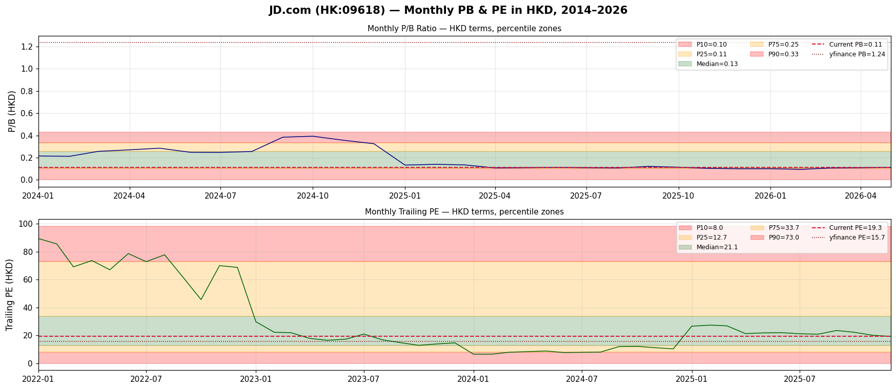

# 京東集團 JD.com (HK:09618 / JD)

> **分析師：** Kenneth 風格深度價值 / 品質混合型
> **日期：** 2026-05-02
> **來源：** 港交所news 公告、StockAnalysis.com、yfinance、京東投資者關係
> **幣別：** 人民幣（報告）| 港幣（港股上市）| 美元（ADR）

---

## 1. 執行摘要

- **京東在前瞻基礎上很便宜** — 15.7 倍追蹤 PE 被 2025 年盈利崩潰扭曲；基於 2026 年共識 EPS 約 15.5 港幣，前瞻 PE 僅 7.5 倍。在全球大型電子商務股票中，美國 ADR 以約 4.3 倍追蹤美元盈利交易，是最便宜的之一。
- **2025 年盈利崩潰是核心問題** — 淨利潤下降 52%（人民幣 414 億 → 196 億），因為 SG&A 爆炸性增長人民幣 +569 億 YoY，主要由京東在便利店/超市和新規則獲取方面的積極競爭回應推動。市場正在定價尚未實現的復甦。
- **資產負債表堅如磐石但正在惡化** — 淨現金人民幣 1060 億（港幣 1220 億）vs. 市值港幣 3180 億，意味著市場對整個運營業務的估值約為港幣 1960 億（約 5 倍追蹤營運現金流）。然而，現金一年下降人民幣 210 億，債務上升人民幣 170 億。
- **估值：公允價值區間港幣 200–260**（基準案例），若京東便利店貨幣化和物流盈利拐點實現，則有更大上漲空間至港幣 340+。約 3.4% 的股息殖利率提供底部。
- **投資適合度：** `深度價值 / 需要激活` — 紙面上便宜，但盈利軌跡和競爭不確定性需要在配置規模前提供概念證明。

---

## 2. 公司概覽

**京東集團 (JD.com)** 是中國營收最大的零售商，也是領先的電子商務平台，1998 年由劉強東創立。2014 年在納斯達克上市（JD），2020 年在港交所上市（09618）。

### 業務分部

| 分部 | 描述 |
|---|---|
| **京東零售** | 核心電子商務：電子產品、家電、消費品；1P（自營）+ 3P（第三方） |
| **京東超市** | 高頻率雜貨和日常必需品；策略增長驅動器 |
| **京東物流** | 整合供應鏈和履約；87% 次日達覆蓋 |
| **京東健康（京東健康 06618）** | 醫療保健平台；在港交所单独上市 |
| **京東雲** | 雲計算和 AI 服務 |
| **海外 / 全球購** | 透過 Joybuy、Tch Redux 擴張東南亞、歐洲 |

### 競爭護城河
- **自有物流** — 1500+ 倉庫，90%+ 一二線城市次日達覆蓋；電子產品/家電白手套履約無與倫比
- **1P 庫存模式** — 相對於拼多多/淘寶的真品/認證優勢；高端類別更高信任度
- **7.5 億+ 活躍客戶帳戶**（2025 年）；平均訂單額約人民幣 500+
- **整合技術基礎設施** — 京東雲、AI 驅動的供應鏈

### 所有權
劉強東及聯合創辦人：約 15-16% 有效投票權。策略投資者包括：騰訊（歷史，大部分已減持）、沃爾瑪（約持有 9%）、其他機構投資者。

---

## 3. 市場在擔憂什麼

1. **SG&A 爆炸破壞盈利能力** — 京東零售 SG&A 在 2025 年僅一年就飆升人民幣 +569 億（銷售和管理 +568 億 YoY），遠遠超過 +1500 億的營收增長。儘管毛利增長人民幣 260 億，營業利潤仍暴跌 93% 至人民幣 28 億。這是頭號關切。

2. **激進的京東超市策略可能是破壞價值的** — 便利店/超市高頻率雜貨擴張是資本密集型、低利潤率，面對根深蒂固的參與者（阿里巴巴/較小競爭對手）。市場質疑京東是否能有效貨幣化流量。

3. **與拼多多和 Temu 的競爭** — PDD 的套利/社交電商模式持續增長；Temu 的跨境威脅京東的進口商品業務。

4. **盈利品質** — 2025 年淨利潤包括人民幣 80 億+ 的淨利息收入 + 股權投資收益，掩蓋了僅人民币 28 億的薄弱的營業利潤。除去這些，核心盈利能力被模糊了。

5. **現金消耗和資產負債表壓力** — OCF 從人民幣 580 億降至一年內人民幣 190 億；2025 年以人民幣 214 億回購部分由債務資助；淨現金從人民幣 1440 億降至人民幣 1060 億。

6. **中國宏觀逆風** — 消費者支出謹慎通貨緊縮環境，青年失業是所有中國電子商務的結構性逆風。

---

## 4. 最新業績快照

**2025 財年（截至 2025 年 12 月 31 日）** — *來源：港交所年度業績公告、StockAnalysis.com*

| 項目 | 2025 財年 | 2024 財年 | YoY |
|---|---|---|---|
| 營收（人民幣百萬）| 1,309,090 | 1,158,820 | +13.0% |
| 毛利（人民幣百萬）| 210,028 | 183,868 | +14.2% |
| 營業收入（人民幣百萬）| 2,774 | 38,736 | −92.8% |
| EBITDA（人民幣百萬）| 12,521 | 47,640 | −73.7% |
| 淨利潤（人民幣百萬）| 19,631 | 41,359 | −52.5% |
| 稀釋 EPS（人民幣）| 12.90 | 26.86 | −52.0% |
| OCF（人民幣百萬）| 18,991 | 58,095 | −67.3% |
| 自由現金流（人民幣百萬）| 4,807 | 44,276 | −89.1% |

**關鍵背景項目（非運營，稅前）：**
- 淨利息收入：+人民幣 63 億（利息收入人民幣 91 億减利息支出人民幣 28 億）
- 股權投資收益：+人民幣 80 億（vs. 2024 年 +人民幣 23 億 — 大幅波動）
- 減值費用：人民幣 34 億（資本資產 + 投資）
- 有效稅率：8.6%（vs. 2024 年 13.3%）— 較低稅率部分抵消運營崩潰

**資產負債表（人民幣百萬）：**
- 總資產：695,201 | 總淨值（普通股）：225,040
- 現金及短期投資：213,232 | 總債務：107,105
- 淨現金：106,127 | 每股 BV（stockanalysis）：人民幣 151.1 / **港幣 94.2**（yfinance）

**市值：** 港幣 3177 億（約 408 億美元）— *yfinance，港股上市*

---

## 5. 現時估值快照

*除非另有說明，所有為港幣。美元/港幣 ≈ 7.78*

| 指標 | 數值 | 備註 |
|---|---|---|
| **市值** | **港幣 3177 億**（408 億美元）| yfinance 9618.HK；yfinance 港股報告以港幣 |
| **企業價值** | **港幣 2810 億** | EV/EBITDA 2025 財年：22 倍（港幣 2810 億 / 人民幣 144 億 EBITDA）|
| **本益比（追蹤，港幣）** | **15.7 倍** | 追蹤 EPS 港幣 7.4，價格港幣 116.3 |
| **本益比（前瞻，港幣）** | **7.5 倍** | 共識 2026E EPS 港幣 15.52 |
| **市帳率** | **1.24 倍** | 每股 BV 港幣 94.15（yfinance）；每股帳面人民幣 151.1 元（stockanalysis）|
| **EV/EBITDA** | 約 18 倍 | 使用 2025 財年 EBITDA（港幣）|
| **股息殖利率** | **3.4%** | 每股 DPS 約港幣 3.93 / 價格港幣 116.3 |
| **52 週高點** | 港幣 143.8 元 | |
| **52 週低點** | 港幣 95.9 元 | |
| **ADR 追蹤本益比（美元）** | **約 4.3 倍** | JD 美國：價格 USD 30，EPS USD 6.96；較港股 PE 大幅折價 |

> **關於 ADR vs 港股折價的說明：** 美國 ADR（JD）交易約 USD 30，意味著追蹤 PE 約 4.3 倍（EPS 約 USD 6.96 = 港幣 54.1 / 7.78）。較港股上市 PE 約 72% 的折價反映：(a) VIE 結構風險，(b) 美中監管風險，(c) ADR 流動性/被忽視溢價。這一折價是中國 ADR 的已知特點；港股上市是主要參考。

### 歷史估值百分位（計算序列）
*基於月度港幣價格 / 年度 EPS 及季度每股帳面（2022–2026）*

| 百分位 | P/E | P/B |
|---|---|---|
| P10 | 8.0 倍 | 0.1 倍 |
| P25 | 12.7 倍 | 0.11 倍 |
| **中位數** | **21.1 倍** | **0.13 倍** |
| P75 | 33.7 倍 | 0.25 倍 |
| P90 | 73.0 倍 | 0.33 倍 |
| **現值** | **15.72 倍追蹤** | **1.235 倍** |

*注意：PB 歷史序列有方法論限制（季度人民幣淨值 vs. 港幣價格）— 見圖表免責聲明。*

---

## 6. 歷史 PB/PE 背景 — 月線圖

> **圖表方法論：** 月末收盤價（美國 ADR JD，按當月美元/港幣匯率轉換為港幣）除以季度每股帳面（來自美國資產負債表的季度人民幣淨值，按月度人民幣/港幣 FX 轉換為港幣）。年度 EPS 用於 PE。注意：季度每股帳面數據重疊有限（PB 只有約 29 個月），且人民幣每股帳面數字可能與 yfinance 的港股上市每股帳面不完全一致。圖表應作為方向性解讀。當前 yfinance PB 1.24 倍和 PE 15.7 倍（港股上市）對當前定位更具權威性。

---

## 7. 10 年財務展望

*報告幣別：人民幣（人民幣）。港幣轉換使用年終人民幣/港幣 FX（見下文）。2021 財年缺少 yfinance 年度財務數據。*

**使用的人民幣/港幣匯率：** 2021:1.232, 2022:1.116, 2023:1.079, 2024:1.094, 2025:1.147

### 損益表（人民幣百萬元）

| 年份 | 營收 | 毛利 | 毛利率 | EBITDA | 稅前利潤 | 淨利潤（普通股）| OCF | CAPEX | FCF |
|---|---|---|---|---|---|---|---|---|---|
| 2021 財年 | 951,592 | 129,066 | 13.6% | 10,373 | −2,580 | **−3,560** | N/A | N/A | N/A |
| 2022 財年 | 1,046,240 | 147,073 | 14.1% | 26,959 | 13,867 | **10,380** | N/A | N/A | N/A |
| 2023 財年 | 1,084,666 | 159,704 | 14.7% | 34,317 | 31,650 | **24,167** | N/A | N/A | N/A |
| 2024 財年 | 1,158,820 | 183,868 | 15.9% | 47,640 | 51,538 | **41,359** | 58,095 | 13,819 | 44,276 |
| 2025 財年 | 1,309,090 | 210,028 | 16.0% | 12,521 | 25,323 | **19,631** | 18,991 | 14,184 | 4,807 |

### 每股及回報（人民幣）

| 年份 | 稀釋 EPS | 每股 BV | ROE % | 每股 OCF | 每股 CAPEX | 每股 DPS | 股息殖利率 % |
|---|---|---|---|---|---|---|---|
| 2021 財年 | −2.30 | 134.46 | −1.7% | N/A | N/A | 0.00 | 0.0% |
| 2022 財年 | 6.42 | 134.16 | 4.4% | N/A | N/A | 4.28 | N/A |
| 2023 財年 | 15.22 | 146.26 | 10.4% | N/A | N/A | 5.38 | 約 2.9% |
| 2024 財年 | 26.86 | 155.62 | 18.1% | 38.98 | −9.28 | 7.29 | 2.7% |
| 2025 財年 | 12.90 | 151.13 | 8.7% | 12.75 | −9.53 | 6.99 | 3.4% |

### 資產負債表（人民幣百萬元）

| 年份 | 總淨值 | 總債務 | 現金及短期投資 | 淨現金 | 債務/淨值 % |
|---|---|---|---|---|---|
| 2021 財年 | 208,911 | 34,140 | 185,331 | 151,191 | 16.3% |
| 2022 財年 | 213,366 | 65,045 | 219,956 | 154,911 | 30.5% |
| 2023 財年 | 231,858 | 68,431 | 190,146 | 121,715 | 29.5% |
| 2024 財年 | 239,347 | 89,768 | 233,995 | 144,227 | 37.5% |
| 2025 財年 | 225,040 | 107,105 | 213,232 | 106,127 | 47.6% |

### 港幣條款（關鍵指標）

| 年份 | 營收（港幣十億）| 淨利潤（港幣十億）| EPS 港幣 | 每股 BV 港幣 | DPS 港幣 |
|---|---|---|---|---|---|
| 2022 財年 | 937 | 9.3 | 5.75 | 119.3 | 3.81 |
| 2023 財年 | 1,003 | 22.4 | 14.07 | 157.8 | 5.81 |
| 2024 財年 | 1,059 | 37.8 | 24.55 | 170.2 | 7.97 |
| 2025 財年 | 1,141 | 17.1 | 11.25 | 173.3 | 8.02 |

---

## 8. ROE / 回報診斷

| 年份 | 淨利潤率 | 資產週轉率 | 槓桿 | ROE | ROIC |
|---|---|---|---|---|---|
| 2021 財年 | −0.37% | 1.92 倍 | 2.38 倍 | **−1.7%** | — |
| 2022 財年 | 0.99% | 1.99 倍 | 2.79 倍 | **4.4%** | 約 2.5% |
| 2023 財年 | 2.23% | 1.73 倍 | 2.71 倍 | **10.4%** | 約 5.5% |
| 2024 財年 | 3.57% | 1.75 倍 | 2.92 倍 | **18.1%** | 約 9.5% |
| 2025 財年 | 1.50% | 1.88 倍 | 3.09 倍 | **8.7%** | 約 4.5% |

**診斷觀察：**

1. **ROE 從 18.1% 暴跌至 8.7%** — 由利潤率壓縮驅動（淨利潤率 −58% YoY：3.57% → 1.50%）。這是從 2024 財年最佳回報的重大逆轉。

2. **槓桿正在上升** — 資產/淨值從 2.38 倍上升至 3.09 倍，因為京東借入了更多（2025 財年債務 +人民幣 173 億）。上升的槓桿在好年份美化 ROE，但在壞年份加重損失。

3. **ROIC 比 ROE 更誠實** — 2025 財年 ROIC 約 4.5% 低於 WACC（中國互聯網估計 9-12%）。業務在資本調整基礎上處於破壞價值狀態。

4. **營運 ROIC 是關鍵觀察項目** — 京東的投入資本（淨值 + 淨債務）約港幣 2800 億+。以 4.5% ROIC，回報低於資本成本。2024 財年 ROIC 約 9.5% 接近 WACC。

5. **回購幫助 EPS 但相對成本高** — 京東在 2025 財年回購了人民幣 214 億的股票，將股份數量從約 15.4 億減少至約 14.9 億 ADR。然而，以低於每股帳面（按約 1.2 倍 P/B 回購）的價格回購，這只是適度增值。

---

## 9. 三大報表品質診斷

### 損益表品質 — ⚠️ 觀察

| 指標 | 2024 財年 | 2025 財年 | 信號 |
|---|---|---|---|
| 毛利率 | 15.9% | 16.0% | 穩定 ✓ |
| 營運利潤率 | 3.34% | 0.21% | **崩潰 ✗** |
| 淨利潤率 | 3.57% | 1.50% | **觀察 ✗** |
| 有效稅率 | 13.3% | 8.6% | 一次性好處？**？** |
| 非營運收入 | +人民幣 128 億 | +人民幣 225 億 | **關鍵支持 ✗** |

2025 年損益表顯示核心業務幾乎不盈利（營業收入僅人民币 28 億 / 營收人民币 1.3 兆 = 0.21% 營運利潤率）。報告的淨利潤人民币 196 億嚴重依賴：
- 淨利息收入（人民币 +63 億）
- 股權投資收益（人民币 +80 億）  
- 低稅率（8.6% vs. 法定 25%）

**沒有這些，京東將報告 minimal 稅前利潤約人民币 28 億。**

### 現金流量表品質 — ⚠️ 關切

| 項目 | 2024 財年 | 2025 財年 | 評估 |
|---|---|---|---|
| OCF | 人民幣 581 億 | 人民幣 190 億 | **大幅下降 −67%** |
| 淨利潤 | 人民幣 414 億 | 人民幣 196 億 | OCF/淨利潤 = 0.97 倍 — 可接受 |
| 營運資金 | +人民幣 51 億 | −人民幣 70 億 | **惡化** |
| CAPEX | −人民幣 138 億 | −人民幣 142 億 | 相對穩定 |
| FCF | 人民幣 443 億 | 人民幣 48 億 | **嚴重壓縮** |
| 回購 | −人民幣 259 億 | −人民幣 214 億 | 透過債務自籌資金 |
| 股息 | −人民幣 83 億 | −人民幣 104 億 | 由 OCF 覆蓋 |

**關鍵擔憂：** OCF 從人民币 580 億暴跌至 190 億，儘管營運資金只是適度惡化。這表明 2025 年盈利品質低 — 高的非營運收入膨脹了淨利潤，而沒有相應的現金產生。

### 資產負債表品質 — ✅ 強（但正在減弱）

| 項目 | 2024 財年 | 2025 財年 | 評估 |
|---|---|---|---|
| 現金 | 人民幣 2340 億 | 人民幣 2130 億 | 下降 ✓ |
| 總債務 | 人民幣 900 億 | 人民幣 1070 億 | 上升 — 觀察 |
| 淨現金 | 人民幣 1440 億 | 人民幣 1060 億 | 仍是淨現金 ✓ |
| D/E 比率 | 37.5% | 47.6% | 可管理 ✓ |
| 流動比率 | 約 1.29 倍 | 約 1.22 倍 | 充足 ✓ |
| 商譽/資產 | 約 4% | 約 4% | 低 ✓ |

**淨現金人民币 1060 億 vs. 市值港幣 3180 億（約人民币 2770 億）：** 市場對運營業務的定價實際上等於零淨債務，使得任何盈利復甦直接增加淨值。

---

## 10. 企業品質評估

### 基於證據的優勢

1. **規模和營收增長** — 人民币 1.3 兆（1830 億美元）2025 財年營收，同比 +13%。這是一個真正與沃爾瑪在本土市場營收規模相當的巨大零售業務。

2. **毛利率穩定並緩慢擴張** — 2025 財年 16.0% vs. 2021 財年 13.6%。作為 1P 重度零售商，京東的毛利率結構性高於純市場平台模式。

3. **物流是真正的護城河** — 1500+ 倉庫，90%+ 次日達覆蓋，行業領先的履約成本效率。這被管理層引用為 15 年基礎設施投資。

4. **7.5 億+ 活躍客戶帳戶**，相對較高的 AOV（約 70 美元）。這些客戶推動高頻率回購和交叉銷售機會，特別是在雜貨領域。

5. **京東健康（06618.HK）** — 单独上市，約 150 億美元市值，中国醫療保健平台，強勁增長；策略選擇權價值。

6. **雜貨擴張策略上是合理的** — 雜貨是最高頻率的電子商務類別；京東超市推動的客流可交叉銷售電子產品。

### 基於證據的弱點

1. **SG&A 結構性過高** — 2025 財年 SG&A 增加人民币 +569 億不是一次性項目。如果持續，這將破壞盈利復甦主題。

2. **負營運槓桿** — 營收增長 +13% 但營運利潤下降 −93%。京東無法在不加速營收的情況下削減回 2024 年利潤率。

3. **3P（第三方）市場滲透不足** — 京東的 3P 變現率低於阿里巴巴/淘寶，因為品牌質量定位；擴張 3P 需要數年時間建立賣家信任。

4. **股權投資收入不穩定** — 投資收益年同比人民币 80 億波動（人民币 23 億 → 80 億）使盈利不可預測。京東的上市和非上市科技投資組合增加了不可預測性。

5. **資本密集度** — 每年人民币 140 億+ 的 CAPEX 是結構性的。京東物流需要持續倉庫投資以保持交付質量。

---

## 11. 管理層展望、公信力與執行

### 關鍵高管
- **劉強東** — 創辦人兼董事長（事實上的控制股東；自 2022 年以來退出日常管理）
- **辛利軍** — 京東 CEO（自 2020 年起）；此前為京東健康總裁
- **書東 舒** — CFO

### 10 年執行記錄

| 時期 | 承諾 | 交付 | 評估 |
|---|---|---|---|
| 2015–2018 | 物流基礎設施建設 | 建成了 500→1200 倉庫；90%+ 次日達覆蓋 | **✓ 超額完成** |
| 2019–2020 | 港交所二次上市 | 2020 年 6 月成功上市 09618.HK | **✓ 完成** |
| 2020–2022 | COVID 韌性 | 維持運營；在市場份額上相對阿里巴巴有所提升 | **✓ 交付** |
| 2023 | 盈利能力專注 | 營運利潤率擴張至 2024 財年 3.3% | **✓ 部分交付** |
| 2024–2025 | 京東超市雜貨擴張 | 營收 +13%，但 SG&A 破壞盈利能力 | **✗ 混合** |
| 2026（指引）| 「高品質增長」| 不清楚；最新港交所公告中無具體數字指引 | **？** |

**管理層可信度評級：6/10**

*正面：* 歷史上謹慎的資本配置；在合理價格回購；物流基礎設施投資已支付回報；保持 1P 真品優勢。

*擔憂：* 2025 年 SG&A 爆炸是故意的策略賭注（尚未支付）還是糟糕的成本控制？管理層尚未足夠清楚地解釋京東超市何時/如果會變得利潤率增值。未提供具體中期財務指引降低了問責性。

---

## 12. 暫時性 vs. 可修復 vs. 結構性

| 問題 | 類別 | 證據 | 可修復？|
|---|---|---|---|
| 2025 財年 SG&A 峰值 | **可修復 / 結構性** | +人民币 569 億增長；部分由京東超市賣家獲取和營銷推動。若京東超市達到目標滲透率，營銷支出正常化。 | **是的，如果策略成功** |
| 營運利潤率崩潰 | **結構性風險** | 2025 財年 0.21% 的營運利潤率非常危險。2024 財年 3.3% 的利潤率是可控的，因為 SG&A 得到控制。 | **不確定** |
| 競爭壓力（PDD/Temu）| **結構性** | PDD 的增長表明消費者價格敏感度上升。京東的 1P 模式比市場平台更昂貴。 | **部分可通過 3P 組合修復** |
| 宏觀/消費者逆風 | **宏觀** | 中國消費者支出謹慎；部分類別通貨緊縮。 | **部分暫時性** |
| 現金/盈利能力惡化 | **暫時性** | 2025 財年 OCF/FCF 崩潰部分是由於營運資金波動（+50 億 → −70 億）。庫存構建用於京東超市解釋部分。 | **是的，如果 WC 正常化** |
| 股權投資波動性 | **結構性** | 投資收益年同比 80 億波動增加不可預測性 | **可管理** |
| 上升槓桿 | **可修復** | 債務從人民币 650 億增加到 1070 億，在 2 年內。淨現金仍是人民币 1060 億。尚無警訊。 | **是的，如果 FCF 恢復** |

---

## 13. 情景估值

*除非另有說明，所有為每股港幣*

### 熊市案例：港幣 85–115（PE ~7–10 倍基於被壓抑盈利）

**假設：**
- 2026 年盈利維持被壓抑狀態，約港幣 10–12/股（EPS 人民幣約 10–12）
- 京東超市策略未能貨幣化；SG&A 保持高位
- 營收增長放緩至 +3–5%，因為宏觀弱點持續
- 無重新評級；PE 維持約 7–10 倍（歷史中位數約 2.4 倍，但大型優質股的底部約 7 倍）

**目標：** 每股港幣 85–115 元（市值港幣 2550–3400 億）
**概率權重：** 25%

---

### 基準案例：港幣 150–200（PE ~10–13 倍正常化盈利）

**假設：**
- 2026 年 EPS 恢復至約港幣 15 元（人民幣約 13.5，較 2025 財年人民幣 12.90 增長約 5%）
- SG&A 增長適中；營運利潤率恢復至約 1.5–2%
- 京東超市達到正面貢獻；競爭壓力穩定
- 市場給予約 10–13 倍盈利 — 對中國第二大電子商務合理

**目標：** 每股港幣 150–200 元（市值港幣 4500–6000 億）
**概率權重：** 50%

---

### 牛市案例：港幣 230–310（PE ~15–18 倍基於強勁復甦）

**假設：**
- 2027 年 EPS 達到人民幣 20–25（港幣 23–29）；營運利潤率回升至 2.5–3%
- 京東超市貨幣化；3P 變現率提高；交叉銷售推動 AOV
- 京東物流段盈利貢獻增長（单独京東物流 IPO 選擇權）
- 市場給予阿里巴巴般 PE 15–18 倍，因資產負債表更強

**目標：** 每股港幣 230–310 元（市值港幣 6900–9300 億）
**概率權重：** 25%

---

### 情景摘要

| 情景 | 港幣/股 | 市值（港幣十億）| 概率 |
|---|---|---|---|
| 熊市 | 85–115 | 255–340 | 25% |
| 基準 | 150–200 | 450–600 | 50% |
| 牛市 | 230–310 | 690–930 | 25% |
| **概率加權** | **約 150–175** | **約 450–525** | |

---

## 14. 適合 Kenneth 風格的投資

**風格匹配：深度價值 / 需要激活**

### ✅ 符合 Kenneth 方法：
- **強資產負債表** — 淨現金人民币 1060 億 vs. 市值港幣 3180 億（約 410 億美元）。業務的定價如同淨值幾乎為零。
- **股息殖利率 3.4%** — 在等待主題發展時提供收入底部
- **資產品質** — 京東的物流基礎設施、7.5 億客戶、1500 倉庫是真實資產，在出售/IPO 場景中可能更有價值
- **回購** — 管理層正在積極回購股票（2025 財年人民币 214 億），這對股東友好

### ❌ 對於 Kenneth 方法的警示信號：
- **盈利品質差** — 營業利潤僅人民币 28 億；大部分盈利是金融收入
- **2025 財年 ROIC 低於 WACC** — 資本未有效部署
- **無明確護城河貨幣化路徑** — 7.5 億客戶尚未在核心零售之外有效貨幣化
- **治理** — VIE 結構（港股/美股上市），創始人控制，有限分析師覆蓋透明度
- **競爭動態** — PDD/Temu 結構性威脅京東的中端市場定位

### 記分卡

| 維度 | 分數 | 評論 |
|---|---|---|
| 資產負債表品質 | ★★★★★ | 淨現金，低商譽 |
| 盈利品質 | ★★☆☆☆ | 營業收入崩潰 |
| 競爭護城河 | ★★★☆☆ | 物流優勢；品牌弱於阿里巴巴 |
| 管理層可信度 | ★★★☆☆ | 京東超市執行混合 |
| 估值 | ★★★★☆ | 前瞻 PE 7.5 倍便宜；P/B 1.2 倍接近低谷 |
| 資本配置 | ★★★☆☆ | 積極回購但由債務資助 |
| **整體** | **★★★☆☆** | **便宜但需要概念證明** |

**建議：** 觀察名單 / 小型起始倉位。只有在 2026 年第一季度業績顯示 SG&A 增長適中和營運利潤率恢復至 1.5% 以上時才能加倉。當前價格（港幣 116 元）考慮到盈利不確定性並非明顯錯誤 — 需要耐心。

---

## 15. 關鍵監控點 / 主題破壞者

### 🔴 紅線（退出如果觸發）
1. **營運利潤率在 2026 年持續低於 1.5%** — 意味著京東超市策略正在永久破壞價值
2. **OCF 在任何季度低於人民币 100 億** — 現金轉換危機
3. **營收增長放緩至低於 +5% YoY** — 市場份額流失是結構性的
4. **淨現金低於人民币 500 億** — 資產負債表惡化變得重大

### 🟡 觀察項目（季度）
1. **SG&A 佔營收百分比** — 目標 < 13%（2025 財年為 15.8%；2024 財年為 11.0%）
2. **營運利潤率恢復** — 季度進展至 2%+ 的軌跡
3. **京東超市 GMV 和變現率** — 在季度運營指標中披露
4. **3P 賣家增長** — 新賣家獲取率 vs. 阿里巴巴
5. **物流段盈利** — 對集團盈利能力的貢獻
6. **庫存天數** — 京東超市成功的代理；庫存增加 = 過剩風險

### 🟢 牛市案例催化劑
1. 京東物流** IPO 或分拆**（解鎖重大淨值）
2. **AI 驅動的個人化**提高轉換率和 AOV
3. **國際擴張**（東南亞、歐洲）獲得關注
4. **京東健康**與主平台整合推動交叉銷售

---

## 附錄：關鍵財務比率

| 比率 | 2024 財年 | 2025 財年 | 評論 |
|---|---|---|---|
| 毛利率 | 15.9% | 16.0% | 穩定 ✓ |
| 營運利潤率 | 3.34% | 0.21% | **關鍵** |
| 淨利潤率 | 3.57% | 1.50% | **觀察** |
| ROE | 18.1% | 8.7% | 崩潰 |
| ROIC | 約 9.5% | 約 4.5% | 低於 WACC |
| OCF/營收 | 5.0% | 1.5% | **弱** |
| FCF/營收 | 3.8% | 0.4% | **非常弱** |
| 淨現金/淨值 | 60% | 47% | 下降 |
| 債務/EBITDA | 1.9 倍 | 8.6 倍 | **快速上升** |
| 利息覆蓋 | 約 17 倍 | 約 9 倍 | 仍充足 |

---

*報告生成：2026-05-02*
*下次更新：2026 年第一季度業績預期之際（約 2026 年 5 月）*
*代碼：HK:09618 | NASDAQ: JD*
*資料：港交所news、StockAnalysis.com、yfinance、京東投資者關係*
