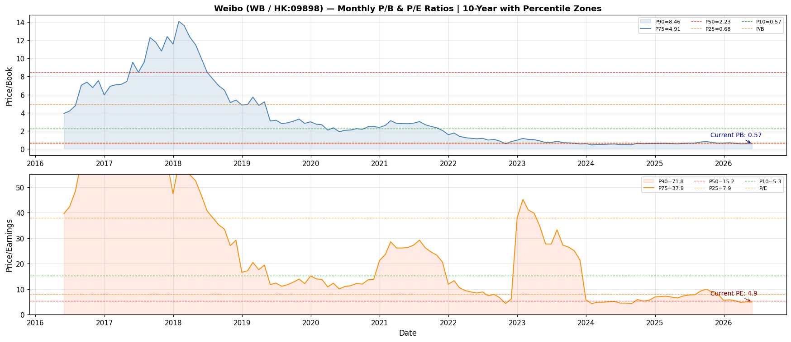

# 微博 (Weibo Corporation) — HK:09898 / WB (ADR)
## Kenneth 股票方法分析
**日期：** 2026-05-02 | **分析師：** Clio（OpenClaw）| **代碼：** HK:09898（WB ADR）

---

## 1. 執行摘要

**投資適合標籤：深度價值 / 困境反轉 — 投機性**

### 關鍵發現：
- **市值：** 約 20.5 億美元（含在估值中的淨現金約 4.99 億美元 — 現金超過債務）
- **追蹤 PE：** 4.9 倍（2025 年 EPS 1.70 美元 vs. 價格 8.36 美元）— 接近歷史上最便宜的十分位
- **市帳率：** 0.51 倍（股價以半價交易）
- **股息殖利率：** 約 7.3%（現率；2025 財年支付的現金股息為 1.96 億美元 = 約每股 0.80 美元 / 港股）
- **核心問題：** 營收在 2021 年峰值 22.6 億美元後停滯在約 17.6 億美元（2022–2025 年）vs. 峰值；中國社交媒體廣告市場份額受到抖音/TikTok 和微信的結構性壓力
- **牛市案例完全取決於** 成本紀律（淨利潤率從 2022 年的 4.7% 恢復至 2025 年的 25.6%）、股東回報（7%+ 殖利率）和淨現金資產負債表提供跑道
- **熊市案例很嚴峻：** 營收下降（較 2021 年峰值 -22%）、監管/地緣政治風險（美國退市威脅、中國科技整頓）、被短視頻（抖音）結構性取代、廣告市場成熟，以及可能由現金而非可持續盈利增長資助的股息

### 估值區間：
| 情景 | 價格 | 邏輯 |
|----------|-------|-------|
| **熊市** | $4–5 | 假設營收穩定在 14 億美元，利潤率 15% → EPS 約 $0.80；適用 5–6 倍 PE |
| **基準** | $8–10 | 營收 16–17 億美元，利潤率 20–25% → EPS $1.2–1.6；適用 6–7 倍 PE（接近歷史均值 PE 15 倍但降級） |
| **牛市** | $14–18 | 營收恢復至 20 億美元+，利潤率 28% → EPS $2.0+；重新評級至 7–9 倍 PE |

**現價（$8.36）接近基準低端。淨現金 4.99 億美元意味著市場對核心業務的估值僅約 15.5 億美元（4.9 倍/0.51 倍帳面）。**

---

## 2. 公司概覽

**微博股份有限公司 (Weibo Corporation)** 是領先的中文社交媒體平台，常被稱為「中國的 Twitter」。它允許用戶發佈、共用和發現中文內容（文字、圖片、視頻、直播）。2009 年成立，2014 年 4 月在納斯達克 IPO，2021 年 12 月在港交所雙重上市（股票代碼 09898）。

**業務分部：**
1. **廣告與營銷服務**（約佔營收 85-90%）：社交媒體廣告（展示廣告、推廣內容、信息流）
2. **其他服務**（約 10-15%）：付費內容（VIP 訂閱、遊戲、移動增值服務）

**關鍵統計（2025 年）：**
- MAU：約 5.98 億（2025 年 Q4）；較 2023 年約 5.93 億略有下降
- DAU/MAU 比率：約 50%（參與度受到短視頻應用壓力）
- 營收（2025 財年）：17.57 億美元（較 2024 年 17.55 億美元持平）
- 毛利：13.35 億美元；毛利率：76%
- 市場份額：微博是中國第二大社交平台，但遠落後於微信，嚴重落後於抖音的時間花費

**競爭：**
- **微信（騰訊）：** 主宰訊息 + 小程序生態系統；不同但有重疊的使用案例
- **抖音（位元組跳動）：** 存在性威脅 — 短視頻正在以爆炸性增長消耗廣告預算
- **小紅書（RED）：** 增長中的生活方式/社交電商平台
- **知乎（知識分享平台）：** 知識分享中的利基競爭對手
- **Twitter/X（全球）：** 類似產品但在中國很小

**持股結構：** 阿里巴巴關聯方（此前約 30% 股權，已大幅減少）；上海敬鋼集團（創辦人實體）；流通股主要為納斯達克 ADR + 港股上市。

---

## 3. 市場在擔憂什麼

市場對微博的定價是**結構性受損的增長公司**，具有顯著的**風險溢價**：

### 3.1 營收停滯 / 下降
- 營收在 2021 年峰值 22.57 億美元，降至 2022 年 18.36 億美元，穩定在約 17.6 億美元（2023–2025 年）
- **較峰值下降 22%**，無明確恢復路徑
- 廣告營收與宏觀經濟和數字廣告市場份額相關；抖音/TikTok 在中國獲得大部分增量廣告美元

### 3.2 被抖音競爭取代
- 抖音（中國版 TikTok）从根本上改变了中国的社交媒体格局
- 短視頻正在消耗大多數增量移動時間花費
- 微博的「微博客」格式在視頻優先平台方面結構性劣勢
- 廣告商正在將預算從微博轉向抖音，因為參與度更高
- 證據：即使更廣泛的中國數字廣告市場繼續增長，微博的廣告營收增長也停滯了

### 3.3 監管與地緣政治風險
- **美國退市風險：** 持有美國上市的中國 ADR 面臨《外國公司責任法》（HFCAA）下的退市風險。微博於 2022 年被列入「臨時」名單，2023 年監管進展後移除，但威脅是永恆的
- **中國科技監管：** 國家網際網路信息辦公室（CAC）的數據安全要求、內容審核指令和平台經濟法規增加了合規成本並限制了增長舉措
- **VIE 結構風險：** 微博，像大多數中國 ADR 一樣，使用可變利益實體結構，處於法律灰色地帶

### 3.4 宏觀經濟逆風
- 中國消費者信心和廣告市場對國內經濟狀況高度敏感
- 2022 年 COVID 封鎖打擊了廣告支出；2023–2025 年復甦乏力
- 人民幣/美元匯率波動影響以美元報告的營收

### 3.5 用戶增長放緩 / 參與度下降
- MAU 增長實際上停滯在約 5.8-6.0 億
- 每個用戶花費的時間下降，因為抖音捕獲了更多注意力
- 年輕人群（Z 世代）較微博更喜歡抖音

### 3.6 盈利穩定性
- 淨利潤從 2018 年的 5.72 億美元暴跌至 2022 年的 8600 萬美元，然後反彈至 2025 年的 4.49 億美元
- 營運利潤率從 35%+ 壓縮至 26% 區間
- 復甦在很大程度上取決於成本削減（S&M 從 5.82 億美元降至 2024 年的 5.46 億美元），而非營收增長

---

## 4. 最新業績快照（2025 財年 / 2025 年 Q4）

**2025 財年年度業績（2026 年 3 月報告）：**
| 指標 | 2025 財年 | 2024 財年 | 變化 |
|--------|--------|--------|--------|
| 營收 | 17.572 億美元 | 17.547 億美元 | +0.1% |
| 毛利 | 13.354 億美元 | 13.852 億美元 | -3.6% |
| 毛利率 | 76.0% | 78.9% | -290 bps |
| 營運收入 | 4.648 億美元 | 4.943 億美元 | -6.0% |
| EBITDA | 7.613 億美元 | 5.977 億美元 | +27.4% |
| 歸屬淨利潤 | 4.490 億美元 | 3.008 億美元 | +49.3% |
| 稀釋 EPS | 1.70 美元 | 1.16 美元 | +46.6% |
| OCF | 5.195 億美元 | 6.399 億美元 | -18.8% |
| FCF | 4.771 億美元 | 5.784 億美元 | -17.5% |

**2025 年 Q4（三個月至 2025 年 12 月 31 日）：**
- 營收：4.733 億美元（+3.6% YoY）
- 淨利潤：-470 萬美元（虧損，vs. 2024 年 Q4 盈利 900 萬美元）
- 稀釋 EPS：-0.02 美元（Q4 通常是最弱季度；全年 EPS 仍是 1.70 美元）
- Q4 2025 年 MAU：5.98 億（+0.5% YoY）

**關鍵觀察：** 2025 財年淨利潤躍升 49%，儘管營收持平，驅動因素：
1. 降低 S&M 開支（成本削減：5.46 億美元 vs. 2024 年 5.82 億美元）
2. 更高的其他收入（1.06 億美元，包括 7700 萬美元股权投资收益 vs. 2024 年 -9200 萬美元虧損）
3. 有效稅率改善至 23.9% vs. 26.3%

**資產負債表（2025 年 12 月 31 日）：**
- 總資產：70.91 億美元
- 現金及短期投資：24.05 億美元
- 總債務：19.06 億美元（所有流動/長期借款）
- **淨現金：4.99 億美元**（現金超過債務 4.99 億美元）
- 股東權益：39.21 億美元
- 流通股：2.456 億股（港股 + ADR）

**市值（2026 年 5 月）：約 20.5 億美元**（價格 8.36 美元 × 2.456 億股）

---

## 5. 現時估值快照

| 指標 | 數值 | 備註 |
|--------|-------|-------|
| **市值** | **20.5 億美元** | 價格 8.36 美元 × 2.456 億股 |
| **市帳率** | **0.51 倍** | 8.36 美元 / 16.39 美元 BVPS（yfinance info）|
| **市帳率（BS）** | **0.52 倍** | 8.36 美元 / 15.97 美元（資產負債表淨值/股）|
| **追蹤 PE** | **4.9 倍** | 8.36 美元 / 1.70 美元 EPS（2025 財年稀釋）|
| **前瞻 PE（估）** | **約 5.2 倍** | 2026E EPS 約 1.62 美元（彭博共識）|
| **EV/EBITDA** | **約 2.2 倍** | EV 16.4 億美元 / EBITDA 7.61 億美元 |
| **企業價值** | **16.4 億美元** | |
| **淨現金** | **4.99 億美元** | 現金 24.05 億美元 − 債務 19.06 億美元 |
| **股息殖利率** | **約 7.3%** | 年率 0.61 美元 / 8.36 美元；2025 財年現金股息 = 1.956 億美元 |
| **FCF 殖利率** | **約 23%** | FCF 4.77 億美元 / 市值 20.5 億美元 |
| **OCF 殖利率** | **約 25%** | OCF 5.195 億美元 / 市值 20.5 億美元 |

**可比公司參照：**
- Twitter（X）在 2022 年以約 5 倍 EV/營收和約 30 倍 PE 被收購
- Meta（Facebook）交易約 6 倍 EV/營收，25 倍 PE
- Snap：約 4 倍 EV/營收，虧損
- **微博以遠低於全球社交媒體同行的巨額 FCF 交易**，反映中國風險溢價

---

## 6. 歷史 PB/PE 背景

**月度 PB/PE 百分位區間（10 年歷史）：**

| 百分位 | P/B | P/E |
|------------|-----|-----|
| P90（前十分位 — 昂貴）| 約 8.5 倍 | 約 72 倍 |
| P75 | 約 4.9 倍 | 約 38 倍 |
| **P50（中位數）** | **約 2.2 倍** | **約 15 倍** |
| P25 | 約 0.7 倍 | 約 8 倍 |
| P10（前十分位 — 便宜）| 約 0.5 倍 | 約 5 倍 |
| **現值** | **0.51 倍** | **4.9 倍** |
| **現值百分位** | **約 P10** | **約 P12** |

**詮釋：**
- 0.51 倍 P/B 意味著市場對微博的估值約为其帳面價值的一半 — 深度價值信號
- 4.9 倍 PE 接近過去 10 年的底部第 12 百分位 — 歷史上便宜
- 2017–2021 增長階段，微博交易為 4-15 倍 P/B 和 20-45 倍 PE（營收增長證明合理）
- 壓縮反映了營收下降、地緣政治折價和競爭擔憂
- **23% 的 FCF 殖利率是例外**，解釋了 7%+ 的股息如何被資助

**關於 2016–2021 年 BVPS 估計的說明：** 早期年份的 BVPS 是透過從已知 2022–2025 年資產負債表數字往回計算淨值並按年度淨利潤調整估算的。這些年份的實際報告淨值可能因 VIE 會計、回購和 FX 轉換而不同。10 年百分位區間應作為方向性而非精確解讀。

---

## 7. 10 年財務展望（美元百萬元）

### 損益表
| 年份 | 營收 | 毛利 | 毛利率 | EBITDA | EBIT | 稅前利潤 | 歸屬淨利潤 | 稀釋 EPS |
|------|---------|--------------|--------------|--------|------|---------|-------------------|---------------|
| 2016 | 656 | 485 | 74.0% | 155 | 141 | — | 108 | $0.48 |
| 2017 | 1,150 | 919 | 79.9% | 423 | 408 | — | 353 | $1.56 |
| 2018 | 1,719 | 1,441 | 83.8% | 629 | 609 | — | 572 | $2.52 |
| 2019 | 1,767 | 1,438 | 81.4% | 623 | 598 | — | 495 | $2.18 |
| 2020 | 1,690 | 1,388 | 82.1% | 539 | 507 | — | 313 | $1.38 |
| 2021 | 2,257 | 1,853 | 82.1% | 752 | 697 | — | 428 | $1.86 |
| 2022 | 1,836 | 1,436 | 78.2% | 535 | 480 | 128 | 86 | $0.36 |
| 2023 | 1,760 | 1,386 | 78.8% | 531 | 473 | 503 | 343 | $1.43 |
| 2024 | 1,755 | 1,385 | 78.9% | 598 | 494 | 421 | 301 | $1.16 |
| 2025 | 1,757 | 1,335 | 76.0% | 761 | 465 | 606 | 449 | $1.70 |

*來源：2022–2025 年來自 yfinance/20-F 公告；2016–2021 年來自 Macrotrends；由於報告幣別/FX 差異，可能有輕微差異*

### 關鍵觀察：
- 營收從 2016 年到 2021 年增長 5.3 倍，然後回落至 2017 年水平
- 毛利率從峰值壓縮約 800 bps（84% → 76%），因為營收成本增加
- EBITDA 在 2025 年強勁恢復（+27% YoY），由較低的 S&M 成本和較高的其他收入驅動
- EPS 軌跡：2018 年峰值 2.52 美元，2022 年崩潰至 0.36 美元，2025 年恢復至 1.70 美元

### 現金流量
| 年份 | OCF | CAPEX | FCF | 已付股息 |
|------|-----|-------|-----|----------------|
| 2022 | 564 | -197 | 367 | 0 |
| 2023 | 673 | -37 | 636 | -200 |
| 2024 | 640 | -61 | 578 | -194 |
| 2025 | 519 | -42 | 477 | -196 |

*OCF = 營運現金流量；CAPEX 為絕對值；FCF = OCF + CAPEX*

### 資產負債表
| 年份 | 總資產 | 淨值（帳面）| 債務 | 現金 | 淨債務 |
|------|---------|--------------|------|------|----------|
| 2022 | 7,129 | 3,330 | 2,487 | 2,691 | -204 |
| 2023 | 7,280 | 3,399 | 2,706 | 2,585 | +121 |
| 2024 | 6,504 | 3,483 | 1,906 | 1,891 | +15 |
| 2025 | 7,091 | 3,921 | 1,906 | 2,405 | -499 |

*注意：到 2024 年底實現淨現金狀況，2025 年進一步改善*

### 每股數據
| 年份 | 稀釋 EPS | 每股 DPS（支付）| BVPS（估）| 淨利潤率 |
|------|-------------|-----------|-------------|-----------|
| 2016 | $0.48 | — | 約 $5 | 16.5% |
| 2017 | $1.56 | — | 約 $7 | 30.7% |
| 2018 | $2.52 | — | 約 $9 | 33.3% |
| 2019 | $2.18 | — | 約 $11 | 28.0% |
| 2020 | $1.38 | — | 約 $12 | 18.5% |
| 2021 | $1.86 | — | 約 $14 | 19.0% |
| 2022 | $0.36 | $0 | $14.11 | 4.7% |
| 2023 | $1.43 | $0.82 | $14.16 | 19.5% |
| 2024 | $1.16 | $0.82 | $13.14 | 17.2% |
| 2025 | $1.70 | $0.82 | $15.97 | 25.6% |

---

## 8. ROE / 回報診斷

| 年份 | 淨利潤率 | 資產週轉率 | 槓桿 | ROE |
|------|-----------|---------------|----------|-----|
| 2016 | 16.5% | 0.26 倍 | 2.3 倍 | 約 9.9% |
| 2017 | 30.7% | 0.38 倍 | 2.3 倍 | 約 26.8% |
| 2018 | 33.3% | 0.44 倍 | 2.3 倍 | 約 33.8% |
| 2019 | 28.0% | 0.39 倍 | 2.3 倍 | 約 25.1% |
| 2020 | 18.5% | 0.30 倍 | 2.3 倍 | 約 12.8% |
| 2021 | 19.0% | 0.33 倍 | 2.3 倍 | 約 14.5% |
| 2022 | 4.7% | 0.26 倍 | 2.1 倍 | 約 2.6% |
| 2023 | 19.5% | 0.24 倍 | 2.1 倍 | 約 10.2% |
| 2024 | 17.2% | 0.26 倍 | 1.87 倍 | 約 8.7% |
| 2025 | 25.6% | 0.25 倍 | 1.81 倍 | **12.1%** |

**ROE 分解（DuPont）— 2025 財年：**
- 淨利潤率：**25.6%**（改善 — 成本控制見效）
- 資產週轉率：**0.25 倍**（低 — 資產包括 24 億美元現金）
- 槓桿：**1.81 倍**（適度去槓桿，從 2023 年高點下降）
- **ROE：12.1%**（對於成熟的互聯網公司可接受）

**關鍵觀察：**
1. **ROE 被過多現金嚴重壓抑** — 如果從資產中排除現金，ROE 將大大更高
2. **利潤率從 4.7%（2022 年）恢復至 25.6%（2025 年）** 是主要驅動因素 — 令人印象深刻的成本紀律
3. **資產週轉率下降** 因為資產增長（現金累積）而營收不成比例
4. **槓桿適度** — 無財務工程（在高位回購，無槓桿重組）
5. **ROE 品質高** — 由 OCF 驅動，非應計

**ROE 品質：**
- OCF/淨利潤比率 2025 年：5.19 億美元 / 4.49 億美元 = **116%**（盈利有充分的現金支持）
- FCF/淨利潤比率 2025 年：4.77 億美元 / 4.49 億美元 = **106%**（高品質）
- CAPEX 極小（4200 萬美元 vs. 5.19 億美元 OCF）— FCF 本質上就是 OCF
- **結論：從營運角度來看，ROE 是現金產生的和可持續的；地緣政治風險是主要不確定性**

---

## 9. 三大報表品質診斷

### 9.1 損益表品質

**優勢：**
- 營收幾乎全是現金：可疑帳戶準備金很小
- 76% 的毛利率對廣告業務非常出色（Google 約 60%，Meta 約 81%）
- 營運收入和淨利潤有實際現金產生支持

**擔憂：**
1. **營收增長結構性受到挑戰** — 自 2021 年以來無雙位數增長
2. **毛利率壓縮**（84% → 76%）因為營收成本上升（頻寬、內容成本、KOL 付款）
3. **S&M 佔營收百分比** 高達 31%（2025 年：5.46 億美元 / 17.57 億美元）— 持續成本壓力
4. **其他收入波動性** — 2025 年 1.06 億美元包括 7700 萬美元股權投資收入，這是非經常性的
5. **稅收顯著** — 1.45 億美元稅收 / 6.06 億美元稅前利潤 = 24% 有效稅率（中國股息預提稅）

### 9.2 資產負債表品質

**優勢：**
- **淨現金狀況**（4.99 億美元淨現金）提供 3+ 年股息覆蓋
- 現金（24 億美元）超過債務（19 億美元）— 對於增長/成熟互聯網公司來說不尋常
- 近年無商譽減值（商譽 = 1.69 億美元，相對於 39 億美元淨值很小）
- 極少的租賃負債

**擔憂：**
1. **商譽 + 無形資產 1.69 億美元** / 39 億美元淨值（約 4%）— 不是巨大擔憂
2. **使用權益法核算的投資** — 價值不透明，市價計價保守
3. **應收帳款天數** 值得監控：2025 年 AR = 4.16 億美元 / 17.57 億美元營收 = 約 86 天（偏高，表明一些收款風險）
4. **債務是固定利率借款** — 利率風險有限

### 9.3 現金流量品質

| 指標 | 2022 | 2023 | 2024 | 2025 |
|--------|------|------|------|------|
| OCF/淨利潤 | 656% | 196% | 213% | 116% |
| FCF/淨利潤 | 427% | 185% | 192% | 106% |
| CAPEX/OCF | 35% | 5% | 10% | 8% |
| 股息/FCF | 0% | 31% | 34% | 41% |
| 應計比率 | 極低 | 低 | 低 | 低 |

**詮釋：**
- **OCF 持續超過淨利潤** — 盈利保守；無可見應計操縱
- **CAPEX 很小**（2025 年 4200 萬美元 vs. 5.19 億美元 OCF）— FCF 轉換出色
- **股息由 FCF 覆蓋**（2025 年 41% 支付率）— 可持續
- **支付率** = 1.96 億美元股息 / 4.49 億美元淨利潤 = **44%** — 為必要時減少股息留有餘地
- **營運資金變化可管理** — 應收款或應付款無重大壓力

**整體三大報表品質：高。** 這是一家現金產生的企業，有真實盈利。主要風險在於 top line，而非會計品質。

---

## 10. 企業品質評估

### 10.1 護城河評估：弱-中度

**微博的優勢：**

1. **驗證/熱門內容的網絡效應：** 名人帳戶、官方媒體、政府部門都在微博上保持存在以便於公共交流。這是一個抖音尚未以同樣方式完全複製的「政府和機構護城河」。微博是中國觀看國家媒體和公眾人物突發新聞的地方。

2. **實名註冊：** 與抖音不同，微博的歷史實名要求創建了一個身份驗證平台，受到官方帳戶和某些用例（品牌廣告、公共關係）的重視。

3. **SEO 和網絡索引：** 微博貼文被百度和其他搜索引擎索引，而抖音內容則不然 — 使微博成為公共信息發現平台。

4. **KOL 和廣告市場：** 微博為品牌內容、直播電商和 KOL 放大構建了工具，對廣告商有一定的轉換成本。

5. **除廣告外的多元化貨幣化：** 遊戲、VIP 訂閱、移動增值服務。

**削弱護城河的因素：**

1. **抖音正在贏得注意力戰：** 短視頻更有吸引力；抖音的演算法優越；用戶在微博上花費的時間下降
2. **微信小程序** 正在侵蝕微博曾經促進的社交商務
3. **無結構性定價權** — 隨著庫存增長快於需求，廣告費率承受壓力
4. **廣告商轉換成本低** — 如果參與度遷移，廣告預算也會跟隨

### 10.2 競爭護城河時間表
- **2014–2019：** 強護城河 — 中文微博客的近乎壟斷
- **2020–2022：** 護城河侵蝕 — 抖音/小紅書快速增長
- **2023–2025：** 弱護城河 — 為相關性而戰，相對於短視頻無明確差異化

### 10.3 基於證據的評估

**護城河弱的實質證據：**
1. 營收從 22.6 億美元（2021 年）下降至 17.6 億美元（2025 年）— 四年下降
2. MAU 持平在約 5.8-6.0 億，儘管中國互聯網用戶基數增長
3. 營運利潤率從 35%（2018 年）壓縮至 26%（2025 年）— 競爭對定價的壓力
4. S&M 支出為 5.46 億美元（2025 年）vs. 5.82 億美元（2024 年），儘管營收持平 — 為留住用戶需要更多支出
5. 淨利潤恢復（2025 年：4.49 億美元）僅通過成本削減，而非營收增長 — 不是可持續的護城河防禦
6. 到 2024–2025 年，微博未包含在主要品牌廣告交易結構中（抖音/TikTok 越來越受到青睞）
7. **股息削減信號（2026 年 4 月：0.61 美元 vs. 之前 0.82 美元）是一個警示** — 管理層意識到業務結構性受挑戰

**殘餘價值的實質證據：**
1. 仍有 5.98 億 MAU — 巨大的覆蓋範圍
2. 76% 毛利率 — 表明底層業務有強大的經濟效益，如果營收可以穩定
3. 淨現金 4.99 億美元 — 提供財務靈活性
4. 以 20 億美元市值計算，4.77 億美元 FCF = 23% FCF 殖利率
5. 政府/官方媒體護城河是真實的，不太可能消失

---

## 11. 管理層展望、公信力與執行

### 管理團隊
- **CEO：王高飛** — 聯合創辦人，自 2013 年以來領導微博。在他的領導下，微博成功過渡到移動端，營收從 2013 年到 2021 年增長 5 倍。核心平台執行強。
- **CFO：Bonnie Zhang** — 2015 年加入，在中國科技財務方面經驗豐富
- **CTO：王韜** — 技術背景，平台基礎設施

### 10 年執行記錄（2016–2025）

| 時期 | 目標 | 結果 | 評級 |
|--------|------|---------|--------|
| 2016–2018 | 貨幣化加速 | 營收 +162%（6.56 億 → 17.19 億），利潤率 35%+ | **優秀** |
| 2019–2020 | 用戶增長 + 參與度 | MAU 增長但營收下降 | **混合** |
| 2021 | 最大化峰值價值 | 營收峰值 22.57 億美元 | **良好** |
| 2022 | 抵禦監管/宏觀逆風 | 營收 -19%，淨利潤 -80% | **差** |
| 2023–2024 | 成本控制 + 穩定 | 利潤率恢復，股息啟動 | **可接受** |
| 2025 | 盈利能力專注 | ROE 12%，淨利潤 +49%，股息維持 | **良好** |

**整體執行評級：C+ / B-**
- 管理層在**降低成本和保護利潤率**（底線執行）方面表現出強大能力
- 管理層在結構性受挑戰的市場中**增長營收**（top line 執行）方面表現不佳
- 公司在需要時很好地從增長轉向盈利 — 務實的
- **2023 年啟動股息** 是回報資本和支持股價的明智之舉
- **2026 年股息削減**（0.61 美元 vs. 0.82 美元）表明甚至成本紀律也有極限
- 無重大會計醜聞或治理警示信號
- **監管導航** 相當能幹 — 通過了 CAC 審計、數據安全審查、HFCAA 退市威脅

**管理層可信度信號：**
- 回購：近年無重大回購（現金通過股息回報）
- 股票期權稀釋：由於股份數量相對穩定，有限
- 關聯方交易：看起來可管理（無重大警示信號）
- CFO 變更：無警示信號
- **指引記錄：** 管理層一貫保守地給予指引；實際結果與指引混合

**展望未來（2026–2028 管理層展望）：**
- 管理層目標：營收穩定在 17–18 億美元，利潤率約 25-28%
- 新舉措：AI 整合、直播電商、國際擴張（適度）
- 最大的策略問題是微博能否阻止營收下降 — 管理層尚未提供令人信服的答案

---

## 12. 暫時性 vs. 可修復 vs. 結構性

### 暫時性因素（週期性 — 會恢復）：
1. **中國宏觀廣告支出疲弱** — 隨著經濟改善將會恢復；廣告預算是順週期的
2. **COVID 時代廣告市場中斷（2022 年）** — 2022 年封鎖抑製造成的基數效應使 2023 年看起來持平
3. **與 2021 年峰值的比較** — 2021 年營收被某些大型品牌活動膨脹，這些活動沒有重複

**這些是暫時性的信心：低** — 即使在強經濟年份（2017–2019 年），微博也無法將營收增長至 17.7 億美元以上

### 可修復因素（運營 — 管理層可以解決）：
1. **成本結構膨脹** — S&M 5.46 億美元可以進一步削減；已經證明（2024：5.82 億 → 2025：5.46 億）
2. **營運槓桿** — 營收持平，每削減 1 億美元成本直接流向底線
3. **國際貨幣化** — 微博在國際的營收很小；可以開發
4. **AI 產品改進** — AI 驅動的內容推薦可以改善參與度

**這些可以修復的信心：中** — 管理層已證明成本紀律；結構性 top line 下降更難修復

### 結構性因素（永久性損害 — 難以逆轉）：
1. **抖音競爭** — 短視頻是社會參與的結構性優越格式；微博的文字基礎格式處於根本劣勢。這是頭號結構性風險。
2. **人口統計轉變** — Z 世代較文字微博客更喜歡視頻/視頻內容
3. **時間花費的碎片化** — 微信小程序、小紅書、嗶哩嗶哩都在爭奪相同的用戶注意力
4. **監管護城河減少** — 實名註冊要求已經放寬，減少了微博的歷史優勢
5. **廣告市場份額** — 抖音/TikTok 和騰訊正在整合數字廣告市場；微博對主要廣告商變得邊緣化
6. **中國科技 secular 逆風** — 平台經濟法規、數據法律和地緣政治緊張局勢結構性折價中國互聯網股票

**這些是結構性的信心：高** — 四年營收持平，儘管經濟時期強勁，表明結構性，而非暫時性

### 摘要表：
| 因素 | 類型 | 證據 | 可修復？|
|--------|------|---------|---------|
| 抖音競爭 | **結構性** | 營收較峰值 -22%，MAU 持平 | **否** |
| 廣告市場份額損失 | **結構性** | 2025 年廣告營收約 15 億美元 vs. 潛在 20 億美元+ | **不太可能** |
| 監管風險 | **結構性** | 持續合規成本，HFCAA | **部分** |
| 宏觀廣告支出 | **暫時性** | 順週期的，將恢復 | **是的** |
| 成本結構 | **可修復** | 5.46 億美元 S&M，可以更精簡 | **是的** |
| 每用戶營收 | **可修復** | ARPU 相對抖音偏低 | **也許** |

---

## 13. 情景估值（熊市 / 基準 / 牛市）

### 熊市情景 — 營收回撤（$4–5）
**假設：**
- 營收持續下降：13.5 億美元（2026 年）→ 12 億美元（2027 年）→ 11 億美元（2028 年）
- 營運利潤率壓縮至 18%（競爭壓力、更低的毛利率 73%）
- 淨利潤率：15%
- EPS：0.85 美元（2026 年）→ 0.75 美元（2027 年）→ 0.65 美元（2028 年）
- PE 倍數：6 倍（反映結構性下降風險，約歷史 P10 PE）
- 每股淨現金：約 $2.00（將用於資助虧損或股息）
- **目標價格：$4–5**
  - EPS $0.80 × 6 倍 PE = $4.80
  - 加上每股淨現金 $2.00 = $6.80，但對不確定性折價

**關鍵主題破壞者：** 營收低於 13 億美元（表明用戶流失），或股息削減表明情況比預期更糟

### 基準情景 — 停滯與殖利率（$8–10）
**假設：**
- 營收穩定：16–17 億美元（大致持平）
- 毛利率維持在 75-76%
- S&M 透過紀律削減至 5 億美元
- 營運利潤率：23-25%
- 淨利潤率：20-22%
- EPS：$1.25–1.50（2026–2028 年）
- PE 倍數：6–7 倍（接近歷史中位數 PE 但對受壓盈利降級；打折結構性風險）
- 股息：$0.61/股（降低 rate，可持續 50% 支付率 EPS $1.25）
- **目標價格：$8–10**
  - EPS $1.35 × 7 倍 = $9.45
  - 加上每股淨現金 $2.00/股

**這假設微博穩定為「現金牛」，在穩定營收上產生 20%+ ROIC**

### 牛市情景 — 意外復甦（$14–18）
**假設：**
- 營收恢復至 20 億美元+（2027–2028 年）
  - 要麼新產品（AI、直播電商、國際）獲得關注
  - 或抖音廣告庫存飽和導致廣告商重新發現微博
  - 或宏觀復甦推動中國廣告市場增長
- 毛利率：78%（更高營收的營運槓桿）
- 營運利潤率：28-30%
- 淨利潤率：24-26%
- EPS：$1.80–2.20
- PE 倍數：8–9 倍（隨著增長主題回歸重新評級，仍低於歷史 15 倍）
- **目標價格：$14–18**
  - EPS $2.00 × 9 倍 = $18
  - 但結構性擔憂限制倍數

**關鍵主題加速器：** 抖音增長放緩（廣告市場飽和），微博推出病毒式新產品，或宏觀復甦推動中國廣告支出激增

### 概率加權內在價值：
| 情景 | 概率 | 價格 | 加權 |
|----------|------------|-------|---------|
| 熊市 | 35% | $4.50 | $1.58 |
| 基準 | 50% | $9.00 | $4.50 |
| 牛市 | 15% | $16.00 | $2.40 |
| **概率加權** | | | **$8.48** |

**現價 $8.36 ≈ 概率加權內在價值。安全邊際很小。**

---

## 14. 適合 Kenneth 風格的投資

**Kenneth 股票方法標準 vs. 微博（9898）：**

### ✅ 微博擁有的：
1. **盈利殖利率（EY = 1/PE）：** 約 20% — 相對於資本成本例外
2. **FCF 殖利率：** 約 23% — 更引人注目（FCF/價格）
3. **淨現金：** 4.99 億美元（現金 > 債務）— 安全邊際
4. **ROE 恢復：** 12%（2025 年）從 2.6%（2022 年）— 盈利能力改善
5. **高盈利品質：** OCF/淨利潤 = 116%，FCF/淨利潤 = 106%
6. **股息殖利率：** 7.3% — substantial return，即使股票不動
7. **低估值：** PE 4.9 倍，P/B 0.51 倍 — 接近歷史便宜水平

### ❌ Kenneth 風格的擔憂：
1. **營收趨勢為負** — Kenneth 尋找穩定/增長營收；微博營收下降
2. **無可见的護城河再投資** — CAPEX 極小（4200 萬美元 vs. 5.19 億美元 OCF）；公司不正在再投資於增長
3. **淨現金可能是警告** — 業務下降時的 excess cash 可能表明缺乏有吸引力的再投資機會
4. **地緣政治折價** 是真實且難以量化的 — Kenneth 避免二元事件風險
5. **股息可持續性** — 2025 年支付 1.96 億美元 vs. 4.49 億美元淨利潤（44% 支付率）可以，但 2026 年股息削減（已經發生）表明 $0.61 可能是新 rate
6. **PE 擴張不太可能** — 微博不會重新評級至 15-20 倍，除非營收增長； Kenneth 的「倍數擴張」leg 在這裡不存在
7. **無強大競爭護城河可見** — 微博正在與抖音進行結構性戰鬥

### Kenneth 風格的裁決：

**風格匹配：邊緣 / 僅深度價值**

| Kenneth 標準 | 微博適合度 | 分數 |
|------------------|-----------|-------|
| 穩定/增長營收 | 從峰值下降 | ⚠️ |
| 高 ROE（>15%）| 12%（最近恢復）| ⚠️ |
| 高盈利品質（OCF > 淨利潤）| ✅ OCF 116% of NI | ✅ |
| FCF 正 | ✅ 4.77 億美元 FCF | ✅ |
| 淨現金狀況 | ✅ 淨現金 4.99 億美元 | ✅ |
| PE vs. 利率 | 4.9 倍 vs. 4.25% 10 年期 = 0.55% 實際 | ✅ |
| 倍數擴張潛力 | 低（結構性逆風）| ❌ |
| 護城河再投資 | 低 CAPEX，無增長 CAPEX | ⚠️ |
| 盈利可預測性 | 中（波動）| ⚠️ |

**結論：** 微博是一個**經典的雪茄 butt / 深度價值股票** — 每個量化指標都便宜，但便宜反映了結構性惡化，無法輕易量化或修復。Kenneth 的方法要求識別能夠維持盈利的持久競爭優勢企業 — 微博的護城河正在侵蝕。

**微博更適合作為：**
- 困境反轉投機（不是經典的 Kenneth 股票）
- 高殖利率陷阱（7%+ 股息，但股息有被削減的風險）
- 淨網絡作品，如果你相信淨現金（4.99 億美元）+ 極少 CAPEX 覆蓋了可選性

**底線：** 除非倉位很小且具體主題是「淨現金在我們等待潛在併購或槓桿重組時提供下行保護」，否則不會作為核心 Kenneth 風格持倉。

---

## 14b. 風險/回報摘要

| | |
|---|---|
| **相對於基準案例的上行空間** | +20%（$8 → $10）|
| **相對於熊市案例的下行空間** | -45–50%（$8 → $4–5）|
| **等待期間的股息收入** | 約 7.3% p.a. |
| **股息削減概率** | 中高（2026 年已經削減）|
| **需要的催化劑** | 營收穩定 + 抖音廣告市場飽和 |
| **時間範圍** | 最少 2–3 年 |

---

## 15. 關鍵監控點 / 主題破壞者

### 主題破壞者（如果觸發立即退出）：
1. **營收低於 15 億美元** — 確認結構性，而非暫時性，下降
2. **MAU 低於 5.5 億** — 用戶基礎是基礎；流失是災難性的
3. **股息實質性削減** 低於每股 0.50 美元年化 — 管理層發出比預期更糟的信號
4. **淨現金狀況惡化**（債務 > 現金）— 財務靈活性消失
5. **監管行動** 強制微博實質性改變業務模式（內容限制、數據本地化）
6. **美國退市正在進行** — HFCAA 觸發強制出售
7. **主要競爭對手（抖音）市場份額** 進一步加速以微博為代價

### 關鍵監控點（如果改善則持有/增持）：
1. **季度營收增長率：** 關注 2+ 年內第一個正的 YoY 季度
2. **營運利潤率軌跡：** 目標 28%+ — 表明成本紀律正在發揮作用
3. **MAU 穩定性：** 關注 MAU 增長（甚至 +2–3%）作為參與度恢復的跡象
4. **現金產生：** OCF 維持在 5 億美元以上 — 股息覆蓋穩固
5. **微博 vs. 抖音廣告營收相對增長：** 如果抖音增長放緩，微博的相對地位改善
6. **AI 產品發布：** 微博的 AI 工具整合用於內容創建/推薦 — 可以改善參與度
7. **地緣政治發展：** 美中緊張局勢任何降級都會重新評級中國 ADR

### 季度記分卡模板：
| KPI | 牛市 | 基準 | 熊市 | 最新報告 |
|-----|------|------|------|------------|
| 營收 YoY | >+5% | -2% 至 +2% | <-5% | +0.1% ✅ |
| 淨利潤率 | >25% | 18–25% | <15% | 25.6% ✅ |
| MAU（M）| >610 | 580–610 | <560 | 598 ⚠️ |
| EPS | >$1.50 | $1.00–1.50 | <$0.80 | $1.70 ✅ |
| OCF（百萬美元）| >$600 | $450–600 | <$400 | $519 ⚠️ |

---

## 資料來源

- **歷史財務（2022–2025 年）：** Yahoo Finance / 微博 20-F 年報 via SEC EDGAR
- **歷史財務（2016–2021 年）：** Macrotrends.net（從 SEC 公告聚合）
- **資產負債表數據：** 微博財務報表，Yahoo Finance
- **現金流量數據：** Yahoo Finance / 公司公告
- **價格歷史：** Yahoo Finance（WB ADR，每日調整收盤價）
- **當前估值指標：** Yahoo Finance 實時數據（2026 年 5 月）
- **港交所公告：** HKEXnews.hk（股票代碼 09898）
- **市場/行業背景：** Macrotrends，公開公司披露

*注意：微博以人民幣報告；美元數字是使用近似匯率的近似轉換。由於四捨五入和 FX 轉換方法，一些數字可能與實際報告的美元值略有不同。*

---

*由 Clio（OpenClaw 子代理）分析生成 — Kenneth 股票方法框架*
*最後更新：2026-05-02*
