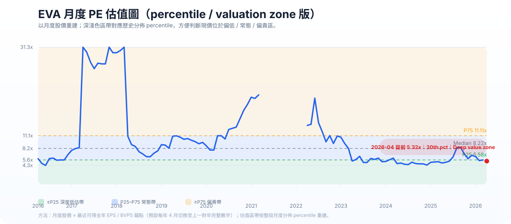
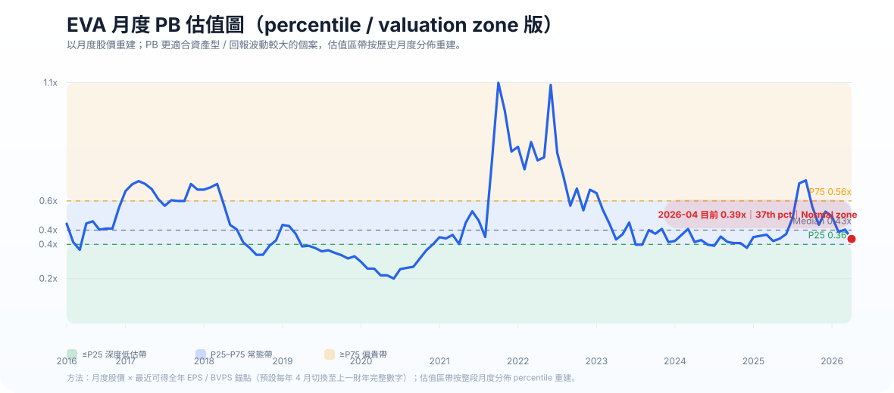

# 億和控股（838.HK）分析報告

- 公司：億和精密工業控股有限公司 / EVA Precision Industrial Holdings Limited
- 代號：838.HK
- 方法：Kenneth stock method
- 語言：中文
- 股價基準：HK$0.75（2026-04-30）

## 簡版結論

億和控股（838.HK）在 Kenneth stock method 下，我會定性為：**有真修復內容的低估股**。

它不是高質長線複利股，但也不像純 value trap。傳統 OA（辦公室自動化）業務面對結構壓力，但汽車零部件和 ICT 新業務增長是真實的；資產負債表仍可承受，現價估值偏低，因此屬於可研究、可分注的修復 / 轉型型價值股。

### 簡版投資判斷
- 質素評級：中等
- 投資類型：修復 / 轉型型價值股
- 非高質複利股
- 現價仍有值博率，但不是極端失真級別的大平賣

### 簡版估值觀點
- 現價 HK$0.75 不算貴
- HK$0.65 以下吸引力更強
- HK$0.75 左右可研究 / 分注
- HK$1.00 以上要再看盈利驗證才適合追

---

## 完整版報告

### 1. 結論先講

用 Kenneth stock method 去看，**億和控股（838.HK）我會定性為：**

**「有真修復內容的低估股」**，
**不是高質長線複利股，但也不似純 value trap。**

如果一句講完：
**傳統 OA 業務有結構壓力，但汽車零部件 + ICT 新業務增長真實，資產負債表頂得住，估值仍偏平。**

### 2. 最新快照（按 2025 年報 + 2026-04-30 股價）

2025年：
- 收入：HK$6,027.8m
- 毛利：HK$1,346.6m
- 毛利率：22.3%
- EBIT：HK$363.8m
- 股東應佔溢利：HK$244.6m
- EPS：14.1 港仙
- 現金及現金等價物：HK$1,597.4m
- 銀行借款：約 HK$2,163.8m
- 股東權益：HK$3,334.8m
- 每股 NAV：約 HK$1.93

以現價 HK$0.75 計：
- 市值：約 HK$1.30b
- PE：約 5.3x
- PB：約 0.39x
- 股息（2025全年 4.24仙）息率：約 5.7%
- EV：約 HK$1.87b
- EV/EBIT：約 5.1x

第一眼：**估值不貴，甚至算平。**

### 3. 市場擔心什麼

市場主要擔心三樣：

1. **OA（辦公室自動化）業務轉弱**
   - 2025 年 OA 收入跌 14.4% 至 HK$3,502.4m
2. **傳統製造業沒有強 moat，容易受客戶轉單、關稅、地緣政治影響**
3. **雖然有盈利，但長期 ROE 不高，市場不願給高估值**

這些擔心是有根據的，不是市場亂驚。

### 4. 但好消息是：不是全線轉差

2025年另外兩條腿其實幾實在：
- **汽車零部件收入 +9.6%** 至 HK$2,136.2m
- **ICT 收入 +50.5%** 至 HK$389.2m

即是說：
- OA 真係弱
- 但汽車 + ICT **不是故事，而是已經反映在數字**

所以億和而家最重要不是「OA 仲得唔得」，
而是：**新業務增長，能不能快過舊業務下滑。**

### 5. 10年視角：有增長，但未完全轉化成高質價值

2016 → 2025：
- 收入：32.1億 → 60.3億，CAGR 約 7.3%
- 股東權益：25.9億 → 33.3億，CAGR 約 2.9%
- EPS：2.9仙 → 14.1仙
- 中間 2020 年曾錄得股東應佔虧損

重點解讀：
- 規模有擴大
- 盈利能力近幾年明顯比早年好
- 但**股東權益增長不算快**
- 即是：**收入增長不等於高質地轉化成每股內在價值增長**

所以它不是典型高 ROE compounder。

### 6. ROE / DuPont 判斷

2025 年 ROE：7.3%

拆開看，大概是：
- 淨利率：約 4.1%
- 資產周轉：中等
- 槓桿：有，但不算失控，而且近年在下降

即是：
- 億和現在的 ROE **不是靠極端槓桿谷出來**
- 但也**未強到足以支持高估值**

所以 ROE 結論：**比以前穩，但仍然只屬中等回報企業。**

### 7. 三表質素：比預期好

正面位：
- 2025 經營現金流：HK$707.0m
- 明顯高過股東應佔盈利 HK$244.6m
- 公司持續減債
- 淨負債對股本比率降至 14.1%

要留意：
- 存貨週轉日數由 48 天升到 63 天
- 應收週轉日數由 104 天升到 107 天
- 流動比率跌至 1.36
- 即是營運資金仍然食錢，只是未去到危險

整體：**現金流質素合格以上，資產負債表頂得住。**

### 8. 業務質素判斷

我會給：**業務質素 = Neutral（中性）**

原因：
- 沒有明顯強 moat
- 受客戶結構、產能利用率、宏觀周期影響大
- 但有幾個真優勢：
  - 多地產能布局（中國 / 越南 / 墨西哥）
  - 汽車、ICT 轉型不是紙上談兵
  - 精密製造、模具、焊接、組裝一體化能力有一定門檻

所以它不是普通殼式平股，
但也未去到「可以閉眼揸10年」那種。

### 9. 管理層可信度

評級：
- 方向判斷：中上
- 盈利轉化能力：中等
- 整體管理層可信度：fair / neutral-to-positive

原因：
- 管理層近年一直講 diversification 去汽車、ICT
- 回看 2025，這兩塊確實有交數
- 同時也有減債、改善盈利質素

但保留：
- OA 下滑仍然幾重
- 長期整體回報率未算高
- 即是**方向不錯，但未證明自己是頂級資本配置者**

### 10. 問題分類：temporary / fixable / structural

我會這樣分：
- **OA 傳統業務壓力：部分結構性**
- **汽車零部件增長：中期可持續**
- **ICT / 服務器 / 新應用：可修復兼可成長**
- **財務壓力：可控，不是核心雷**

所以億和不是簡單「等周期返來就贏」，
而是：**舊業務有結構壓力，新業務要跑得夠快先得。**

### 11. 估值判斷

**歷史 PB（粗略以 2016–2025 年底計）**
- 大概範圍：0.35x – 0.90x
- 中位數：約 0.49x

現價 PB 0.39x：
- 接近歷史低端
- 但未是絕對最低

**歷史 PE（正盈利年份）**
- 近五年大概中位數約 6.6x
- 現價 PE 5.3x，屬偏低端

即是：**估值平是真，但平背後有原因。**

### 11A. 月度估值圖表（正式版：monthly percentile / valuation zone）

**點睇：**
- 現價 PE 約 **5.3x**，大概喺歷史月度分佈 **20th percentile**，屬偏低區
- 現價 PB 約 **0.39x**，大概喺歷史月度分佈 **37th percentile**，屬低-normal 區，不算極端錯殺
- 即是 EVA 而家係 **平，但未去到市場完全唔信佢** 的最恐慌位

**方法說明：** 用 **2016-04 至 2026-04 月度股價** 重建估值圖；EPS / BVPS 用最近可得全年年報錨點，並假設每年 **4 月起切換至上一財年完整數字**。圖內再用歷史月度分佈標示 **P25 / Median / P75** 同估值 zone，方便區分「偏低」「常態」同「偏貴」。

### 12. Bear / Base / Bull

**Bear**
- OA 繼續縮
- 汽車 / ICT 增長不足以填補
- EPS 回落到 10–11 仙
- 估值只值 4.5–5x PE / 0.30–0.35x PB
- 股價大概：HK$0.45–0.60

**Base**
- OA 繼續弱，但汽車 + ICT 穩步頂住
- EPS 維持 13–15 仙
- 估值 6–7x PE / 0.40–0.50x PB
- 合理值：約 HK$0.80–1.05

**Bull**
- ICT / 機器人 / 汽車訂單上得更順
- OA 跌幅收窄甚至穩住
- EPS 去到 16–18 仙
- 估值回到 7.5–9x PE
- 股價：約 HK$1.20–1.45

### 13. 最後判斷

我會這樣落結論：

**億和控股 = 可以研究、可以守紀律買的修復型價值股。**

但要記住它不是：
- 高質複利股
- 超強 moat 股
- 閉眼長揸型核心持倉

它比較像：
- 有資產支持
- 有真轉型進展
- 估值仍偏平
- 但要持續驗證新業務能否抵消舊業務結構下滑

所以我偏正面，但屬於**審慎正面**。

如果以現價 HK$0.75：
- 我覺得未算貴
- 但如果要說是「超深度失真大平賣」，又未必去到最誇張

我會傾向：
- **HK$0.65 以下吸引力更強**
- **HK$0.75 左右仍可研究 / 分注**
- **上到 HK$1.00 以上就要看盈利驗證才再追**

---

## 主要依據（摘要）

- 2025 年報：收入 HK$6,027.8m；股東應佔溢利 HK$244.6m；EPS 14.1仙；股東權益 HK$3,334.8m；現金 HK$1,597.4m
- 2025 分部收入：OA HK$3,502.4m；汽車零部件 HK$2,136.2m；ICT HK$389.2m
- 10年財務回顧：2016–2025 annual reports
- 市價：Yahoo Finance 10年價格序列，2026-04-30 約 HK$0.75

## 保存規格

- 路徑：`analysis/`
- 格式：簡版結論 + 完整版報告
- 命名：`公司英文簡稱_公司中文名_report_cn.md`
