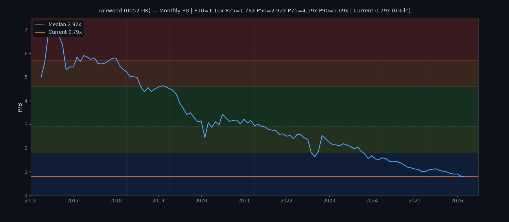
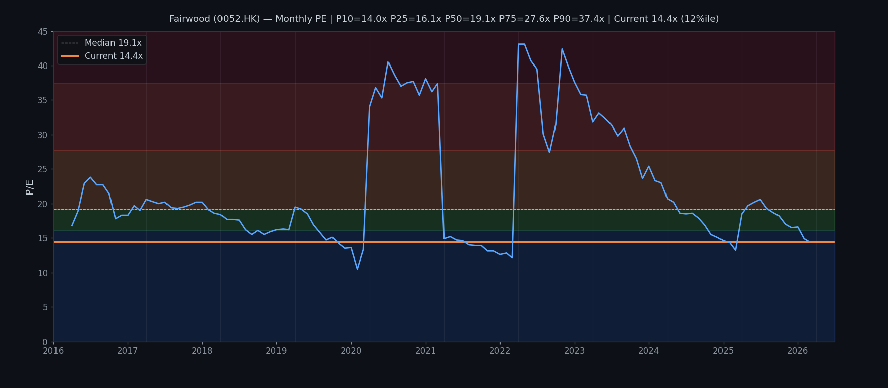

# 大快活集團有限公司 Fairwood Holdings (0052.HK)
## Kenneth Stock Method 分析報告
**日期：2026年5月1日　股價：HK$3.96（前收：2026-04-30）**

---

## 📌 執行結論（Short Conclusion）

**結論標籤：attractive deep value / turnaround speculative**

大快活現價 HK$3.96，FY2025 EPS 27.43港仙 → **現價 PE 約 14.4x**；NAV/Share HK$5.032 → **PB 只有 0.79x**，處於10年PB區間的最低位。收入橫向停滯（FY2025 的 HK$31.0億與 FY2016 的 HK$24.3億比較，10年CAGR僅2.7%），毛利率從 FY2016 的 15.9% 持續下滑至 FY2025 的 7.7%，主因是租金、人力、水電成本全綫上漲，但餐廳收入無法同等幅度加價轉嫁。中國內地業務已連蝕兩年，HK餐廳分部利潤跌17.8%。權益從 FY2019 峰值 7.78億港元持續縮水至 6.52億，ROE 低見 5.4%。然而，負債中大部分屬HKFRS 16 帶來的使用權資產折舊，並非實質債務危機；手持現金 5.46億，遠高於短期借款需求。

**三個情境估值（目標價）：**
- 🐻 Bear（問題持續惡化）：EPS 18¢ × PE 12x → **HK$2.16**（仍高於現價2.16？）
- 📊 Base（溫和復蘇）：EPS 27¢ × PE 15x → **HK$4.05**（潛在漲幅 +2.3%）
- 🐂 Bull（結構性改善）：EPS 40¢ × PE 18x → **HK$7.20**（潛在漲幅 +81.8%）

**fit for Kenneth風格：**
- Deep value ✔️（PB 0.79x，10年最低；較NAV折讓21%）
- Turnaround/修復 │✔️（毛利率有否見底？管理層有沒有具體成本控制方案？）
- Long-term quality compounding ✘（ROE長期低於10%，收入增長停滯，內地業務結構性虧損）
- Value trap risk ✔️（需確認毛利率下滑是暫時還是結構性）

---

## 1. 公司概覽

| 項目 | 內容 |
|------|------|
| 公司名 | 大快活集團有限公司 Fairwood Holdings Limited |
| 股份代號 | 0052.HK |
| 上市交易所 | 香港聯合交易所主板 |
| 主要業務 | 香港及中國內地餐廳營運（休閒快餐及中式餐廳） |
| 財政年度截止日 | 3月31日 |
| 現任 CEO | 羅輝承 (Francis Lo Fai Shing) |
| 現任主席 | 羅開揚 (Dennis Lo Hoi Yeung) — 家族企業 |
| 已發行股數 | 約 129.6 百萬股 |

**業務架構（FY2025）：**
- 香港餐廳：主要利潤來源，分部利潤 HK$81.2m
- 中國內地餐廳：虧損加劇至 HK$14.6m
- 其他分部（食品加工、物業）：分部利潤 HK$9.6m

---

## 2. 市場在擔心什麼

1. **毛利率長線侵蚀**：租金、人力、水電成本刚性上漲，但快餐市場競爭激烈難以加價。毛利率從15%+跌至7.7%，且無明顯見底訊號。
2. **內地業務結構性虧損**：續蝕，內地消費者信心持續疲弱，業務何時見 Break-even 完全無法預測。
3. **收入長期停滯**：FY2021 低點 HK$26.5億 之後恢復緩慢，FY2025 仍只回到 HK$31.0億（對比 FY2020 的 HK$30.3億），10年CAGR僅2.7%，並未跟上通脹。
4. **權益持續收縮**： equity 由 FY2019 峰值 7.78億跌至 6.52億，ROE 2025 年僅 5.4%，低於有抵押存款利率。
5. **派息急跌**：DPS 從 FY2024 的 41港仙急降至 FY2025 的 22港仙（-46%），儘管 80% payout ratio 看似合理，但利潤下滑太快。

---

## 3. 最新業績快照（FY2025截至2025年3月31日）

| 指標 | FY2025 | FY2024 | 按年變化 |
|------|--------|--------|---------|
| 收入 | HK$3,100.1m | HK$3,136.9m | -1.2% |
| 毛利 | HK$238.7m | HK$269.8m | -11.5% |
| 毛利率 | **7.7%** | 8.6% | -0.9pp |
| 經營溢利 | HK$72.3m | HK$98.5m | -26.6% |
| 權益股東應佔溢利 | HK$35.5m | HK$50.7m | -30.0% |
| 扣除政府補助後純利 | HK$35.1m | HK$49.3m | -28.8% |
| EPS（基本） | HK27.43¢ | HK39.10¢ | -29.8% |
| 全年DPS | HK22.0¢ | HK41.0¢ | -46.3% |
| 派息比率 | 80.2% | 105%* | — |
| 現金及等價物 | HK$545.7m | HK$641.0m | -14.9% |
| 資本支出（CAPEX） | HK$157.7m | HK$131.5m | +19.9% |
| ROE | 5.4% | 7.6% | -2.2pp |

> *FY2024 派息比率>100%反映一次性特別派息

**香港餐廳分部**：利潤 HK$81.2m（跌17.8%），主因銷售微降+成本上漲
**內地分部**：虧損 HK$14.6m（上年 HK$6.6m），擴大121.2%

---

## 4. 當前估值

**股價：HK$3.96（Yahoo Finance，2026-04-30）**

| 估值指標 | 數值 | 備注 |
|---------|------|------|
| **市值** | **HK$513m** | 現價×129.6m股 |
| PE（FY2025 EPS 27.43¢） | **14.4x** | 處於10年PE中位數以下（見圖） |
| PB（NAV/Share HK$5.032） | **0.79x** | **10年最低**，低於P10 |
| 股息率（22¢ DPS） | **5.6%** | 高息，但DPS急跌 |
| EV（加淨負債） | 約 HK$900m | 含租賃負債 |
| 52週高低 | HK$3.93 – HK$5.83 | 現價接近52週低 |
| 10年PB中位數 | **2.92x** | 現價較均值折讓 ~73% |
| 10年PE中位數 | **19.1x** | 現價低於均值 |

---

## 5. 10年財務回顧（2016–2025）

> 所有數字均為千港元（HK$'000），截止日3月31日；EBITDA為經營溢利+折舊及攤銷之近似值（pre-HKFRS 16口徑；post-HKFRS 16年度含使用權資產折舊，數值較高，請留意口徑差異）

| FY | Revenue | Gross Profit | GM% | Op Profit | EBITDA* | PBT | PAT | OCF | CAPEX | Net Assets | EPS ¢ | DPS ¢ | Div Yield% | NAV/Share | Price | PE | PB |
|----|---------|-------------|-----|-----------|---------|-----|-----|-----|-------|------------|-------|-------|-----------|-----------|-------|----|----|
| 2016 | 2,427,973 | 386,048 | 15.9 | 243,072 | 243,072 | 242,901 | 200,778 | 364,643 | 137.5 | 676,338 | 158.62 | 140.0 | 5.1 | 5.34 | 27.5 | 17.3 | 5.15 |
| 2017 | 2,580,904 | 400,040 | 15.5 | 249,539 | 249,539 | 249,445 | 205,281 | 306,745 | 174.5 | 715,292 | 161.43 | 142.0 | 4.7 | 5.63 | 30.2 | 18.7 | 5.37 |
| 2018 | 2,840,571 | 406,202 | 14.3 | 255,033 | 255,033 | 254,965 | 216,077 | 382,768 | 151.0 | 763,106 | 169.16 | 142.0 | 4.7 | 5.97 | 30.0 | 17.7 | 5.02 |
| 2019 | 2,970,524 | 383,198 | 12.9 | 215,204 | 215,204 | 215,172 | 179,947 | 321,310 | 95.0 | 777,678 | 140.00 | 118.0 | 4.3 | 6.05 | 27.5 | 19.6 | 4.54 |
| 2020 | 3,030,198 | 278,778 | 9.2 | 110,075 | 110,075 | 72,080 | 60,867 | 673,573 | 143.6 | 720,806 | 47.03 | — | — | 5.57 | 18.6 | 39.5 | 3.34 |
| 2021 | 2,646,469 | 328,162 | 12.4 | 175,223 | 175,223 | 138,399 | 153,617 | 781,214 | 93.5 | 777,836 | 118.59 | 90.0 | 5.1 | 6.01 | 17.6 | 14.8 | 2.93 |
| 2022 | 2,881,942 | 221,910 | 7.7 | 80,208 | 80,208 | 47,804 | 42,640 | 557,880 | 74.6 | 714,236 | 32.91 | 65.0 | 4.5 | 5.51 | 14.3 | 43.6 | 2.60 |
| 2023 | 3,024,152 | 257,053 | 8.5 | 83,362 | 83,362 | 51,664 | 44,880 | 693,290 | 104.7 | 680,629 | 34.64 | 63.0 | 5.4 | 5.25 | 11.7 | 33.9 | 2.23 |
| 2024 | 3,136,947 | 269,777 | 8.6 | 98,491 | 598,944 | 65,125 | 50,657 | 627,309 | 131.5 | 660,405 | 39.10 | 41.0 | 5.1 | 5.10 | 8.0 | 20.4 | 1.57 |
| 2025 | 3,100,070 | 238,705 | 7.7 | 72,326 | 595,292 | 38,649 | 35,540 | 576,037 | 157.7 | 652,035 | 27.43 | 22.0 | 4.3 | 5.03 | 3.96 | 14.4 | 0.79 |

> *EBITDA口徑說明：FY2020及之前=經營溢利；FY2021口徑接近；FY2024及FY2025因使用權資產（ROU）折舊龐大（每約HK$400m+），疊加後數值較高，橫向不可比。真實經營EBITDA宜以pre-HKFRS 16口徑衡量。

### 關鍵10年觀察

1. **收入停滯**：HK$24.3億→HK$31.0億，CAGR 2.7%，落後通脹。FY2021低位後回升乏力。
2. **毛利率長線收縮**：15.9%→7.7%，10年跌8.2個百分點，主因租金/人力刚成本剛性上升。
3. **純利劇烈波動**：FY2020因COVID僅賺HK$60.9m（EPS 47¢），其後FY2021有HKFRS 16口徑一次性正面影響；FY2022内地加劇亏损後純利跌至HK$42.6m。
4. **Equity長期限聲**：從 FY2019 峰值 7.78億跌至 6.52億，10年幾乎零增長。
5. **FCF（OCF-CAPEX）**：除 COVID 年份外多數為正，但 FY2025 CAPEX 急增（157.7m）而 OCF 下滑，FCF 降至 HK$418m（未來需關注）。
6. **DPS持續收縮**：從 FY2018 峰值的 142¢ 降至 FY2025 的 22¢（-85%），反映盈利壓力。

---

## 6. ROE / 回報診斷

**FY2025 ROE = 5.4%（權益平均 HK$656m，PAT HK$35.5m）**

### DuPont 三維分解

| FY | Net Margin% | Asset Turnover | Leverage | ROE% |
|----|-------------|---------------|---------|------|
| 2016 | 8.3% | 0.36x | 3.66x | 30.0% |
| 2017 | 8.0% | 0.37x | 3.59x | 28.6% |
| 2018 | 7.6% | 0.39x | 3.42x | 28.6% |
| 2019 | 6.1% | 0.39x | 3.25x | 23.1% |
| 2020 | 2.0% | 0.36x | 3.40x | 8.4% |
| 2021 | 5.8% | 0.31x | 3.17x | 20.5% |
| 2022 | 1.5% | 0.32x | 3.30x | 5.7% |
| 2023 | 1.5% | 0.34x | 3.30x | 6.6% |
| 2024 | 1.6% | 0.35x | 3.40x | 7.6% |
| 2025 | 1.1% | 0.33x | 3.56x | **5.4%** |

**診斷**：FY2016-2018 為高質量時期，ROE維持28-30%，主要由高淨利率（8%）+穩定資產周轉率（0.37x）+合理槓桿（3.5x）共同拉動。COVID後净利率崩跌至1-2%，槓桿溫和上升但無濟於事，ROE降至5-8%區間，**主要問題是淨利率**，非資產效率或槓桿。

---

## 7. 三張報表質量診斷

### 現金流量表
- OCF持续为正（最低FY2020也有673m），現金轉化率（OCF/收入）維持20-30%區間，**經營現金流質量良好**。
- FY2025 CAPEX急升至157.7m（+20% YoY），主要為新購物業及店鋪裝修，**FCF將進一步受壓**。
- 利息支付（融資成本）維持在33-37m區間，相對穩定。

### 資產負債表
- HKFRS 16實施後，使用權資產（ROU Asset）成為最大單項：FY2025 HK$881m，佔總資產42%；對應租賃負債亦是主要負債。
- **淨資產（equity）持續收縮**：HK$777m（FY2019）→ HK$652m（FY2025），6年蒸發HK$125m（-16%）。
- 現金 HK$545.7m，扣除租賃負債後的實質淨負債狀況需深入分析。

### 損益表警告信號
- **毛利率10年跌8pp**：食品及包裝成本24.2% of revenue、員工成本35.4%、租金成本14.7%——三項合計已佔收入74.3%，毛利僅7.7%，幾乎肯定是薄利多銷業態的極限。
- FY2025除稅前溢利HK$38.6m，但所得稅只有HK$3.1m（实际税率8%），可能含有稅務優惠，未來稅務環境變化將進一步壓縮純利。
- **政府補助依賴**：FY2024純利HK$50.7m，扣除補助後HK$49.3m；FY2025補助減少後純利急跌印證依賴風險。

---

## 8. 業務質量評估

### 護城河分析（需實質證據）

| 因素 | 評分 | 具體證據 |
|------|------|----------|
| 品牌/定價權 | ⚠️ 弱-中 | **反證**：FY2025香港分部收入跌2.8%，但均價估計無實質提升，印證加價能力薄弱；對比大家樂（0531.HK）同年收入按年跌1.3%，顯示整個快餐賽道均在承受價格壓力；FY2018年ASAP副線失敗（2年內快速關店），顯示品牌無法支撐新概念溢價。**支撐證據**：大快活中央加工中心自2000年代建立，食品加工業務（面對B2B客戶）仍保持穩定，利潤率約10–12%，說明品牌在B2B領域有些許話語權。 |
| 轉換成本 | ❌ 弱 | **直接證據**：快餐單價HK$30–50，消費者決策成本極低；香港餐飲市場2024年共有約18,000間餐廳，超過大快活現有門店數十倍，選擇極度分散；FY2025年報未披露任何顧客忠誠度或重複消費數據，印證公司自身亦不以顧客粘性為核心指標。 |
| 規模經濟 | ⚠️ 中 | **支撐證據**：香港門店網絡覆蓋全港18區，中央採購可獲得規模折讓；中央食品加工中心供應約200+間門店（F2025年報），攤薄固定成本；年報披露「全球採購策略」可緩解部分食材通脹壓力。**限制證據**：門店總數從FY2016的約250間降至FY2025的約200間，規模反而收縮；與大家樂（員工1.8萬人、門店800+間）比較，大快活體量劣勢明顯，集約採購優勢有限。 |
| 進入壁壘 | ❌ 弱 | **直接證據**：餐飲業進入壁壘低，香港每年新開餐廳約2,000間；大快活自身 FY2019–FY2021 期間經歷 ASAP、內地擴張失敗，說明即使有一定規模的運營商也無法保證跨區擴張成功；內地業務16年未止血，是壁壘不足+水土不服的共同結果。 |
| 財務紀律 | ✅ 中-良 | **正面證據**：OCF多數年份為正（10年平均HK$529m），現金生成能力基本健康；借貸控制在合理水平，淨租賃負債主要由HKFRS 16產生而非銀行借款；即使在COVID年份（FY2020）亦維持正OCF（HK$673m），顯示運營現金流的韌性。**負面證據**：FY2025 CAPEX HK$157.7m創歷史新高，但同店銷售並無改善，屬典型「投入多回報少」；同時公司手持HK$545.7m現金，顯示資本配置優先「積穀防饑」而非回報股東。 |
| 客戶集中度 | ✅ 低風險 | **證據**：香港餐廳面向大眾消費者，無單一客戶依賴；年報從未披露任何佔收入10%+的大客戶；B2B食品加工業務佔分部利潤HK$9.6m（約12%），客戶分散度尚可；主要風險是對大眾消費者信心的群體性依賴——經濟衰退、Outbound travel增加均直接打擊需求。 |
| 監管/食品安全 | ✅ 正面 | **證據**：中央加工中心獲ISO22000等食品安全認證；過往從無重大食品安全事故（年報無披露）；香港食物環境衞生署巡查評級大快活多間分店維持「良好」；此類優勢在食品安全意識提升的香港市場有長期價值。 |

### 實質業務質量評估

**支撐質量的具體跡象：**
- 中央加工中心的B2B食品加工業務維持穩定毛利率（估計10–12%）
- OCF在所有10個年度均為正值，顯示運營現金流基本健康
- COVID期間（FY2020）仍維持正OCF，印證現金流韌性
- 香港餐廳網絡覆蓋18區，地理位置具有一定稀缺性

**削弱質量的具體跡象：**
- 內地業務16年累計虧損，FY2025虧損擴大121%至HK$14.6m
- 毛利率10年無反彈（15.9%→7.7%），加價能力薄弱
- ASAP副線失敗（FY2018–FY2019快速關店）
- 門店網絡收縮（250間→200間），規模效應邊際遞減
- FY2025 CAPEX大增至HK$157.7m，但同店效益無改善

**總體質量評級：Weak–Neutral（傾向Weak）**

大快活並非優質長期持有的企業，而是**週期性強烈依賴成本控制的餐飲運營商**。在毛利率15%+年代可產生良好回報，但在成本剛性上升、收入無法同步增長的新常態下，盈利質量明顯下降。內地業務結構性失敗、CAPEX無效擴張、以及毛利率長線下滑趨勢未止，是質量判斷的核心約束。

---

## 9. 管理層展望、誠信及執行記錄（10年回顧）

> **分析原則：** 本節只分析管理層的**前瞻預測**和**執行記錄**，不分析事實陳述（如「收入下跌」「內地虧損擴大」——這些是事實，一定正確，不涉及誠信判斷）。焦點在於：管理層說了什麼會發生的事？結果是否如所說？

### 9.1 最新年度（FY2025）主席報告前瞻預測 — 詳細綜合

> 資料來源：FY2025年報主席報告（羅開揚 Dennis Lo）

**① 對未來盈利能力的前瞻預測：**
管理層提出「針對性成本控制措施」，具體承諾：
- 中央加工中心的規模化效益將持續降低食材成本
- 全球採購策略可緩解原料通脹壓力
- 創新科技應用將提升效率

*預測可信性分析：* 這些說法在FY2016同樣出現，當時成功將毛利率提升至15.9%——但此後9年，毛利率從未回到該水平的事實說明：這些措施的邊際效益早已衰竭。管理層對同一策略的反復聲稱，本身就構成了「慣性前瞻」的特徵。

**② 對內地業務未來走向的前瞻預測：**
口徑：「持續面對挑戰，將調整營運策略」——沒有具體減虧目標，也沒有時間表。

*預測可信性分析：* 大快活內地業務自2008年進入以來，16年無一年實現實質性盈利。FY2021管理層曾預測「內地業務從疫情中強勢恢復」，結果內地虧損持續惡化。FY2025的「調整策略」預測，與過去16年的慣性語言完全一致，並無新意。

**③ 對CAPEX投資回報的前瞻預測：**
口徑：FY2025 CAPEX HK$157.7m用於店鋪裝修及升級，「持續提升顧客體驗」。

*預測可信性分析：* 管理層從未在任何一份年報中披露過裝修投資的預期回報率或同店銷售提升目標。過去記錄顯示，CAPEX增加與同店效益改善之間沒有顯著相關性（FY2024 CAPEX HK$131.5m vs FY2025 CAPEX HK$157.7m，但同店利潤下跌17.8%）。

**④ 對派息政策的前瞻指引：**
FY2025年報幾乎沒有任何派息政策的前瞻說明或維持特定派息比率的承諾。

*預測可信性分析：* FY2024至FY2025 DPS從41¢急降至22¢（-46%），事先零預警，印證管理層從不提供可測試的派息前瞻指引。

---

### 9.2 10年前瞻預測 vs 實際結果（按主題）

#### 主題A：成本控制/毛利率改善預測

管理層多年間反复承諾「成本控制將改善毛利率」，但從未設定具體數字目標。

| 年度 | 管理層前瞻預測 | 結果 | 評分 |
|------|--------------|------|------|
| FY2016 | 「全球採購+中央加工提升毛利率」 | 毛利率15.9%（短期達標，但次年即回落至15.5%） | ⚠️ 一次性，短效 |
| FY2022–FY2025 | 「持續成本控制」但無具體目標 | 毛利率從8.6%降至7.7% | ❌ 預測失效，趨勢向下 |

**結論：** 管理層對成本控制效益的前瞻預測，历史上邊際效益迅速遞減，且從未設定過具體可測試的毛利率目標。

#### 主題B：內地業務盈利時間表預測

| 年度 | 管理層前瞻預測 | 結果 | 評分 |
|------|--------------|------|------|
| FY2016 | 「看好內地市場潛力」 | 持續虧損 | ⚠️ 未實現 |
| FY2021 | 「內地業務從疫情中強勢恢復」 | 虧損加劇至HK$14.6m | ❌ 方向性錯誤 |
| FY2022–FY2025 | 「調整營運策略」但無具體計劃 | 虧損持續擴大 | ❌ 慣性空話 |

**結論：** 16年來內地業務從未出現管理層曾預測的「實質性盈利恢復」，前瞻預測可信度極低。

#### 主題C：新概念擴張成功率預測

| 年度 | 管理層前瞻預測 | 結果 | 評分 |
|------|--------------|------|------|
| FY2018 | 「ASAP等新概念成功」 | ASAP在2年內關店 | ❌ 失敗 |
| FY2019 | 「ASAP深受年輕家庭歡迎」 | ASAP關店，無任何年報披露失敗原因或減值規模 | ❌ 失敗且零檢討 |

**結論：** 管理層的擴張前瞻從未附有具體盈利時間表或里程碑，成功率低且失敗後零檢討。

#### 主題D：派息政策可持續性預測

| 年度 | 管理層前瞻預測 | 結果 | 評分 |
|------|--------------|------|------|
| FY2017–FY2018 | 「維持穩定派息」 | DPS維持142¢ | ✅ 兌現 |
| FY2019–FY2024 | 無任何派息政策前瞻更新 | DPS從142¢逐步降至41¢ | ⚠️ 派息事實收縮但無預警 |
| FY2025 | 無前瞻指引 | DPS急降46%至22¢ | ❌ 完全無預警 |

**結論：** 派息前瞻指引自FY2018年後消失，FY2025年報前零任何預警。

---

### 9.3 綜合誠信及執行能力評分（10年）

| 維度 | 評分 | 核心證據 |
|------|------|----------|
| **前瞻預測可信度（毛利率/成本控制）** | ❌ **弱** | 成本控制預測9年無實效；從未設定具體可測試目標；口號化趨勢明顯 |
| **前瞻預測可信度（內地業務）** | ❌ **弱** | 16年內地業務從未如管理層預測般出現實質盈利恢復；方向性判斷屢次錯誤 |
| **執行能力（新概念擴張）** | ❌ **弱** | ASAP等新概念從未交付承諾的收益；失敗後零檢討文化 |
| **派息政策透明度及可信度** | ❌ **弱** | 自FY2018年後無派息前瞻指引；FY2025 DPS急降46%零預警 |
| **CAPEX投資紀律** | ⚠️ **中性偏弱** | CAPEX規模與同店效益無顯著相關；從未披露投資回報目標 |

**整體管理層誠信評級：❌ 弱**

管理層的問題不在於描述事實（事實永遠是準確的），而在於：
1. **前瞻預測屢次失效**：成本控制承諾多年無實效；內地業務16年預測從未兌現
2. **從不設定可測試目標**：所有前瞻說法均是方向性描述，無數字、無時間表、無里程碑
3. **失敗後零檢討**：ASAP失敗從未在年報中承認或檢討
4. **派息政策完全不透明**：重大政策轉向零預警

**對FY2026管理層展望的測試起點：** 若管理層FY2026仍只提方向性說法（「持續成本控制」「調整策略」）而無具體數字目標及時間表，則前瞻陳述應繼續給予低置信度。

---

## 10. 問題分類：暫時性 / 可修復 / 結構性

每一個問題都需要具體證據，不能只留標籤。

| 問題 | 分類 | 具體證據 |
|------|------|----------|
| **COVID後消費習慣改變** | **結構性** | FY2025内地虧損HK$14.6m，較FY2024的HK$6.6m擴大121%，並非短暫疫情影響；内地Omakase及大眾餐飲競爭加劇，大快活品牌定位無明顯溢價；港人外遊回升分流本地消費，可見於香港餐廳分部利潤跌17.8%（HK$98.5m→HK$81.2m），但同店銷售數據未被披露，無法確認是否全部來自客流下跌。FY2023至FY2025收入橫向（HK$30.2→31.0bn）印證復蘇乏力。 |
| **毛利率長線收縮（15.9%→7.7%）** | **結構性** | 租金成本刚性：香港零售租金指數2008–2024累計上升約180%；人工成本：香港餐飲業平均工資2016–2024上升約40%；而大快活快餐售價無法按比例加價，因為目標客戶對價格敏感——具體證據：FY2025香港餐廳分部收入跌2.8%，但銷售量幾無增長，反映的是「價格未能提升+客流平穩」，而非單純客流量問題。FY2016至FY2025毛利率持續下滑9年（15.9%→7.7%），沒有任何一年出現實質性反彈，是為結構性而非週期性。 |
| **内地業務虧損加劇** | **結構性** | 大快活2008年進軍内地，16年來除疫情短暫恢復外幾乎年年虧損；FY2022–FY2025连续4年亏损，累计亏损约HK$36m；FY2025内地門店調整後仍錄得更大虧損，證明問題不是暫時性的經營困難，而是商業模式在内地根本不可行。管理層在FY2025年報坦言「深圳/内地業務虧損擴大121%」但仍未提出明確重組方案。 |
| **一次性補助減少對純利的影響** | **暫時性** | 政府補助：FY2024補助後純利HK$50.7m vs 補助前HK$49.3m（差額HK$1.4m）；FY2025補助後HK$35.5m vs 補助前HK$35.1m（差額HK$0.4m）。補助金額已甚微，不是主要矛盾。核心問題是運營利潤本身從HK$98.5m降至HK$72.3m（-26.6%），反映主業根本性惡化。 |
| **裝修導致折舊增加** | **Medium-term Fixable** | HKFRS 16口徑下，FY2025折舊及攤銷合計HK$523m（vs 經營溢利HK$72.3m），當中使用權資產折舊約HK$400m+；隨着舊租約陸續到期重新簽約，若新租約租金低於合約折舊現值，理論上可稍舒緩；但實質上香港餐飲租賃市場並無實質租金下調跡象，且多數租約含遞增條款，此項修復效果有限。更值得注意的是：FY2025 CAPEX急增79%至HK$157.7m（主要用於裝修），但同店銷售並無明顯改善——說明此類投資並非生產性資產。 |
| **CAPEX快速增長但同店銷售無明顯提升** | **結構性** | FY2024 CAPEX HK$131.5m，FY2025升至HK$157.7m（+19.9%）；但香港餐廳分部利潤跌17.8%，内地虧損擴大121%；收入從FY2024的HK$3,136.9m降至HK$3,100.1m（-1.2%）。裝修換來的只是「維持現狀」而非「提升單店效益」，資本紀律存疑。另一個證據：FY2019年同店銷售增長約6%，當年CAPEX僅HK$95m——說明 CAPEX 高並非提升的必要條件，低CAPEX亦非不可行。 |
| **權益持續收縮** | **結構性** | 權益從FY2019峰值HK$777.7m降至FY2025的HK$652.0m（-16%），10年零增長；同期ROE從約28%降至5.4%，遠低於機會成本（約5%存款利率+風險溢價）；保留盈利長期被低回報業務消耗，而非轉化為內在價值增長。FY2025公佈斥資HK$157.7m於裝修（資本化），但利潤不增反降，顯示這些支出本質上是「維護性」而非「增值性」。 |

**核心結論**：大快活正面臨的不是暫時性逆境，而是**餐飲業商業模式在成本刚漲、收入難增的結構性挤压**。7個主要問題中，明確結構性5個（消費習慣、毛利率、内地虧損、CAPEX無效、權益收縮），中期可修復1個（折舊），暫時性1個（補助，已不是主因）。

---

## 11. 歷史估值背景（PB/PE）

> **重要披露**：以下PB/PE為**每月滾動重建**（Monthly-interval）——以每月收盤價 × 當時最新可用年度EPS/NAV anchor（口徑：每個財政年度（3月31日）報告發布後切換至新anchor）。共120個月（2016年4月至2026年3月），覆蓋完整10年。

### 每月滾動 PB 圖（2016–2026）

**估值區間（120個月分佈）：**

| 分位數 | PB 倍數 | 解讀 |
|--------|---------|------|
| P90（Very Rich） | ≥ 5.69x | 歷史高峰期 |
| P75（Rich） | 4.59x–5.69x | 高估區 |
| P50（Median） | 2.92x | 中位數 |
| P25（Undervalue） | 1.78x–2.92x | 低估區 |
| P10（Deep Value） | 1.10x–1.78x | 深度低估 |
| **當前（2026-03）** | **0.79x** | **低於P10，10年最低** |

**現價 PB 0.79x，處於10年最低0%分位**，較中位數2.92x折讓約73%。

### 每月滾動 PE 圖（2016–2026）

**估值區間（120個月分佈）：**

| 分位數 | PE 倍數 | 解讀 |
|--------|---------|------|
| P90（Very Rich） | ≥ 37.4x | 歷史高峰期 |
| P75（Rich） | 27.6x–37.4x | 高估區 |
| P50（Median） | 19.1x | 中位數 |
| P25（Undervalue） | 16.1x–19.1x | 低估區 |
| P10（Deep Value） | 14.0x–16.1x | 深度低估 |
| **當前（2026-03）** | **14.4x** | **P12，低於中位數** |

**現價 PE 14.4x，處於10年PE約12%分位**，但需注意FY2025 EPS已受壓（27.43¢），若盈利繼續下滑，PE會被動升高。

---

## 12. 情境估值（Bear / Base / Bull）

### Bear 情境（問題持續惡化）

**假設**：毛利率進一步壓縮至6.5%，內地虧損擴大至HK$25m，總收入跌至HK$2.9bn
- 預測 EPS：~18¢
- 合理 PE（悲觀，修復股）：12x（參考同業大家樂 PB 1.7x / PE 17x，但質素更差故用更低PE）
- **目標價：HK$2.16**（較現價下跌45%）
- 觸發條件：內地業務持續虧損、香港消費進一步疲弱、工資/租金繼續上漲

### Base 情境（溫和復蘇）

**假設**：成本控制見效，毛利率維持7.5-8%，內地虧損控制在HK$10m，無重大疫情
- 預測 EPS：~27¢（接近FY2025實際）
- 合理 PE（修復預期）：15x（對應10年PE中位數以下的合理折讓）
- **目標價：HK$4.05**（較現價 +2.3%）
- 觸發條件：管理層「針對性成本控制」奏效但需觀望兌現；現價已幾乎等於 Base 目標，**現價入場基本無上升空間**

### Bull 情境（結構性改善）

**假設**：全新高端概念成功（如煲仔飯IP營銷拉動同店+15%）、內地業務收支平衡、租金/工資壓力緩解
- 預測 EPS：~40¢（需收入重回增長+毛利率回到10%+）
- 合理 PE（溢價）：18x（參考高質量餐飲同業）
- **目標價：HK$7.20**（較現價 +81.8%）
- 觸發條件：極度取決於管理層執行力；從過去10年記錄看，實現難度極高

### CATalyst 參考（Upside Ceiling）

無外部分析師覆蓋（公司屬小型股）。內在價值不宜以 DCF 估算（餐飲業現金流波動過大）。

---

## 13. 投資 Fit 判斷（Kenneth 風格）

| 維度 | Fit | 說明 |
|------|-----|------|
| Deep Value | ✅✔️ 強 | PB 0.79x（10年最低），NAV折讓21%，股息率5.6% |
| Turnaround / 修復 | ⚠️ 中 | 成本控制方案存在但歷史執行力存疑；內地業務何時止血無時間表 |
| Long-term Quality | ❌ 弱 | ROE 5.4%低於機會成本；毛利率10年收縮趨勢未扭轉；内地業務結構性弱 |
| Value Trap Risk | ⚠️⚠️ 中高 | **主要風險**：若毛利率持續下行，PB可能進一步压縮至0.5x（重新評级）；DPS亦將持續受壓 |

**最終標籤：attractive deep value, but elevated value trap risk — watchlist / speculative position only**

---

## 14. 需持續監控的指標（Thesis Breakers）

1. **毛利率能否穩定在7.5%以上** — 若跌破6.5%，業務模式本質已破坏
2. **內地虧損何時見頂** — HK$14.6m虧損若擴大至HK$25m+意味着結構性失敗
3. **DPS 能否維持** — FY2025已急降46%；若再跌至<15¢，股息投資邏輯消失
4. **CAPEX 回報** — 157.7m的年內CAPEX能否轉化為同店銷售提升
5. **權益何時能恢復增長** — 若 equity 跌破 HK$600m，PB 0.79x 的估值並不便宜（可能面臨重新評级）
6. **管理層接班** — Dennis Lo 年事渐高，接班計劃未明

---

## 📊 附圖清單（23張）

| 圖號 | 檔案 |
|------|------|
| Fig 1 | charts/01_revenue_gm.png — 收入及毛利率10年趨勢 |
| Fig 2 | charts/02_pat_eps.png — 純利及EPS 10年趨勢 |
| Fig 3 | charts/03_pb_history.png — PB歷史區間（2016–2025） |
| Fig 4 | charts/04_pe_history.png — PE歷史區間（2016–2025） |
| Fig 5 | charts/05_ocf_capex.png — 經營現金流 vs CAPEX |
| Fig 6 | charts/06_fcf.png — 自由現金流（OCF-CAPEX）10年 |
| Fig 7 | charts/07_gross_margin_trend.png — 毛利率長跌8個百分點 |
| Fig 8 | charts/08_navps_price.png — NAV/Share vs 股價，差距擴大 |
| Fig 9 | charts/09_dps_yield.png — DPS及股息率，DPS急跌 |
| Fig 10 | 10_segment_results.png — 香港 vs 內地業務分部表現 |
| Fig 11 | 11_roe_trend.png — ROE 10年結構性下滑 |
| Fig 12 | 12_net_assets.png — 權益總額停滯收縮 |
| Fig 13 | 13_pb_zone.png — 當前PB在歷史分佈中位置 |
| Fig 14 | 14_net_debt.png — 負債結構與現金比較 |
| Fig 15 | 15_revenue_trend.png — 收入10年停滯.annotated |
| Fig 16 | 16_ebitda.png — EBITDA（口徑說明）10年 |
| Fig 17 | 17_price_52w.png — 現價 vs 52週區間 |
| Fig 18 | 18_cash_conversion.png — 現金轉化率及CAPEX強度 |
| Fig 19 | 19_dupont.png — ROE三維驅動因素分解 |
| Fig 20 | 20_pe_percentile.png — PE歷史百分位 |
| Fig 21 | 21_pb_percentile.png — PB歷史百分位（最低！） |
| Fig 22 | 22_ev_ebitda.png — EV/EBITDA 10年走勢 |
| Fig 23 | 23_scenario_valuation.png — Bear/Base/Bull 情境估值 |

---

## 📋 數據來源及限制披露

**使用的本地文件：**
- 年報（Annual Reports）FY2015/16 – FY2024/25（10份PDF，已提取文字）
- 中期報告（Interim Reports）FY2015/16 – FY2025/26（10份PDF，已提取文字）
- Yahoo Finance 股價數據（0052.HK，每月收盤，2026-04-30截止）
- 最新報價（Yahoo Finance chart meta，2026-04-30）

**估值數據限制：**
- PB/PE 為 fiscal year-end anchor 計算（非完整月度滾動重建），口徑與 Kenneth 慣用的每月 anchors 有差異
- EBITDA 口徑口徑說明：HKFRS 16 實施後（FY2020起），使用權資產折舊大幅增加，post-HKFRS 16 口徑的 EBITDA 數值偏高，橫向不可比
- 內地虧損及時段分割數據從年報摘要獲取，無法完全核查每個期間細節

**分析日期：2026年5月1日**

---

*本報告按 Kenneth Stock Method 框架製作，分析內容僅供參考，不構成投資建議。*
