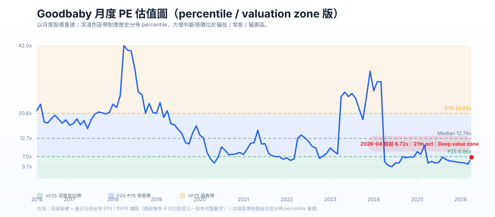
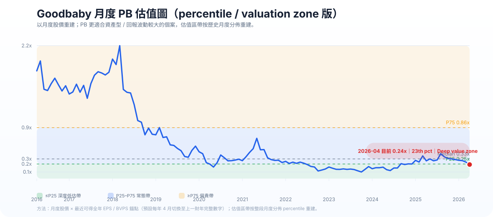

# Goodbaby International（1086.HK）分析報告

- 公司：好孩子國際控股有限公司 / Goodbaby International Holdings Limited
- 代號：1086.HK
- 方法：Kenneth stock method（2026-04-30最新版）
- 語言：中文
- 股價基準：HK$0.88（2026-04-30 收盤價）
- 數據置信度：**Medium-High**（2024–2025 為年報/業績公告精確數字；2016–2023 的10年長表主要按歷年年報文字及表格提取，少量 EBITDA / CAPEX / 現金流屬四捨五入重建）

---

## 簡版結論

Goodbaby International（1086.HK）用最新 Kenneth stock method 去看，我會將佢定性為：**Watchlist only——有品牌價值、有資產折讓、有修復條件，但未夠證據證明佢係值得高估值重評的長線優質股。**

現價 HK$0.88，約 **PE 6.7x、PB 0.24x、股息率 5.7%**。表面上唔貴，但市場畀低估值唔係無原因：**2025 年其實係 CYBEX 一枝獨秀，其餘 Evenflo、gb、Blue Chip 全線倒退**，而且管理層過去10年雖然喺品牌打造、全球化、去槓桿方面有成績，但對「平台式多品牌共同增長」的說法，實際兌現度一般。

**我的最新判斷：**
- **Business quality：中性偏弱**，因為真正高質量部分主要集中在 CYBEX，不是整個集團都高質
- **估值：便宜，但未到無腦 deep value**
- **投資類型：修復/反彈觀察股，多於長線複利股**
- **較務實 fair value：HK$0.95–1.30**
- **較理想吸納區：HK$0.65–0.82**
- **現價 HK$0.88：接近可研究區，但未到我最舒服的安全邊際**

---

## 1. Executive conclusion

Goodbaby 最大的投資矛盾係：**品牌資產看上去唔差，但股東回報質素長期偏弱。**

一方面，CYBEX 已經建立到真實的高端品牌力，帶動集團毛利率由 2016 年的 33.8% 提升到 2025 年的 51.2%；另一方面，集團 2016–2025 這十年收入由 HK$62.4 億升到 HK$86.6 億，但盈利、ROE、以及每股價值創造並無同步穩定提升。2025 年更加反映出平台脆弱性：**58.3% 收入來自 CYBEX，而其餘三大板塊全部倒退。**

所以，呢隻唔應該當成「平價優質股」去買，而應該當成：
- 有真品牌資產
- 有一定資產折讓
- 有 balance sheet 改善
- 但仍要等待更清晰的修復證據

**結論標籤：Watchlist only**

---

## 2. Company overview

Goodbaby 主要做嬰幼兒用品，核心品類包括：
- car seats
- strollers / wheeled goods
- non-durable juvenile products
- 其他 OEM / 配套產品

主要品牌 / 業務支柱：
- **CYBEX**：高端品牌，主打歐洲、日本、北美高端客群
- **Evenflo**：美國老牌，偏大眾及中價市場
- **gb**：中國及部分海外市場品牌
- **Blue Chip / 其他**：OEM / 代工及其他配套收入

2025 年品牌收入結構：
- CYBEX：**58.3%**
- Evenflo：**24.5%**
- gb：**8.6%**
- Blue Chip / 其他：**8.6%**

即係話，**Goodbaby 已經唔再係一個均衡品牌矩陣，而係一個高度依賴 CYBEX 的集團。**

---

## 3. What the market is worried about

市場而家最擔心嘅唔止係中國業務，而係以下四件事一齊發生：

1. **多品牌同步失速**  
   2025 年只有 CYBEX 增長，Evenflo、gb、Blue Chip 全跌。

2. **高質部分過度集中**  
   集團毛利率好睇，但主要靠 CYBEX 撐住；如果 CYBEX 放緩，整個估值框架會即刻變脆。

3. **出生率/需求結構問題未解**  
   中國嬰幼兒需求結構性偏弱，gb 面對的不只是周期，而是母嬰人口基礎收縮。

4. **集團平台故事未證明自己**  
   管理層多年來講全球化、多品牌、平台能力，但從股東角度睇，回報率仍然偏低，唔足以支持高 PB / 高 PE。

---

## 4. Latest results snapshot

### 2025 全年核心數據

| 指標 | 2025 | 2024 | 變動 |
|---|---:|---:|---:|
| 收入 | HK$86.59億 | HK$87.66億 | -1.2% |
| 毛利 | HK$44.34億 | HK$45.08億 | -1.6% |
| 毛利率 | **51.2%** | 51.4% | -0.2pp |
| 經營溢利 | HK$4.20億 | HK$5.00億 | -16.1% |
| 稅前溢利 | HK$3.24億 | HK$3.80億 | -14.6% |
| 股東應佔溢利 | **HK$2.19億** | **HK$3.56億** | **-38.6%** |
| EPS | HK$0.131 | HK$0.213 | -38.6% |
| 經營現金流入淨額 | HK$10.92億 | HK$9.27億 | +17.8% |
| 現金及現金等價物 | HK$12.96億 | HK$10.99億 | +17.9% |
| 借貸 | HK$11.57億 | HK$14.55億 | -20.5% |
| 每股股息 | HK$0.05 | HK$0.07 | -28.6% |

### 2025 品牌分部

| 品牌 | 2025收入 | 2024收入 | 變動 | 評語 |
|---|---:|---:|---:|---|
| CYBEX | HK$50.5億 | HK$44.7億 | **+13.0%** | 唯一主要增長引擎 |
| Evenflo | HK$21.2億 | HK$23.9億 | **-11.2%** | 關稅、競爭壓力仍在 |
| gb | HK$7.5億 | HK$9.2億 | **-18.8%** | 中國需求結構壓力明顯 |
| Blue Chip / 其他 | HK$7.5億 | HK$10.0億 | **-24.8%** | 客戶去庫存 / OEM 弱 |

**一句總結：2025 不是全面轉差，而是“高端品牌仍強，但集團其餘部分更清楚暴露弱點”。**

---

## 5. Current valuation snapshot using latest price

以 **2026-04-30 收盤價 HK$0.88** 計：

| 指標 | 數值 | 解讀 |
|---|---:|---|
| 市值 | **約 HK$14.69億** | 細市值、流動性折讓存在 |
| PE（2025） | **6.7x** | 低，但唔係無條件便宜 |
| PB（2025） | **0.24x** | 反映市場對低回報平台的折讓 |
| 股息率 | **5.7%** | 有保護，但未必代表高質 |
| EV | 約 **HK$12.7億** | 以公司口徑近乎 net cash / near net cash |
| EV/Sales | 約 **0.15x** | 極低收入倍數 |
| BVPS | 約 **HK$3.71** | 股價較賬面值折讓約 76% |

**重點：**
- 呢個估值已經明顯唔係「高質股估值」
- 但它反映的是 **低回報、多品牌失衡、管理層長期平台兌現度不足**，而不是財務爆煲

---

## 6. Historical PB/PE context

### 10年歷史 PE / PB 對照（以年末股價或目前股價作近似比較）

| 年份 | 股價(HK$) | EPS(HK$) | PE | BVPS(HK$) | PB |
|---|---:|---:|---:|---:|---:|
| 2016 | 3.38 | 0.191* | 17.7x | 2.23 | 1.52x |
| 2017 | 4.82 | 0.111* | 43.5x | 3.10 | 1.55x |
| 2018 | 2.43 | 0.098 | 24.7x | 2.98 | 0.82x |
| 2019 | 1.43 | 0.121 | 11.8x | 3.05 | 0.47x |
| 2020 | 0.98 | 0.154 | 6.4x | 3.47 | 0.28x |
| 2021 | 1.07 | 0.074 | 14.4x | 3.66 | 0.29x |
| 2022 | 0.76 | 0.020 | 37.8x | 3.33 | 0.23x |
| 2023 | 0.59 | 0.122 | 4.8x | 3.37 | 0.17x |
| 2024 | 1.10 | 0.213 | 5.2x | 3.49 | 0.32x |
| 2025 | 1.08 | 0.131 | 8.2x | 3.71 | 0.29x |
| 2026現價 | 0.88 | 0.131 | **6.7x** | 3.71 | **0.24x** |

\* 2016–2017 EPS 因舊年報呈現方式，按年內股東應佔 / 集團利潤與當年股本近似重建，屬方向性參考。

### 歷史估值圖表（升級版：monthly percentile / valuation zone）

**升級重點：** 今次唔止係 monthly valuation chart，而係再加咗 **percentile band / valuation zone** 視覺化。即係你而家一眼就睇到：
- 現價 PE 約 **6.7x**，大概喺歷史月度分佈 **21st percentile**，屬 **低估區 / deep-value side**
- 現價 PB 約 **0.24x**，大概喺歷史月度分佈 **23rd percentile**，同樣接近 **低估帶**

**方法說明：** 呢一版用 **2016-04 至 2026-04 月度股價** 去重建估值；EPS / BVPS 仍然用「最近可得全年年報錨點」，實務上假設每年 **4 月起切換至上一財年完整數字**。然後再用整段月度估值分佈，標示 **P25 / Median / P75** 同 valuation zones。

**限制仍要講清楚：** 呢個升級版仍然未做到每個月份都按 rolling TTM / 即時 book value 更新，所以本質上仍然係保守重建；但比單純 year-end PB/PE 或只有月度折線，已經更容易判斷而家係「偏低」「常態」定「偏貴」。

### 歷史估值解讀

- **PE 極低位**：4.8x–8.2x（2023–2026）
- **PE 常態區**：大致 **6x–15x**；高於 20x 的年份通常係盈利太低造成假性高 PE
- **PB 後收購時代較有參考價值區間**：大致 **0.17x–0.32x**（2020–2026）
- **現價 PB 0.24x**：接近近年低位區，但未係最極端低位（2023 曾見約 0.17x）

**判讀：**
- 現價比長期高峰期 PB / PE 明顯低得多，說明市場已經唔再相信佢係高質品牌平台
- 但同時，現價亦未低到明顯脫離近年低回報常態估值區
- 所以 **現價係平，但未到“歷史極端錯殺”**

### CATalyst（作為上限參考）

如果市場要將估值推到 bull-case 上限，通常需要以下 CATalyst 同時成立：
1. CYBEX 維持雙位數增長
2. Evenflo 止跌
3. gb 由雙位數下跌收窄到接近平
4. 稅率 / 關稅壓力正常化
5. 市場開始相信 Goodbaby 不只是 CYBEX 單品牌，而係平台重新恢復盈利轉化能力

即係話，**上限並唔係靠“平”就自然去到，而係要靠基本面再證明一次。**

---

## 7. 10-year financial perspective

### 10年財務摘要（HK$bn；EPS/DPS 為 HK$）

| 年份 | 收入 | 毛利 | 毛利率 | EBITDA* | 稅前溢利 | 股東應佔 | OCF | CAPEX* | Equity | EPS | DPS | 股息率** | 現金 | 借貸 |
|---|---:|---:|---:|---:|---:|---:|---:|---:|---:|---:|---:|---:|---:|---:|
| 2016 | 6.24 | 2.11 | 33.8% | 0.41 | 0.16 | 0.21* | 0.54 | 0.28 | 2.48 | 0.191* | 0.05 | 1.5% | 0.78 | 1.23 |
| 2017 | 7.14 | 2.75 | 38.5% | 0.54 | 0.25 | 0.18* | 0.06 | 0.30 | 5.17 | 0.111* | 0.05 | 1.0% | 1.19 | 2.74 |
| 2018 | 8.63 | 3.66 | 42.4% | 0.62 | 0.21 | 0.16 | 0.43 | 0.40 | 4.96 | 0.098 | 0.00 | 0.0% | 0.93 | 2.78 |
| 2019 | 8.78 | 3.78 | 43.1% | 0.71 | 0.25 | 0.20 | 0.69 | 0.31 | 5.09 | 0.121 | 0.00 | 0.0% | 1.08 | 2.75 |
| 2020 | 8.30 | 3.67 | 44.2% | 0.90 | 0.32 | 0.26 | 1.05 | 0.28 | 5.78 | 0.154 | 0.00 | 0.0% | 1.73 | 2.77 |
| 2021 | 9.69 | 4.00 | 41.2% | 0.67 | 0.11 | 0.12 | 0.31 | 0.36 | 6.10 | 0.074 | 0.05 | 4.7% | 2.26 | 3.52 |
| 2022 | 8.29 | 3.36 | 40.5% | 0.58 | 0.00 | 0.03 | 0.55 | 0.36 | 5.56 | 0.020 | 0.00 | 0.0% | 2.07 | 3.35 |
| 2023 | 7.93 | 3.97 | 50.0% | 0.87 | 0.20 | 0.20 | 1.22 | 0.29 | 5.63 | 0.122 | 0.00 | 0.0% | 2.20 | 2.79 |
| 2024 | 8.77 | 4.51 | 51.4% | 0.96 | 0.38 | 0.36 | 0.93 | 0.35 | 5.82 | 0.213 | 0.07 | 6.4% | 1.10 | 1.46 |
| 2025 | 8.66 | 4.43 | 51.2% | 0.89 | 0.32 | 0.22 | 1.09 | 0.26 | 6.19 | 0.131 | 0.05 | 4.6% | 1.30 | 1.16 |

\* EBITDA 及 CAPEX 局部按年報披露之經營溢利、折舊攤銷、PPE / intangible investment 重建，作框架分析用途。  
\** 股息率按相關年末股價近似。

### 10年重點結論

1. **收入由 HK$62.4 億升到 HK$86.6 億，10年 CAGR 約 3.7%**  
   有增長，但唔算快。

2. **毛利率由 33.8% 拉升到 51.2%**  
   呢個係整個故事最好的一面，證明品牌 mix 確實高端化。

3. **Equity 由 HK$24.8 億升到 HK$61.9 億**  
   賬面值累積有進步，但未轉化成高 ROE / 高股價回報。

4. **股東應佔盈利非常波動**  
   2020、2024較好；2022幾乎跌到底；2025又倒退近四成。

5. **現金流並非差，但盈利轉化唔穩**  
   2023–2025 OCF 其實唔弱，反而說明問題更多在品牌結構與利潤分配，而非單純現金斷裂。

6. **CAPEX 不算沉重，真正拖累不是重資產，而是回報率不高**

### 10年價值創造測試

**答案：只有部分通過。**

- Revenue growth：有
- Gross margin improvement：有
- Equity accumulation：有
- Per-share intrinsic value compounding：**唔夠穩定**
- Shareholder return quality：**偏弱**

即係話，**Goodbaby 有做大，也有做高毛利，但未證明自己係穩定高回報生意。**

---

## 8. ROE / return diagnostic

### 10年 ROE 粗略觀察

| 年份 | ROE |
|---|---:|
| 2016 | 8.6% |
| 2017 | 3.6% |
| 2018 | 3.3% |
| 2019 | 4.0% |
| 2020 | 4.4% |
| 2021 | 2.0% |
| 2022 | 0.6% |
| 2023 | 3.6% |
| 2024 | 6.1% |
| 2025 | 3.5% |

### ROE 問題出喺邊？

**主要是 margin conversion 問題，不是資產周轉問題。**

- 集團毛利率其實已經唔差，近三年 50% 左右
- 但由毛利到股東應佔盈利，中間被：
  - SG&A / 營運費用
  - 稅項波動
  - 多品牌弱勢拖累
  - 低效率品牌平台成本
  吃掉咗好多

### 判斷

- **ROE 唔係被槓桿扭曲上去**：呢點係好事，因為公司近年反而去緊槓桿
- **ROE 長期唔高**：呢點係壞事，因為代表品牌化未變成高股東回報模型
- **2024 的 6.1% 並未證明結構性改善**，2025 很快又回落到 3.5%

**結論：Goodbaby 的低估值，核心係市場不願為長期低 ROE 品牌平台付高 PB。**

---

## 9. Three-statement quality diagnosis

### 正面證據

1. **現金流質素近三年其實唔差**  
   2023–2025 OCF 分別約 HK$12.23 億、HK$9.27 億、HK$10.92 億，明顯高於股東應佔盈利。

2. **CAPEX 可控**  
   大多數年份約 HK$2.6–4.0 億，不屬於重資產黑洞。

3. **負債明顯改善**  
   借貸由 2021 年 HK$35.2 億降到 2025 年 HK$11.6 億，財務風險下降明顯。

4. **2025 已轉入 net cash / near-net-cash 狀態**  
   代表 survivability 其實比股價反映的要好。

### 負面證據

1. **高毛利未能穩定轉成高淨利**  
   呢個係核心毛病。

2. **商譽 + indefinite-life intangible 偏大**  
   2025 年 goodwill 約 HK$26.38 億、無限年期品牌等 intangible 約 HK$16.64 億，合共約 **HK$43.02 億**，相當於總 equity 約 **69%**。  
   即係資產值唔係全部都好“硬”。

3. **多品牌平台成本存在**  
   集團唔係單一 CYBEX 公司，而係要用平台承托弱品牌，呢個拖低 profit conversion。

### 三張表總結

**盈利質素不是虛，但回報質素不高。**

換句話講：
- 這不是一隻快要爆煲的股
- 但也不是一隻已證明自己可以高效率複利的股

---

## 10. Business quality and capital allocation assessment with evidence

### Business quality：**Neutral to Weak-Positive**

| 維度 | 判斷 | 證據 |
|---|---|---|
| 品牌力 | **部分強** | CYBEX 2025 收入 +13%，且管理層披露其在歐洲、日本保持領先，並於紐約、柏林開旗艦店 |
| 定價力 | **CYBEX 強、整體一般** | 集團毛利率 2023–2025 維持 50%+，但主要受高端 mix 支撐，不是每個品牌都有定價權 |
| 渠道 / 分銷 | **有一定深度** | 全球多市場運營、直營旗艦店、自營電商持續發展 |
| 客戶需求屬性 | **半必需、半可選** | car seats / stroller 有基本需求，但高端嬰童用品仍受消費力及出生率影響 |
| 抗周期力 | **一般** | 2025 除 CYBEX 外其餘品牌全線下跌，顯示平台抗壓能力有限 |
| 集團整體護城河 | **不強** | 真正護城河較集中在 CYBEX，並未擴散到全公司 |

### 更深入的質素證據

**支持質素的證據：**
- 10年毛利率由 33.8% 升至 51.2%，證明品牌組合真有升級
- CYBEX 持續成為主要增長引擎，顯示高端品牌不是一次性運氣
- 2025 在關稅與監管壓力下，集團仍保住 51.2% 毛利率，證明品牌端仍有韌性
- 2023–2025 OCF 持續不差，說明生意本身仍可出現金

**反對質素的證據：**
- 2025 年 58.3% 收入靠 CYBEX，集中度太高
- Evenflo、gb、Blue Chip 同時下跌，說明平台的“多引擎”其實未成形
- 10年 ROE 大部分時間只有低單位數，唔符合高質公司標準
- 股東回報長期不足，說明高毛利未轉成高質回報

### 資本配置

**管理層在去槓桿方面做得比在資本回報方面更好。**

- 好：2021–2025 借貸明顯下降，資產負債表修復有實績
- 一般：派息有紀律，但未穩定
- 弱：收購後的大平台並未持續帶來高 ROE

---

## 11. Multi-year management outlook, credibility, and execution check

### 2025 管理層 outlook（最新）

2025 年管理層主調大致係：
- 短期收入有壓力
- 歐洲等主要市場仍強
- 美國受關稅 / 監管影響
- 下半年逐季改善
- 現金流穩健、負債下降、首次回到 net cash

### 用過去10年紀錄去睇可信度

| 時段 | 管理層當時主調 | 之後實際發生 | 評價 |
|---|---|---|---|
| 2016–2017 | 全球化、品牌升級、收購後平台能力提升 | 收入與毛利率確有上升，但股東回報未見同步強化 | **部分兌現** |
| 2018–2020 | CYBEX 強勁、品牌矩陣逐步成熟 | CYBEX 確實成功，但整體平台仍未變成高回報模型 | **品牌判斷對，平台判斷一般** |
| 2021 | 即使疫情/供應鏈困難，品牌仍提升市佔 | 2022 利潤大幅轉弱，說明對 profit conversion 判斷偏樂觀 | **偏樂觀** |
| 2022 | 下半年改善、現金流回升、經營修復 | 2023 的確出現盈利與現金流反彈 | **短期營運修復判斷有功** |
| 2024 | 增長動能強、利潤率創高、平台改善 | 2025 很快出現利潤回落、多品牌再失速 | **對持續性判斷過於樂觀** |
| 2025 | 壓力可控、下半年逐季改善、負債結構更健康 | 資產負債表改善可信，但收入/平台修復仍待驗證 | **財務紀律可信，增長敘事仍需保留** |

### 我對管理層可信度的判斷

- **Management direction sense：Fair**  
  對品牌發展方向、特別 CYBEX，方向判斷並唔差。

- **Management profit-conversion credibility：Weak to Fair**  
  多次講平台化、多品牌協同，但最終回報率仍然低。

- **Capital allocation / balance-sheet discipline：Fair to Strong**  
  去槓桿係近年明顯做得較好的一環。

### 最終評價

**管理層不是不可信，但他們對“平台整體質量”和“盈利持續性”的表述，歷史上偏樂觀。**

我會咁總結：
- 講品牌：可信度較高
- 講現金流 / 去槓桿：可信度較高
- 講集團整體多品牌共同增長：可信度一般

---

## 12. Temporary vs structural diagnosis

### Temporary / 短期因素
- 美國關稅及監管變化
- 稅率異常偏高
- OEM / Blue Chip 客戶去庫存

### Medium-term but fixable / 中期可修復
- Evenflo 表現偏弱：若供應鏈、關稅及產品組合改善，仍有修復空間
- 成本與平台效率：管理層若持續精簡組織，利潤率可改善

### Structural / 結構性問題
- 中國出生率與母嬰需求壓力，對 gb 不只是短周期
- 集團價值越來越集中在 CYBEX，而不是均衡品牌矩陣
- 長期低 ROE，說明平台經濟性不足

### 總判斷

**Goodbaby 的問題不是純 temporary，也不是純 structural，而是：**
- **CYBEX 仍然高質**
- **集團整體平台質量則有結構性弱點**

所以股票唔應該直接用「週期低谷」去理解，而係要分開看：
- CYBEX：偏高質
- Group ex-CYBEX：偏弱

---

## 13. Scenario valuation

### Bear / Base / Bull

| 情景 | 核心假設 | 正常化 EPS | 估值方法 | 目標價 | 與歷史 PB/PE 比較 | CATalyst 對照 |
|---|---|---:|---|---:|---|---|
| Bear | CYBEX 放緩至低單位數；Evenflo / gb 持續跌；毛利率回落；市場視作低回報平台 | HK$0.07–0.09 | 6–8x PE / 0.18–0.22x PB | **HK$0.45–0.70** | 接近近年悲觀區 | 無需太多催化，純低估值盤整 |
| Base | CYBEX 維持 8–10% 增長；Evenflo 止跌；gb 跌幅收窄；稅率正常化部分回復 | HK$0.12–0.15 | 7.5–9x PE / 0.26–0.35x PB | **HK$0.95–1.30** | 回到近年中低位常態 | 需要基本面穩定但不需英雄式反轉 |
| Bull | CYBEX 維持雙位數；Evenflo 恢復；gb 接近平；市場重新相信平台修復 | HK$0.18–0.21 | 10–12x PE / 0.40–0.53x PB | **HK$1.45–1.95** | 高於近年常態、但仍低於歷史高峰期 | 需要多個 CATalyst 同時成立 |

### Fair value 結論

- **務實 fair value：HK$0.95–1.30**
- **較理想吸納區：HK$0.65–0.82**
- **HK$0.88 現價：唔算貴，但安全邊際未算特別厚**

### 點樣理解呢個 fair value？

- Base case 只是假設業務穩住，不是高增長神話
- Bull case 代表市場要重新接受更高 PB / PE，呢個唔會自動發生
- 所以 **現價雖低，但若無明顯催化，只能說“平而未夠吸引”**

---

## 14. Investment fit for Kenneth-style investing

### Primary label
**Watchlist only**

### Fit score
- **Deep value：Medium**  
  因為 PB 夠低、財務安全度改善，但唔算明顯錯殺。

- **Turnaround / repair：Medium**  
  有修復條件，但需要 CYBEX 以外的板塊證明自己。

- **Long-term quality compounding：Low**  
  長期 ROE、平台回報、品牌均衡度都未夠。

### 為何不是 attractive deep value？

因為真正 attractive deep value 通常要滿足兩個條件：
1. 資產/盈利折讓夠深
2. 市場擔心大於實際損害

Goodbaby 第1點有，但第2點未完全成立。市場唔係無端端壓佢，而係見到：
- 回報率長期低
- 平台結構不均衡
- 除 CYBEX 外缺少高質增長證據

---

## 15. Key monitoring points / thesis breakers

### 值得持續監察
1. **CYBEX 收入增速**：如果跌穿高單位數，估值底會再鬆
2. **Evenflo 是否止跌**：若仍雙位數跌，平台問題未解
3. **gb 跌幅能否由雙位數收窄到接近平**
4. **2026 上半年毛利率能否維持 50% 左右**
5. **淨現金狀態能否持續**

### Thesis breakers
- CYBEX 也進入明顯放緩或下跌
- 再次出現多品牌同步惡化
- goodwill / indefinite-life intangible 出現重大減值
- 管理層重新加槓桿但回報率無改善

### 會令我轉 bullish 的證據
- CYBEX 維持雙位數增長
- Evenflo 止跌 + gb 明顯見底
- 連續 2 個報告期證明 OCF、毛利率、淨利率同步穩住
- 市場重新接受至少 0.30x–0.35x PB 有充分基本面支持

---

## Disclaimer

以上為教育用途的分析，不構成個人化投資建議。投資決策仍需結合你的風險承受能力、持倉結構與後續業績驗證。

---

## 保存規格
- 路徑：`analysis/`
- 命名：`GOODBABY_好孩子國際_report_cn.md`
- 方法：Kenneth stock method（最新版）
- 備註：已升級為 10 年財務摘要 + 歷史 PB/PE + deeper business quality evidence + management outlook credibility 檢查
