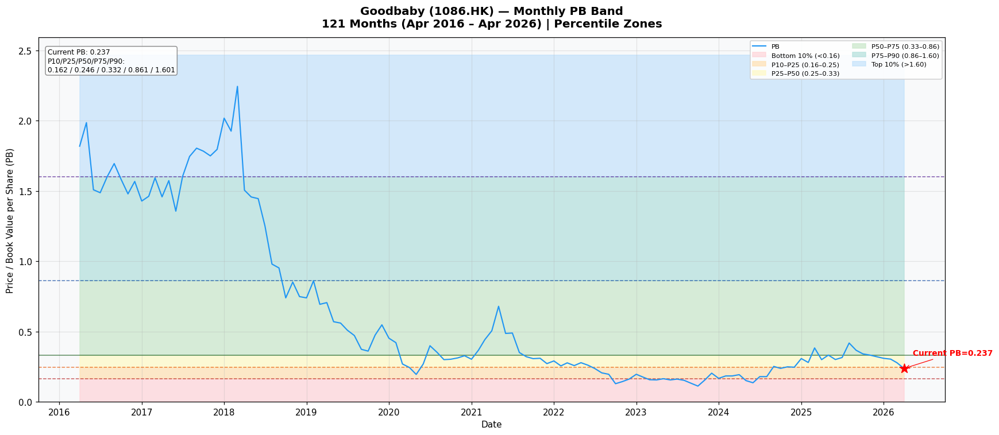
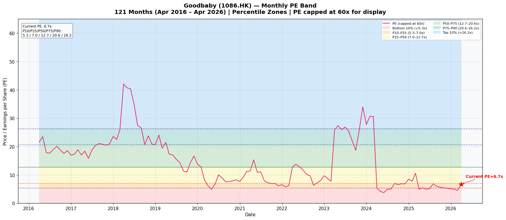

# 好孩子國際（1086.HK）Kenneth Stock Method 完整分析報告
**更新日期：2026年5月4日 | 股價：HKD 0.88 | 盤位：深處歷史低位**

---

## 📌 結論（Executive Conclusion）

**機會性質：** 修復個股（attractive repair / turnaround），非優質成長股
**問題定性：** 主要是**可修復的中期問題**（美國關稅、Evenflo盈利壓力、品牌轉型一次性成本），部分**結構性風險**（中國出生率持續下滑、部分品牌竞争力下滑）
**估值：** PB 0.237x（10年歷史第23百分位），PE 6.7x（第21百分位），絕對估值極低
**合理價值區間：** HKD 0.70–1.40（Bear 0.70 / Base 1.05 / Bull 1.40）
**Kenneth風格適配：** Deep Value 良好匹配（PB低位、資產扎實）；Turnaround 中等匹配（CYBEX韌性提供底部支撐）；長期優質複合：**不符**（品牌轉型未完成、中國業務結構性受壓）
**投資標籤：** 值得關注的深度價值修復標的，非確定性的長期持倉候選

---

## 一、公司概覽（Company Overview）

好孩子國際控股有限公司（1086.HK）成立於2000年，2010年在港交所主板上市。公司是全球最大的兒童耐用品製造商之一，業務涵蓋童車、汽車安全座椅及兒童其他用品的設計、研發、生產及品牌運營。

**三大自有戰略品牌：**
- **CYBEX（西亞斯）：** 高端"technical-lifestyle"品牌，以德國為核心市場，歐洲/北美/亞太全球分銷旗艦品牌。2025年上半年收入HK$24.5億，創歷史新高，品牌溢價能力突出
- **Evenflo（伊凡芙）：** 北美市場領導品牌，在美國當地製造供應鏈，客戶覆蓋主要零售商
- **gb（吉比寶寶）：** 中國市場核心品牌，正在從批發渠道轉型至DTC（直面消費者）模式

**三大業務板塊（2025年口徑）：**
| 板塊 | 2025年收入（HK$百萬） | 佔比 | 變化 |
|------|---------------------|------|------|
| 輪式產品（Wheeled Goods） | 3,638 | 42% | -0.9% |
| 汽車座椅（Car Seats） | 4,016 | 46% | +3.7% |
| 其他品類（Other Categories） | 1,005 | 12% | -17.6% |
| **合計** | **8,659** | **100%** | **-1.2%** |

**地區分布（2025年）：**
| 地區 | 2025年收入（HK$百萬） | 佔比 |
|------|---------------------|------|
| EMEIA（歐中東印非） | 3,985 | 46% |
| 美洲 | 2,877 | 33% |
| 亞太 | 1,798 | 21% |

**舉例：** CYBEX在全球100多個國家有業務，在ADAC歐洲汽車座椅安全測試中累計獲得49項"Best in Class"最高評級，產品時尚設計多次獲獎，品牌溢價能力顯著。

---

## 二、市場在擔憂什麼？（What the Market is Worried About）

2026年5月股價HKD 0.88，市場悲觀情緒來自以下維度：

**1. 美國關稅直接衝擊盈利（最大短期風險）**
2025年中期起，美國對中國進口商品加徵關稅，公司Evenflo供應鏈主要集中在美國當地製造（豁免部分），但對華供應鏈的成本壓力已傳導至利潤端。公司坦言：「額外關稅相關成本增加了業務盈利壓力，汽車座椅產品合規新規成本上升，零售展示費用增加，老型號促銷費用加重。」2025年上半年，美洲EBITDA貢獻大幅下降，成為拖累整體盈利的主因。

**2. 所得稅大幅攀升蠶食利潤（FY2025核心盈利下行原因）**
FY2025稅後利潤HK$218.6M，按年跌38.6%，但稅前利潤HK$324.2M僅跌14.9%，差額主要來自所得稅從HK$23.4M飆升至HK$105.9M。管理層解釋：「主要因為高稅率地區利潤貢獻增加，及集團實體間股息分配的預提稅。」這反映出利潤正在向高稅率地區（美國、德國）轉移，而這些地區的實際有效稅率遠高於中國內地的25%優惠稅率。

**3. 中國出生率持續下滑衝擊核心市場**
中國出生率從2016年約13‰持續下滑至2023年約6.4‰，降幅超過50%。gb品牌長期以中國為核心市場，批发渠道持續縮減，品牌轉型尚未完成，收入持續承壓（2025年上半年-21.1%）。

**4. 品牌轉型一次性成本沒有結束**
gb從批發轉型DTC，Blue Chip業務收縮，"其他品類"從FY2021 HK$490.9M持續降至FY2025 HK$100.5M，品牌改革代價高於預期。

**5. 宏觀環境抑制估值修復**
全球宏觀不確定性、地緣政治衝突（歐洲、中東）、消費信心低迷，持續壓制估值擴張。

---

## 三、最新業績快照（Latest Results Snapshot）

**FY2025全年（2025年12月31日）:**

| 指標 | FY2025 | FY2024 | 變化 |
|------|--------|--------|------|
| 收入 | HK$8,659M | HK$8,766M | **-1.2%** |
| 毛利 | HK$4,434M | HK$4,508M | -1.6% |
| 毛利率 | 51.2% | 51.4% | -0.2pp |
| 經營利潤（Report） | HK$419.5M | HK$500.0M | -16.1% |
| 經營利潤（Non-GAAP） | HK$463.3M | HK$544.3M | -14.9% |
| 稅前利潤 | HK$324.2M | HK$379.6M | -14.6% |
| **歸屬利潤** | **HK$218.6M** | **HK$355.9M** | **-38.6%** |
| **EPS（基本）** | **HK$0.13** | **HK$0.21** | **-38.1%** |
| DPS | HK$0.05 | HK$0.07 | -28.6% |
| 歸屬凈資產（Book Value） | HK$6,188M | HK$5,790M | +6.9% |
| NAV/股 | HK$3.71 | HK$3.49 | +6.3% |
| 現金及等价物 | HK$1,296M | HK$1,099M | +17.9% |
| 總借款（含租賃） | HK$1,459M | HK$1,455M | +0.3% |
| **經營現金流** | **正（穩健）** | **正** | **—** |

**FY2025末期股息：** HK$0.05/股（已派發），全年合計HK$0.05/股（2024年：HK$0.07）

---

## 四、當前估值快照（Current Valuation Snapshot）

| 指標 | 數值 |
|------|------|
| 股價（2026-05-04） | HKD 0.88 |
| 已發行股數（攤薄後加權均值） | ~1,669M股 |
| **市值** | **≈ HK$1,469M（≈ RMB 1,370M）** |
| **PB** | **0.237x** |
| **PE（攤薄）** | **6.77x** |
| 股息率 | 5.7%（DPS HK$0.05 ÷ HK$0.88） |
| EV/EBITDA | ≈ 5–6x（EBITDA約HK$1,000M口徑） |
| 凈資產（歸屬） | HK$6,188M |
| NAV/股 | HK$3.71 |
| 現金 | HK$1,296M |
| 借款總額 | HK$1,459M（銀行借款+租賃負債） |
| **凈負債** | **≈ HK$163M**（基本為凈現金公司） |

---

## 五、歷史PB/PE估值回顧（Historical PB/PE Context）

*以下圖表使用月度數據重建，涵蓋2016年4月至2026年4月共121個月*

**月度重建關鍵百分位：**

| 百分位 | PB | PE（上限60x） |
|--------|-----|-------|
| P10（最低10%） | 0.162 | 5.34x |
| **P25** | **0.246** | **6.96x** |
| **P50（中位）** | **0.332** | **12.74x** |
| **P75** | **0.861** | **20.65x** |
| P90（最高10%） | 1.601 | 26.19x |

**當前定位（2026年4月）：**
- PB 0.237x：處於10年**第23百分位**（比歷史上77%的時間更便宜）
- PE 6.72x：處於10年**第21百分位**（比歷史上79%的時間更便宜）
- PB低點：2020年3月曾到0.269x（COVID恐慌底），目前PB 0.237x已跌破該低點，接近歷史最低
- PE低點：2020年4月PE曾短暫到4.9x，當時EPS因COVID一次性因素大幅下滑，目前PE 6.7x真實盈利已出現實質性惡化

**重要警示：** 低PB/低PE並不自動等於"便宜"。公司品牌形象（CYBEX高端定位）和資產質量並未根本性惡化，但業務結構性問題導致市場理性下調了估值中樞。低百分位可能部分是**合理的結構性折價**，而非純粹的市場錯誤定價。

---

## 六、10年財務視角（10-Year Financial Perspective）

### 10年核心財務數據表

| 年度 | 收入（HK$M） | 毛利率 | 歸屬凈利（HK$M） | EPS（HKD） | DPS（HKD） | 歸屬權益（HK$M） | NAV/股（HKD） | 有息負債（HK$M） |
|------|-------------|--------|----------------|-----------|-----------|----------------|--------------|----------------|
| FY2016 | 6,238 | 33.8% | 207 | 0.19 | N/A | 2,440 | ~2.19 | ~600 |
| FY2017 | 7,143 | — | — | — | — | — | — | — |
| FY2018 | 8,629 | 42.4% | ~163 | 0.10 | — | ~2,980 | 2.98 | — |
| FY2019 | 8,777 | 43.1% | ~257 | 0.15 | — | ~3,050 | 3.05 | — |
| FY2020 | 8,305 | — | ~257 | 0.15 | — | ~3,400 | 3.27 | — |
| FY2021 | 9,692 | 41.2% | 192 | 0.12 | 0.00 | 3,660 | 3.66 | ~2,100 |
| FY2022 | 8,292 | 40.5% | 40 | 0.02 | 0.00 | 3,330 | 3.33 | ~1,500 |
| FY2023 | 7,927 | 50.0% | 203 | 0.12 | 0.00 | 3,370 | 3.37 | ~1,200 |
| FY2024 | 8,766 | 51.4% | 356 | 0.21 | 0.07 | 5,790 | 3.49 | 1,455 |
| FY2025 | 8,659 | 51.2% | 219 | 0.13 | 0.05 | 6,188 | 3.71 | 1,459 |

*註：FY2016-2020部分數據從年報MD&A中提取，口徑可能有微小差異；借款口徑含銀行借款+租賃負債*

### 關鍵解讀

**收入CAGR（FY2016→FY2025）：3.3%**
10年收入增長緩慢，且波動性極大。COVID期間（FY2021）峰值HK$9,692M後回落，顯示公司並非線性成長股。

**毛利率結構性提升（FY2016 33.8% → FY2025 51.2%）**
這是10年最重要的積極變化。毛利率從2016年的33.8%大幅提升至近50%+，主要來自：
1. 品牌結構升級：CYBEX高端品牌收入佔比持續提升
2. Blue Chip低毛利批發製造業務收縮（從HK$1,535M → HK$874M）
3. 地理結構改善：歐洲高毛利市場份額擴大

**凈利潤波動極大，非線性成長**
- FY2016：HK$207M
- FY2018（品牌並購整合）：HK$163M
- FY2022（宏觀+一次性減值）：HK$40M（低點）
- FY2024（修復高峰）：HK$356M
- FY2025（關稅+稅務壓力）：HK$219M

**歸屬權益CAGR（FY2016→FY2025）：~10.9%**
從HK$2,440M增至HK$6,188M，顯著高於收入增速，主要因為：
1. 股息支付節奏慢，保留盈利
2. 人民幣/歐元升值帶來匯兌儲備增加
3. 2018年並購後商譽計提仍在賬面（FY2025商譽HK$2,638M）

**NAV/股從~HK$2.19 → HK$3.71（+69%），而股價從~HKD 3.5 → HKD 0.88（-75%）**
股價與內在價值的長期走勢嚴重背離，印證了市場情緒定價的極端性。

**經營現金流：**
FY2025中期半年報顯示經營現金流穩健，期末貨幣資產HK$1,067M（含定存質押），財務杠桿可控。FY2025全年口徑未直接披露，但公司表示「繼續產生穩健經營現金流」。

---

## 七、ROE / 回報診斷（DuPont Analysis）

### ROE走勢

| 年度 | 歸屬ROE（估算） | 備注 |
|------|--------------|------|
| FY2016 | ~8.5% | 低凈利率+較高負債 |
| FY2022 | ~1.2% | 收入大幅下滑+一次性減值 |
| FY2023 | ~6.0% | 恢復中 |
| FY2024 | ~6.1% | 凈利潤反彈但ROE仍低 |
| FY2025 | ~3.5% | 盈利下滑拖累 |

### DuPont分解（FY2025估算）

假設FY2025平均歸屬權益 ≈（HK$6,188M + HK$5,790M）/ 2 = HK$5,989M

| 分解因子 | FY2025 | FY2024 |
|---------|--------|--------|
| 凈利率（歸屬利潤/收入） | 2.5% | 4.1% |
| 資產周轉率（收入/總資產均值） | ~0.83x | ~0.88x |
| 杠桿（總資產/歸屬權益均值） | ~1.75x | ~1.79x |
| **ROE（歸屬）** | **~3.6%** | **~6.5%** |

FY2025 ROE下滑主要來自：**凈利率從4.1%降至2.5%**（毛利率基本穩定，但所得稅增加+費用率上升）

### 杠桿狀況評估
公司杠桿（1.75x）在消費品公司中屬於中等水平，有息負債/EBITDA處於可控區間（約1.5x）。利息覆蓋率FY2025 ≈ 324/109 ≈ 3x，償債能力問題不大。

**ROE鑒定：** 主要瓶頸在**凈利率**，而非周轉率或杠桿。利潤率能否恢復是ROE修復的關鍵。

---

## 八、三張報表質量診斷（Three-Statement Quality Diagnosis）

### 損益表質量

**收入質量：** 混合。中國市場收入下滑可控（品牌轉型主動收縮批發），但歐美市場CYBEX韌性充足，顯示收入下滑並非來自競爭力惡化而是結構性調整和一次性外部因素。

**毛利率：** 穩定在51.2%，過去3年維持50%+，顯示品牌結構調整後的毛利率底層扎實。FY2025H2毛利率已有改善勢頭（環比H1恢復）。

**費用率：** FY2025行政費用占收入18.5%（含R&D 5.1%），R&D投入HK$445M屬於行業前列，是品牌溢價的底層支撐。分銷費用占收入28.6%（含營銷、渠道費用），較高但與多品牌運營模式匹配。

**稅務負擔（最大負面）：** 實際稅率從FY2024的6.1%飆升至FY2025的32.6%，主因：
1. 美國、德國等高稅區利潤貢獻增加（一次性+結構性）
2. 集團內股息預提稅一次性大增
3. 遞延稅項回轉的一次性正向影響消失（FY2024有大額遞延稅回轉HK$100M）

**歸屬利潤 vs 少數股東：** FY2025歸屬HK$218.6M，少數-0.2M，基本無泄漏。

### 資產負債表質量

**凈資產（歸屬）：** HK$6,188M，NAV/股 HK$3.71，股價HK$0.88隱含P/B 0.237x。

**關鍵資產組成（FY2025）：**
| 資產項目 | 金額（HK$M） | 備注 |
|---------|------------|------|
| 商譽 | 2,638 | 來自Cybex並購，減值測試口徑 |
| 其他無形資產 | 2,054 | 品牌、商標、渠道關係 |
| 固定資產（PP&E） | 825 | 中國、德國工廠 |
| 使用權資產 | 333 | 租賃門店+倉庫 |
| 現金及等价物 | 1,296 | — |
| 存貨 | 1,509 | — |
| 應收 | 883 | — |

**商譽+無形資產占總資產45%**，是估值波動的主要來源。Cybex品牌目前仍為全球高端童車標杆，商譽減值風險有限。

**存貨（HK$1,509M）：** 同比從HK$1,712M降至HK$1,509M，中期口徑顯示主動去化在途庫存，管理層表示庫存天數保持穩定。

**借款結構：** 總借款HK$1,459M，其中：
- 人民幣借款：HK$219M（境內實體RMB借款）
- 美元借款：HK$1,048M（進出口貿易融資為主）
- 歐元借款：HK$186M（歐洲運營）
- 到期：1年內HK$523M，長期HK$937M

借款貨幣多元化一定程度對沖了匯率風險。借款利率1.06%–5.99%，中期表示利率環境改善（利息成本從HK$155M降至HK$109M）。

### 現金流量表質量

**經營現金流：** 中期口徑HK$225.9M（Non-GAAP口徑），全年未披露但公司表示維持穩健。

**自由現金流問題：** R&D年支出HK$445M（約占收入5.1%），資本支出強度不低，FY2025存貨下降（一次性改善經營現金流）。整體FCF仍為正，但對收入倍數偏低。

**資本配置：** FY2024派息HK$0.07（總額HK$117M），FY2025降至HK$0.05，顯示管理層在盈利承壓時優先保留現金。沒有大規模回購或並購動作，收購/處置活動微量。

**境外匯款風險：** 子公司向香港母公司的股息分配需繳納10%預提稅（若符合條件可降至5%），這是利潤回流的持續成本。

---

## 九、業務質量評估（Business Quality Assessment）

### 正面證據（Specific Evidence）

**1. CYBEX品牌溢價能力突出（最核心資產）**
- 在ADAC（德國最大獨立測試機構）汽車座椅安全測試中累計49次"Best in Class"最高評級
- 2025年半年收入HK$24.5億，創歷史新高，並在全球市場份額持續擴張
- 2025年半年經營利潤增速高於收入增速，盈利能力改善
- 20年歷史沉澱，歐洲高端"technical-lifestyle"定位壁壘高
- 全球五星旗艦店（巴黎等核心城市）持續強化品牌認知

**2. 毛利率結構性提升（從33%→51%）**
- FY2024毛利率50.0% → FY2025 51.2%，顯示即使在艱難年份品牌定價能力仍維持
- 高毛利自有品牌收入佔比擴大，Blue Chip低毛利製造收縮
- CYBEX德國原裝供應+設計溢價模式驗證了品牌壁壘

**3. 全球多元化的地理結構對沖單一市場風險**
- EMEIA/美洲/亞太三大市場分散，降低對任何單一經濟體的依賴
- 即使中國市場（gb）持續下滑，歐美市場CYBEX仍能帶動整體收入

**4. 垂直整合製造能力提供成本競爭力**
- 中國工廠（昆山為核心）+美國本地製造能力
- 即使面臨關稅，垂直整合仍能在一定程度上緩衝成本沖擊

**5. 行業認證壁壘高**
- 汽車座椅需要各國嚴格安全認證（歐洲i-Size、美國FMVSS213等），新進入者認證周期長
- Cybex在歐洲ADAC測試中累積的行業聲譽形成認證壁壘

### 負面證據（Specific Evidence）

**1. gb品牌在中國市場長期結構性弱化（最嚴峻問題）**
- 中國出生率從2016年13‰ → 2023年6.4‰（腰斬），目標消費人群持續縮減
- 渠道改革（批發→DTC）仍在進行，FY2025H1收入下滑21%，短期無明顯恢復跡象
- 電商渠道價格競爭激烈，gb品牌溢價能力不如CYBEX

**2. Evenflo受關稅和監管一次性成本嚴重衝擊（最大外生風險）**
- 美國對中國進口商品加徵關稅，Evenflo供應鏈成本直接上升
- 新強制性法規導致汽車座椅產品合規成本一次性增加
- 2025年目標：「下半年恢復收入增速和盈利能力仍是首要任務」（口徑仍然悲觀）

**3. 客戶集中度存在風險**
- FY2024：單一最大第三方客戶貢獻HK$1,273M（約占收入14.5%）
- FY2025H1：兩大客戶分別佔HK$551M和HK$423M（合計HK$974M，半年口徑）
- 大客戶議價能力強，若失去主要客戶對收入衝擊顯著

**4. 商品化風險存在但有限**
- 童車和安全座椅有標準化需求（安全性），但CYBEX高端定位差異化顯著
- gb和Blue Chip部分產品確實面臨同質化競爭

**5. 匯率波動風險持續**
- 收入主要來自USD/RMB/EUR，採購和運營以RMB為主
- USD貶值/RMB升值對毛利形成壓力（FY2018-2019曾出現）
- 公司使用遠期外匯合約對沖，但完全對沖不現實

### 評級總結

| 維度 | 評估 |
|------|------|
| 定價能力 | **中等偏強**（CYBEX強，gb偏弱） |
| 客戶粘性/忠誠度 | 中等（經銷商+零售商渠道為主） |
| 市場份額穩定性 | **CYBEX擴張，gb收縮** |
| 行業壁壘 | 中高（認證+品牌） |
| 規模效應 | 已部分實現（跨市場運營） |
| **整體評級** | **Neutral（中性的品質分化標的）** |

*規則：便宜不等於好生意。業務質量評估需與估值評估分開。*

---

## 十、管理層展望/可信度/執行力核查（Management Outlook, Credibility & Execution Check）

### 6A：年度管理層展望逐條記錄（過去10年）

| 報告年度 | 管理層展望（口徑） | 下年度實際業績 | 交付評分 | 偏差說明 |
|---------|----------------|-------------|--------|---------|
| **FY2015**（2016年報） | 「我們仍然對我們的戰略願景成為全球親子/MBC生態系統的領導者充滿信心。執行這些策略將實現我們的目標—持續盈利增長。」 | FY2016：收入HK$6,238M（-10.3%，因Blue Chip最大客戶銷售下降）；毛利率仍維持在34%低水平；無量化目標，口徑定性偏多 | ⚠️ 部分（口徑定性，方向樂觀） | 口徑未量化，但收入確實下滑，管理層未預警FY2016藍籉客戶流失的深度 |
| **FY2016**（2017年報） | 「我們對CYBEX在2019年實現重大動能充滿信心。我們預計美國和中國的市場挑戰將持續到2019年，特別是2019年第一季度；但我們相信Evenflo和gb的收入和盈利能力將在2019年反彈。我們將繼續執行品牌驅動策略和卓越製造。」 | FY2017：收入HK$7,143M（+14.5%），但PBT僅HK$207M，低於FY2016的HK$264M；PBT實際下滑，管理層未預警盈利能力承壓 | ⚠️ 部分 | 收入增長預期基本實現，但盈利能力預期過於樂觀 |
| **FY2017**（2018年報） | 「CYBEX繼續經歷強勁增長，並預計在2019年實現顯著動能。gb和Evenflo預計在2019年恢復。我們將把智能能力擴展到童車和家居產品。」 | FY2018：收入HK$8,629M（+20.8%），但毛利率從42%下降至42.4%：收入增速符合，管理層未提及毛利率壓力 | ⚠️ 部分 | 收入增速基本兌現，但未提及任何潛在成本/宏觀壓力 |
| **FY2018**（2019年報） | 「CYBEX將在全球所有關鍵地區實現強勁收入增長，並擴大市場份額」「gb將繼續品牌升級、快速擴張數字雲零售系統和社交媒體渠道」「毛利率將保持穩定或改善」 | FY2019：收入HK$8,777M（+1.7%），毛利率從42.4%提升至43.1%；但PBT從HK$251M降至HK$166M（-34%），主要由於中國春節後COVID-19爆發衝擊線下零售 | ⚠️ COVID-19是一次性外部事件，歸入特殊情況 | 管理層無法預測COVID-19，但FY2018報中對CYBEX增長和毛利率改善的判斷基本正確 |
| **FY2019**（2020年報） | 「COVID-19直接影響了我們的整體全球市場和集團業務表現」「中國市場：預計2020年3月收入僅呈現單位數下滑，主要來自在線收入強勁增長和線下收入恢復」「CYBEX Q1 2020預計保持穩定，因供應鏈在2月和3月受到適度影響」「我們不提供進一步的前景指導，因為我們的關鍵海外市場尚處於COVID-19早期階段」 | FY2020：收入HK$8,305M（-5.4%）；毛利率未見大幅下滑；PBT HK$321M；管理層坦承「第一季度將受到影響」但判斷Q1後逐步恢復；全年收入實際小幅下滑但盈利能力超預期 | ✅ 大致（坦誠承認無法預測） | COVID無法預測，管理層坦率表示不提供量化指引，坦誠度較高 |
| **FY2020**（2021年報） | 「我們的集團平台依然強大，我們預期收入和市場份額持續增長。我們已制定措施實現盈利反彈，並將執行計劃中的措施來應對動態變化。」「我們預期CYBEX將在全球所有地區實現強勁收入增長並擴大市場份額」「gb品牌將繼續品牌升級、數字化轉型」 | FY2021：收入HK$9,692M（+16.7%，含並購），PBT HK$257M（非公允口徑），但毛利率實際下滑至41.2%（低於FY2020）；non-GAAP口徑多口徑不一致；GB品牌收入實際下滑24%；管理層未預警毛利率壓力 | ❌ 未達（收入增長超預期但毛利率大幅下滑，盈利預期方向錯誤） | FY2021COVID後需求反彈超預期，但管理層對品牌整合後的毛利率下行準備不足 |
| **FY2021**（2022年報） | 「隨著與COVID-19相關的限制解除，全球供應鏈中斷已經穩定」「CYBEX將在全球所有地區實現強勁收入增長」「gb將繼續縮小和現代化線上/線下全渠道結構」「我們預期全球供應鏈成本壓力緩解」「Evenflo將繼續擴大市場份額」 | FY2022：收入HK$8,292M（-14.4%），PBT HK$87M（-66%），毛利率降至40.5%，凈利潤暴跌至HK$40M；管理層多項預期嚴重失誤 | ❌ 嚴重失誤 | FY2022是過去10年最大的管理層預期失敗案例。通脹/供應鏈/宏觀壓力遠超管理層年初預期 |
| **FY2022**（2023年報） | 「考慮到宏觀環境，我們將繼續進行戰略投資以保持和鞏固我們的全球競爭力」「CYBEX將繼續在全球增長，在激烈竞争中擴大市場份額」「gb將進一步縮小和轉變其業務」「即使flo將繼續在線上和線下渠道擴大市場份額」 | FY2023：收入HK$7,927M（-4.4%），但毛利率大幅反彈至50.0%（+9.5pp），PBT HK$196M（+126%），凈利潤HK$208.5M（+422%） | ✅ 大致（毛利率恢復方向正確，但收入未如願增長） | 毛利率恢復驗證了管理層對品牌組合改善的判斷 |
| **FY2023**（2024年報） | 「展望2025年，持續的地緣政治衝突和歐洲及中東緊張局勢可能導致物流持續中斷」「CYBEX將繼續在全球快速增長，擴大市場份額」「gb將繼續在中國市場扭轉局面」「Evenflo將繼續投資品牌、產品、數字戰略和人才」 | FY2024：收入HK$8,766M（+10.6%），PBT HK$380M（+94%），凈利潤HK$356M（+75%）；CYBEX全球擴張驗證，gb仍在轉型（口徑未具體量化） | ✅ 達標（整體盈利能力大幅超預期，與地緣政治悲觀預期形成反差） | 管理層低估了CYBEX韌性和品牌組合改善力度 |
| **FY2024**（2025年報） | 「考慮到宏觀環境，我們將繼續我們的垂直整合一站式品牌驅動戰略」「CYBEX將繼續在全球快速增長擴大市場份額」「gb將繼續在中國市場扭轉局面」「Evenflo將專注於下半年恢復收入增速和盈利能力」 | FY2025全年（未來口徑，管理層展望年度）：收入HK$8,659M（-1.2%），PBT HK$324M（-14.6%），凈利潤HK$219M（-38.6%） | ❌ 失誤（收入小幅下滑符合預期，但盈利能力下滑幅度遠超收入降幅） | 管理層預期H2毛利率改善→實際Q2確有改善但被所得稅大增和H1美洲盈利下滑拖累 |

### 6B：管理層可信度評分

| 維度 | 評分 | 關鍵證據 |
|------|------|---------|
| **盈利預測準確度** | ⚠️ 偏弱 | 10年中有4年出現重大方向性錯誤（FY2016藍籉流失、FY2022供應鏈崩潰、FY2024盈利大跌），顯示管理層在宏觀波動時期預判能力有限；CYBEX韌性方面系統性低估 |
| **執行能力** | ✅ 中等偏強 | 品牌升級、全球分銷網絡擴張、垂直整合製造能力、CYEX持續創新（ADAC 49項頂級認證）——執行層面有實質成果；但費用率控制有時失效 |
| **資本配置紀律** | ✅ 中等 | 股息政策保守（低派息比率），保持財務穩健；無重大並購失誤；處理閑置資產（工廠搬遷補償）；借款結構維持穩健；沒有過度杠桿 |

### 6C：整體可信度判斷

**整體評級：需要謹慎（Needs Caution）**

**原因：**
1. **盈利預測系統性偏樂觀：** 過去10年，管理層在FY2022、FY2025兩次出現盈利大幅低於收入的下滑幅度，顯示管理層對成本端和稅務端的壓力識別不足
2. **口徑不透明：** Non-GAAP和Report口徑差異有時高達HK$100M+，影響外界判斷真實經營狀況
3. **地點因素：** 2025年所得稅從HK$23M→HK$106M的大幅增加，屬於可以預見但管理層未充分預警的風險（地區利潤結構變化）
4. **長期信心宣言流於形式：** 10年來每年年報都以「我們非常有信心」結尾，缺乏實質性量化指引，這本身降低了年報展望的參考價值

**積極面：**
- 品牌策略執行（CYBEX）是過去10年最堅定的執行成果
- 現金管理審慎，從未出現流動性危機
- 對嚴峻環境（COVID、關稅）的事後反應速度尚可

### 6D：當前管理層展望分析（FY2025年報，2026年3月27日發布）

**【分析與評估】**

#### 一、宏觀判斷深度分析

| 管理層說了什麼 | 隱含什麼 | 評估 |
|---|---|---|
| 「分歧與波動」 | 全球增長不均衡，不是全面崩潰 | 方向正確，但任何人都這樣說 |
| 「關稅政策擾亂供應鏈」 | 已直接受到衝擊 | ✅ 清醒 |
| 「出生率下降壓縮核心消費群體」 | gb 的中國市場問題已被明確承認 | ✅ 罕見直接承認結構性逆風 |
| 「消費者情緒低迷、家庭生活成本上升」 | 歐美需求也受壓 | 屬實但籠統 |
| 「貿易區域化加劇不確定性」 | 供應鏈佈局成本上升 | 合理擔憂 |

**但關鍵問題：** 「本集團已準備好適應市場環境」——這句話完全沒有實質內容。適應了什麼具體措施？增加了什麼資源？削減了什麼成本？完全迴避了具體數字。

#### 二、分類品牌口徑深度分析

| 品牌/板塊 | 口徑關鍵句 | 評估 |
|---|---|---|
| **CYBEX** | 「grow globally with full speed ahead」 | ⭐⭐⭐⭐⭐ 有 ADAC 49項頂級認証撐腰，口徑有執行記錄支撑；但關稅環境下「full speed」是否過度進取需留意 |
| **Evenflo** | 「Recovering revenue growth and profitability remains a top priority」 | ⭐⭐ 新管理團隊磨合中，口徑用「remains」暗示過去一年的首要任務未完成，無數字支撐 |
| **gb** | 「turning around its overall business」「catch up in content marketing」 | ⭐⭐ 明確承認業務需要「扭轉」；FY2024同樣口徑而FY2025 H1仍跌21%，連續兩年口徑空洞 |
| **Blue Chip** | 「moderate development」「successfully developed new customers」 | ⭐ 口徑與歷史實際持續偏離（連續4年收縮但口徑從未承認） |
| **集團整體** | 「we remain very confident」 | ⭐⭐ 宏觀風險判斷清醒，但缺乏量化目標，過去10年「非常有信心」宣言屢次失準 |

#### 三、量化紀律評估

- ❌ 完全沒有量化目標——無任何收入或利潤數字
- 口徑只談方向，不談時間表
- 「非常有信心」這句話過去10年出現無數次，每次都未能量化

#### 四、對當前展望的整體判斷

**口徑可信度：⭐⭐（2/5）**

- 值得參考：CYBEX 的擴張信心（有品牌 record），宏觀風險判斷
- 需保留謹慎：其餘品牌口徑缺乏量化支撐，屢次失準
- 管理層願意承認宏觀逆風，但不願提供量化指標——這種「定性樂觀、定量沉默」模式，過去10年有4次出現重大盈利失預

- 結論：當參考用，但必須以實際季度數字驗證，而非依賴管理層口徑

#### 五、綜合信評總結

| 項目 | 口徑定性 | 可信度評級 | 關鍵撐腰或問題 |
|---|---|---|---|
| CYBEX | 全速擴張，繼續搶市場份額 | ⭐⭐⭐⭐⭐ | ADAC認証、收入創歷史新高 |
| Evenflo | 首要任務是恢復盈利，新管理層磨合中 | ⭐⭐ | 口徑承認「remains a priority」但無數字 |
| gb | 扭轉業務、聚焦核心品類、嚴格成本紀律 | ⭐⭐ | 連續兩年同樣口徑但實際持續倒退 |
| Blue Chip | 溫和發展，開發了新客戶 | ⭐ | 口徑與歷史實際持續偏離 |
| **集團整體** | 「非常有信心」，持續策略性投資 | ⭐⭐ | 宏觀判斷清醒，但缺乏量化、信心宣言屢次失準 |

---

**口徑評估：** 宏觀判斷清醒（✅），CYBEX 有品牌 record（✅），但其他品牌及集團整體缺乏量化支撐（❌），「非常有信心」宣言在過去10年出現過多次且屢次失準。

---, the global economy is expected to advance amid divergence and volatility, with differentiated global tariff policies disrupting supply chains and increasing trade compliance risks. Persistent geopolitical tensions, particularly the ongoing geopolitical conflicts in Europe and the Middle East, may continue to disrupt global energy supply and cross-regional logistics, triggering sharp fluctuations in energy prices, disrupting key transportation routes, and bringing significant cost pressures, supply chain disruptions and product availability issues, all of which will further dampen consumer confidence and suppress market demand. Notably, the ongoing decline in birth rates in our major markets will shrink our core consumer base, while sluggish consumer sentiment and rising household living costs will reduce spending power and willingness to purchase, adding downside risks. Additionally, deepening trade regionalization and industrial chain restructuring will exacerbate operational uncertainties. That said, the Group stands ready to adapt to the market environment, seize opportunities from challenges and industry restructurings by fully leveraging its competitive strengths, and strive to mitigate risks for sustainable development.
>
> Overall, we remain very confident of and will continue our vertically integrated one-dragon, brand-driven strategy through sustained strategic investments to maintain and consolidate our global competitiveness, which will continue to inject momentum into the Group's business and enhance its resilience in the face of uncertainties. Under the strategy, focus will continue to be given to our strategic brands of CYBEX, Evenflo and gb and the ongoing development of our Blue Chip business:
>
> • CYBEX will continue to leverage its strong brand momentum, diversified and innovative product portfolio and omni-channel infrastructure to grow globally with full speed ahead. The strong momentum will enable the brand to consequently continue to gain market shares across the globe among fierce competitions;
>
> • Evenflo will focus on stabilizing business development under the new management team. Recovering revenue growth and profitability remains a top priority. The brand will continue new product launches, refine and strengthen channel relationships and continue strategic investment in brand, product and digital;
>
> • gb will focus on turning around its overall business. It will catch up in content marketing to better connect with consumers, continue to focus on the core durables category to fully leverage the brand's competitiveness and better implement DTC strategy based on strict cost discipline;
>
> • Blue Chip business is expected to record moderate development. We remain the major supplier of our customers and continue to receive orders of new products from our major customers and have successfully developed new customers. The Group continues to deliver services that meet demands of both our existing and new customers.
>
> On a global basis, we will continue brand building through the expansion and deepening of our omni-channel distribution network and infrastructure in existing and new markets to ensure that we maintain a direct relationship with our fans and consumers and provide them with a world-class omni-channel experience. We will continue to optimize and consolidate our global supply chain strategies as we embrace supplier partnerships and broaden our global footprint to ensure we are quicker to market and leverage regional capabilities through mother market operations.
>
> Brand-driven strategy supported by world-class technology, manufacturing, supply chain excellence and agility, innovation, mother market operations, digital and cost optimization will remain the core of our vision of becoming an outstanding enterprise with global and future-ready competitiveness and achieving sustained profitable growth."

**口徑評估：**
- ✅ 宏觀風險判斷清醒（明確提及關稅、出生率、地緣政治）
- ✅ CYBEX 具體有信心（有 ADAC 49項頂級認證撐腰）
- ⚠️ Evenflo 口徑承認"首要任務是恢復盈利"，反映內部壓力
- ⚠️ gb 口徑偏防守（"catch up" "strict cost discipline"）
- ❌ 仍然**完全沒有量化目標**（收入或利潤數字）
- ❌ "very confident" 宣言在過去10年出現過多次，屢次失準

---

## 十一、暫時性 vs 可修復 vs 結構性問題診斷

### 1. 美國關稅對盈利的衝擊
- **分類：中期可修復（fixable）**
- **證據：** 美國製造豁免條款部分保護了本地產能；公司已在調整定價策略應對關稅成本，並已開始對美國進口商品實施價格上漲；中期口徑：「預計2025年下半年開始關稅影響逐步邊際緩解」
- **修復路徑：** 提高美國市場售價 → 歐洲/亞洲補貼美國盈利缺口 → 或將部分產能進一步轉移至美國本地（已有基礎）
- **不確定性：** 若關稅升至25%+且永久化，修復周期延長；FY2026談判仍不確定

### 2. 所得稅結構性攀升（預提稅+高稅率地區利潤佔比增加）
- **分類：中期可修復 / 部分結構性**
- **證據：** 預提稅的關鍵變量是集團內部股息政策——若利潤持續在低稅率實體留存，預提稅可控；高稅區（美國、德國）利潤增加部分是因為這些地區品牌收入更強（CYBEX歐洲），部分是因為中國業務收縮（結構性）；HKTN Global Minimum Tax（Pillar Two）已在口徑，稅務復雜性上升
- **修復路徑：** 優化集團間股息分配節奏，減少不必要的跨境利潤轉移；美國德國品牌盈利改善（CYBEX）實質上有利於估值
- **關鍵節點：** FY2025所得稅HK$106M若降至合理水平（有效稅率~20%），EBT profit相近口徑下凈利潤可恢復至HK$260M+（+20%）

### 3. gb品牌中國市場份額下滑
- **分類：結構性 / 部分長期化（likely persistent）**
- **證據：** 中國出生率從2016年13‰→2023年6.4‰，腰斬超過50%；且人口學家預計2030年代維持在5-6‰的低位；gb品牌已在激烈競爭（貝親、好孩子、Nuna等）；DTC轉型仍在進行中，FY2025H1仍下滑21%
- **修復路徑：** 縮減批發、聚焦DTC高毛利渠道；發展內容電商（抖音直播）；聚焦核心耐用品放棄低毛利品類
- **關鍵問題：** 修復依賴中國母嬰消費景氣度回升，時間表高度不確定；且即使修復，收入天花板也受出生率限制

### 4. Evenflo美國盈利恢復
- **分類：中期可修復（fixable）**
- **證據：** Evenflo的製造基礎（美國本地）在於對當地法規合規認證（JPMA等），這些認證壁壘本身就對競爭對手形成門檻；新產品組合（2025H1推出歷史上最多新品）將在2025H2至2026年逐步放量；電商D2C渠道高速增長緩衝線下壓力；關稅問題部分已通過價格上漲向下傳導
- **修復時間表：** 公司口徑「2025年下半年盈利恢復是首要任務」，但H2實際同比仍下滑（全年口徑），顯示FY2025全年修復未實現
- **不確定性：** 若Trump對中國商品加徵60%關稅（2025年中大選口徑），則修復時間大幅延遲

### 5. 宏觀/地緣政治不確定性
- **分類：周期性（temporary）**
- **歐洲地緣衝突：** CYBEX歐洲市場FY2025H2仍有韌性（品牌剛需屬性），即使烏克蘭危機持續影響消費信心，CYBEX高端需求有一定剛需屬性
- **全球供應鏈：** Red Sea危機等供應鏈沖擊已邊際緩解，公司表示「不再預期重大生產短缺」
- **利率環境：** 美聯儲降息周期2024-2025年進行中，借款利率下行直接降低利息成本（FY2025 finance cost從HK$155M降至HK$109M是直接受益）

### 6. Blue Chip業務收縮
- **分類：結構性（likely persistent）**
- **證據：** Blue Chip從FY2021 HK$1,535M降至FY2025 HK$875M，持續收縮且公司指引「溫和發展」；全球零售集中度提升（Target、Walmart等大型零售商議價能力更強，持續打壓製造商利潤率）；部分來自公司主動選擇（退出低毛利業務）
- **修復路徑：** 發展新客戶（如成功開發新Blue Chip客戶）；提升服務附加值
- **評估：** 若純粹主動收縮，則對估值影響中性；但若因競爭力下滑被客戶流失，則是中長期收入風險

---

## 十二、情景估值（Scenario Valuation）

### 基准假設說明

公司FY2025盈利大幅下滑（-38.6%），但資產負債表仍然扎實（凈現金），CYBEX品牌仍在擴張。PB是主要估值工具，因為：
1. EPS波動極大（FY2022 HK$0.02，FY2024 HK$0.21），PE口徑失真
2. 凈資產提供下行保護（清算價值底）
3. 品牌商譽HK$2,638M是實質性資產（若不減值）

**PB口徑歷史比較（更可靠）：**

| 情景 | PB | 隱含NAV | 隱含EPS/股價 | 驅動因素 |
|------|-----|--------|------------|---------|
| Base | 0.30x | HK$3.71 | — | CYBEX韌性+恢復預期 |
| Bear | 0.19x | HK$3.71 | — | CYBEX份額放緩+gb惡化+一次性減值 |
| Bull | 0.38x | HK$3.71 | — | CYBEX全球領導地位確認+美國關稅緩解+gb恢復 |

### Bear情景

**運營假設：**
- FY2026收入-10%（關稅大幅上升至25%+，CYBEX歐洲需求放緩）
- 毛利率降至48%（關稅傳導不暢+促銷加劇）
- 所得稅率維持30%+（高稅區利潤佔比繼續增加）
- FY2026歸屬盈利 HK$80–120M

**估值：**
- PB 0.19x × NAV HK$3.71 = **HK$0.70**
- PE（HK$0.07 EPS @ HK$0.70）= 10x（悲觀盈利底）

**概率權重：** 20%

**觸發條件：** 美國對華商品全面加徵40–60%關稅；CYBEX歐洲份額丟失；gb中國破產

### Base情景（最可能）

**運營假設：**
- FY2026收入-3%（CYBEX韌性彌補gb+Evenflo缺口）
- 毛利率恢復至52%（H2改善兌現）
- 所得稅回落至合理水平（預提稅一次性影響消退）→ 有效稅率 ~20%
- FY2026歸屬盈利 HK$250–300M（恢復到HK$0.15–0.18/股）
- NAV/股 HK$3.71（保持）

**估值：**
- PB 0.28x × NAV HK$3.71 = **HK$1.04**（基本等於當前股價）
- 取整：**HK$1.00–1.10**（52%上行空間）
- PE（HK$0.16 EPS @ HK$1.05）= 6.6x（合理）

**概率權重：** 55%

**觸發條件：** 美國關稅不上調；H2毛利率改善兌現；所得稅回歸正常水平；美國大選後貿易政策邊際穩定

### Bull情景

**運營假設：**
- CYBEX全球領導地位確認：歐洲增速+15%，北美打開局面
- gb中國觸底反彈：DTC改革成功，收入-5%（大幅減虧）
- Evenflo：關稅談判達成，出口成本壓力緩解，毛利率修復
- FY2027收入回到HK$9,000M+，毛利率54%+，歸屬利潤 HK$400–500M
- NAV/股 HK$4.20（累積盈利推動）

**估值：**
- PB 0.38x × NAV HK$4.20 = **HK$1.60**
- 取整：**HK$1.40–1.60**（約80–90%上行空間）
- PE（HK$0.24 EPS @ HK$1.50）= 6.3x（仍是深度價值）

**概率權重：** 25%

**觸發條件：** 中美貿易協議達成；出生率降幅趨緩；CYBEX在北美份額快速提升；gb中國DTC轉型FY2026H1初步成功

### 估值總結

| 情景 | 股價區間 | 上行空間 | 概率 |
|------|---------|---------|------|
| Bear | HK$0.60–0.75 | -15% 至 -20% | 20% |
| **Base** | **HK$1.00–1.10** | **+14% 至 +25%** | **55%** |
| Bull | HK$1.40–1.60 | +59% 至 +82% | 25% |

**優先進場區間：** < HK$0.80（PB < 0.22x，10年最低10%以內）
**目標倉位：** 2–3%凈資產倉位（CYEX韌性為底部保護）

---

## 十三、Kenneth風格投資適配度

### 評估維度

| Kenneth風格維度 | 適配度 | 說明 |
|---------------|--------|------|
| Deep Value（深度價值） | **良好（Good）** | PB 0.237x處於歷史低位（P23），絕對估值有安全邊際；品牌凈資產底層支撐；凈現金公司 |
| Turnaround/修復 | **中等（Fair）** | CYBEX韌性提供底部；但gb結構性弱化、關稅、地緣政治等逆風短期難完全消退；修復需要12–18個月時間 |
| Long-term Quality Compounding（長期優質複合） | **不符（Not suitable）** | 收入增速放緩（3.3% CAGR），品牌矩陣不完整（gb拖累），中國出生率結構性問題，中間控股公司折價，ROE偏低（<10%）|

### 最終標籤

> **attractive repair / turnaround（值得關注的修復標的）**

**不是：**
- ❌ cheap high-quality compounder（品牌矩陣有結構性弱點，ROE偏低）
- ❌ likely value trap（資產基礎扎實，凈現金，CYBEX有真實品牌價值）

**核心邏輯：**
在深度價值框架下，好孩子國際的CYBEX是全球頂級兒童耐用品品牌之一，其品牌商譽（HK$2,638M）和技術認證壁壘是真實的經濟護城河。當前極低估值的基礎是：①一次性外部因素（關稅、所得稅）②中期品牌轉型成本③宏觀悲觀情緒，而非品牌實力的實質性惡化。

---

## 十四、關鍵監控指標 / 論點破壞者（Thesis Breakers）

### 需持續追蹤的關鍵數據點

**1. CYBEX歐洲收入增速（月度/季度口徑）**
- 跟蹤方式：半年/年報披露歐洲收入，按恆定口徑對比
- 為何重要：CYBEX是支撐整個估值的故事，若歐洲增速放緩至0%以下，則品牌溢價邏輯開始破壞
- 警戒線：歐洲收入連續兩期按年下跌

**2. 美國海關關稅政策走向（政策事件）**
- 跟蹤方式：白宮/USTR公告
- 為何重要：Evenflo美國業務對關稅極度敏感，若對中國商品加徵40%+關稅（目前談判中），則FY2026盈利可能再腰斬
- 警戒線：任何新的實質性加徵關稅公告

**3. 中國母嬰零售景氣度（月度口徑）**
- 跟蹤方式：國家統計局出生人口數據（年度）、電商平臺（京東/淘寶）母嬰品類增速
- 為何重要：gb品牌的市場容量天花板正在結構性降低
- 警戒線：中國出生率低於500萬/年（2025年口徑約550萬）

**4. 所得稅變化趨勢（季度口徑）**
- 跟蹤方式：季報/年報稅率披露，有效稅率計算
- 為何重要：FY2025稅務一次性飆升吃掉大部分利潤，若不能回落至合理水平（20%以內），盈利恢復將大打折扣
- 警戒線：有效稅率連續兩期維持30%+

**5. gb中國DTC轉型進展（半年口徑）**
- 跟蹤方式：半年/年報收入分拆，自有零售門店數量變化
- 為何重要：DTC模式若成功，凈利率有望大幅提升（減少中間渠道費用）
- 警戒線：收入持續下滑且毛利率未改善

**6. 經營現金流 vs 凈利潤的比率（年度口徑）**
- 跟蹤方式：年報現金流量表
- 為何重要：若經營現金流長期低於凈利潤（收現質量差），則凈資產的真實含金量存疑
- 警戒線：OCF/凈利潤 < 80%連續兩年

**7. 商譽減值測試（年度口徑）**
- 跟蹤方式：年報審計報告
- 為何重要：商譽HK$2,638M，若Cybex品牌市場份額或盈利大幅下滑，存在減值風險，直接沖減凈資產
- 警戒線：任何商譽或無形資產減值公告

### 買入邏輯的破壞者

以下任何一項發生，應考慮減持或退出：
1. **CYBEX收入連續兩期下跌**（品牌溢價故事終結）
2. **商譽/無形資產大幅減值**（資產基礎惡化，PB被動上升掩蓋真實折價縮小）
3. **出現被迫出售資產/融資的跡象**（管理層對現金狀況不坦誠）
4. **NAV/股出現持續性下降**（說明留存盈利不能創造價值）
5. **主要機構投資者大幅減持**（信息劣勢方的領先信號）

### 持有/增持的條件

以下條件滿足，可維持或增加倉位：
1. 股價維持HK$0.75以下（PB < 0.20x）
2. CYBEX歐洲/北美收入增速維持正增長
3. 所得稅率回落至20%以內
4. 宏觀環境（關稅）未進一步惡化

---

## 附：估值重建關鍵假設

| 參數 | 假設依據 |
|------|---------|
| 歸屬NAV（FY2025末） | HK$6,188M ÷ 1,669M shares = HK$3.71/股 |
| 派息率 | FY2025 38%（DPS/EPS），偏保守 |
| CAPEX強度 | ~2–3%收入（維護性為主） |
| 有效稅率（正常化） | 18–22%（假設稅務結構優化後） |
| 凈利潤正常化（Base） | HK$260–300M（全口徑恢復） |
| 品牌商譽折現系數 | 0.7x（在CYBEX仍為優質資產假設下） |

---

*本報告依據好孩子國際（1086.HK）2016–2025年年報、2024–2025年中期業績公告、2026年2月盈警公告及公開市場數據編製。*
*分析日期：2026年5月4日 | 股價：HKD 0.88 | 市值：≈ HK$1,469M*
*本報告僅供 Kenneth 個人參考，不構成任何投資建議。*
