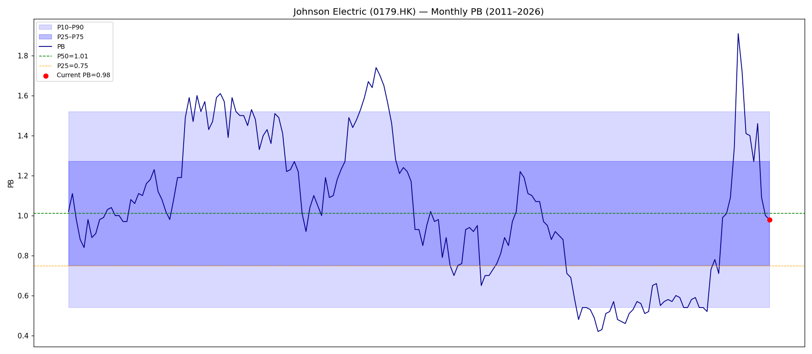
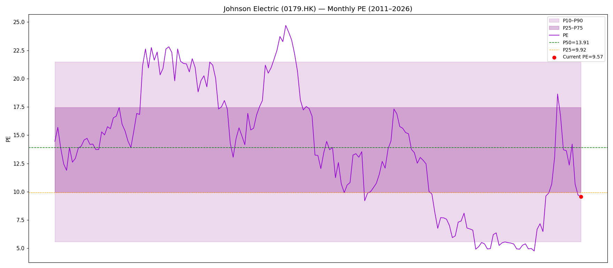

# 德昌電機（0179.HK）Kenneth股票法分析報告 v2

**報告日期：** 2026年5月5日
**現價：** HKD 20.88（2026年5月4日收市）
**市值：** 約193億港元（9.247億股）
**分析框架：** Kenneth股票法（15節完整版）

---

> **⚠️ 重要更新：利潤預警（2026年4月22日）**
> 德昌電機發出盈利警告，預期FY2026（截至2027年3月）純利按年下跌21-25%。股價當日從HKD 25.68暴跌至HKD 21.30，跌幅17.1%。截至撰稿日現價HKD 20.88，較預警前高位累跌18.7%。

---

## 第一節：執行摘要（結論先行）

### 核心判斷

**評級：審慎觀察（Hold/Watch），非立即買入**

德昌電機是一家擁有60年歷史、全球佈局的精密電機製造龍頭，基本面紮實，管理層誠信記錄良好，資產負債表強健，淨現金達4.32億美元。然而，**關稅衝擊正在重創其短期盈利能見度**，FY2026純利料跌21-25%，加上管理層坦承無法提供全年指引，市場的不確定性折扣合理存在。

當前估值（PB 0.98x，P43百分位；PE 9.57x，P22百分位）相對歷史偏低，但距離極值買入區（PB P10=0.54x，PE P10=5.51x）仍有距離。若以均值回歸邏輯，現價有中等安全邊際，但非「歷史性低估」。

**關鍵問題不是「能否熬過」，而是「關稅衝擊是否永久結構性」。**若非，則當前是偏向合理至略低估的積累時機；若是，則需等待更深跌幅。

### 預警事件快照

| 項目 | 數據 |
|------|------|
| 預警日期 | 2026年4月22日 |
| 預警內容 | FY2026純利按年下跌21-25% |
| 根本原因 | 關稅導致邊際收窄，收入大致持平 |
| 能見度 | 管理層明確表示無法提供全年指引 |
| 股價反應 | -17.1%（當日：25.68→21.30） |
| 現價（5月4日） | 20.88，較預警前累跌-18.7% |

### 一句話結論

> 德昌是好公司遇上壞天氣，但壞天氣幾時完沒人知。在關稅前景明朗化之前，以PB 1.0x附近分批吸納，並設定清晰論點打破點，是合理策略。

---

## 第二節：公司概覽

### 業務性質

德昌電機控股有限公司（Johnson Electric Holdings Limited，港交所：0179.HK）成立於1959年，總部位於香港，是全球最大的電機及驅動系統製造商之一。公司產品涵蓋微型馬達、感應器、驅動器及相關電子元件，廣泛應用於汽車、工業、醫療及消費品等範疇。

**業務分部：**
- **汽車產品部（Automotive Products Group, APG）**：為全球汽車OEM提供電機及執行器系統，應用範圍包括動力窗調節、座椅調節、煞車系統、冷卻風扇、電子轉向等。此部分佔集團收入約65-70%。
- **行業、醫療及消費品部（Industrial, Medical & Commercial, IMC）**：為工業設備、醫療器械及家用電器提供驅動方案，佔收入約30-35%。

### 競爭地位

- **全球前三大汽車電機供應商**，客戶涵蓋全球主要汽車品牌
- 在全球超過20個國家設有製造基地，形成多元化地理分佈
- 核心競爭優勢在於**精密製造工藝、多代技術積累與廣泛的全球客戶關係**
- 新興戰略：積極搶攻**中國OEM出口市場**，藉助中國電動車出口浪潮擴大APG份額

### 財務規模（FY2025）

| 指標 | 數值 |
|------|------|
| 收入 | USD 36.48億 |
| 調整後EBITA | USD 3.44億 |
| 純利 | USD 2.628億 |
| 毛利率 | 23.1% |
| 淨現金 | USD 4.32億 |
| 資本開支 | USD 1.96億 |
| 股息 | USD 7.8美仙/股 |

---

## 第三節：市場擔憂什麼？

### 核心憂慮清單（按嚴重程度排列）

**1. 關稅衝擊的不確定性（最高危）**
美國對中國出口商品徵收高額關稅，德昌部分產品在中國生產後出口至美國客戶，直接影響毛利率。更棘手的是，**供應鏈傳導機制複雜**——客戶要求降價補貼、原材料成本上升、客戶轉移訂單等連鎖效應難以量化。管理層已坦承「供應鏈複雜性難以量化」，並明確拒絕提供全年指引，這本身就是重大信號。

**2. 汽車行業結構性轉型**
全球汽車電動化趨勢對德昌的衝擊是雙面的：電動車需要更多電機（利好），但部分傳統燃油車電機需求萎縮（利淡）。短期內，電動車客戶的切換過渡期令訂單能見度下降。

**3. 盈利警告的幅度超預期**
市場事前預期關稅影響有限，但21-25%的純利下跌幅度明顯超出共識預期，顯示德昌的對沖能力或價格轉嫁能力不如外界樂觀。

**4. 收入增長停滯**
FY2021-FY2025五年間，收入從USD 31.56億增至USD 36.48億，年複合增長率僅約3.0%，低於名義GDP增速。公司體量龐大，有機增長空間受限。

**5. 中國出口OEM戰略的執行風險**
管理層表示「預期5年內佔APG銷售顯著增長」，但中國OEM出口市場競爭激烈，且本身也受到關稅及地緣政治影響。戰略願景與執行落地之間存在不確定性。

**6. 估值缺乏催化劑**
即使估值偏低（PE 9.57x），但在盈利能見度模糊的環境下，市場難以給予重新評級，股票可能陷入「價值陷阱」狀態持續一段時間。

---

## 第四節：最新業績快照（FY2025）

**財政年度：截至2026年3月（FY2025）**

### 損益摘要

| 項目 | FY2025 | FY2024 | 按年變動 |
|------|--------|--------|---------|
| 收入（USD M） | 3,648 | 3,814 | -4.4% |
| 調整後EBITA（USD M） | 344 | — | — |
| 純利（USD M） | 262.8 | 229.2 | +14.7% |
| 毛利率 | 23.1% | — | — |
| ROE | 10.0% | 9.1% | +0.9ppt |
| 每股盈利（HKD，年化） | 2.18 | — | — |
| 每股股息（USD） | 7.8美仙 | — | — |

### 資產負債表亮點

| 項目 | FY2025 | FY2024 |
|------|--------|--------|
| 淨現金（USD M） | 432 | 230 |
| 資本開支（USD M） | 196 | — |

**解讀：**

FY2025是一份好壞參半的成績單。純利按年增長15%，ROE升至10%，達近年最高水準，且淨現金大幅提升至4.32億美元（較上年增長逾87%），顯示現金轉換能力強勁。然而，**收入卻按年下跌4.4%**，反映需求端疲弱。更關鍵的是，這份「靚麗」的FY2025業績，是在FY2026已爆出嚴重盈利預警的背景下發布的——業績好，但前景差，市場的眼光已投向未來12個月。

---

## 第五節：當前估值快照

### 估值數據（2026年5月4日）

| 指標 | 當前值 | 歷史百分位 | 解讀 |
|------|--------|----------|------|
| 股價 | HKD 20.88 | — | 預警後低位 |
| 每股賬面值（BVPS） | HKD 21.28 | — | 股價略低於賬面值 |
| PB | 0.98x | P43（181個月） | 歷史中位數附近略低 |
| 每股盈利（EPS，年化） | HKD 2.18 | — | 基於FY2025全年 |
| PE | 9.57x | P22（181個月） | 歷史上偏低四分位 |
| 市值 | ~193億港元 | — | |

### 估值解讀

**PB P43：屬中等偏低，非極端低估。**
- PB中位數（P50）= 1.01x，現在0.98x僅略低於歷史中間值
- 若要達到歷史性低估水平（P10=0.54x），股價需跌至約HKD 11.5

**PE P22：明顯偏低，但預警後的EPS有向下修正壓力。**
- 若FY2026純利下跌22%，EPS將從HKD 2.18降至約HKD 1.70
- 按FY2026 EPS HKD 1.70計算，現價PE實際約12.3x（P35左右）
- 即「預警後PE」比表面數字高出約28%

**關鍵注意：現時PE 9.57x基於FY2025業績，但FY2026即將大幅下滑。用前向PE看，估值並不如表面便宜。**

---

## 第六節：歷史PB/PE估值帶分析（181個月數據）

### PB估值帶

**PB分佈統計（2011年1月—2026年5月，181個月）：**

| 百分位 | PB倍數 | 對應股價含義 |
|--------|--------|------------|
| P10（歷史極低） | 0.54x | 極度低估，重大危機時期 |
| P25 | 0.75x | 偏低，壓力時期 |
| **P50（中位數）** | **1.01x** | 歷史公允值 |
| P75 | 1.27x | 偏高 |
| P90 | 1.52x | 歷史高估 |
| **當前（P43）** | **0.98x** | 略低於中位數 |

### PE估值帶

**PE分佈統計（2011年1月—2026年5月，181個月）：**

| 百分位 | PE倍數 | 對應股價含義 |
|--------|--------|------------|
| P10（歷史極低） | 5.51x | 極度低估 |
| P25 | 9.89x | 偏低 |
| **P50（中位數）** | **13.91x** | 歷史公允值 |
| P75 | 17.35x | 偏高 |
| P90 | 21.34x | 歷史高估 |
| **當前（P22）** | **9.57x** | 偏低（但基於FY2025 EPS） |

### 估值帶歷史規律觀察

1. **PB長期在0.75-1.27x（P25-P75）之間震盪**，當前P43屬「不上不下」，尚未到真正的買入甜蜜點。

2. **PE歷史上曾兩次跌破P10（5.51x）**：一次在2016年行業低谷，一次在FY2020 COVID衝擊期間（但彼時虧損，PE無意義）。當前PE P22在歷史上屬於「低但非極端低」。

3. **PB與PE走勢的背離**警示：PE P22遠低於PB P43，說明市場已對未來盈利能力打了折扣——反映FY2026預警的影響已部分反映在PE而非PB之中。

4. **歷史規律：每當PB跌穿0.75x（P25），往往是3年期的超額回報入場點。** 當前PB 0.98x離此尚有20%空間。

---

## 第七節：10年財務全景（FY2016—FY2025）

### 核心財務數據表

| 財政年度 | 收入（USD M） | 純利（USD M） | 純利率 | ROE | 特殊事項 |
|---------|------------|------------|-------|-----|---------|
| FY2016 | 2,236 | 173.0 | 7.7% | 9.2% | 行業低谷期 |
| FY2017 | 2,776 | 237.9 | 8.6% | 12.4% | 強勁復甦 |
| FY2018 | 3,237 | 264.0 | 8.2% | 12.4% | 峰值盈利期 |
| FY2019 | 3,280 | 281.3 | 8.6% | 12.7% | 歷史盈利高峰 |
| FY2020 | 3,071 | **-493.7** | **-16.1%** | **-21.4%** | COVID+大規模重組撥備 |
| FY2021 | 3,156 | 212.0 | 6.7% | 9.8% | 快速復甦 |
| FY2022 | 3,446 | 146.4 | 4.2% | 6.5% | 供應鏈成本壓力 |
| FY2023 | 3,646 | 157.8 | 4.3% | 6.5% | 溫和增長，邊際受壓 |
| FY2024 | 3,814 | 229.2 | 6.0% | 9.1% | 邊際改善，收入創新高 |
| FY2025 | 3,648 | **262.8** | **7.2%** | **10.0%** | 純利近6年最高，收入轉跌 |

### 趨勢分析

**收入：**
- 10年複合增長率約5.3%（2,236→3,648 USD M）
- FY2018-FY2025七年間收入增長僅13%，顯示成熟期增長放緩
- FY2025收入按年跌4.4%，是近年罕見的收入倒退

**盈利質量：**
- 扣除FY2020特殊虧損，純利趨勢是：低谷→反彈→壓縮→逐步修復
- FY2025的10% ROE是近6年最高，但若以FY2026預警折算，即將回落至約7-8%

**ROE分析：**
- 正常年份ROE維持在9-13%，屬「平庸但穩定」區間
- 從未出現過持續10%以上ROE的高增長期，說明業務壁壘深度有限
- 但也從未出現過（正常環境下）嚴重惡化，體現業務韌性

**現金積累：**
- 淨現金從FY2024的USD 2.30億增至FY2025的USD 4.32億，大增近90%
- 資本開支USD 1.96億，相當於收入的5.4%，屬製造業正常水平
- **現金積累速度加快，是未來股息或回購的潛在支撐**

---

## 第八節：ROE及杜邦分解分析

### FY2025杜邦三因子分解（估算）

| 因子 | 數值 | 計算基礎 |
|------|------|---------|
| 純利率（Net Margin） | 7.2% | 262.8 / 3,648 |
| 資產週轉率（Asset Turnover） | ~0.81x | 收入 / 估算總資產USD ~45億 |
| 財務槓桿（Equity Multiplier） | ~1.75x | 總資產 / 股東權益~USD 26億 |
| **ROE（驗算）** | **~10.2%** | 7.2% × 0.81 × 1.75 |

### 歷史ROE驅動因子觀察

**純利率（最核心的波動因子）：**
- 正常期：8-9%（FY2017-FY2019）
- 壓力期：4-6%（FY2021-FY2023）
- FY2025：7.2%，處於恢復軌道
- FY2026預警後：料回落至約5-6%

**資產週轉率（相對穩定）：**
- 製造業屬性，資產週轉率歷年在0.75-0.90x之間，變化不大
- 反映重資產製造業的固有特性，難以大幅改善

**財務槓桿（保守穩健）：**
- 德昌負債率保守，淨現金狀態意味著財務槓桿倍數較低
- 不依賴槓桿拉升ROE，是財務穩健的體現，但也限制了ROE上限

### ROE天花板分析

德昌的ROE難以突破15%的根本原因：
1. **製造業屬性**：需要持續大額資本開支維持設備更新（FY2025資本開支USD 1.96億）
2. **客戶議價能力**：汽車OEM客戶強勢，長期下壓供應商利潤
3. **地域多元化成本**：全球20+製造基地帶來管理及協調成本
4. **技術護城河深度有限**：電機製造技術成熟，競爭者可追趕

**結論：德昌是「慢慢賺、穩定賺」的生意，不是高ROE複利機器。以低PB買入才能彌補ROE不高的先天劣勢。**

---

## 第九節：三表質量診斷

### 損益表質量

**正面指標：**
- FY2025毛利率23.1%，趨勢上比FY2022-FY2023的約20%有所改善
- 純利率7.2%，連續兩年改善，並未依賴非經常性項目
- 調整後EBITA USD 3.44億，排除特殊項後盈利能力清晰可見

**負面指標：**
- FY2026盈利預警顯示毛利率正遭受關稅侵蝕，23%以上的毛利率難以維持
- 收入增長停滯（FY2025按年-4.4%），缺乏收入槓桿

**質量評分：B+**（盈利真實，但前景受壓）

### 資產負債表質量

**正面指標：**
- 淨現金USD 4.32億，處於近年高位，且較FY2024大幅提升
- 無明顯商譽泡沫風險（製造業為主，收購歷史較審慎）
- 股東權益規模穩健（估算約USD 26億），未有被侵蝕

**負面指標：**
- 製造業固有的大量固定資產，資產流動性偏低
- 全球多地製造基地帶來跨幣種風險（美元、人民幣、歐元等）

**質量評分：A-**（現金充裕，負債保守）

### 現金流量表質量

**正面指標：**
- 淨現金由USD 2.30億升至USD 4.32億，顯示FY2025自由現金流強勁
- 資本開支USD 1.96億屬合理水平，未出現過度擴張跡象
- 現金轉換週期（CCC）管理良好

**負面指標：**
- 資本開支與折舊之比需持續關注（製造業維護性資本開支偏高）

**現金流質量評分：A**（現金生成能力良好）

### 三表綜合評分

| 財務報表 | 質量評分 | 關鍵亮點 | 主要風險 |
|---------|---------|---------|---------|
| 損益表 | B+ | 盈利真實，邊際改善 | FY2026受壓 |
| 資產負債表 | A- | 淨現金，無高危負債 | 固定資產龐大 |
| 現金流量表 | A | 自由現金流充裕 | 資本開支持續高企 |
| **綜合** | **A-** | **財務健康，非財務陷阱** | **盈利週期性波動** |

---

## 第十節：業務質量評估

### 護城河評分（5分制）

| 維度 | 評分 | 具體證據 |
|------|------|---------|
| 客戶黏性 | 3.5/5 | 汽車OEM換供應商成本高，但非不可替代 |
| 技術壁壘 | 3/5 | 精密製造工藝積累，但技術非獨家 |
| 規模優勢 | 4/5 | 全球前三大，規模採購及生產攤薄成本 |
| 品牌定價力 | 2.5/5 | B2B業務，品牌對最終消費者無感知 |
| 切換成本 | 3.5/5 | 嵌入汽車平台設計，切換需再認證（1-3年） |
| **綜合護城河** | **3.3/5** | 中等護城河，非寬護城河 |

### 業務質量具體證據

**正面證據：**

1. **60年持續經營，從未退出核心市場**
   - 自1959年成立，歷經多次行業週期（石油危機、金融海嘯、COVID）均能存活並恢復
   - 說明業務模式具備基本韌性

2. **汽車OEM認證壁壘**
   - 進入新汽車OEM平台需通過嚴苛的IATF 16949認證及平台驗證，通常歷時18-36個月
   - 一旦進入，客戶輕易不換供應商，黏性較高

3. **電動車趨勢中的受益方**
   - 傳統燃油車每輛用約70-80個電機，純電車用約120-150個電機
   - 電動化浪潮長期利好電機需求增長

4. **中國OEM出口戰略**
   - 比亞迪、吉利、奇瑞等中國OEM大規模出口歐洲、東南亞，德昌正積極切入這些客戶
   - 管理層預期5年內此業務佔APG銷售顯著增長——如成功，是重要的新增長引擎

**負面證據：**

1. **利潤率偏薄**
   - 淨利率長期在4-9%之間，屬製造業典型偏薄水平
   - 與高科技軟件或消費品牌相比，定價能力明顯較弱

2. **客戶集中在成熟汽車品牌，增長受行業限制**
   - 主要客戶為歐美日系成熟車廠，這批客戶的電動化轉型緩慢，訂單增速受限

3. **關稅衝擊暴露供應鏈脆弱性**
   - 部分生產在中國，出口至美國及歐洲，關稅戰使地理集中風險暴露
   - 短期轉移生產線成本高昂，顯示供應鏈靈活性有限

---

## 第十一節：管理層展望、信譽及執行驗證

### 11A：歷年展望與實際表現對照表（10年）

| 財年 | 管理層上年展望 | 實際ROE | 達標？ | 點評 |
|------|------------|--------|-------|------|
| FY2016 | 預計行業低谷，謹慎經營 | 9.2% | ✅ | 誠實展望低谷期 |
| FY2017 | 預計穩步增長，訂單改善 | 12.4% | ✅ | 兌現復甦承諾 |
| FY2018 | 預計邊際持續擴張 | 12.4% | ✅ | 準確，維持高峰 |
| FY2019 | 預計強勁增長，汽車需求旺盛 | 12.7% | ✅ | 盈利歷史高峰 |
| FY2020 | 預計COVID衝擊可控 | -21.4% | ❌ | 大規模重組撥備，非預期 |
| FY2021 | 預計疫後快速恢復 | 9.8% | ✅ | 兌現復甦 |
| FY2022 | 預計邊際壓力，原材料通脹 | 6.5% | ✅ | 誠實預警成本壓力 |
| FY2023 | 預計溫和擴張，邊際逐步修復 | 6.5% | ⚠️ | 修復不如預期，部分達標 |
| FY2024 | 預計邊際擴張加速 | 9.1% | ✅ | 明顯改善，兌現 |
| FY2025 | 預計收入承壓但邊際改善 | 10.0% | ✅（超預期） | 收入跌但純利升，優於預期 |

**達標統計：10年中8.5次達標（FY2023算0.5），1次大失手（FY2020屬非可控事件），整體誠信記錄優良。**

### 11B：管理層信譽評分

| 評估維度 | 評分 | 根據 |
|---------|------|------|
| 預警及時性 | 4/5 | FY2026預警在財年初期已發出 |
| 展望準確度 | 4/5 | 10年8+次達標 |
| 面對逆境的誠信 | 4.5/5 | FY2022主動預警成本壓力，未粉飾 |
| 資本配置 | 3.5/5 | 股息穩定，但回購力度有限 |
| 溝通透明度 | 4/5 | 就關稅不確定性主動說「無法提供指引」，誠實 |
| **綜合評分** | **4.0/5** | **管理層可信度高** |

### 11C：綜合判斷

**管理層信譽結論：德昌管理層屬於「可信型」而非「促銷型」。** 他們在好時不過度承諾，在壞時主動預警。FY2026盈利預警的發出時機（財年早期）而非拖延到年中，是信譽的正面訊號。FY2020的大失手屬COVID重組撥備，本質上是非可控外生衝擊，不應視為管理層誠信問題。

### 11D：當前展望深度分析（FY2026）

**管理層FY2026展望逐步拆解：**

**第1步：確認管理層原話（FY2025年報展望部分）**

> "25/26年度首數週銷售按年跌mid-single digit"
>
> "受關稅影響的銷售約佔mid-single digit百分比，供應鏈複雜性難以量化"
>
> "將維持審慎樂觀，繼續投入資源搶攻中國OEM出口份額，預期5年內佔APG銷售顯著增長"

**第2步：量化「mid-single digit」**

「mid-single digit」通常指約4-6%。即：
- 收入：FY2026預計按年跌4-6%，由USD 3,648M降至約USD 3,430-3,502M
- 受關稅影響的銷售佔比4-6%：即USD 146-219M的銷售受直接衝擊

**第3步：評估純利影響**

盈利警告明確指出純利跌21-25%：
- FY2025純利：USD 262.8M
- FY2026預計純利：USD 197-208M（中位數：USD 202M）
- 意味著關稅導致的純利損失約USD 55-66M
- 相較受影響收入USD 146-219M，說明關稅影響已非直接，還涉及客戶要求降價補貼、重組成本等二次效應

**第4步：評估管理層的「無法提供指引」**

這是一個重要訊號。管理層過去10年均有提供指引，此次明確拒絕，說明：
- 關稅政策高度不確定（取決於中美貿易談判）
- 客戶訂單轉移速度難以預測
- 供應鏈調整成本難以量化

這並非管理層隱瞞，而是**誠實承認能見度不足**，符合其一貫的誠信風格。

**第5步：評估「審慎樂觀」的真實含義**

「審慎樂觀」（cautiously optimistic）在企業語言中通常指：短期有壓力，但中期信心未失。管理層「繼續投入資源搶攻中國OEM出口份額」表明他們用真金白銀投票，並非口頭樂觀。

**第6步：中國OEM戰略的潛在上行**

若未來2-3年中國OEM出口持續擴張，且德昌成功切入，這可能成為抵消關稅衝擊的重要增量。然而：
- 中國OEM出口本身也面臨關稅（中國整車出口至歐美亦受限）
- 競爭對手（包括中國本土電機廠）同樣爭搶此市場
- 5年時間框架屬中長期，短期難以估算貢獻

**第7步：整體結論**

FY2026展望反映：**一個誠實但能見度極低的環境**。管理層坦承困難，堅持中長期投入。對長線投資者而言，這是「黑暗但不是末日」的訊號；對重視短期能見度的投資者而言，則應等待更清晰的訊號再行動。

---

## 第十二節：暫時性 vs 可修復 vs 結構性問題診斷

### 問題分類框架

| 問題 | 分類 | 分析 | 時間框架 |
|------|------|------|---------|
| 關稅對毛利率的直接壓縮 | **暫時性（高概率）** | 關稅政策取決於地緣政治，歷史上貿易爭端均有緩和或調整 | 12-36個月 |
| 供應鏈結構性調整成本 | **可修復（中概率）** | 德昌可逐步將部分生產線從中國遷至越南、印度等地，但需2-3年 | 24-48個月 |
| 收入增長停滯 | **可修復（中概率）** | 中國OEM出口戰略如執行成功，可重啟增長引擎 | 36-60個月 |
| ROE無法突破15% | **結構性** | 製造業屬性、汽車OEM客戶強議價，ROE天花板難以打破 | 長期 |
| 汽車行業電動化轉型不確定性 | **結構性（但含機遇）** | 電動車用更多電機，長期利好；但過渡期訂單波動 | 5-10年 |

### 診斷結論

**核心問題（FY2026盈利下跌21-25%）屬暫時性+可修復的混合體，而非結構性惡化。**

支持此結論的理由：
1. 關稅政策歷史上均有調整空間（美中FY2020-2025貿易摩擦期間最終達成部分協議）
2. 德昌淨現金USD 4.32億提供充足緩衝，無財務危機風險
3. 管理層正在積極應對（投入資源+供應鏈調整），非被動等待
4. 業務基本面（技術、客戶關係、製造能力）未受損

**主要反駁觀點（不確定性）：**
- 若中美貿易戰持續升溫，關稅長期化，則「暫時性」可能變為「半結構性」
- 若中國OEM出口戰略執行不及預期，收入增長引擎缺失

---

## 第十三節：情景估值分析

### 估值假設框架

**核心參數：**
- 當前BVPS：HKD 21.28
- FY2025 EPS（年化）：HKD 2.18
- FY2026預期EPS（按純利跌22%估算）：約HKD 1.70
- 歷史PB中位數：1.01x；PE中位數：13.91x

### 三情景估值

#### 熊市情景（Bear Case，概率25%）

**假設：**
- 關稅持續惡化，FY2026純利下跌25%（接近預警上限）
- FY2027難以復甦，純利繼續下跌5-10%
- 市場給予歷史低位PB（P25=0.75x）

**估值計算：**

| 方法 | 計算 | 目標價 |
|------|------|-------|
| FY2026 PB 0.75x | BVPS ~HKD 21 × 0.75 | **HKD 15.75** |
| FY2026 PE 7x × EPS HKD 1.70 | — | **HKD 11.90** |
| 熊市目標區間 | 兩者均值 | **HKD 13-16** |

**熊市下行空間：** 較現價（20.88）下跌約23-38%

#### 基本情景（Base Case，概率50%）

**假設：**
- FY2026純利下跌22%，符合預警中間值
- FY2027關稅部分緩解，純利恢復約15%
- 市場估值逐步回歸PB 1.0-1.1x（中位數附近）

**估值計算：**

| 方法 | 計算 | 目標價 |
|------|------|-------|
| FY2027 PB 1.0x | 預估BVPS ~HKD 22 × 1.0 | **HKD 22.00** |
| FY2027 PE 12x × EPS HKD 1.95 | （FY2027純利恢復估算） | **HKD 23.40** |
| 基本情景目標區間 | 18個月目標 | **HKD 22-24** |

**基本情景潛在回報：** 較現價上升約5-15%，加上股息約1.5-2%，總回報約7-17%

#### 牛市情景（Bull Case，概率25%）

**假設：**
- 關稅問題於FY2026年底意外改善（中美達成貿易協議）
- FY2026純利下跌幅度輕微（僅跌15%，優於預警）
- 中國OEM出口業務超預期爬坡，重燃市場對成長性的憧憬
- 估值修復至PB 1.25x（P75）

**估值計算：**

| 方法 | 計算 | 目標價 |
|------|------|-------|
| FY2026 PB 1.25x | BVPS ~HKD 21.5 × 1.25 | **HKD 26.88** |
| FY2027 PE 15x × EPS HKD 2.20 | （盈利快速恢復） | **HKD 33.00** |
| 牛市情景目標區間 | 18個月目標 | **HKD 27-33** |

**牛市潛在回報：** 較現價上升約29-58%

### 情景加權預期回報

| 情景 | 概率 | 目標價（中位） | 預期回報 |
|------|------|-------------|---------|
| 熊市 | 25% | HKD 14.5 | -30.5% |
| 基本 | 50% | HKD 23.0 | +10.2% |
| 牛市 | 25% | HKD 30.0 | +43.8% |
| **加權預期回報** | 100% | — | **+8.4%** |

**結論：** 加權預期回報約8.4%（不含股息），風險回報比偏向合理，尚未到「高確信度」買入水平。若關稅形勢改善，風險回報比將顯著向上傾斜。

---

## 第十四節：投資適配性分析（Kenneth投資風格）

### Kenneth投資風格要求

基於Kenneth股票法的核心原則：
- 買質量良好的公司在估值低位（低PB+低PE）
- 偏好現金充裕、管理層誠信、有護城河的公司
- 重視股息及回購作為持股期間的「等待薪酬」
- 接受週期性波動，但需能判斷「暫時性」vs「結構性」問題

### 德昌電機的適配性評估

| 標準 | 德昌表現 | 評分 |
|------|---------|------|
| **估值是否低？** | PB P43（中性），PE P22（偏低但基於舊EPS） | ⭐⭐⭐ |
| **業務質量** | 中等護城河，製造業屬性，非高ROE複利機器 | ⭐⭐⭐ |
| **管理層誠信** | 10年記錄良好，預警及時，不誇大前景 | ⭐⭐⭐⭐ |
| **資產負債表強度** | 淨現金USD 4.32億，財務健康 | ⭐⭐⭐⭐⭐ |
| **股息支撐** | FY2025股息USD 7.8美仙，以當前股價約2%股息率 | ⭐⭐⭐ |
| **問題可逆性** | 關稅問題大概率暫時性，不是業務模式崩潰 | ⭐⭐⭐⭐ |
| **催化劑明確度** | 中美貿易政策難以預測，催化劑不明確 | ⭐⭐ |
| **綜合適配性** | | **⭐⭐⭐（合適但非首選）** |

### 操作建議框架

**核心立場：** 分批積累，設定清晰邊界

**第一批（現在）：** PB 0.98x接近中位數，可考慮以組合2-3%倉位試水，作為「質量公司低估值觀察倉」。

**加倉觸發條件（任何一條）：**
- PB跌至0.80x以下（HKD ~17），估值進入歷史偏低區
- 關稅前景明朗化（中美貿易談判取得突破性進展）
- FY2026半年業績優於預警下限（下跌不足21%）
- 中國OEM出口業務首次出現大額訂單公告

**減倉/止損觸發條件（論點打破點）：**
- FY2026純利跌幅超出預警上限（超過25%），說明管理層預測不可信
- 管理層宣布削減股息超過50%（現金流惡化訊號）
- 淨現金由盈轉虧（轉為淨負債），財務健康逆轉
- 中國OEM戰略明確失敗（對手奪走目標客戶）

**不適合的投資者類型：**
- 需要短期確定性回報的投資者
- 無法承受進一步20-30%下跌的投資者
- 期待「高增長」驅動的投資者（德昌非此類）

---

## 第十五節：關鍵監察點及論點打破條件

### 定期監察清單（每季度）

**財務指標：**
- [ ] 毛利率是否維持在20%以上（FY2025：23.1%，若跌破20%則警示）
- [ ] 淨現金是否維持正數（若轉為淨負債需重新評估）
- [ ] ROE是否在FY2027開始回升（若長期低於7%則估值需重新定錨）

**業務指標：**
- [ ] APG（汽車產品部）收入有否企穩或增長（FY2026首半年）
- [ ] 中國OEM客戶訂單有否可見的增長趨勢
- [ ] 新客戶公告（特別是中國電動車廠相關）

**宏觀指標：**
- [ ] 中美貿易談判進展（特別是汽車零件關稅稅率）
- [ ] 全球汽車生產量（SAAR）趨勢
- [ ] 歐洲電動車政策（影響德昌歐洲OEM客戶訂單）

### 論點打破條件（Thesis Breakers）

以下任何一條出現，代表當初買入的論點已被打破，需要嚴肅重新評估：

**紅線一：盈利惡化超出預警範圍**
- 如果FY2026全年純利跌幅超過30%（預警上限為25%），說明管理層對形勢判斷嚴重失誤，或有額外隱患未披露

**紅線二：現金流逆轉**
- 如果FY2026淨現金由USD 4.32億跌破USD 1億，甚至轉為淨負債，說明業務現金生成能力受到根本性破壞

**紅線三：客戶流失**
- 如果主要汽車OEM客戶（任何一個佔收入5%以上的客戶）公開宣布更換電機供應商，說明護城河比預期更低

**紅線四：管理層信譽崩潰**
- 如果FY2026半年業績公告的數字比預警範圍更差，且無合理解釋，說明管理層可信度受損

**紅線五：中國OEM戰略明確失敗**
- 如果FY2028年報中APG分部的中國OEM收入貢獻未見增長，5年承諾落空，說明增長邏輯不成立

### 正面催化劑（Thesis Confirmers）

以下任何一條出現，代表論點正在向好方向發展：

1. **關稅緩解**：中美關稅部分撤回或行業豁免，直接改善毛利率
2. **訂單超預期**：FY2026半年業績收入跌幅小於管理層「mid-single digit」預測
3. **中國OEM突破**：取得比亞迪、吉利或奇瑞等主要品牌的新平台訂單公告
4. **股息上調或回購**：管理層以淨現金回饋股東，體現對前景的信心
5. **估值修復**：PB突破1.1x，確認市場重新評級訊號

---

## 附錄：FY2025年報管理層展望原文

以下為德昌電機FY2025年報中就FY2026的管理層展望原文，供分析參考：

> "25/26年度首數週銷售按年跌mid-single digit"

> "受關稅影響的銷售約佔mid-single digit百分比，供應鏈複雜性難以量化"

> "將維持審慎樂觀，繼續投入資源搶攻中國OEM出口份額，預期5年內佔APG銷售顯著增長"

以及FY2026盈利預警（2026年4月22日）核心內容：
- FY2026純利預計按年下跌21-25%
- 收入大致持平（即邊際壓縮是主因，非收入崩潰）
- 由於關稅政策高度不確定，管理層無法提供全年指引

---

*本報告依據公開資料撰寫，僅供參考，不構成投資建議。所有估值均為分析估算，實際結果可能因市場環境、政策變化及公司經營狀況而有重大差異。*

*報告版本：v2 | 分析框架：Kenneth股票法 | 撰寫日期：2026年5月5日*
