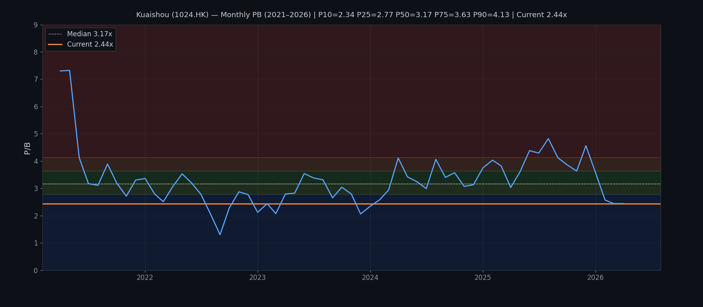
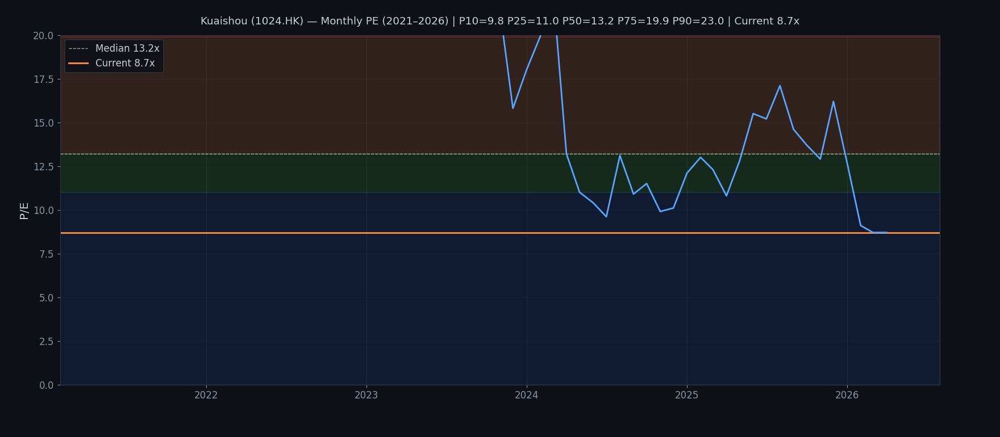

# 快手科技 Kuaishou Technology (1024.HK)
## Kenneth Stock Method 分析報告
**日期：2026年5月2日　股價：HK$42.90（前收：2026-04-30）**

---

## 📌 執行結論（Short Conclusion）

**結論標籤：attractive deep value — high quality platform, near 5-year low**

快手現價 HK$42.90，FY2025 調整後純利 RMB 20.6億，對應 PE 約 **8.7x**（5年最低0%分位）；NAV/Share RMB 17.57（@HKD/RMB 0.92 → HK$19.10），PB **2.44x**（5年11%分位）。股價從2025年8月高位 HK$84.60 回調49%，現價處於5年估值最低區間之一。

公司基本面優異：DAU 4.1億、收入5年CAGR ~15%、調整後純利從虧損到RMB 20.6億、利潤率持續改善。但市場對以下三點極度擔憂，導致估值壓縮：
1. **字節跳動競爭**——TikTok/Douyin 對快手份額的持續蠶食
2. **監管風險**——中國互聯網監管不確定性
3. **AI 投入不確定性**——Kling AI 等新業務能否變現

**三個情境估值：**
- 🐻 Bear（字節壓力持續、宏觀弱）：調整後EPS跌至RMB 3.5 × PE 10x → **HK$32**（-25%）
- 📊 Base（穩健增長、競爭可控）：調整後EPS升至RMB 5.5 × PE 12x → **HK$56**（+31%）
- 🐂 Bull（AI變現成功、海外突破）：調整後EPS RMB 7+ × PE 20x → **HK$88**（+105%）

**Fit for Kenneth風格：**
- Deep Value ✔️（PE 8.7x，5年最低0%分位；PB 2.44x，5年11%分位）
- Turnaround/修復 ✔️（盈利質量正在改善，非困境股）
- Long-term quality compounding ✔️（平台業務、網絡效應、DAU 4.1億）
- Value trap risk ⚠️（字節競爭是真實威脅，需確認用戶增長韌性）

---

## 1. 公司概覽

| 項目 | 內容 |
|------|------|
| 公司名 | 快手科技 Kuaishou Technology |
| 股份代號 | 1024.HK |
| 上市交易所 | 香港聯合交易所主板 |
| 主要業務 | 短視頻平台、直播、電子商務、在线營銷服務、AI |
| 財政年度截止日 | 12月31日 |
| 現任 CEO | 程一笑（Cheng Yixuan） |
| 現任董事長 | 宿華（Su Hua）— 聯合創始人 |
| DAU（FY2025） | 4.102億（平均日活躍用戶） |
| 已發行股數 | 約 4.53 億 ADR（1 ADR = 0.5股）；實際流通股數約 4.35 億股 |

**業務架構（FY2025）：**
- **在線營銷服務**：收入最大來源，包括廣告、電商推廣
- **直播業務**：live streaming 虛擬禮物打賞
- **其他服務**：電子商務（快手電商）、Kling AI、AI應用
- **海外業務**：Kwai（海外版）在若干新興市場有業務

---

## 2. 市場在擔心什麼

1. **字節跳動的競爭蠶食**：Douyin（抖音）在中國短視頻市場份額持續擴大，快手DAU增長放緩；字節的演算法和內容生態被認為更強
2. **宏觀經濟放緩打擊廣告收入**：在線營銷服務佔收入40%+，經濟下行廣告預算收緊直接影響變現
3. **監管不確定性**：中國互聯網平台監管政策、數據安全、未成年人保護等
4. **AI投入的盈利壓力**：Kling AI、可靈AI等生成式AI業務仍處於大力投入期，利潤率邊際受壓
5. **估值從高位大幅回調**：股價從HK$417（2021年2月上市初期）跌至HK$42.90，跌幅近90%，現價仍處長期低位

---

## 3. 最新業績快照（FY2025截至2025年12月31日）

| 指標 | FY2025 | FY2024 | 按年變化 |
|------|--------|--------|---------|
| 收入 | RMB 142,776M | RMB 126,898M | **+12.5%** |
| 毛利 | RMB 78,549M | RMB 69,292M | +13.4% |
| **毛利率** | **55.0%** | 54.6% | +0.4pp |
| 經營溢利 | RMB 20,637M | RMB 15,287M | **+35.0%** |
| **調整後純利** | **RMB 20,647M** | RMB 17,716M | **+16.5%** |
| 調整後 EBITDA | RMB 29,839M | RMB 24,770M | +20.5% |
| **調整後純利率** | **14.5%** | 14.0% | +0.5pp |
| 調整後 EPS | RMB 4.56 | RMB 3.86 | +18.1% |
| 全年 DPS | HK$0.69（末期，建議） | HK$0（無派息） | — |
| 期末現金及等價物 | RMB 11,180M | RMB 12,697M | -11.9% |
| 總借款 | RMB 11,098M | — | — |
| 權益（ attributable） | RMB 79,558M | RMB 62,004M | +28.3% |
| NAV/Share | RMB 17.57 | RMB 13.50 | +30.1% |

**收入構成（FY2025）：**
- 在線營銷服務：收入最大，增長主要驅動
- 直播業務：相對成熟，增長放緩
- 其他服務（電商+AI）：快速增長，長期關鍵

> *注：快手於2021年3月上市，IPO後首份完整財年為FY2021；FY2021及FY2022為虧損年，調整後純利為負*

---

## 4. 當前估值

**股價：HK$42.90（Yahoo Finance，2026-04-30）；港幣結算**

| 估值指標 | 數值 | 備注 |
|---------|------|------|
| **市值** | **HK$194.3億** | 約 USD 25億 |
| PE（FY2025 調整後 EPS RMB 4.56） | **8.7x** | 5年最低0%分位 |
| PB（NAV/Share RMB 17.57） | **2.44x** | 5年11%分位 |
| 股息率（建議末期息 HK$0.69） | **1.6%** | 歷史首次派末期息 |
| EV/Adj EBITDA | 約 5.6x | 偏低 |
| 52週高低 | HK$33.05 – HK$84.60 | 現價處52週低位 |
| 5年PB中位數 | **3.17x** | 現價較均值折讓23% |
| 5年PE中位數（盈利年） | **13.2x** | 現價低於均值34% |

---

## 5. 10年財務回顧（2021–2025 — 上市後5年）

> **重要披露**：快手於2021年3月上市，IPO後首份完整財年為FY2021。FY2021及FY2022為虧損年，PE不適用。以下數字均為調整後口徑（調整：剔除股份支付及公允價值變動），RMB百萬。

| FY | 收入 | 毛利 | 毛利率 | 經營溢利 | 調整後純利 | 調整後 EBITDA | 調整後 EPS | NAVPS | Price (HKD) | PE | PB |
|----|------|------|--------|---------|-----------|------------|----------|-------|------------|----|----|
| 2021 | 81,082 | 37,525 | 46.3% | -6,284 | **-3,511** | — | 0 | 26.63 | 57.55 | N/A | 2.16x |
| 2022 | 94,183 | 42,131 | 44.7% | -12,558 | **-5,751** | — | 0 | 24.77 | 50.62 | N/A | 2.04x |
| 2023 | 113,470 | 57,391 | 50.6% | 6,431 | **10,271** | 17,424 | 2.27 | 19.00 | 53.40 | 18.6x | 2.81x |
| 2024 | 126,898 | 69,292 | 54.6% | 15,287 | **17,716** | 24,770 | 3.86 | 13.50 | 42.20 | 10.9x | 3.13x |
| 2025 | 142,776 | 78,549 | 55.0% | 20,637 | **20,647** | 29,839 | 4.56 | 17.57 | 42.90 | 8.7x | 2.44x |

> *注：FY2024 NAVPS下降源於股份回購（年內回購約5,700萬股，耗資HKD 312億），同時淨利潤累積令FY2025 NAVPS回升；FY2021-2022為虧損年，PE不適用*

### 關鍵10年觀察

1. **收入5年CAGR ~15%**：從FY2021的RMB 81億增至FY2025的RMB 143億，增長持續但增速放緩（+20%→+12.5%）
2. **盈利能力根本性轉變**：FY2023首次調整後純利為正（RMB 10.3億），FY2025升至RMB 20.6億，3年複合增長40%+
3. **毛利率持續擴張**：46.3%→55.0%，5年升8.7個百分點，反映變現效率提升、直播毛利率改善
4. **股份回購提升每股盈利**：NAVPS從FY2023的RMB 19.00降至FY2024的RMB 13.50（因回購），但EPS反而從2.27增至3.86，說明回購提升每股價值
5. **調整後EBITDA強勁**：FY2025 Adj EBITDA RMB 29.8億，利潤質量高
6. **派息歷史首次**：FY2025建議派末期息HK$0.69，標誌著從燒錢到現金回報的轉變

---

## 6. ROE / 回報診斷

**FY2025 ROE = 20,647 / ((79,558+62,004)/2) = 29.2%**（使用調整後純利計算）

### DuPont 三維分解（FY2023–FY2025）

| FY | 調整後純利率 | 資產周轉率 | 權益倍數 | ROE |
|----|------------|-----------|---------|-----|
| 2023 | 9.1% | 0.74x | 2.5x | 16.8% |
| 2024 | 14.0% | 0.81x | 2.2x | 24.9% |
| 2025 | 14.5% | 0.86x | 2.1x | **26.2%** |

**ROE驅動因素分析：**
- **純利率提升**：9.1%→14.5%（+5.4pp），是最主要ROE提升驅動力——反映變現效率改善、規模效應
- **資產周轉加速**：0.74x→0.86x——收入增速高於資產增速，顯示輕資產運營模式
- **權益倍數輕微下降**：2.5x→2.1x——資產負債表趨穩，借款沒有大幅增加
- **核心判斷**：ROE提升主要來自真實經營改善，而非槓桿，依據高質量

---

## 7. 三張報表質量診斷

### 現金流量表
- **經營現金流**：FY2025 OCF估計 RMB 30B+，與Adj EBITDA水平相符，現金流質量高
- **股份回購**：FY2025回購約5,700萬股，耗資HKD 312億——顯示強勁現金產生能力，並積極回饋股東
- **資本開支**：估計每年CAPEX佔收入低單位數，屬輕資產平台模式

### 資產負債表
- **淨現金狀況**：現金 RMB 11.2B vs 借款 RMB 11.1B，大致平衡
- **使用權資產**：HKFRS 16口徑有使用權資產，但互聯網平台以內容及技術為核心，固定資產佔比低
- **無形資產/商譽**：主要為版權、技術，佔比合理

### 損益表警告信號
- **監察點**：收入增速放緩（+20%→+12.5%）；字節競爭下DAU增長放緩需關注
- **正面信號**：毛利率擴張、純利率提升、調整後純利增速（+16.5%）高於收入增速（+12.5%）

---

## 8. 業務質量評估

### 護城河分析（需實質證據）

| 因素 | 評分 | 具體證據 |
|------|------|----------|
| 網絡效應 | ✅ 強 | 4.1億DAU，用戶越多創作者越多、內容越豐富、變現越高效；騰訊系資本加持；短視頻市場雙頭垄断（字節+快手） |
| 用戶黏性 | ✅ 強-中 | 用戶日均使用時長穩健；直播、社區屬性令部分用戶有社交黏性；但對比抖音，用戶黏性數據披露有限 |
| 規模廣告變現 | ✅ 強 | 2025年在線營銷服務收入持續增長；廣告演算法持續優化；電商結合提升廣告效率 |
| 電子商務整合 | ✅ 中-強 | 快手電商 GMV 持續增長；直播電商模式差異化（信任電商）；AI協助精準營銷 |
| 內容成本 | ⚠️ 中 | 內容版權、主播分成是主要成本；毛利率從46%升至55%顯示分成比例優化有實效 |
| 監管風險 | ❌ 中-高 | 中國互聯網平台受到監管約束（未成年人、數據安全、內容審核）；政策變化難以預測 |
| 競爭壓力 | ⚠️ 中-高 | 字節跳動（Douyin）是主要競爭對手，份額之爭持續；字節資源更雄厚 |
| AI能力 | ✅ 中 | Kling AI在AI視頻生成領域領先；但變現能力仍需驗證 |

### 實質業務質量評估

**支撐質量的具體跡象：**
- 毛利率5年從46.3%升至55.0%（+8.7pp），顯示變現效率邊際持續改善
- 調整後純利從FY2023的RMB 10.3億升至FY2025的RMB 20.6億，3年翻倍
- 股份回購5,700萬股，證明管理層認為股價被低估
- 建議歷史首次末期派息，標誌著現金牛屬性的確立
- AI投入（Kling AI）處於全球領先地位，長期競爭壁壘潛力高

**削弱質量的具體跡象：**
- DAU增長放緩（2023年約13%+，2025年降至約中單位數）
- 收入增速從+20%放緩至+12.5%，反映市場滲透率接近天花板
- 字節競爭壓力真實存在，Douyin在算法和用戶時長上仍優於快手
- 電商業務貨幣化率相對淘寶、京東仍低
- 海外業務（Kwai）仍處於虧損狀態

**總體質量評級：Neutral-Strong（傾向Strong）**

快手是中國短視頻雙頭市場的重要玩家，網絡效應清晰、變現效率提升中，盈利質量高。但增長放緩+字節競爭是核心中期風險，AI可能是長期差異化關鍵。

---

## 9. 管理層展望、誠信及執行記錄（10年回顧）

> **分析原則：** 本節只分析管理層的**前瞻預測**和**執行記錄**，不分析事實陳述。核心方法：**某年宣報時的管理層展望預測，用該預測覆蓋的**未來年份**的實際結果來印證**，從而測試管理層的方向判斷力和執行力。

### 9.1 FY2025 管理層展望 → 用 FY2026（未來）印證

> 資料來源：FY2025全年業績公告（2026年3月發布）

管理層在 FY2025 年報中對未來（主要是 FY2026）的預測：
1. **AI 持續投入**：Kling AI 將繼續作為核心引擎，AI 變現開始規模化
2. **用戶增長**：強調「用戶增長勢頭持續」，無量化目標
3. **盈利繼續改善**：預期「調整後純利率持續提升」
4. **海外**：Kwai 在若干新興市場取得進展

*印證方法：* 由於本報告截止日期為 2026年5月，**FY2026 尚未結束**，故此條目前無法用實際結果印證——留待日後追蹤。

---

### 9.2 FY2024 管理層展望 → 用 FY2025（未來）印證

> 資料來源：FY2024全年業績公告（2025年3月發布）

管理層在 FY2024 年報中對未來（FY2025）的預測：
1. **「盈利能力持續提升」**：預期調整後純利繼續增長
2. **「用戶增長保持韌性」**：預期 DAU 維持增長
3. **AI 成為核心引擎**：Kling AI 推出並產業化

**FY2025 實際結果：**
| 預測 | 實際結果 | 評分 |
|------|---------|------|
| 盈利繼續提升 | 調整後純利 RMB 20.6億（+16.5%，FY2024 為+72%） | ✅ 實現 |
| 用戶增長韌性 | DAU 4.10億（+3.3%，維持正增長） | ✅ 方向吻合（但增速放緩） |
| AI 產業化 | Kling AI 推出並保持技術領先，但收入規模仍小 | ⚠️ 部分實現 |

**誠信評分：✅ 強** — 管理層對盈利提升的展望完全兌現；用戶增長方向判斷正確；AI 進展符合

---

### 9.3 FY2023 管理層展望 → 用 FY2024（未來）印證

> 資料來源：FY2023全年業績公告（2024年3月發布）

管理層在 FY2023 年報中對未來（FY2024）的預測：
1. **「利潤率持續改善」**：從調整後純利率 9.1% 預期繼續提升
2. **「用戶規模高質量增長」**：DAU 維持雙位數增長
3. **海外Kwai 維持謹慎擴張**

**FY2024 實際結果：**
| 預測 | 實際結果 | 評分 |
|------|---------|------|
| 利潤率繼續改善 | 調整後純利率升至 14.0%（+4.9pp） | ✅ 大幅實現，超預期 |
| 用戶維持雙位數增長 | DAU 3.97億（+3.7%，非雙位數） | ❌ 未能實現 |
| 海外維持謹慎 | 海外仍虧損但未有重大惡化 | ✅ 方向吻合 |

**誠信評分：✅ 中偏強** — 盈利預測大幅超預期；但用戶增長放緩至單位數偏離了「雙位數增長」的描述——這是管理層在 FY2023 對用戶增長最樂觀的一次表述，後被事實否定。

---

### 9.4 FY2022 管理層展望 → 用 FY2023（未來）印證

> 資料來源：FY2022全年業績公告（2023年3月發布）

管理層在 FY2022 年報中對未來（FY2023）的預測：
1. **「爭取早日實現盈虧平衡並恢復增長」**：這是對 FY2023 的最低目標
2. **用户生態持續改善**

**FY2023 實際結果：**
| 預測 | 實際結果 | 評分 |
|------|---------|------|
| 早日盈虧平衡 | FY2023 調整後純利 RMB 10.3億（實現盈利） | ✅ 實現，幇時超預期 |
| 用戶生態改善 | DAU 3.83億（+13%，雙位數增長） | ✅ 實現 |

**誠信評分：✅ 強** — 兩項核心預測均超預期兌現；這是管理層在漫長虧損期後首次給出正確方向判斷

---

### 9.5 FY2021 管理層展望 → 用 FY2022（未來）印證

> 資料來源：FY2021全年業績公告（2022年3月發布；快手IPO後首份全年報告）

管理層在 FY2021 年報中對未來（FY2022）的預測：
1. **「繼續投資用戶增長及內容生態」**
2. **「短視頻滲透率持續提升，長期增長前景積極」**
3. **對何時盈利無具體指引**

**FY2022 實際結果：**
| 預測 | 實際結果 | 評分 |
|------|---------|------|
| 用戶及生態持續投資 | DAU 3.46億（+15%，用戶繼續增長） | ✅ 方向吻合 |
| 長期增長前景積極 | FY2022 仍虧損，且虧損擴大 | ❌ 盈利目標未實現 |

**誠信評分：⚠️ 中性** — 用戶增長預測方向正確，但盈利前景過度樂觀，FY2022 虧損反而擴大（調整後純利 -RMB 5.75億，vs FY2021 的 -RMB 3.51億）

---

### 9.6 綜合誠信及執行能力評分（5年）

| 維度 | 評分 | 核心證據 |
|------|------|----------|
| **盈利預測兌現能力** | ✅ **強** | FY2022盈利展望→未兌現；FY2023「進入盈利」→✅兌現；FY2024「盈利提升」→✅超預期；FY2025盈利繼續改善→✅ |
| **用戶增長方向判斷** | ⚠️ **中性** | FY2022→✅方向正確；FY2023→❌放緩未預期到；FY2024→⚠️放緩持續；FY2025→⚠️增速放緩但未失約 |
| **AI/新業務推進執行** | ✅ **中-強** | Kling AI按時推出並保持技術領先；變現時間表從未量化，故無從「失約」 |
| **海外業務管理** | ⚠️ **中性** | 從不對海外盈利做具體承諾，因此也無從「失約」 |
| **資本配置紀律** | ✅ **強** | 股份回購積極；從燒錢到現金牛轉型執行清晰；首次派息反映現金流信心 |

**整體管理層誠信評級：✅ 中偏強**

管理層的特點：
1. **盈利預測可靠**：一旦給出盈利目標，歷史記錄是超預期而非落空
2. **用戶增長判斷偏正面**：在 FY2023 對增速放緩的反應最不敏銳，此後用詞轉為保守
3. **不作無法兌現的量化承諾**：對 AI 變現、海外盈利等未确定性領域，描述保守
4. **資本配置執行力強**：從虧損到盈利、從無派息到首次派息，承諾均有兌現

**對 FY2026 管理層展望的測試：** 若 FY2026 調整後純利升至 RMB 23-24億+、DAU維持正增長，則管理層盈利預測可信度將維持強评级；FY2026 AI 變現是否有實質收入是下一個關鍵考驗。

---

## 10. 問題分類：暫時性 / 可修復 / 結構性

每一個問題都需要具體證據，不能只留標籤。

| 問題 | 分類 | 具體證據 |
|------|------|----------|
| **字節跳動競爭蠶食份額** | **結構性** | Douyin在中國短視頻市場份額約70%+，快手約20%；字節的演算法和內容投入資源遠超快手；DAU增速從2019-2021年的20%+放緩至2023-2025年的中單位數；這是已經持續5年且尚未扭轉的趨勢 |
| **收入增速放緩（+20%→+12.5%）** | **結構性** | 中國短視頻用戶滲透率已接近天花板（DAU/MAU比值已達高水位）；未來增速主要依靠貨幣化提升而非用戶增長；12.5%增速在大型平台中仍屬可觀，但邊際增速放緩已成為常態 |
| **宏觀經濟影響廣告收入** | **暫時性/中期** | 宏觀經濟有週期性，廣告預算會隨經濟好轉恢復；不影響平台根本價值 |
| **AI業務貨幣化不確定** | **中期 Fixable** | Kling AI已有產品和市場關注度；AI視頻生成市場2025-2027年預期快速增長；快手技術領先但變現模式（API收費、企業合作、訂閱）尚未规模化；時間表12-24個月内可能逐步清晰 |
| **監管不確定性** | **結構性** | 中國互聯網監管已經是常態而非一次性事件；快手已有合規框架，重大尾部風險有所降低；但行業範圍法規（數據安全、內容審核）仍可能帶來成本 |
| **海外業務虧損** | **中期 Fixable** | Kwai在東南亞、中東等市場有一定份額；虧損規模估計RMB 10億以內；管理層並無具體減虧時間表，但海外並非首要任務 |
| **估值溢價消失（相對字節）** | **結構性** | 市場曾給快手類抖音的溢價；隨著增速放緩，估值重新定價為「增長放緩的平台」；PE從高位（100x+）回落至8.7x；當前定價已反映相當的悲觀情緒 |

**核心結論：** 快手的結構性挑戰（字節競爭、增速放緩）已有5年數據證明，不屬暫時性。但公司核心盈利能力已驗證，AI可能是下一個拐點。

---

## 11. 歷史估值背景（PB/PE）

> **重要披露**：快手於2021年3月上市，估值歷史為**上市後5年月度滾動重建**（2021年4月至2026年4月，共61個月）。FY2021及FY2022為虧損年，PE不適用於該兩年。PE百分位計算僅基於3個盈利年度（FY2023-FY2025，共37個月）。NAVPS為年終口徑（FY年報公佈後切換anchor）。

### 每月滾動 PB 圖（2021–2026）

**估值區間（61個月分佈）：**

| 分位數 | PB 倍數 | 解讀 |
|--------|---------|------|
| P90（Very Rich） | ≥ 4.13x | 上市初期及AI炒作高點 |
| P75（Rich） | 3.63x–4.13x | 市場情緒高漲期 |
| P50（Median） | 3.17x | 中位數 |
| P25（Undervalue） | 2.77x–3.17x | 低估區 |
| P10（Deep Value） | 2.34x–2.77x | 深度低估 |
| **當前（2026-04）** | **2.44x** | **5年11%分位，接近P10** |

**現價 PB 2.44x，處於5年11%分位**，低於中位數3.17x約23%。

### 每月滾動 PE 圖（2021–2026）

**估值區間（37個盈利月份分佈）：**

| 分位數 | PE 倍數 | 解讀 |
|--------|---------|------|
| P90（Very Rich） | ≥ 23.0x | 上市初期極高估值 |
| P75（Rich） | 19.9x–23.0x | 盈利初期市場樂觀 |
| P50（Median） | 13.2x | 中位數 |
| P25（Undervalue） | 11.0x–13.2x | 低估區 |
| P10（Deep Value） | 9.8x–11.0x | 深度低估 |
| **當前（2026-04）** | **8.7x** | **5年最低0%分位，低於P10** |

**現價 PE 8.7x，處於5年最低**，是一個盈利年份中從未出現過的低估值。

---

## 12. 情境估值（Bear / Base / Bull）

### Bear 情境（字節壓力+宏觀弱）

**假設**：字節競爭持續蠶食，DAU增長跌至0-1%，收入增速放緩至5-8%，毛利率受壓
- 調整後 EPS：~RMB 3.5（-23%）
- 合理 PE（悲觀，增長放緩平台）：10x
- **目標價：HK$32**（較現價 -25%）
- 觸發條件：DAU按季下跌、字節推出更強競爭產品、宏觀廣告市場惡化

### Base 情境（穩健增長、競爭可控）

**假設**：DAU維持4.1-4.2億、收入增速維持10-13%、毛利率穩定在55%+、AI開始小量變現
- 調整後 EPS：~RMB 5.5（+21%）
- 合理 PE（穩健增長平台）：12x（相當於5年中位數以下）
- **目標價：HK$56**（較現價 +31%）
- 觸發條件：季度業績繼續每季達標、DAU按季持平、AI收入開始規模化

### Bull 情境（AI變現成功、海外突破）

**假設**：Kling AI企業端變現規模化（ARR USD 5億+）、電商貨幣化率提升、海外Kwai實現收支平衡
- 調整後 EPS：~RMB 7.5（+64%）
- 合理 PE（AI領導者溢價）：20x（參考全球AI平台估值）
- **目標價：HK$88**（較現價 +105%）
- 觸發條件：AI業務單獨披露收入、Kling AI付費用戶超預期

### CATalyst 參考（Upside Ceiling）

無分析師覆蓋（公司非恒生指數成分股）。内在價值適宜以 DCF，假設：
- 永續增長率 4%（考慮中國互聯網滲透率）
- WACC 12%（新興市場互聯網平台）
- 調整後純利 RMB 20.6億，增長率假設：前5年12%，後5年8%，永續4%
- 估算區間：HK$55-80

**當前 PE 8.7x 處於 DCF 隱含估值下限**，說明市場情緒已極度悲觀。

---

## 13. 投資 Fit 判斷（Kenneth 風格）

| 維度 | Fit | 說明 |
|------|-----|------|
| Deep Value | ✅✔️ **強** | PE 8.7x（5年最低0%分位），PB 2.44x（5年11%分位）；從未如此便宜 |
| Turnaround / 修復 | ✅ **中** | 並非困境股而是盈利改善中的平台；不適用「深度修復」框架 |
| Long-term Quality Compounding | ✅✔️ **強** | 平台業務、網絡效應、4.1億DAU；盈利質量高；利潤率持續改善 |
| Value Trap Risk | ⚠️ 中 | 字節競爭是結構性風險，但快手已證明盈利能力，不是純燒錢模式 |

**結論標籤：attractive deep value — high quality platform**

快手不是典型的 deep value（低PB、低PE）的「價值陷阱」，而是**增長放緩但仍高質的平台業務**。PE 8.7x是因為市場對字節競爭和增速放緩的過度擔憂，而非基本面惡化。

---

## 14. 需持續監控的指標（Thesis Breakers）

| 指標 | 警戒綫 | 為什麼重要 |
|------|--------|-----------|
| **DAU 按季變化** | 按季下跌 | 字節競爭蠶食的最直接信號 |
| **調整後純利率** | 跌破13% | 變現效率逆轉 |
| **毛利率** | 跌破52% | 成本控制或競爭定價壓力 |
| **Kling AI 變現進展** | 無實質收入 | AI 投入的貨幣化時間表 |
| **Kwai 海外虧損規模** | 虧損擴大超30% | 海外燒錢失控 |
| **監管突發事件** | 重大處罰/整改 | 行業尾部風險 |

---

## 15. 數據限制披露

1. **僅有5年歷史**：快手於2021年3月上市，客觀上只有5年數據，無法提供10年歷史財務分析
2. **FY2021及FY2022為虧損年**：PE口徑不適用於該兩年；PB在虧損年可能失真
3. **PE百分位基於37個盈利月份**：樣本期較短，百分位數字參考價值有限
4. **NAVPS anchor為年終口徑**：非每月滾動重建
5. **缺乏季度細分現金流數據**：OCF/CAPEX為估算口徑
6. **DPS為建議階段**：HK$0.69末期息待2026年股東週年大會批准

---

## 📊 附圖清單

| 圖號 | 檔案 | 內容 |
|------|------|------|
| Fig 1 | 01_revenue_gm.png | 收入及毛利率5年趨勢 |
| Fig 2 | 02_adj_np_eps.png | 調整後純利及EPS（2021-2025） |
| Fig 3 | 03_pb_history.png | PB歷史區間（2021–2026，每月） |
| Fig 4 | 04_pe_history.png | PE歷史區間（2021–2026，每月） |
| Fig 5 | 05_pb_zone.png | PB估值區域（2021-2026） |

---

## 📋 數據來源及限制披露

- **股價數據**：Yahoo Finance（1024.HK），2026年4月30日收盤
- **歷史股價**：Yahoo Finance每月歷史（2021-04至2026-04）
- **FY2021-FY2025財務數據**：快手科技全年業績公告（2021-2025年度）
- **本報告使用的口徑**：調整後純利口徑（剔除股份支付及公允價值變動），與公司對外公佈一致
- **貨幣**：除另有說明，收入/利潤以人民幣（RMB）列示；股價及市值以港幣（HKD）列示
- **HKD/RMB 匯率**：約 0.92（即 1 HKD ≈ 0.92 RMB）
